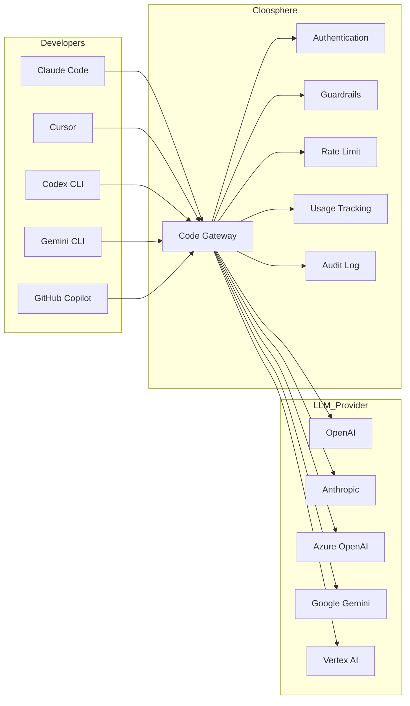
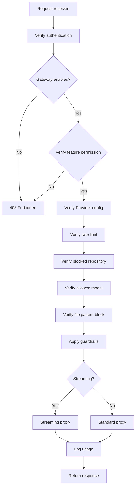

Code Gateway is an enterprise proxy gateway that routes LLM API requests from AI coding CLI tools (Claude Code, Cursor, Codex CLI, Gemini CLI, GitHub Copilot, etc.) through Cloosphere. Centralize the management of AI coding tool usage with guardrails, usage tracking, audit logs, and rate limits.

<Frame caption="Code Gateway settings main screen">
  
</Frame>

---

## Concept



| Component | Description |
|-----------|-------------|
| **Developers** | Set Cloosphere Code Gateway as BASE_URL in AI coding tools |
| **Code Gateway** | Performs authentication, guardrails, rate limiting, usage tracking, then proxies to upstream provider |
| **LLM Provider** | Service that actually provides the LLM API (OpenAI, Anthropic, Azure, etc.) |

<Note>
  Code Gateway is backend-API-dedicated and operates separately from chat in the Cloosphere web UI. Configure only in admin settings — users set Cloosphere API keys in their coding tools.
</Note>

---

## Activation and Setup

### Enabling Code Gateway

<Steps>
  <Step title="Open admin settings">
    Navigate to the **Code Gateway** settings page in the admin panel.
  </Step>
  <Step title="Activate the gateway">
    Toggle on **Enable Code Gateway**.
  </Step>
  <Step title="Add Provider">
    Click **+ Add Provider** to register an LLM Provider.
  </Step>
  <Step title="Security settings">
    Configure allowed models, rate limits, guardrails, file pattern blocks.
  </Step>
</Steps>

<Frame caption="Code Gateway activation and full settings">
  
</Frame>

### Global Settings

| Setting | Description | Default |
|---------|-------------|:-------:|
| **Enabled** | Code Gateway ON/OFF | OFF |
| **Allowed models** | List of usable models (empty = allow all) | All |
| **Rate limit** | Max requests per minute per user (0 = unlimited) | 0 |
| **Guardrails** | List of guardrail IDs to apply | None |
| **File pattern block** | File patterns to block (glob format) | None |
| **File block action** | Behavior on block (block / warn) | block |
| **Blocked repositories** | Repository patterns to block AI coding tool usage | None |
| **Require repository metadata** | Block requests without helper script setup | OFF |

---

## Provider Settings

A Provider is the upstream LLM service Code Gateway forwards requests to. Multiple Providers can be registered simultaneously, each identified by a unique `provider_id`.

### Supported Providers

| Type | Service | Auth Method |
|------|---------|-------------|
| **openai** | OpenAI, OpenAI-compatible endpoints | Bearer token |
| **anthropic** | Anthropic API | x-api-key header |
| **gemini** | Google Gemini API | x-goog-api-key header |
| **azure_openai** | Azure OpenAI Service | api-key header |
| **azure_ai_foundry** | Azure AI Foundry | api-key header |
| **vertex_ai** | Google Vertex AI (native) | GCP Service Account |

### Provider Presets

Picking a preset when adding a Provider auto-sets the type and base URL.

<Note>
  **Azure AI Foundry** has two sub-presets:
  - **Azure AI Foundry - OpenAI**: For OpenAI-compatible models (`openai` type). Use with Cursor, Codex CLI, GitHub Copilot.
  - **Azure AI Foundry - Claude**: For Claude models (`azure_ai_foundry` type). Use with Claude Code, Cursor.

  For the same AI Foundry endpoint, pick the appropriate preset based on the models you're using.
</Note>

### Adding a Provider

<Frame caption="Add Code Gateway Provider">
  
</Frame>

<Tabs>
  <Tab title="OpenAI / Anthropic / Gemini">

    | Setting | Description |
    |---------|-------------|
    | **Provider ID** | Unique identifier (used in URL path) |
    | **Type** | openai / anthropic / gemini |
    | **API URL** | Provider API endpoint |
    | **API Key** | Authentication key |
    | **Model IDs** | List of allowed models for this Provider (empty = all) |
    | **Enabled** | Provider ON/OFF |

  </Tab>
  <Tab title="Azure OpenAI">

    | Setting | Description |
    |---------|-------------|
    | **Provider ID** | Unique identifier |
    | **Type** | azure_openai |
    | **API URL** | Azure endpoint (`https://{name}.openai.azure.com`) |
    | **API Key** | Azure API key |
    | **API Version** | API version (e.g., `2024-12-01-preview`) |
    | **Deployment Map** | Model name → deployment name mapping (optional) |

  </Tab>
  <Tab title="Vertex AI">

    | Setting | Description |
    |---------|-------------|
    | **Provider ID** | Unique identifier |
    | **Type** | vertex_ai |
    | **Project ID** | GCP project ID |
    | **Location** | GCP region (default: us-central1) |
    | **Service Account Key** | GCP service account JSON key |
    | **Use global GCP Key** | Use server's global GCP key as fallback |

  </Tab>
</Tabs>

---

## Developer Usage

Developers set the BASE_URL of their AI coding tools to Cloosphere Code Gateway and use a Cloosphere API key.

### Endpoint Structure

```
{CLOOSPHERE_URL}/api/v1/code-gateway/{provider_id}/{path}
```

**Examples:**
- OpenAI Provider: `https://cloosphere.company.com/api/v1/code-gateway/openai/v1/chat/completions`
- Anthropic Provider: `https://cloosphere.company.com/api/v1/code-gateway/anthropic/v1/messages`

### Authentication

Code Gateway accepts API keys in four ways (in priority order).

| Method | Header/Parameter | Tools |
|--------|-----------------|-------|
| **Bearer Token** | `Authorization: Bearer {api_key}` | Cursor, Codex CLI, GitHub Copilot |
| **x-api-key** | `x-api-key: {api_key}` | Claude Code (Anthropic SDK) |
| **x-goog-api-key** | `x-goog-api-key: {api_key}` | Gemini CLI |
| **Query Parameter** | `?key={api_key}` | Fallback |

<Tip>
  Generate API keys in the **API Keys** section of Cloosphere user settings. Use the Cloosphere API key, not the Provider's original API key.
</Tip>

### Per-Tool Setup Examples

<Tabs>
  <Tab title="Claude Code">
    ```bash
    # .bashrc or .zshrc
    export ANTHROPIC_BASE_URL="https://cloosphere.company.com/api/v1/code-gateway/anthropic"
    export ANTHROPIC_API_KEY="sk-cloosphere-..."
    ```
  </Tab>
  <Tab title="Cursor">
    In Cursor settings, set **Override OpenAI Base URL** to:
    ```
    https://cloosphere.company.com/api/v1/code-gateway/openai/v1
    ```
    Set API Key to your Cloosphere API key.
  </Tab>
  <Tab title="Codex CLI">
    ```bash
    export OPENAI_BASE_URL="https://cloosphere.company.com/api/v1/code-gateway/openai/v1"
    export OPENAI_API_KEY="sk-cloosphere-..."
    ```
  </Tab>
  <Tab title="Gemini CLI">
    ```bash
    export GOOGLE_GEMINI_BASE_URL="https://cloosphere.company.com/api/v1/code-gateway/gemini"
    export GEMINI_API_KEY="sk-cloosphere-..."
    ```
  </Tab>
  <Tab title="GitHub Copilot">
    GitHub Copilot CLI connects via the OpenAI-compatible endpoint:
    ```bash
    export OPENAI_BASE_URL="https://cloosphere.company.com/api/v1/code-gateway/openai/v1"
    export OPENAI_API_KEY="sk-cloosphere-..."

    # Start GitHub Copilot CLI
    gh copilot
    ```
  </Tab>
</Tabs>

### Claude Code Setup Script

An auto-setup script is provided for Claude Code users. It auto-installs the helper script and configures `~/.claude/settings.json`.

<Tabs>
  <Tab title="Linux / macOS">
    ```bash
    # 1. Set environment variables
    export ANTHROPIC_AUTH_TOKEN="sk-cloosphere-..."
    export ANTHROPIC_BASE_URL="https://cloosphere.company.com/api/v1/code-gateway/anthropic"

    # 2. Run setup script
    curl -s https://cloosphere.company.com/api/v1/code-gateway/setup-script | bash
    ```
  </Tab>
  <Tab title="Windows (PowerShell)">
    ```powershell
    # 1. Set environment variables
    $env:ANTHROPIC_AUTH_TOKEN = "sk-cloosphere-..."
    $env:ANTHROPIC_BASE_URL = "https://cloosphere.company.com/api/v1/code-gateway/anthropic"

    # 2. Run setup script
    irm "https://cloosphere.company.com/api/v1/code-gateway/setup-script?os=powershell" | iex
    ```
  </Tab>
</Tabs>

What the setup script does:

1. **Install helper script** (`~/cloosphere-helper.sh` or `~/cloosphere-helper.ps1`): Auto-attach repository metadata (Git remote URL, working directory) to API keys
2. **Configure `~/.claude/settings.json`**: Auto-set `ANTHROPIC_AUTH_TOKEN`, `ANTHROPIC_BASE_URL`, `apiKeyHelper`

<Tip>
  The helper script is required in environments with repository metadata-based blocking policies (`blocked_repos`, `require_repo_metadata`) enabled.
</Tip>

---

## Security Features

### Guardrails

Apply guardrails to Code Gateway for PII detection, content filtering, etc., on coding tool inputs. Specify guardrail IDs created in [Guardrail Management](/en/workspace/guardrails).

Guardrail violations, file pattern blocks, repository blocks, and other events are all viewable in the **Monitoring > Guardrail Logs** tab.

<Frame caption="Code Gateway security settings">
  
</Frame>

### Allowed Models

Restrict to specific models. Configurable at both global and Provider levels.

| Level | Setting Field | Description |
|-------|--------------|-------------|
| **Global allowed models** | `allowed_models` | Models usable across the entire Code Gateway (global setting) |
| **Provider model IDs** | `model_ids` | Models allowed per Provider (per-Provider setting) |

<Note>
  When both `allowed_models` (global) and `model_ids` (per Provider) are set, only models allowed by both are usable. `allowed_models` is the Code Gateway-wide policy; `model_ids` adds per-Provider restriction.
</Note>

### Rate Limit

Limit max requests per minute per user. Operates on a 60-second sliding window.

<Warning>
  Rate limits are in-memory, so they reset on server restart.
</Warning>

### File Pattern Block

Block files matching specific patterns in coding tool requests. Specify patterns in glob format.

| Setting | Description | Example |
|---------|-------------|---------|
| **Pattern** | File path patterns to block | `*.env`, `*credentials*`, `*.pem` |
| **Action** | block (block request) or warn (log only) | block |

### Blocked Repositories

Block AI coding tool usage in specific Git repositories. Matching is based on repository metadata (repo URL, working directory) passed via the helper script.

| Setting | Description | Example |
|---------|-------------|---------|
| **Block patterns** | Repository URL or path patterns to block (substring matching) | `secret-project`, `github.com/org/private-repo` |

Patterns are case-insensitive substring matched against repository URL and working directory path. Git SSH URLs (`git@github.com:org/repo.git`) are auto-normalized for matching.

<Note>
  Blocked repository access is auto-recorded in the **guardrail log**.
</Note>

### Require Repository Metadata

Enabling `require_repo_metadata` blocks requests without repository metadata via the helper script. This forces all Code Gateway users to set up the helper script.

<Warning>
  Enabling this option blocks all requests from users without the helper script. Inform users to set up the helper script before enabling.
</Warning>

---

## Usage Tracking

All requests through Code Gateway are auto-logged for usage. Admins can review usage logs to see per-team, per-user, per-model usage.

| Item | Description |
|------|-------------|
| **User** | Requesting user |
| **Model** | LLM model used |
| **Provider** | Provider used |
| **Input/output tokens** | Request/response token counts |
| **Time** | Request time |

### Usage Statistics

View per-period usage statistics to analyze cost and trends.

### Filters

| Filter | Description |
|--------|-------------|
| **User** | Filter by specific user |
| **Model** | Filter by specific model |
| **Period** | Start ~ end date |

---

## Proxy Processing Flow

The full flow Code Gateway uses to process requests:



---

## Troubleshooting

<Accordion title="403 Forbidden: Code Gateway is disabled">
  Code Gateway is disabled in admin settings. Ask an admin to enable it.
</Accordion>

<Accordion title="403 Forbidden: Code Gateway access not permitted">
  The user's feature permissions don't include Code Gateway access. Admin must enable `features.code_gateway` in group permission settings.
</Accordion>

<Accordion title="404 Not Found: Provider not found">
  The `provider_id` in the request URL doesn't match a registered Provider. Verify Provider ID.
</Accordion>

<Accordion title="403 Forbidden: Model not allowed">
  The requested model isn't in the global allowed models or the Provider's allowed models list. Ask an admin to add the model.
</Accordion>

<Accordion title="429 Too Many Requests: Rate limit exceeded">
  You've exceeded the per-minute request limit. Wait briefly and retry.
</Accordion>

<Accordion title="403 Forbidden: Repository metadata is required">
  `require_repo_metadata` is enabled but the helper script isn't configured. Run the Claude Code setup script to install the helper script.
</Accordion>

<Accordion title="403 Forbidden: AI coding tool usage is blocked for repository">
  The request's repository URL or working directory matches a `blocked_repos` pattern. Ask an admin for unblock.
</Accordion>
