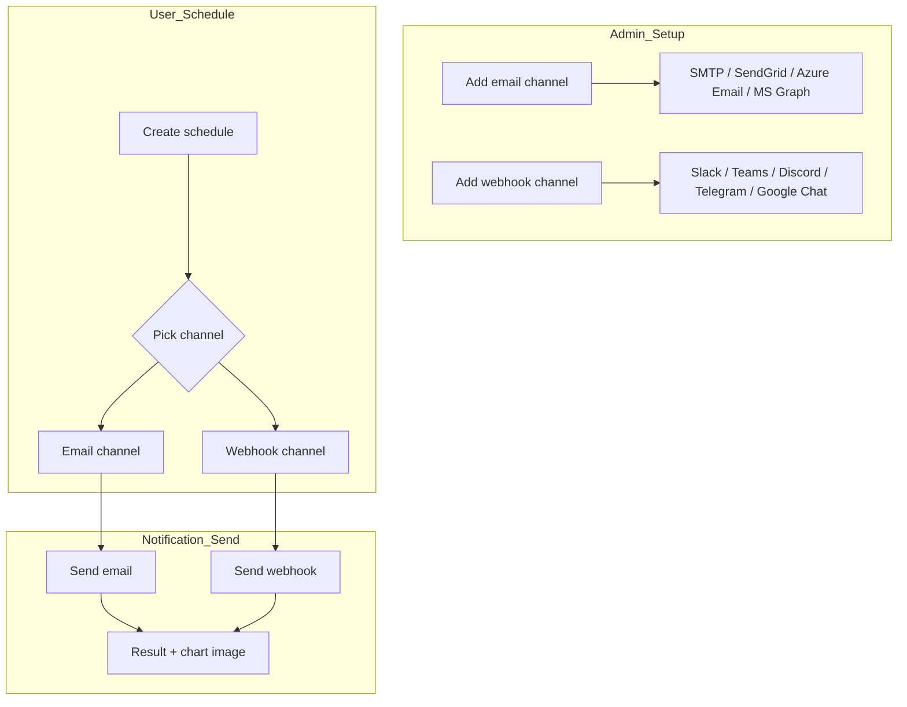

The notification system automatically delivers scheduled task results via email and webhooks. Once admins pre-configure notification channels, users select a channel when creating scheduled tasks to receive result notifications.

<Frame caption="Notification settings main screen">
  
</Frame>

---

## Notification Architecture

| Stage | Owner | Description |
|-------|-------|-------------|
| **Channel setup** | Admin | Pre-configure SMTP, SendGrid, Azure Email, Slack, etc. |
| **Channel selection** | User | Specify notification channel and trigger condition in the schedule |
| **Notification dispatch** | System | After scheduled task runs, deliver result to selected channel |

---

## Email Channels

Add email channels in **Admin > Settings > Notifications** or the dedicated notification management screen. Register multiple channels to use different sender configs per team.

### Add Channel

Click the **+** icon button on the right of the Email section. (Tooltip: "Add Email Channel")

<Frame caption="Add email channel">
  
</Frame>

| Field | Description |
|-------|-------------|
| **Channel name** | Identifier name (e.g., "Default", "Marketing Team Mail") |
| **Email Provider** | Choose SMTP, SendGrid, Azure Email, or MS Graph |

### Per-Provider Settings

<Tabs>
  <Tab title="SMTP">
    Connect your internal mail server or external SMTP service (Gmail, Outlook, etc.).

    | Setting | Description | Example |
    |---------|-------------|---------|
    | **Server** | SMTP server address | smtp.gmail.com |
    | **Port** | SMTP port | 587 (TLS) / 465 (SSL) |
    | **Username** | Auth account | noreply@company.com |
    | **Password** | Auth password | |
    | **Use TLS** | Enable TLS encryption | Use on port 587 |
    | **Use SSL** | Enable SSL encryption | Use on port 465 |
    | **Sender address** | From email address | noreply@company.com |
    | **Sender name** | From name | Cloosphere |

    <Warning>
      TLS and SSL can't be used together. Use TLS on port 587 and SSL on port 465.
    </Warning>
  </Tab>
  <Tab title="SendGrid">
    Email sending using the SendGrid API.

    | Setting | Description |
    |---------|-------------|
    | **API Key** | SendGrid API key |
    | **Sender address** | SendGrid-verified sender email |
    | **Sender name** | From name |
  </Tab>
  <Tab title="Azure Email">
    Email sending via Azure Communication Services.

    | Setting | Description |
    |---------|-------------|
    | **Connection String** | Azure Communication Services connection string |
    | **Sender address** | Azure-provisioned sender email (e.g., `DoNotReply@your-domain.azurecomm.net`) |
    | **Sender name** | From name |
  </Tab>
  <Tab title="MS Graph">
    Send directly from Microsoft 365 mailboxes — use your corporate domain sender address without SPF/DKIM setup burden.

    | Setting | Description |
    |---------|-------------|
    | **Tenant ID** | Microsoft Entra ID tenant ID (GUID) |
    | **Client ID** | Application (Client) ID of the Entra app registration |
    | **Client Secret** | Entra app's client secret (auto-masked on save) |
    | **Sender Email** | Email address of the sending mailbox (e.g., `noreply@your-domain.com`) |
    | **Sender name** | From name |

    <Note>
      The Entra app must have **`Mail.Send`** Application permission with admin consent. Since this uses app permission (not delegated), the system must be allowed to send mail directly from the specified sender mailbox.
    </Note>
  </Tab>
</Tabs>

### Test Connection

Click the **Test** button to verify mail server connection.

<Note>
  Test Connection and Send Test Email are only available in edit mode after saving the channel. When adding a new channel, save first, then reopen and test.
</Note>

| Result | Description |
|--------|-------------|
| **Success** | Server connection and authentication both OK |
| **Auth failure** | Verify username/password |
| **Connection failure** | Verify server address, port, firewall |
| **Timeout** | Verify network connection |

### Send Test Email

In the **Send Test Email** section, enter a recipient address and click **Send** to verify actual email delivery.

<Steps>
  <Step title="Enter recipient email">
    Enter the address to receive the test email.
  </Step>
  <Step title="Click Send">
    Click the **Send** button.
  </Step>
  <Step title="Verify reception">
    Verify test email reception in the inbox (including spam folder).
  </Step>
</Steps>

---

## Webhook Channels

Connect with external messaging services to send notifications.

### Add Channel

Click the **+** icon button on the right of the Webhook section. (Tooltip: "Add Webhook Channel")

<Frame caption="Add webhook channel">
  
</Frame>

| Field | Description |
|-------|-------------|
| **Channel name** | Identifier name (e.g., "Engineering Slack") |
| **Provider** | Slack / Microsoft Teams / Discord / Telegram / Google Chat |
| **Webhook URL** | Receiving webhook URL from the provider (except Telegram — see below) |

<Note>
  Telegram uses **Bot Token** and **Chat ID** instead of webhook URL. The input form auto-changes when Telegram is selected.
</Note>

### Per-Provider Settings

<Tabs>
  <Tab title="Slack">
    **Generate webhook URL:**
    1. Enable **Incoming Webhooks** in your Slack app management page
    2. Click **Add New Webhook to Workspace**
    3. Pick a channel and click **Allow**
    4. Copy the generated URL (`https://hooks.slack.com/services/...`)

    **Notification format:** Header block + Fields (prompt, completion time) + Section (result) + chart image
  </Tab>
  <Tab title="Teams">
    **Generate webhook URL:**
    1. Configure **Connectors** or **Workflows** on the Teams channel
    2. Add **Incoming Webhook**
    3. Set name and click **Create**
    4. Copy the generated URL (`https://...webhook.office.com/...`)

    **Notification format:** Adaptive Card 1.5 — TextBlock, FactSet, Table + chart image
  </Tab>
  <Tab title="Discord">
    **Generate webhook URL:**
    1. Discord channel settings > **Integrations** > **Webhooks**
    2. Click **New Webhook**
    3. Set name and **Copy Webhook URL** (`https://discord.com/api/webhooks/...`)

    **Notification format:** Embed — Title + Fields + Description + chart image (first only)
  </Tab>
  <Tab title="Telegram">
    Telegram uses **Bot Token + Chat ID** instead of webhook URL.

    **Bot setup:**
    1. Create bot via `@BotFather` and obtain **Bot Token**
    2. Add the bot to channel/group
    3. Get **Chat ID** (group/channel ID, e.g., `-1001234567890`)

    | Setting | Description |
    |---------|-------------|
    | **Bot Token** | Token issued by BotFather |
    | **Chat ID** | Chat room ID to send notifications to |

    <Info>
      When Telegram is selected, the form shows Bot Token and Chat ID fields instead of webhook URL.
    </Info>
  </Tab>
  <Tab title="Google Chat">
    **Generate webhook URL:**
    1. In Google Chat space, pick **Apps & integrations** > **Webhooks**
    2. Set name and **Save**
    3. Copy the generated URL (`https://chat.googleapis.com/v1/spaces/.../messages?key=...`)

    **Notification format:** Simple text message (same text payload as Slack)
  </Tab>
</Tabs>

### Test Webhook

Click **Test Webhook** to send a test message in the selected provider's format.

<Note>
  Test Webhook is only available in edit mode after saving the channel.
</Note>

---

## Schedule Notification Integration

After admins configure channels, users configure notifications in scheduled tasks.

### Trigger Conditions

| Condition | Description | Use Case |
|-----------|-------------|----------|
| **Always** | Notify on success and failure | Critical schedule monitoring |
| **Success only** | Notify only on successful completion | Regular report delivery |
| **Failure only** | Notify only on errors | Failure detection alerts |

### Multiple Notifications

A single scheduled task can have multiple notification channels.

| Notification | Channel | Target | Condition |
|--------------|---------|--------|-----------|
| Notif 1 | Email | Team Lead | Always |
| Notif 2 | Slack webhook | Engineering channel | Failure only |
| Notif 3 | Teams webhook | Executive channel | Success only |

---

## Chart Image Delivery

Plotly charts generated by DbSphere agents are server-side rendered to PNG images and included in notifications.

| Channel | Method | Description |
|---------|--------|-------------|
| **Email** | Inline Base64 | Image directly embedded in body |
| **Slack** | Image URL | Displayed as image block |
| **Teams** | Adaptive Card | Image element in card |
| **Discord** | Embed image | Only first chart included |
| **Google Chat** | Text | Same text payload as Slack |

<Note>
  Chart images are auto-extracted before notification dispatch. Chart markers are removed from the notification body so clean text is delivered.
</Note>

---

## Troubleshooting

<Accordion title="Email issues">

| Symptom | Check |
|---------|-------|
| **Connection failure** | Verify server address, port. Check firewall SMTP port allowance |
| **Auth failure** | Verify username/password. Google requires app passwords |
| **Email not received** | Check recipient spam folder. Verify sender domain SPF/DKIM |
| **TLS error** | Verify TLS/SSL setting and port combination (587-TLS, 465-SSL) |
| **SendGrid error** | Check API key permission. Verify sender address verified |
| **Azure Email error** | Check Connection String validity. Verify sender provisioned in Azure |

</Accordion>

<Accordion title="Webhook issues">

| Symptom | Check |
|---------|-------|
| **Send failure** | Check webhook URL validity. Check if URL has expired |
| **Message not shown** | Check target channel/app permissions. Check if bot can access channel |
| **Timeout** | Check network connection. Check firewall outbound HTTPS allowance |
| **Format broken** | Check provider setting (Slack/Teams/Discord/Telegram/Google Chat selection correct) |

</Accordion>

<Accordion title="General issues">

| Symptom | Check |
|---------|-------|
| **No notifications** | Check schedule's notification settings. Verify trigger condition correctness |
| **No chart image** | Verify the agent is connected to DbSphere |

</Accordion>
