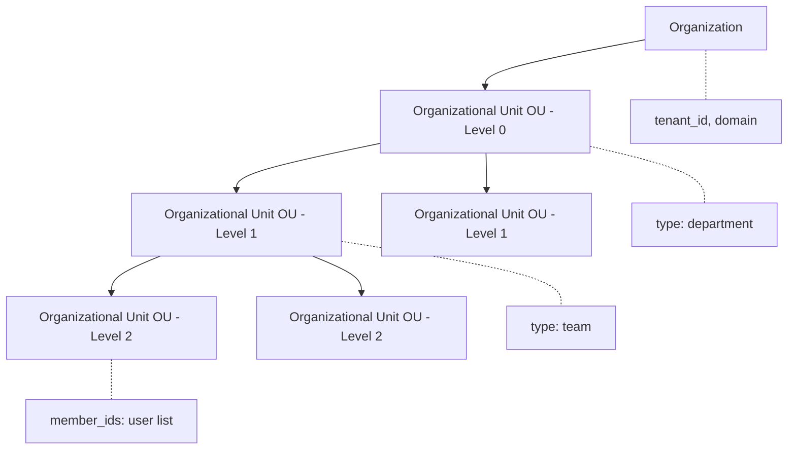
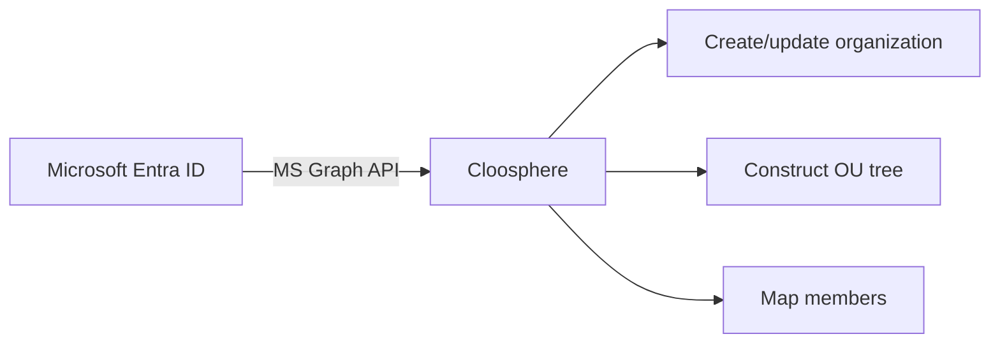
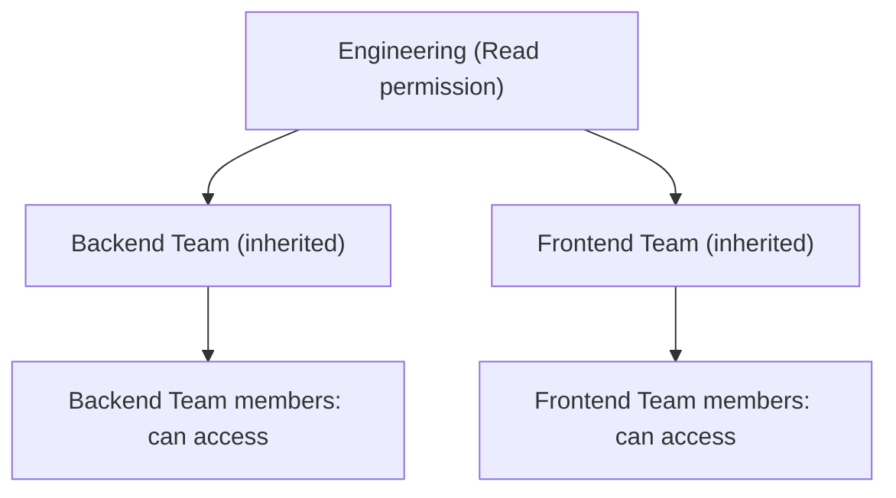

Organization management reflects your company's department structure in Cloosphere to systematically control resource access. Sync with Microsoft Entra ID (Azure AD), or build the org structure directly via JSON Import.

<Frame caption="Organization management screen">
  
</Frame>

---

## Organizational Hierarchy

Cloosphere's organization system consists of hierarchical Organizations and Organizational Units.



| Concept | Description | Example |
|---------|-------------|---------|
| **Organization** | Top-level entity. Identified by tenant ID and domain | "Cloocus Inc." |
| **Organizational Unit (OU)** | Sub-units like departments, teams. Hierarchically nestable | "Engineering > Backend Team" |
| **Members** | List of users belonging to an OU | user_id array |

### Organizational Unit Types

OUs distinguish purpose via the `type` field.

| Type | Description |
|------|-------------|
| **department** | Department (division-level upper organization) |
| **team** | Team (working-unit organization) |
| **group** | Group (functional unit, e.g., project team) |

---

## Organizations vs Groups

Cloosphere offers two user grouping mechanisms — **groups** and **organizations**. Use them appropriately by purpose.

| Aspect | Group | Organization |
|--------|-------|--------------|
| **Purpose** | Permission management | Reflect organizational structure |
| **Structure** | Flat (no hierarchy) | Tree (hierarchical) |
| **Permission setup** | Permissions assigned directly to the group | Specify OU in resource's access_control |
| **External integration** | Manual management | Auto-sync with Entra ID |
| **Use case** | "Grant agent creation permission" | "HR team only accesses HR Policy KB" |

<Tip>
  Use groups for **permission control** (what they can do) and organizations for **access control** (what they can see). The two systems can be used together.
</Tip>

---

## Creating Organizations

Organizations and OUs are created **only via sync**. There's no UI to create them manually.

Supported sync methods:

| Method | Description |
|--------|-------------|
| **Microsoft Graph** | Auto-sync organizational structure from Entra ID (Azure AD) |
| **JSON Import** | Upload JSON data to construct the org structure |

See [Microsoft Entra ID Sync](#microsoft-entra-id-sync) and [JSON Import](#json-import) below for details.

---

## Microsoft Entra ID Sync

Sync organizational structure automatically with Microsoft Entra ID (Azure AD).



### Prerequisites

<Warning>
  Microsoft OAuth setup is required for Entra ID sync. Set the following environment variables on the server.
</Warning>

| Environment Variable | Description |
|----------------------|-------------|
| `MICROSOFT_CLIENT_ID` | Azure App Registration's Client ID |
| `MICROSOFT_CLIENT_SECRET` | Client Secret |
| `MICROSOFT_CLIENT_TENANT_ID` | Azure AD Tenant ID |

### Running Sync

<Steps>
  <Step title="Pick sync options">
    Pick which data sources to fetch during sync.

    | Option | Description | Default |
    |--------|-------------|:-------:|
    | **Administrative Units** | Fetch Entra ID Administrative Units | ON |
    | **Security Groups** | Fetch Entra ID Security Groups | OFF |
    | **Departments** | Build from user department info | OFF |
    | **Group Filter** | Filter to specific groups (optional) | - |
  </Step>
  <Step title="Run sync">
    Click the **Sync** button.
  </Step>
  <Step title="Verify results">
    Verify the synced OU tree and member mapping.
  </Step>
</Steps>

<Frame caption="Entra ID sync options">
  
</Frame>

### JSON Import

In environments without Entra ID, import the org structure via JSON data directly.

```json
{
  "organization": {
    "tenant_id": "my-company",
    "name": "My Company",
    "domain": "mycompany.com"
  },
  "units": [
    {
      "id": "dept-1",
      "name": "Engineering",
      "type": "department",
      "children": [
        { "id": "team-1", "name": "Backend Team", "type": "team" },
        { "id": "team-2", "name": "Frontend Team", "type": "team" }
      ]
    }
  ]
}
```

---

## Organization-based Access Control

Use OUs to control resource (agents, KBs, databases, etc.) access scope.

### Setting OU Permissions on Resources

In each workspace resource's **Access** settings, specify the OU.

| Access Level | Description |
|--------------|-------------|
| **Read** | OU members can view/use the resource |
| **Write** | OU members can edit the resource |

### Permission Inheritance

Permissions granted to upper OUs are inherited by lower OUs.



<Note>
  When resource access is set on an upper OU, all members of lower OUs automatically receive the same permission.
</Note>

### Example Use

| Resource | Access Control | Description |
|----------|---------------|-------------|
| **HR Policy KB** | HR Team OU (Read) | Only HR team can view HR policy |
| **Sales Agent** | Sales Division OU (Read) | Entire Sales department can use |
| **Sales DB** | Operations Division OU (Read) | Only Operations department queries sales data |
| **Company-wide Notice KB** | Top-level OU (Read) | Entire organization can access |

---

## Per-OU Resource Permission View

Admins can view all resource permissions assigned to a specific OU at a glance.

<Frame caption="Per-OU resource permission list">
  
</Frame>

| Resource Type | Items Shown |
|---------------|-------------|
| **Knowledge Base** | Name, Read/Write, inheritance |
| **Tools** | Name, Read/Write, inheritance |
| **Prompts** | Name, Read/Write, inheritance |
| **Models** | Name, Read/Write, inheritance |
| **Database** | Name, Read/Write, inheritance |
| **Glossary** | Name, Read/Write, inheritance |

---

## Per-Organization Usage Limits

In the OU detail panel, set **daily token limits**.

| Setting | Description |
|---------|-------------|
| **Daily token limit** | Daily token cap for users belonging to this OU (0 = unlimited) |

<Warning>
  This feature requires admin settings to have **usage limits** (`enable_usage_limit`) enabled.
</Warning>

<Note>
  Usage limits can be set at four levels — global, user, group, organization. When set at multiple levels, the **most permissive (highest)** value applies.
</Note>

---

## Per-OU Guardrails

Connect **guardrails to OUs** to auto-validate AI inputs/outputs of users in that OU.

Configure in the **Guardrail Settings** of the OU detail panel.

| Setting | Description |
|---------|-------------|
| **Pick guardrails** | List of guardrails to apply to this OU (multi-select) |
| **Inherit global guardrails** | When on, also apply global (Code Gateway) guardrails. When off, only the OU-specified guardrails apply |

### Application Priority

Guardrails can be set at multiple levels — to users, the **sum across all levels** is applied.

```
Agent guardrail   ─┐
Group guardrail   ─┼─  All combined and applied
OU guardrail      ─┤
Global guardrail  ─┘  (when global inheritance is on)
```

<Info>
  Global guardrails are configured in **Admin > Code Gateway**. Turning off `Inherit global guardrails` for an OU exempts it from global guardrail influence.
</Info>

---

## Sync Provider List

Currently supported sync providers:

| Provider | Description | Requirements |
|----------|-------------|--------------|
| **JSON Import** | Direct configuration via JSON data | None |
| **Microsoft Graph** | Auto-sync from Entra ID | `MICROSOFT_CLIENT_ID`, `CLIENT_SECRET`, `TENANT_ID` |

<Tip>
  Additional provider support (Okta, Google Workspace, etc.) is planned.
</Tip>

---

## FAQ

<Accordion title="Organization sync fails">
  1. Verify Azure App Registration has `Directory.Read.All` permission.
  2. Verify environment variables `MICROSOFT_CLIENT_ID`, `MICROSOFT_CLIENT_SECRET`, `MICROSOFT_CLIENT_TENANT_ID` are correctly set.
  3. Check server logs for detailed error messages.
</Accordion>

<Accordion title="Do I need to use both organizations and groups?">
  Not necessarily. **Permission management** alone is fine with groups. Use organizations additionally when you need **department-based access control** with Entra ID integration.
</Accordion>

<Accordion title="Are members deleted when I delete an OU?">
  Deleting an OU doesn't delete the user accounts in it. Only the resource access permissions configured for that OU are removed.
</Accordion>
