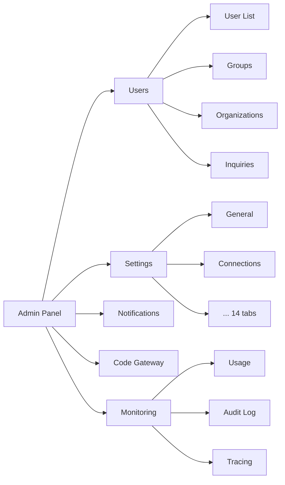

The admin panel is the central management interface for operating the Cloosphere platform. Control all platform settings: user management, organizational structure, LLM connections, security policies, notification channels, and more.

<Frame caption="Admin panel main screen">
  
</Frame>

---

## Accessing the Admin Panel

<Note>
  Only users with the **Admin** role can access the admin panel. Regular users (User role) won't see the admin menu.
</Note>

Click your user name at the bottom of the sidebar to reveal the **Admin Panel** menu. Click it to navigate to the admin dashboard.

---

## Per-Role Access

Cloosphere has three user roles. Admin panel access is determined by role.

| Role | Admin Panel | Workspace | Chat |
|------|:-----------:|:---------:|:----:|
| **Admin** | Full access | Full access | Full access |
| **User** | No access (default) | Per group permission | Per group permission |
| **Pending** | No access | No access | No access |

<Tip>
  Through group permission settings, you can delegate parts of admin features (user management, monitoring, etc.) to regular users at read or write level. See the group permissions section in [User Management](/en/admin/users).
</Tip>

---

## Admin Features

The admin panel consists of these features.

<Columns cols={2}>
  <Card title="User Management" icon="users" href="/en/admin/users">
    User list, role assignment, group management, permission settings, inquiry management
  </Card>
  <Card title="Organization Management" icon="building" href="/en/admin/organizations">
    Organizational structure, Microsoft Entra ID sync, organization-based access control
  </Card>
  <Card title="System Settings" icon="gear" href="/en/admin/settings/general">
    14 tabs: LLM connections, documents/search/audio/images, interface, license, etc.
  </Card>
  <Card title="Notification Settings" icon="bell" href="/en/admin/notifications">
    Configure email (SMTP/SendGrid) and webhook (Slack/Teams/Discord/Telegram) notification channels
  </Card>
  <Card title="Code Gateway" icon="code" href="/en/admin/code-gateway">
    LLM API proxy gateway for AI coding tools (Claude Code, Cursor, etc.)
  </Card>
  <Card title="Monitoring" icon="chart-line" href="/en/monitoring/overview">
    Usage, audit logs, guardrail logs, tracing, evaluations
  </Card>
</Columns>

---

## 14 System Settings Tabs

System settings classify all configuration needed for platform operations into 14 tabs.

| Tab | Description | Link |
|-----|-------------|------|
| **General** | Authentication, default role, log level, usage limits | [Settings](/en/admin/settings/general) |
| **Connections** | OpenAI, Ollama, and other LLM Provider connections | [Settings](/en/admin/settings/connections) |
| **Models** | Model list management, default model, model filters | [Settings](/en/admin/settings/models) |
| **Documents** | Embedding engine/model, chunk size, Vector DB | [Settings](/en/admin/settings/documents) |
| **Search Engine** | Azure Search, Elasticsearch, etc. | [Settings](/en/admin/settings/search-engine) |
| **Web Search** | SearXNG, Google PSE, Bing, and other web search engines | [Settings](/en/admin/settings/web-search) |
| **Code Execution** | Code interpreter (Jupyter/Sandbox) settings | [Settings](/en/admin/settings/code-execution) |
| **Interface** | UI customization, default prompts, landing page | [Settings](/en/admin/settings/interface) |
| **Audio** | STT/TTS engine and model | [Settings](/en/admin/settings/audio) |
| **Images** | Image generation engines (DALL-E, Stable Diffusion) | [Settings](/en/admin/settings/images) |
| **Pipelines** | Pipeline server connections and management | [Settings](/en/admin/settings/pipelines) |
| **Tools** | Global OpenAPI/MCP tool server settings | [Settings](/en/admin/settings/tools) |
| **Branding** | Customize logo, favicon, colors, sign-in screen | [Settings](/en/admin/settings/branding) |
| **License** | License key management, feature activation | [Settings](/en/admin/settings/license) |

---

## Admin Panel Navigation

The admin panel switches between feature areas via top-tab navigation.

---

## Quick Start

<Steps>
  <Step title="Configure LLM connections">
    Register OpenAI API keys or Ollama server URLs in [Connections](/en/admin/settings/connections).
  </Step>
  <Step title="Manage users">
    Add users and assign roles in [User Management](/en/admin/users). Create groups for organized permission management.
  </Step>
  <Step title="Configure security">
    Set authentication methods, JWT expiration, and signup permission in [General Settings](/en/admin/settings/general).
  </Step>
  <Step title="Set up notification channels">
    Register email or webhook channels in [Notification Settings](/en/admin/notifications) to enable scheduled task notifications.
  </Step>
</Steps>

---

## Service Request (SR)

A feature for admins to directly submit **service requests (usage increases, feature inquiries, bug reports, etc.)** to the Cloosphere operations team.

### Activation Conditions

Activated when **both** the `SR_KEY` and `CLOOCUS_PUBLIC_URL` environment variables are set. Without them, the menu doesn't appear.

### How to Use

1. Click your **user avatar** at the bottom of the sidebar
2. Pick **Service Request** from the dropdown
3. Fill in and submit the SR modal

| Field | Description |
|-------|-------------|
| **Type** | Request type — usage limit, feature request, bug report, account, others |
| **Title** | Request title (brief summary) |
| **Content** | Request details |

<Note>
  Requester name and email are auto-attached from sign-in info. SR is shown only to **Admin role** users.
</Note>
