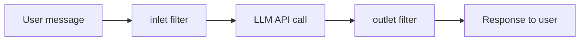

Pipelines are a plugin system that **injects custom logic** into the LLM request/response processing pipeline. Deploy Python code (.py) to the pipeline server to implement message pre/post-processing, custom models, etc.

Configure in **Admin > Settings > Pipelines**.

---

## What is a Pipeline?

Pipelines come in two types.

| Type | Role | Shown in Model List |
|------|------|:-------------------:|
| **Filter** | Request pre-processing (inlet) + response post-processing (outlet) | ✗ |
| **Pipe** | Behaves like a custom model | ✓ |

### Filter Pipeline Flow

- **inlet**: Process the message before passing to the LLM (e.g., prompt transformation, data injection)
- **outlet**: Process the LLM response before delivering to the user (e.g., format conversion, filtering)
- With multiple filters, they run in **priority order**
- `pipelines: ["*"]` applies to all models; specific model ID list applies only to those models

---

## Connecting a Pipeline Server

Pipeline server URLs aren't entered separately in this tab. Servers added as **OpenAI-compatible servers in the Connections tab** that provide pipelines are auto-detected and shown in the dropdown.

<Note>
  To use pipeline servers, first register the server as an OpenAI-compatible API in **Admin > Settings > Connections**.
</Note>

---

## Installing a Pipeline

<Steps>
  <Step title="Pick pipeline server">
    Pick a pipeline server from the dropdown.
  </Step>
  <Step title="Add pipeline">
    Choose between two methods:

    | Method | Description |
    |--------|-------------|
    | **GitHub URL** | Enter a GitHub Raw URL to download directly on the server |
    | **File upload** | Upload a local `.py` file directly |
  </Step>
  <Step title="Configure Valves">
    Selecting an installed pipeline shows the configuration parameter (Valves) edit form for that pipeline.
  </Step>
</Steps>

<Warning>
  Pipelines are plugins that **execute arbitrary code** on the server. Don't install pipelines from untrusted sources.
</Warning>

---

## Valves Configuration

Each pipeline has its own settings (Valves) defined in code. Selecting a pipeline auto-generates the corresponding settings form.

| Valve Type | UI Display |
|------------|------------|
| Boolean | Toggle switch |
| Enum (choices) | Dropdown |
| Array (list) | Comma-separated text input |
| Others (string, number) | Text input |

Each Valve is controlled by a **None (use default)** or **Custom (set manually)** toggle.

<Note>
  Valve changes take effect immediately on save. For Pipe-type pipelines, the model list is also auto-refreshed.
</Note>

---

## Related Pages

<Columns cols={2}>
  <Card title="Connections" icon="plug" href="/en/admin/settings/connections">
    Register pipeline servers as OpenAI-compatible APIs
  </Card>
  <Card title="Tool Servers" icon="wrench" href="/en/admin/settings/tools">
    Configure tool servers that agents call as external APIs
  </Card>
</Columns>
