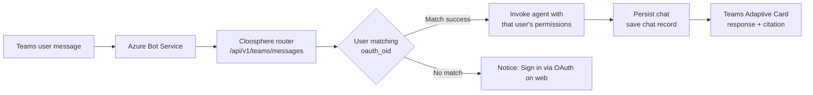

Deploy Cloosphere as a **Microsoft Teams app** so users can talk to internal agents without leaving Teams. Same permissions and agent settings apply across 1:1 chat, team channels, and group chats.

<Note>
  The Teams bot is different from the **notification channel** (Teams webhook in `/admin/notifications`). The notification channel is one-way message delivery; the Teams bot is two-way integration where users converse directly with the bot.
</Note>

---

## Why You Need It

| Existing Approach | Teams Bot Integration |
|-------------------|----------------------|
| Users open Cloosphere web app in a separate window | Start conversation directly inside Teams |
| Separate sign-in | Auto user matching via Entra ID (Object ID → Cloosphere account) |
| Inconvenient on mobile | Use Teams mobile app as-is |
| Disconnected from channel collaboration | Invoke bot in team channels/group chats and review answers together |

**Use scenarios:**
- Deploy an internal IT helpdesk bot to Teams 1:1 to automate password reset and access permission inquiries
- Add a sales analytics agent to the sales team channel for instant data queries during meetings
- Invoke a meeting note summarization agent in group chats

---

## How It Works



Key points:
- **JWT validation**: M365 Agents SDK validates Teams Activity's JWT against Azure
- **User matching**: Match Teams user's **AAD Object ID** ↔ Cloosphere `User.oauth_oid` field. Only users who've signed in at least once via OAuth (Entra/Google) match
- **Permission application**: The matched Cloosphere user's permissions apply directly — Teams calls use the same agent/Knowledge Base access permissions the user has in the workspace
- **Conversation persistence**: Teams conversation ID (`teams_conversation_id`) is saved in Cloosphere `chat.meta`, so the same Teams conversation always links to the same chat record

---

## Setup Procedure

### Step 1: Configure Bot in Admin Panel

Configure the bot in **Admin > Settings > Notifications > Teams Bot Config**.

{/* SCREENSHOT: admin-teams-bot-config */}

#### Auth Info (required for P2 mode)

| Item | Description |
|------|-------------|
| **Enable Teams Bot** | Master ON/OFF toggle |
| **App ID (Client ID)** | Client ID (GUID) of Azure Bot or Entra app registration |
| **Tenant ID** | Azure AD tenant ID. `common` for multi-tenant bots |
| **App Password** | Client secret of the Entra app (auto-masked on save) |
| **Default Agent** | Default agent/model when a user first chats with the bot |

<Note>
  Production environments are recommended to use **P2 mode** (certificate-based auth). P1 mode (anonymous) auto-falls-back when auth info is empty and is for local development.
</Note>

#### Branding (optional)

| Item | Limit | Description |
|------|-------|-------------|
| **Bot Name** | Max 30 chars | Name shown to Teams users |
| **Short Description** | Max 80 chars | Teams app catalog one-line description |
| **Full Description** | Max 4000 chars | App detail screen description |
| **Developer Name / Website** | — | Shown on app info page |
| **Color Icon** | 192×192 PNG | Color icon for Teams app catalog |
| **Outline Icon** | 32×32 PNG (white silhouette) | Mono icon for Teams sidebar |
| **Accent Color** | `#RRGGBB` | Manifest accent color |

#### Deployment Scope

| Item | Options | Description |
|------|---------|-------------|
| **Bot Scopes** | `personal` / `team` / `groupchat` (multi-select) | Surfaces where the bot is exposed. Pick from 1:1 / team channel / group chat |
| **Default Group Capability** | `team` / `groupchat` / `meetings` | Default surface when multiple scopes selected |

<Warning>
  Selecting `team`/`groupchat` scope requires **admin consent** when installing the Teams app (RSC: `ChannelMessage.Read.Group`, etc.). Check your corporate Teams admin center's app approval policy.
</Warning>

### Step 2: Register Azure Bot Service

For P2 mode operation, create a Bot resource in Azure Portal.

<Steps>
  <Step title="Register Entra app">
    Azure Portal > Microsoft Entra ID > App registrations > **New registration**.
    - Name: anything (e.g., "Cloosphere Teams Bot")
    - Supported account types: single / multi-tenant
    - After registration, get **Application (client) ID**, **Directory (tenant) ID**
    - **Certificates & secrets** > generate new client secret → use as **App Password**
  </Step>
  <Step title="Create Azure Bot resource">
    Azure Portal > Create resource > Search **Azure Bot** and create.
    - Microsoft App ID: enter Step 1's Client ID
    - Pricing tier: F0 (development) or S1 (production)
  </Step>
  <Step title="Register messaging endpoint">
    Created Bot resource > **Configuration** > Messaging endpoint:

    ```
    https://your-cloosphere.com/api/v1/teams/messages
    ```

    <Tip>
      The admin panel's Teams Bot Config screen shows the **current instance's messaging endpoint URL** for easy copy-paste.
    </Tip>
  </Step>
  <Step title="Add Microsoft Teams channel">
    Bot resource > **Channels** > Add Microsoft Teams.
  </Step>
</Steps>

### Step 3: Download and Upload Teams Manifest

<Steps>
  <Step title="Download manifest ZIP">
    Click **Download Teams Manifest** in Admin > Settings > Notifications > Teams Bot Config.
    A `cloosphere-teams.zip` is downloaded with App ID, branding, and icons dynamically injected.
  </Step>
  <Step title="Upload to Teams">
    Teams left sidebar **Apps** > **Manage your apps** > **Upload an app** > **Upload a custom app** > Select downloaded ZIP.

    To deploy to the org catalog, proceed with **Org-wide publishing** in the Teams admin center > App management.
  </Step>
  <Step title="Wait for activation">
    The bot activates in about 30 seconds to 1 minute after upload. Verify by having a first user start a conversation.
  </Step>
</Steps>

---

## User Usage

### Prerequisites — Sign in to Cloosphere via OAuth Once

The Teams bot matches users' **AAD Object ID** with the Cloosphere `User.oauth_oid` field. So before using the bot in Teams, **each user must sign in to the Cloosphere web app once via OAuth (Entra/Google)**.

<Warning>
  Users without sign-in history get a "Sign in to Cloosphere first" notice when invoking the bot in Teams. Once matched, it's automatic thereafter.
</Warning>

### First Conversation

When you invoke the bot in Teams, an **agent selection card** appears automatically.

| Entry Surface | Invocation |
|---------------|------------|
| **1:1** | Teams left chat > search for bot and message |
| **Team channel** | Mention `@bot-name your-question` in the channel |
| **Group chat** | Add bot as a member to group chat, then mention or message |

### Slash Commands

| Command | Action |
|---------|--------|
| `/agent` | Show available agents as Adaptive Card. Selection is remembered for that user for 30 days |
| `/current` | Check currently selected agent |
| `/reset` | Reset conversation (discard previous context, create new chat record) |
| `/lang <code>` | Change bot response language (e.g., `/lang ko`, `/lang en`) |
| `/help` | Command help |

### Conversation Persistence

The bot remembers previous conversations in the same Teams conversation window.

- LLM context sends **up to 10 most recent turns** (token saving on long conversations)
- Full conversation is saved in the Cloosphere chat record — users can continue the same conversation in the web app
- `/reset` separates into a new chat record

### Citation Display

Responses using Knowledge Base or web search results are shown as **Teams Citation Cards** — click to view source documents/URLs.

---

## Environment Variables (for operators)

```bash
# Teams auth (P2 mode)
TEAMS_BOT_APP_ID=<Azure Bot Client ID>
TEAMS_BOT_APP_PASSWORD=<Client Secret>
TEAMS_BOT_TENANT_ID=common  # or single-tenant GUID

# Bot behavior
TEAMS_BOT_ENABLED=true
TEAMS_BOT_BACKEND_TIMEOUT=300       # backend call timeout (seconds)
TEAMS_BOT_DEFAULT_LOCALE=en-US      # i18n default (fallback for non-ko-KR/en-US)
CLOOSPHERE_PUBLIC_URL=https://your-domain.com  # auto-computes manifest validDomains

# Multi-worker environment (Redis strongly recommended)
REDIS_URL=redis://localhost:6379
REDIS_SENTINEL_HOSTS=host1,host2    # when using Sentinel
REDIS_SENTINEL_PORT=26379

# Development/test only
TEAMS_BOT_TEST_JWT=<fallback JWT>   # fallback for users without OAuth matching
```

<Warning>
  **Redis is required in multi-worker environments**. Without Redis sharing per-user agent selection state, workers see different states.
</Warning>

---

## Known Limitations / Caveats

<AccordionGroup>
  <Accordion title="Users without OAuth sign-in can't use the bot" icon="circle-exclamation">
    Teams user's AAD Object ID must match Cloosphere `User.oauth_oid`. Users who've never signed in via OAuth (Entra/Google) get a notice when invoking the bot.
    `TEAMS_BOT_TEST_JWT` fallback is available in development environments but **must not be used in production**.
  </Accordion>

  <Accordion title="Agent visibility scope" icon="filter">
    Agents shown by `/agent` command are filtered by **that user's permissions**. Agents the user can't see in the web app aren't visible in Teams either.
  </Accordion>

  <Accordion title="Conversation history limit" icon="clock-rotate-left">
    LLM calls send **only the last 10 turns**. For longer context, explicitly ask the user for a summary, or have them re-enter key info after `/reset`.
  </Accordion>

  <Accordion title="i18n supported languages" icon="globe">
    Bot system messages are completed only for **Korean (ko-KR)** and **English (en-US)**. Other-language users fall back via `TEAMS_BOT_DEFAULT_LOCALE` (default en-US).
  </Accordion>

  <Accordion title="Streaming response" icon="bolt">
    Cloosphere internal Socket.IO streaming is subscribed and relayed to Teams. Even if Socket.IO connection fails, the final response arrives — but progress (typing/tool calls) and some citation cards may be missing.
  </Accordion>

  <Accordion title="RSC (Resource-Specific Consent) permissions" icon="shield-halved">
    Enabling team channel/group chat scope declares RSC permissions like `ChannelMessage.Read.Group` in the manifest. Admin consent may be required per the corporate Teams admin center's app approval policy.
  </Accordion>
</AccordionGroup>

---

## Related Pages

<Columns>
  <Card title="Notification Settings" icon="bell" href="/en/admin/notifications">
    Teams webhook-based one-way notification channel (separate from bot integration)
  </Card>
  <Card title="Agents" icon="robot" href="/en/workspace/agents">
    Create and configure permissions for agents usable in Teams
  </Card>
  <Card title="User Management" icon="users" href="/en/admin/users">
    OAuth sign-in / permissions / group settings
  </Card>
  <Card title="Chat Widget Embed" icon="code" href="/en/admin/settings/embed-widgets">
    Website embed-form integration (alternative option)
  </Card>
</Columns>
