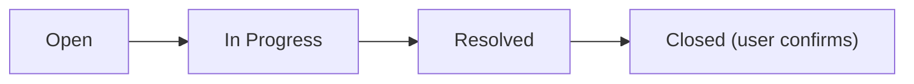

In **Admin > Users**, manage all platform users, groups, and organizations. Role-based access control with fine-grained per-group permissions enables systematic user management at any organization scale.

<Frame caption="User management main screen">
  
</Frame>

---

## Tabs

The user management screen has four tabs.

| Tab | Description |
|-----|-------------|
| **Overview** | View, add, edit, delete individual users |
| **Groups** | Create and manage permission groups |
| **Organizations** | Manage organizational units based on Entra ID sync (see [Organization Management](/en/admin/organizations)) |
| **Inquiries** | Receive and respond to user inquiries |

---

## User List

### View and Search Users

Users appear as a table with these columns.

| Column | Description |
|--------|-------------|
| **Name** | User display name |
| **Email** | Sign-in email address |
| **Role** | Admin, User, Pending |
| **OAuth ID** | External authentication ID for SSO |
| **Last activity** | Most recent access time |
| **Joined** | Account creation date |

**Search:**
- Real-time search by name or email
- Sort by name, joined date, or last activity

### User Roles

Cloosphere has three roles.

| Role | Description | Admin Panel | Workspace | Chat |
|------|-------------|:-----------:|:---------:|:----:|
| **Admin** | Full management permission | Full access | Full access | Full access |
| **User** | Regular user | Per group | Per group | Per group |
| **Pending** | Awaiting approval | No access | No access | No access |

<Warning>
  The **Admin** role can access all settings and data. Grant to minimum users only.
</Warning>

### Super Admin (SA)

<Info>
  **New feature** — Designate one Admin as **Super Admin (SA)**.
</Info>

SA isn't a separate role but a feature to mark the **representative admin among Admins**. The SA's email is shown as contact info on the **account activation pending screen** after sign-up.

| Item | Description |
|------|-------------|
| **Target** | Admin role users only |
| **How to assign** | Click **Set as SA** in the user edit modal |
| **Display** | SA badge shown in the user list |
| **Effect** | The admin's email is shown on the account activation pending screen |

{/* SCREENSHOT NEEDED: users-sa-badge */}

<Note>
  Only 1 SA can be designated. Designating a new user as SA auto-removes the existing one. Only Admins can designate SA.
</Note>

### Changing Roles

<Steps>
  <Step title="Pick the user in the list">
    Click the edit button on the user row.
  </Step>
  <Step title="Change role">
    Open the role dropdown in the edit modal and pick a new role.
  </Step>
  <Step title="Save">
    Click **Save** to apply the change.
  </Step>
</Steps>

<Frame caption="User edit modal">
  
</Frame>

<Note>
  You can't change your own role. The first user (First User)'s role also can't be changed.
</Note>

<Tip>
  User role changes are auto-recorded in the **audit log** (`ROLE_CHANGE` event). Track who changed whose role when and how in [Monitoring > Audit Logs](/en/monitoring/audit-logs).
</Tip>

---

## Adding and Editing Users

### Adding a User

Click the **+** icon (tooltip: "Add user") to manually create a user.

| Field | Description | Required |
|-------|-------------|:--------:|
| **Email** | Sign-in email address | ✓ |
| **Name** | Display name | ✓ |
| **Password** | Initial password | ✓ |
| **Role** | Admin / User / Pending | ✓ |

<Tip>
  To register many users at once, use **CSV file import**. Pick the CSV upload option in the user add modal.
</Tip>

### Editing a User

Click the user's **name or thumbnail**, or the edit button on the row, to open the edit modal.

**Editable items:**
- Name
- Email
- Role
- Profile image URL
- New password
- **Member groups** — view groups the user belongs to and add/remove
- **Member organizational units (OU)** — read-only display of the user's OU tree (Entra/Google Workspace sync result)

<Note>
  Organizational units are shown **read-only** in the user edit screen. OU membership is determined by external IdP sync — to modify directly, change IdP sync settings in [Organization Management](/en/admin/organizations).
</Note>

### Deleting a User

<Warning>
  Deleting a user permanently removes all the user's chat history, settings, and data. This action is irreversible.
</Warning>

### User Chats

Admins can view a user's chat list. Click the **Chats** button on the user row.

---

## Usage Limits

Set per-user daily token usage limits. Set **Daily token limit** in the user edit screen.

| Setting | Description |
|---------|-------------|
| **Daily token limit** | Maximum tokens usable per day (0 = unlimited) |
| **Daily usage** | Tokens used so far (read-only) |

<Note>
  Usage limits can be set at four levels — global, user, group, organization. When set at multiple levels, the **most permissive (highest)** value applies.
</Note>

---

## Group Management

Groups bundle users for unified permission management. Design groups by department, role, project, etc., to match your organization.

### Why Groups?

| Per-user | Per-group |
|----------|-----------|
| Set permissions per user individually | Set once on the group, applies to everyone |
| Edit one by one when changing | Edit only the group setting |
| Becomes complex as users grow | Scales systematically |

### Creating a Group

<Steps>
  <Step title="Select the Groups tab">
    Pick the **Groups** tab in user management.
  </Step>
  <Step title="Create a new group">
    Click the **+** icon (tooltip: "Create group").
  </Step>
  <Step title="Enter group info">
    Enter group name (e.g., "Marketing Team") and description.
  </Step>
  <Step title="Add members">
    Search for users in the **Members** tab and add to the group.
  </Step>
  <Step title="Connect to Organizational Unit (optional)">
    In the **Organization Assignment** area, link this group to a specific organizational unit. All users in the linked OU automatically get the group's permissions — useful for applying the same permission set to an entire department.

    <Tip>
      Linking the "Marketing Team" group to "Company / Marketing Division" OU automatically grants permission to new employees as IdP sync adds them to Marketing Division.
    </Tip>
  </Step>
</Steps>

### Group Permission Settings

Configure detailed permissions per group. All permissions are split into **4 levels**.

<Frame caption="Group permission settings">
  
</Frame>

#### Permission Levels

| Level | Description |
|-------|-------------|
| **None** | Cannot access the feature |
| **Access** | View list (no detail access) |
| **Read** | View list + view details |
| **Write** | View + create/edit/delete |

<Accordion title="Workspace permissions detail">

| Permission | None | Access | Read | Write |
|------------|------|--------|------|-------|
| **Agents** | No access | List only | View detail | Create/edit |
| **Knowledge Base** | No access | List only | View detail | Create/edit |
| **Prompts** | No access | List only | View detail | Create/edit |
| **Tools** | No access | List only | View detail | Create/edit |
| **Database** | No access | List only | View detail | Create/edit |
| **Glossary** | No access | List only | View detail | Create/edit |
| **Guardrails** | No access | List only | View detail | Create/edit |
| **Flow access** | No access | List only | View detail | Create/edit |

</Accordion>

<Accordion title="Admin permissions detail">

You can delegate parts of admin features to regular users.

| Permission | None | Access | Read | Write |
|------------|------|--------|------|-------|
| **User management** | No access | View user list | View detail | Create/edit/delete |
| **Settings access** | No access | View settings list | View setting values | Change settings |
| **Evaluations** | No access | View evaluation list | View detail | Change settings |
| **Monitoring** | No access | View monitoring | View detail | — |

</Accordion>

<Accordion title="Sharing/Chat/Feature permissions detail">

**Sharing permissions** (ON/OFF):
- Share agents, KBs, prompts, tools, databases, glossaries

**Chat permissions** (ON/OFF):
- File upload, chat deletion, message editing, chat controls
- Voice input (STT), voice output (TTS), voice calls
- Multi-model concurrent use, temporary chat

**Feature permissions** (ON/OFF):
- Direct tool server connection, web search, image generation, code execution

</Accordion>

### Default Permissions

Set default permissions applied to users not in any group. Click **Default Permissions** at the top of the Groups tab.

<Tip>
  Default permissions are the initial permissions for users not in any group. Per least-privilege principle, set defaults restrictively and grant additional permissions through groups as needed.
</Tip>

### Group ↔ Organizational Unit Mapping

In the **Organizations** tab of the group edit modal, you can map this group to one or more organizational units (OUs). All members of mapped OUs automatically inherit the group's permissions, so when IdP sync adds a new employee to an OU, permissions apply without any manual action.

| Field | Description |
|-------|-------------|
| **Tab location** | Group edit modal → `General / Permissions / Organizations / Users` |
| **Selection** | Multi-select checkboxes. Search box filters OUs by name, display name, or description |
| **Mutual exclusivity** | **Each OU can be assigned to only one group**. OUs already claimed by another group are automatically excluded from the list |
| **Displayed info** | OU display name + internal name, member count, `Assigned` badge for OUs already attached to the current group |
| **Save behavior** | On group save, persisted to `group.meta.org_unit_ids` |

<Note>
  OUs themselves are imported via IdP sync (Entra/Google Workspace OIDC) or created manually under **Admin > Organizations**. See [Organization Management](/en/admin/organizations) for OU creation and sync.
</Note>

<Tip>
  Mapping the "Marketing" group to the "Company / Marketing" OU means that the moment IdP adds a new hire to the Marketing OU, they receive the group's permission set automatically — eliminating the operational overhead of adding/removing users from groups one by one.
</Tip>

---

## Inquiry Management

Receive and respond to user inquiries to admins.

### Sending User Inquiries

Regular users click **Contact Admin** in the bottom sidebar menu to send inquiries.

<Frame caption="User inquiry modal">
  
</Frame>

| Type | Subtype | Description |
|------|---------|-------------|
| **Usage limit** | Limit increase, limit check | Token limit related |
| **Feature** | Chat, agents, KBs, databases, tools | Feature usage |
| **Bug** | Chat error, agent error, upload error, etc. | Error reports |
| **Account** | Permission request, account issue | Account/permission related |
| **Other** | Improvement, others | Other inquiries |

### Handling Admin Inquiries

Manage received inquiries in **Admin > Users > Inquiries** tab.

<Frame caption="Inquiry management Kanban view">
  
</Frame>

<Tabs>
  <Tab title="Kanban view">
    Drag cards across status columns (Open, In Progress, Resolved, Closed) to change status.
  </Tab>
  <Tab title="List view">
    View all inquiries as rows with filters and sorting.
  </Tab>
</Tabs>

**Status flow:**

<Warning>
  Admins can't change directly to Closed. Only users can close their inquiries. Admins set **Resolved** so users can confirm and close themselves.
</Warning>

---

## Best Practices

<Accordion title="Role management principles">

1. **Minimize Admins** — Designate only essential users as admins
2. **Use Pending** — Set new sign-ups to Pending and approve after review
3. **Periodic review** — Periodically delete or deactivate (Pending) departed user accounts

</Accordion>

<Accordion title="Group design strategy">

1. **Department-based** — Per-department groups (Marketing, Engineering, Sales, etc.)
2. **Role-based** — Per-rank groups (Manager, Senior, Junior, etc.)
3. **Project-based** — Project participant groups (temporary)

</Accordion>

<Accordion title="Security recommendations">

1. **Least privilege** — Grant only minimum permissions needed for the job
2. **Group-first** — Prefer group permissions over individual user permissions
3. **Periodic audit** — Periodically review permission settings and revoke unnecessary

</Accordion>

---

## FAQ

<Accordion title="A user forgot their password">
  Admin can set a new password in user edit. With SSO (Entra ID), contact your company's IT department.
</Accordion>

<Accordion title="How do I let only specific users use a specific agent?">
  In the agent edit screen's **Access** settings, specify the group or organization. Set visibility to "Private" and add the allowed groups.
</Accordion>

<Accordion title="How do I handle departed user accounts?">
  Either delete the account or change the role to **Pending** to deactivate. Deletion also removes chat history — to preserve history, prefer Pending.
</Accordion>
