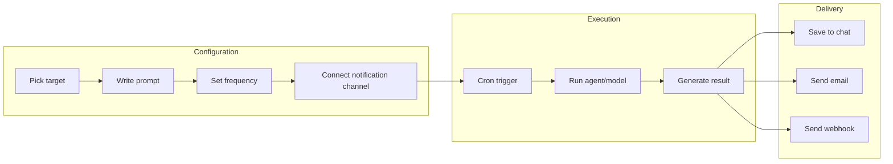
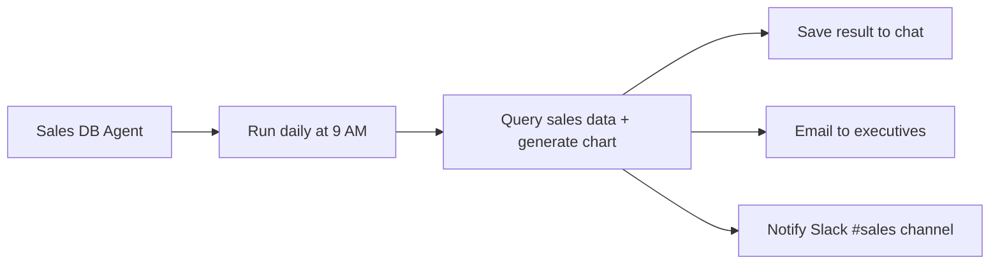

Cloosphere's automation runs repetitive AI tasks at scheduled times without human intervention. Use cron-based scheduled tasks to automate report generation, data analysis, status monitoring, and more — and receive results via email or webhooks.

<Frame caption="Schedule list — card-based schedule view">
  
</Frame>

---

## Automation Features

<Columns cols={2}>
  <Card title="Schedules" icon="clock" href="/en/automation/schedules">
    Auto-run agents, flows, and models on a cron-based scheduler. Receive results via email, Slack, Teams, etc.
  </Card>
  <Card title="Future Plans" icon="lightbulb">
    Event-trigger-based automation, conditional workflows, and other features are planned.
  </Card>
</Columns>

---

## Automation Scenarios

| Scenario | Target | Frequency | Notification |
|----------|--------|-----------|--------------|
| **Daily sales report** | Sales DB agent | Daily 9 AM | Email |
| **Weekly data analysis** | Analytics agent | Every Monday | Slack webhook |
| **System status check** | Monitoring agent | Hourly | Teams on failure |
| **Monthly KPI report** | KPI flow | First of month | Email + Slack |
| **Real-time anomaly detection** | Anomaly agent | Every 10 min | Webhook (immediate) |

---

## Automation Flow

---

## Key Concepts

### Target

The AI resource to auto-run. Pick one of agent, flow, or model.

| Target Type | Description | Best For |
|-------------|-------------|----------|
| **Agent** | AI with Knowledge Base/DB connections | Data analysis, document-based reports |
| **Flow** | Multi-step workflow | Complex multi-step automation |
| **Model** | Base LLM | Simple text generation, summarization |

### Cron Expression

Standard format defining the run frequency. `0 9 * * 1-5` means "weekdays at 9 AM". An intuitive cron editor is provided — you don't need to write it manually.

### Delivery Channel

Channels to receive run results. Supports email, Slack, Teams, Discord, and more.

---

## Prerequisites

<Warning>
  To use scheduled tasks, the following must be in place:
  - Admin must enable `features.scheduled_tasks` permission for the user's group
  - You must have access permission to the agent/flow/model being auto-run
  - For email/webhook notifications, admin must pre-configure channels in **Admin > Settings > Notifications**
</Warning>

---

## Get Started

<Steps>
  <Step title="Prepare workspace">
    First prepare the [agent](/en/workspace/agents), [flow](/en/workspace/flows), or model to auto-run. For data-analysis automation, create an agent connected to a [database](/en/workspace/database).
  </Step>
  <Step title="Create a schedule">
    On the [Schedules](/en/automation/schedules) page, set target, prompt, run frequency, and notification channel.
  </Step>
  <Step title="Test run">
    Use the **Run Now** button to test settings. If the result isn't what you expected, edit the prompt and retest.
  </Step>
  <Step title="Activate">
    After testing, activate the schedule. It runs automatically per the configured frequency.
  </Step>
</Steps>

---

## Example Setup: Daily Sales Report Automation

| Setting | Value |
|---------|-------|
| **Target** | Sales analytics agent (DB-connected) |
| **Prompt** | "Analyze today's sales data and write a report including DoD growth rate" |
| **Frequency** | Daily 9 AM (`0 9 * * *`) |
| **Notification 1** | Email (on success) → executives |
| **Notification 2** | Slack webhook (always) → #sales |

<Tip>
  Charts generated by DbSphere agents are server-side rendered to images and auto-included in emails and webhooks.
</Tip>
