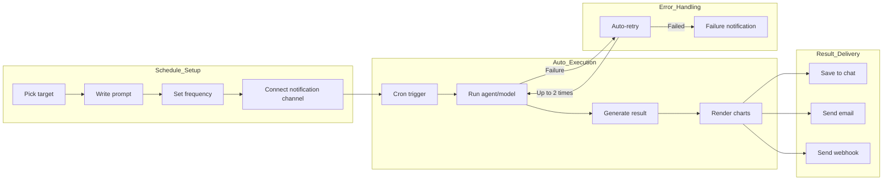

Tired of manually requesting daily sales reports or checking weekly system monitoring results?

Schedules **send the AI prompts at scheduled times automatically** and save the results to chat or deliver them via email/Slack/Teams.

### Example

> "Every day at 9 AM, analyze yesterday's sales and send the report by email"

| Method | Process | Time |
|--------|---------|:----:|
| Manual request | Open chat daily → enter prompt → copy result → write email | 10–20 min/day |
| Schedule | Configure once → auto-run daily + email send | **0 min** (auto) |

{/* SCREENSHOT: schedules-list */}
<Frame caption="View status, next run time, and target for every schedule in the schedules list">
  
</Frame>

---

## Schedule Lifecycle



---

## Schedule List

In the **Schedules** section of the sidebar, view all schedules.

| Feature | Description |
|---------|-------------|
| **Search** | Search by name, description, prompt |
| **Toggle active/inactive** | Toggle from the more menu (⋮) |
| **Run Now** | Run immediately without waiting for next cycle |
| **Delete** | Delete the schedule and execution history |

---

## Creating a Schedule

Click the **+** icon button to create a schedule.

<Steps>
  <Step title="Basic info">
    Enter name and description.

    {/* SCREENSHOT: schedules-create-top */}
    <Frame caption="Enter the schedule name and description">
      
    </Frame>

    | Field | Description | Example |
    |-------|-------------|---------|
    | **Name** | Schedule name | "Daily Sales Report" |
    | **Description** | Purpose (optional) | "Daily 9 AM sales analysis" |
  </Step>

  <Step title="Pick target">
    Pick the agent, flow, or model to run.

    | Target Type | Description |
    |-------------|-------------|
    | **Agent** | AI agent connected to Knowledge Bases, databases, etc. |
    | **Flow** | Multi-step workflow |
    | **Model** | Base LLM model (direct prompt) |
    | **Dashboard** | BI dashboard HTML export (refreshed with latest data) |

    <Note>
      You can only pick targets you have access permission to. Without permission, they don't appear in the list.
    </Note>
  </Step>

  <Step title="Write the prompt">
    Enter the prompt to send when running.

    **Tips:**
    - Specify the desired output form
    - When the agent has structured output (JSON Schema), result fields are accessible from notification templates

    **Example:**
    ```
    Analyze today's sales data and write a report including DoD growth rate
    and key drivers. Visualize with charts and summarize 3 key insights.
    ```
  </Step>

  <Step title="Set frequency (cron editor)">
    Set the run frequency. An intuitive cron editor is provided.

    {/* SCREENSHOT: schedules-cron-editor */}
    <Frame caption="Set frequency with the intuitive cron editor — no need to know complex cron expressions">
      
    </Frame>

    | Mode | Description | Example |
    |------|-------------|---------|
    | **Interval** | Run every N minutes (1, 2, 3, 5, 10, 15, 20, 30 min) | Every 10 min |
    | **Hourly** | Every hour at a specific minute | Every hour at :30 |
    | **Daily** | Daily at a specific time | Daily 9:00 AM |
    | **Weekly** | Specific weekday + time | Mon–Fri 9:00 AM |
    | **Monthly** | Specific day + time | 1st of month 8:00 AM |
    | **Custom** | Direct cron expression | `0 9 * * 1-5` |

    You can also set timezone and run period.

    | Setting | Description |
    |---------|-------------|
    | **Timezone** | Reference timezone for run time (default: browser timezone) |
    | **Start date** | Schedule start date (optional) |
    | **End date** | Schedule end date (optional, indefinite if unset) |
  </Step>

  <Step title="Notification setup">
    Set channels to receive run results. Add multiple notifications.

    {/* SCREENSHOT: schedules-delivery */}
    <Frame caption="Add multiple notification channels with success/failure conditional branching">
      
    </Frame>

    | Setting | Description |
    |---------|-------------|
    | **Channel type** | Email / Webhook (preconfigured) / Direct URL / Telegram / Google Chat |
    | **Channel selection** | Pick admin-configured email or webhook channel |
    | **Trigger** | Always / Success only / Failure only |
    | **Email recipients** | Email address list (email channel only) |
    | **Subject/Body template** | Email subject and body (email channel only) |
    | **Message template** | Webhook message (webhook channel only, optional) |

    <Tip>
      Add multiple notifications to a single schedule for conditional branching — e.g., email on success and Slack on failure.
    </Tip>
  </Step>

</Steps>

<Note>
  Newly created schedules are saved as **active** (is_active=True) by default. The next run is scheduled immediately upon creation.
</Note>

---

## Cron Expression Guide

In Custom mode, enter a cron expression directly. A cron expression has **5 fields**.

```
┌─────────── minute (0-59)
│ ┌─────────── hour (0-23)
│ │ ┌─────────── day of month (1-31)
│ │ │ ┌─────────── month (1-12)
│ │ │ │ ┌─────────── day of week (0-6, 0=Sunday)
│ │ │ │ │
* * * * *
```

### Special Characters

| Character | Meaning | Example |
|-----------|---------|---------|
| `*` | All values | `* * * * *` = every minute |
| `,` | List multiple values | `0 9,18 * * *` = 9 AM and 6 PM |
| `-` | Range | `0 9 * * 1-5` = Mon–Fri |
| `/` | Step | `*/10 * * * *` = every 10 min |

### Day of Week Numbers

| Number | Day |
|--------|-----|
| 0 | Sunday |
| 1 | Monday |
| 2 | Tuesday |
| 3 | Wednesday |
| 4 | Thursday |
| 5 | Friday |
| 6 | Saturday |

### Common Expressions

| Cron Expression | Description |
|-----------------|-------------|
| `0 9 * * *` | Daily 9 AM |
| `0 9 * * 1-5` | Weekdays (Mon–Fri) 9 AM |
| `0 9,18 * * *` | Daily 9 AM and 6 PM |
| `30 8 * * 1` | Mondays 8:30 AM |
| `0 0 1 * *` | First of every month, midnight |
| `0 0 1,15 * *` | 1st and 15th of every month, midnight |
| `*/30 * * * *` | Every 30 min |
| `0 */2 * * *` | Every 2 hours on the hour |
| `0 9 * * 1,3,5` | Mon/Wed/Fri 9 AM |
| `0 22 * * 0` | Sundays 10 PM |

<Tip>
  When you set Interval/Hourly/Daily/Weekly/Monthly modes, the cron expression is auto-generated. Use Custom mode only for complex schedules.
</Tip>

---

## Schedule Management

### Activate / Deactivate

Open the more menu (⋮) in the list and toggle active/inactive. When deactivated, the next run isn't scheduled.

### Run Now

Click **Run Now** to run immediately without waiting for the next cycle. Useful for manual result review or testing settings.

### Edit

Click a schedule card to open the detail page where you can edit all settings. Changes auto-recalculate the next run time.

### Delete

Deleting a schedule also removes related execution history.

<Warning>
  Deleted schedules can't be recovered. Execution history and linked chat history may also be deleted, so proceed carefully.
</Warning>

### Copy to Users

Copy a schedule to other users. **Copy to Users** works as a **copy-based** share.

| Item | Description |
|------|-------------|
| **Independent copy** | A separate schedule is created for the recipient |
| **Settings copy** | Target, prompt, frequency, and notifications all copied |
| **Independent edits** | After sharing, each user can edit their own schedule freely |
| **Origin tracking** | Copy metadata records the original owner and schedule info |

---

## Execution History

On the schedule detail page, view recent execution history.

{/* SCREENSHOT: schedules-history */}
<Frame caption="View status, duration, and retry counts in execution history">
  
</Frame>

### Status

| State | Color | Description |
|-------|-------|-------------|
| **Pending** | Yellow | Awaiting execution |
| **Running** | Blue | Currently executing |
| **Completed** | Green | Completed successfully |
| **Failed** | Red | Error occurred |

### History Details

| Item | Description |
|------|-------------|
| **Run time** | Scheduled run time |
| **Duration** | Time from start to completion |
| **Retry count** | Auto-retry count on errors (max 2) |
| **Error message** | Failure cause (on failure) |
| **View chat** | Navigate to the chat where results were saved |

### Auto-retry

Timeouts, server errors (5xx), rate-limit errors, and connection errors are auto-retried up to 2 times. Tasks running for more than 10 minutes are auto-recovered.

### History Retention

Completed and failed execution records are auto-deleted after 30 days.

---

## Chat Storage

Every execution result is saved to a dedicated chat.

| Item | Description |
|------|-------------|
| **First run** | A new chat is auto-created |
| **Subsequent runs** | Results accumulate in the same chat |
| **Chat title** | Set by the notification subject template (default: `[{{schedule_name}}] {{result.title}}`) |
| **Quick link** | Navigate via "View Chat" link in execution history |

---

## Chart Images

Charts generated by Database (DbSphere) agents are server-side rendered to images and included in notifications.

**Supported chart types:**
- Bar charts, line charts, pie charts, scatter plots
- Heatmaps, histograms, grouped bar charts

**Per-channel delivery:**

| Channel | Method |
|---------|--------|
| **Email** | Inline images in the body |
| **Slack** | Image URL display |
| **Teams** | Image included in Adaptive Card |
| **Discord** | Image in Embed (first image) |
| **Telegram** | Sent as image messages |
| **Google Chat** | Image in Card |

---

## Template Variables

Variables you can use in notification subject, body, and message templates.

| Variable | Description | Example |
|----------|-------------|---------|
| `{{schedule_name}}` | Schedule name | Daily Sales Report |
| `{{prompt}}` | Executed prompt | Today's sales data... |
| `{{result}}` | Full execution result | (Full AI response) |
| `{{status}}` | Execution status | completed / failed |
| `{{result_raw}}` | Raw result before processing | (Raw AI response) |
| `{{chat_url}}` | Result chat URL | https://cloosphere.example.com/c/abc123 |
| `{{completed_at}}` | Completion time | 2025-02-27 09:00:45 |

### Accessing Structured Output

When the target agent has a JSON Schema response format, access individual fields with dot notation.

```
{{result.title}}           → title field of the result JSON
{{result.data.count}}      → nested field access
{{result.metrics.revenue}} → revenue data access
```

<Tip>
  In the notification setup screen, structured output fields are auto-detected and shown as buttons. Click to insert into the template.
</Tip>

### Template Examples

<Tabs>
  <Tab title="Email subject">
    ```
    [{{schedule_name}}] {{status}} - {{completed_at}}
    ```
  </Tab>
  <Tab title="Email body">
    ```
    Schedule "{{schedule_name}}" execution completed.

    Prompt: {{prompt}}

    Result:
    {{result}}
    ```
  </Tab>
  <Tab title="Slack message">
    ```
    *{{schedule_name}}* run result ({{status}})
    > {{result}}
    ```
  </Tab>
</Tabs>

---

## Access Permissions

| Scope | Description |
|-------|-------------|
| **Creation** | Only users with `features.scheduled_tasks` permission can create (admins always can) |
| **Edit/delete** | Only owner or admin can |
| **Sharing (read)** | Grant view permission to specific groups/users via `access_control` |
| **Target access** | Read permission required for target agent/model (or it's hidden) |

---

## FAQ

<AccordionGroup>
  <Accordion title="Schedule isn't running" icon="triangle-exclamation">
    Check:
    - Verify the schedule is **active**
    - Verify start/end dates are correctly set
    - Verify access permission to the target agent/model
    - Verify `features.scheduled_tasks` permission is enabled for the user's group
  </Accordion>

  <Accordion title="It runs 1–2 minutes late, not on time" icon="circle-question">
    The scheduler checks for run targets at **1-minute intervals**. Once queued, workers process at **5-second intervals**. So up to ~1 min delay can occur, which is normal.
  </Accordion>

  <Accordion title="What if users are in multiple timezones?" icon="circle-question">
    Each schedule can have its own timezone. Example: Seoul office uses `Asia/Seoul`, NY office uses `America/New_York`. The default auto-detects the browser's timezone.
  </Accordion>

  <Accordion title="Execution result doesn't appear in chat" icon="triangle-exclamation">
    The execution may have failed. Check the status and error message in execution history.
  </Accordion>

  <Accordion title="Where do I configure notification channels?" icon="circle-question">
    Email and webhook channels are pre-configured by admins in **Admin > Settings > Notifications**. The Direct URL method can be entered directly in the schedule without preconfiguration.
  </Accordion>

  <Accordion title="I don't know cron expressions" icon="circle-question">
    Picking Interval/Hourly/Daily/Weekly/Monthly mode auto-generates the cron expression. For Custom mode, see the [Cron Expression Guide](#cron-expression-guide) above.
  </Accordion>

  <Accordion title="Can I copy a schedule to other users?" icon="circle-question">
    Yes — click **Copy to Users** on the schedule detail page and select target users. An independent copy is created for each user, separate from the original and freely editable.
  </Accordion>
</AccordionGroup>

---

## Related Pages

<Columns cols={3}>
  <Card title="Agents" icon="robot" href="/en/workspace/agents">
    Configure AI agents as schedule targets
  </Card>
  <Card title="Notification Settings" icon="bell" href="/en/admin/notifications">
    Pre-configure email/webhook notification channels
  </Card>
  <Card title="Database" icon="database" href="/en/workspace/database">
    Useful for chart-included sales report automation
  </Card>
</Columns>
