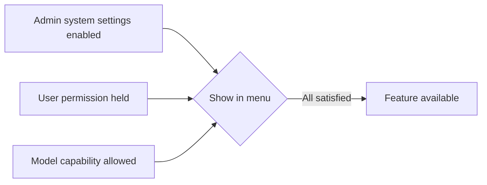

Beyond basic AI conversations, Cloosphere Chat offers three advanced features: **web search**, **image generation**, and **code execution**.
Click the **"+"** button on the left of the input box to open the capability toggles and file attachment menu.

<Frame caption="Capability toggle menu">
  
</Frame>

## Activation Conditions

Advanced features only appear in the menu when **all** of the following are satisfied.

| Condition | Description |
|-----------|-------------|
| **System setting** | Admin must enable the feature globally |
| **User permission** | Permissions like `permissions.features.web_search` are required |
| **Model capability** | The agent's capability setting must not be `off` |

<Note>
  Admins (`admin` role) bypass permission checks, so as long as system settings are enabled, they can use the feature.
</Note>

## Feature Details

<Tabs>
  <Tab title="Web Search">
    ### Web Search

    The AI searches the web in real time and answers based on the latest information.

    

    #### How to Enable

    <Steps>
      <Step title="Open the toggle menu">
        Click the **"+"** button on the left of the input box.
      </Step>
      <Step title="Enable Web Search">
        Toggle on **Web Search**. After enabling, web search is applied to subsequent messages.
      </Step>
    </Steps>

    #### How It Works

    1. The AI auto-extracts a search query from the user's question
    2. Performs web search via the admin-configured search engine (SearxNG, Google PSE, Brave, etc.)
    3. Search result URL list and query are shown collapsed
    4. Generates an answer using the search results as context
    5. Provides source links as citations

    #### Search Result Display

    The search query and referenced URL list appear at the top of the response in collapsible form.
    Click each URL to navigate to the original page.

    <Tip>
      In **Settings > Interface > Web Search in Chat**, set web search to **"always enabled"** to auto-search in every conversation without toggling.
    </Tip>

    #### Use Cases

    - "What's today's KOSPI index?"
    - "What are the latest AI trends?"
    - "Find recent news about this company"
  </Tab>

  <Tab title="Image Generation">
    ### Image Generation

    Use image generation models like DALL-E to generate images from text prompts.

    

    #### How to Enable

    When multiple image generation Connections are configured, choose which Connection to use from the submenu.

    <Steps>
      <Step title="Open the toggle menu">
        Click the **"+"** button on the left of the input box.
      </Step>
      <Step title="Pick Image Generation">
        Click **Image Generation** (may appear as **Image** depending on admin settings) — available Connections appear.
      </Step>
      <Step title="Pick a Connection">
        Pick the image generation engine to use. Hover over each Connection to see details like model name, size, and quality.
      </Step>
    </Steps>

    #### Connection Info

    Each image Connection includes:

    | Item | Description |
    |------|-------------|
    | **Deployment** | Image generation deployment name (Azure deployment name) |
    | **Model** | Model name |
    | **Size** | Output image size (e.g., 1024x1024) |
    | **Quality** | Image quality setting (when applicable) |
    | **Format** | Output format (PNG, JPEG, etc.) |

    #### Prompt Tips

    - **Be specific**: Instead of "mountain", say "snow-covered Alps at sunrise, photorealistic"
    - **Specify style**: "watercolor", "minimal illustration", "3D render"
    - **State composition**: "wide shot", "close-up", "aerial view"

    <Note>
      For agent models, admins can restrict to specific Connections. In that case, only allowed Connections appear in the list.
    </Note>
  </Tab>

  <Tab title="Code Interpreter">
    ### Code Interpreter

    Run AI-generated code directly and see results.

    

    #### How to Enable

    <Steps>
      <Step title="Open the toggle menu">
        Click the **"+"** button on the left of the input box.
      </Step>
      <Step title="Enable Code Interpreter">
        Toggle on **Code Interpreter**.
      </Step>
    </Steps>

    #### Supported Features

    | Feature | Description |
    |---------|-------------|
    | **Python execution** | Run Python via Pyodide (browser) or server-side Jupyter (per admin setting) |
    | **Data visualization** | Generate charts using matplotlib, plotly, etc. |
    | **File generation** | Download code execution outputs as files |
    | **Result display** | Real-time stdout, stderr, and return value display |

    #### Code Block Execution

    When the AI generates a response containing code blocks, a **Run** button appears at the top of each block.
    Clicking runs the code and displays results below the block.

    #### Artifact Viewer

    When the AI generates HTML or SVG code, the Artifact Viewer panel **auto-opens** to display the rendered result.

    <Steps>
      <Step title="Request web content">
        Ask the AI to generate web pages, charts, SVG graphics, UI components, etc.
      </Step>
      <Step title="Auto-render">
        When HTML/SVG is generated, the Artifact Viewer panel auto-opens with rendered output.
      </Step>
      <Step title="Review the result">
        Inspect the rendered output in the Artifact panel and copy code if needed.
      </Step>
    </Steps>

    

    <Warning>
      In browser (Pyodide) mode, system access and network requests are restricted. When admins configure server-side Jupyter, those restrictions may not apply.
    </Warning>
  </Tab>
</Tabs>

## Using Tools

Beyond advanced features, you can enable **Tools** registered by the admin in conversations.
The available Tool list appears at the top of the toggle menu, with switches to individually enable/disable.

<Frame caption="Capability toggle menu">
  
</Frame>

| Item | Description |
|------|-------------|
| **Tool name** | Name of the tool registered by admin |
| **Tool description** | Tooltip shown on hover |
| **Enable switch** | Toggle Tool use in this conversation |

<Tip>
  Tools are enabled per conversation. Enabling a Tool in one conversation doesn't affect others.
</Tip>

## Agent vs. Base Model

Advanced feature availability depends on the selected model type.

| Feature | Agent Model | Base Model |
|---------|-------------|------------|
| **Web Search** | Per Capability setting | Shown when system + user permissions are met |
| **Image Generation** | Per Capability setting | Shown when system + user permissions are met |
| **Code Interpreter** | Per Capability setting | Shown when system + user permissions are met |

<Note>
  In agent models, capabilities set to `on` are auto-enabled at conversation start.
  Capabilities set to `user` must be toggled by the user.
</Note>
