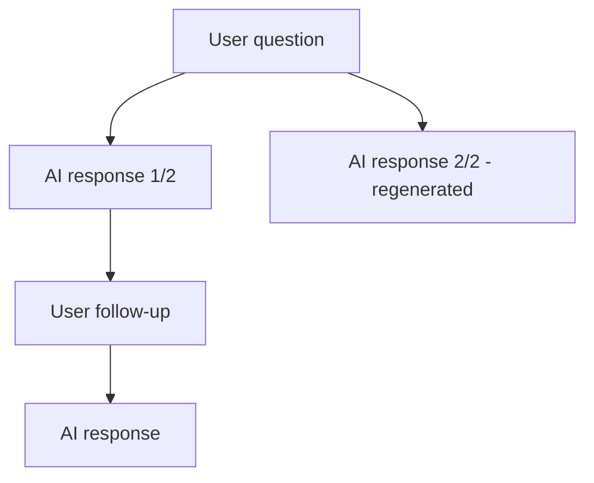

Cloosphere automatically saves every conversation. From the sidebar you can search chat history, organize chats into folders, and export them in various formats.

## Starting a New Conversation

<Steps>
  <Step title="Click the New Chat button">
    Click the **New Chat** button at the top of the sidebar, or use the `Ctrl + Shift + O` shortcut.
  </Step>
  <Step title="Pick a model">
    Choose the AI model from the dropdown in the chat header. If you don't pick one, the default model is used.
  </Step>
  <Step title="Type and send">
    Type your question or request in the input box and press `Enter` to start. The chat title is auto-generated from the first message.
  </Step>
</Steps>

<Tip>
  Enable **Temporary Chat** mode to skip saving the conversation history. Useful for testing sensitive content or one-off questions.
</Tip>

## Searching Chat History

Use the search box at the top of the sidebar to find conversations.

- **Title search**: Search by auto-generated chat titles
- **Content search**: Full-text search of conversation content
- **Tag filter**: Use `tag:tagname` syntax to filter conversations with a specific tag

<Note>
  The chat list uses scroll-based pagination. Older conversations load automatically as you scroll down.
</Note>

## Chat Menu

Hover over a chat item to reveal the **more (...)** button — clicking it opens action options.

<Frame caption="Chat context menu">
  
</Frame>

| Menu | Description |
|------|-------------|
| **Pin / Unpin** | Pin important conversations to the top of the sidebar |
| **Rename** | Manually change the auto-generated chat title |
| **Clone** | Copy the current conversation into a new chat |
| **Archive** | Hide a conversation from the list without deleting it |
| **Share** | Generate a share link ([Sharing details](/en/chat/sharing)) |
| **Download** | Export the chat as JSON (.json), plain text (.txt), or PDF (.pdf) |
| **Delete** | Permanently delete the conversation |
| **Tag** | Add or remove category tags |

## Editing and Deleting Messages

### Editing User Messages

When you edit a sent user message, the **original message is preserved** and the AI generates a new response based on the edit. This creates a conversation branch.

<Frame caption="Branch after editing a user message">
  
</Frame>

<Steps>
  <Step title="Hover the message">
    Hover over the message you want to edit.
  </Step>
  <Step title="Click the edit button">
    Click the **Edit** icon that appears on the right side of the message.
  </Step>
  <Step title="Edit and send">
    Type your edits and click **Send** — the AI generates a new response.
    Click **Save** to update the content only without generating a new response.
  </Step>
</Steps>

### Editing AI Responses

You can directly edit AI responses too. Editing preserves the original so you can revert at any time.

### Deleting Messages

When you delete a message, its child responses are reattached to the parent so the conversation flow stays intact.

### Branch Navigation

When a message has multiple branches, an indicator like `1/3` appears below it. Use the left/right arrows to navigate between branch responses.

## Folder Management

Organize conversations into folders.

<Steps>
  <Step title="Create a folder">
    Click **New Folder** in the sidebar and enter a folder name.
  </Step>
  <Step title="Move a chat to a folder">
    Drag a chat item into the folder you want.
  </Step>
  <Step title="Manage folder structure">
    Create sub-folders inside folders for hierarchical management.
  </Step>
</Steps>

<Frame caption="Sidebar folder structure">
  
</Frame>

<Tip>
  Collapse and expand folders to use sidebar space efficiently.
</Tip>

## Exporting Conversations

### Exporting Individual Chats

Choose the format from the **Download** sub-menu in the chat menu.

<Tabs>
  <Tab title="JSON (.json)">
    Complete format including message history, metadata, and branch structure.
    Can be **imported** into another Cloosphere instance.
  </Tab>
  <Tab title="Text (.txt)">
    Plain-text format with only roles (USER/ASSISTANT) and message content.
    Suitable for simple archival or external tools.
  </Tab>
  <Tab title="PDF (.pdf)">
    Exports as A4 PDF. The current theme (light/dark) is applied,
    and long conversations are auto-paginated.
  </Tab>
</Tabs>

### Bulk Export / Import

Settings > **Chats** tab lets you manage all conversations at once.

<Frame caption="Settings — Chats tab">
  
</Frame>

| Feature | Description |
|---------|-------------|
| **Import Chats** | Import conversations from a JSON file (OpenAI export format also auto-converted) |
| **Export Chats** | Export all conversations as `chat-export-{timestamp}.json` |
| **Archived Chats** | View and restore archived conversations |
| **Archive All Chats** | Archive all conversations (with confirmation) |
| **Delete All Chats** | Permanently delete all conversations (with confirmation) |

<Warning>
  **Delete All Chats** is irreversible. Export important conversations first.
</Warning>

## Bulk Actions

Hold Shift while hovering over a chat item to instantly show archive/delete buttons for fast per-item actions.

## Archive Management

Archived conversations are hidden from the sidebar list but not deleted.

<Steps>
  <Step title="View archived conversations">
    Click Settings > Chats > **Archived Chats** to open the archive list.
  </Step>
  <Step title="Restore or delete">
    Restore an archived conversation back to the sidebar, or delete permanently.
    Use **Unarchive All** to bulk-restore all archived conversations, or **Export** to bulk-export them.
  </Step>
</Steps>
