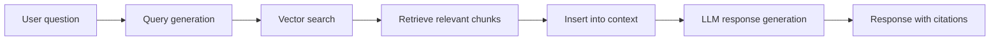

In Cloosphere Chat you can attach files for the AI to analyze, or connect a Knowledge Base for document-grounded answers.

## Attaching Files

You can attach files in several ways.

<Frame caption="Input area with attached files">
  
</Frame>

<Tabs>
  <Tab title="Drag and Drop">
    Drag files into the chat area to upload them automatically.
    You can drag multiple files at once.
  </Tab>
  <Tab title="File Picker">
    Click the **"+"** button on the left of the input box > **Upload Files** to pick files from the file explorer.
  </Tab>
  <Tab title="Screen Capture">
    Click the **"+"** button > **Capture** to capture the screen and attach it as an image.
    On desktop this works via screen sharing; on mobile it uses the camera.
  </Tab>
  <Tab title="Clipboard Paste">
    Copy an image to the clipboard and paste with `Ctrl + V` into the input box.
    To auto-convert long pasted text into a file, enable **"Paste Large Text as File"** under **Settings > Interface** (default: off).
  </Tab>
  <Tab title="Cloud Storage">
    When the admin has enabled it, you can pull files directly from these cloud storage services:

    - **Google Drive**: Google account integration
    - **OneDrive**: Microsoft account integration
    - **SharePoint**: Browse your organization's SharePoint sites
  </Tab>
</Tabs>

## Supported File Formats

| Category | Formats |
|----------|---------|
| **Documents** | PDF, DOCX, PPTX, TXT, MD, HTML |
| **Spreadsheets** | XLSX, CSV |
| **Images** | PNG, JPG, GIF, WebP, AVIF |
| **Code** | PY, JS, TS, Java, C++, etc. |
| **Audio** | WAV, MP3, etc. |
| **Data** | JSON, XML, YAML |

<Tip>
  When you upload audio (WAV, MP3, etc.), STT (Speech-to-Text) is run automatically to produce a transcription.
</Tip>

## File Size Limits

<Note>
  The maximum file size depends on the value the admin sets in **Settings > Documents**.
  Files exceeding the limit are rejected with a "File size should not exceed X MB" error.
</Note>

## Image Analysis

When you attach an image (PNG, JPG, GIF, WebP, AVIF), a Vision model analyzes its content.

<Frame caption="Image analysis response">
  
</Frame>

<Accordion title="Image analysis use cases">
  - **Charts/graphs**: Extract and analyze data points
  - **Document images**: OCR-based text extraction
  - **UI design**: Design feedback and code conversion
  - **Error screens**: Analyze error messages and suggest fixes
  - **Photos**: Object recognition, scene description
</Accordion>

<Warning>
  If the selected model doesn't support Vision, attaching an image triggers a "Selected model(s) do not support image inputs" error.
</Warning>

<Tip>
  Enable **Settings > Interface > Files > Image Compression** to auto-compress high-resolution images to a target size, improving upload speed and token efficiency.
</Tip>

## Document File Processing

For non-image files (PDF, DOCX, code files, etc.), text is **extracted automatically** at upload time.

<Steps>
  <Step title="Upload the file">
    Attach a file using one of the methods above. During upload it shows an "uploading" state.
  </Step>
  <Step title="Text extraction">
    The server extracts the file contents automatically. Once complete, the state changes to "uploaded".
  </Step>
  <Step title="Use the context">
    The extracted text is included as context in the AI conversation, enabling questions about the file content.
  </Step>
</Steps>

## Knowledge Base Integration (RAG)

### Reference a Knowledge Base with `#`

Type `#` in the input box to see available Knowledge Base collections and individual files. The AI searches documents from the selected Knowledge Base or file and uses them in its answer.

<Frame caption="Knowledge Base autocomplete dropdown">
  
</Frame>

```
#hr-policy What is the leave application process?
```

### How RAG Works



<Steps>
  <Step title="Query analysis">
    A search query is generated from the user's question.
  </Step>
  <Step title="Vector search">
    Vector similarity search runs against document chunks stored in the Knowledge Base.
  </Step>
  <Step title="Build the context">
    The retrieved relevant chunks are inserted into the AI prompt as context.
  </Step>
  <Step title="Generate the response">
    The AI generates an answer that references the retrieved documents and provides citations.
  </Step>
</Steps>

### Agent-based RAG

When an agent has Knowledge Bases attached, it searches them automatically — no `#` command required.
Attach Knowledge Bases in Workspace > Agent settings.

## Citation Display

Responses that referenced Knowledge Base or web search results show **citations**.

<Frame caption="Citation display">
  
</Frame>

### Citation List

A list of referenced documents appears below the response.

| Item | Description |
|------|-------------|
| **Index number** | The citation order number |
| **Source name** | Original filename or URL |
| **Source count toggle** | Shows the total source count in "N Sources" format — click to expand the list |

<Note>
  Relevance (similarity score) is not shown in the citation list — view it inside the **source modal** opened by clicking a citation.
</Note>

### Reviewing the Source

Click a citation to open the **source modal** with the full retrieved chunk content.

<Steps>
  <Step title="Click the citation badge">
    Click a source item in the citation area below the response.
  </Step>
  <Step title="Review the source">
    The modal shows the retrieved chunk's full text and metadata.
  </Step>
  <Step title="Verify trustworthiness">
    Use the source to directly verify the accuracy of the AI response.
  </Step>
</Steps>

<Tip>
  URL-based sources (web search results) take you directly to the original page when clicked.
</Tip>

## Files in Chat Controls

The **Files** section of the Chat Controls panel lists files attached to the current conversation.

- Each item shows filename, type, and size
- The **trash icon** removes individual files
- Clicking a file shows its details
