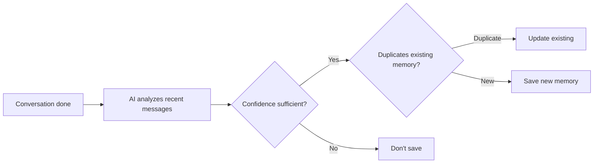
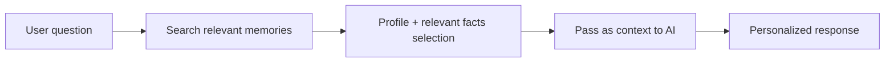

Tired of repeating the same context every time you talk to the AI?

When Memory is enabled, the AI **automatically remembers** information learned in past conversations and uses it in subsequent ones.

### Example

> "Our team uses Python 3.11 + FastAPI, and we deploy on Azure AKS"

| State | Behavior | Result |
|-------|----------|--------|
| Memory OFF | Each conversation is fresh | Repeated questions like "Which framework do you use?" |
| Memory ON | Stack remembered from past conversation | FastAPI-based code suggestions, AKS deployment guidance immediately |

<Warning>
  Memory is currently an **Experimental** feature. Behavior may change in the future.
</Warning>

---

## Enabling Memory

<Steps>
  <Step title="Open Settings">
    Click the **Settings** icon at the top-right or in the sidebar.
  </Step>
  <Step title="Pick the Personalization tab">
    In the settings modal, go to the **Personalization** tab.
  </Step>
  <Step title="Toggle Memory on">
    Enable the toggle switch in the Memory section.

    {/* SCREENSHOT: memory-toggle */}
    <Frame caption="Toggle Memory on under Settings > Personalization">
      
    </Frame>
  </Step>
</Steps>

<Tip>
  Turning Memory off disables both auto-extraction and conversation injection. Existing stored memories are preserved, not deleted.
</Tip>

---

## 3 Ways Memory is Stored

Memory is categorized into three types by source, each with different retention.

| Type | Created By | Retention | Display in List |
|------|-----------|-----------|:----------------:|
| **Manual** | User input | 180 days | No badge |
| **Auto** | AI auto-extracts from conversation | 30 days | `Auto` badge |
| **Profile** | AI summarizes/integrates all memories | Permanent | `Auto-generated` badge |

### Manual Memory

Users directly enter information they want the AI to remember.

**Example inputs:**
- "User is a data engineer who primarily uses Snowflake"
- "User prefers camelCase for variable names in code reviews"
- "User's team holds sprint reviews every Wednesday"

<Note>
  Memory is more effective in third person. Use **"User..."** form instead of "I...".
</Note>

### Auto Memory

When chatting with Memory enabled, the AI **auto-extracts** key facts in the background after a response and saves them.

- Up to **100 auto-memories** stored per user
- Duplicate content is auto-merged to avoid bloat
- Consecutive messages within **5 minutes** in the same chat skip extraction

### Profile Summary

When a certain number of auto/manual memories accumulate, the AI integrates them into a **structured profile document**.

The profile includes:
- Role and work area
- Tech stack preferences
- Active projects
- Communication style

**Only 1 profile is kept** — auto-updated as new memories accumulate.

---

## How Memory is Reflected in Conversations

When you ask a question with Memory ON, the AI auto-references relevant memories before answering.

The AI **auto-adjusts strategy** based on memory volume:

| Memory Count | Behavior |
|--------------|----------|
| None | Standard conversation (no memory injection) |
| Few (< 20) | Reference all memories |
| Many (≥ 20) | Reference profile + selected memories relevant to the question |

<Tip>
  When 20+ memories accumulate, the AI **picks high-relevance memories** based on the question content.
  For example, Python-related questions prioritize Python-related memories.
</Tip>

---

## Memory Management

In Settings > Personalization, click the **Manage** button to open the memory management screen.

{/* SCREENSHOT: memory-manage-list */}
<Frame caption="Memory management modal — view stored memories and the profile summary">
  
</Frame>

### Add Memory

{/* SCREENSHOT: memory-add-modal */}
<Frame caption="Write in third person — 'User...' form is most effective">
  
</Frame>

1. Click **Add Memory** button
2. Enter text (e.g., "User writes code comments in Korean")
3. Click **Add**

### Edit Memory

Click the **pencil icon** on each memory to edit content.
Auto-extracted memories can also be edited.

### Delete Memory

- **Per-item**: Click the **trash icon** on each item
- **Bulk**: **Clear memory** button at the bottom (with confirmation dialog)

<Note>
  Deleted memories don't disappear immediately — they're fully removed after a **30-day grace period**. During this time, they're not reflected in conversations.
</Note>

### Profile Summary View

A **Profile Summary** section appears at the top of the memory management screen (when a profile exists).
{/* SCREENSHOT: memory-profile-summary */}
Click to view the AI-generated user profile.

<Frame caption="AI-generated profile summary — role, tech stack, projects, etc.">
  
</Frame>

---

## Organization Memory (Admin-only)

Admins can configure **memory shared across the entire organization**.

**Path:** Admin > Settings > Memory tab > Organization Memory

Organization memory is auto-injected into **all conversations of all users in the organization**.

{/* SCREENSHOT: admin-org-memory */}
<Frame caption="Organization memory is auto-included in all members' conversations">
  
</Frame>

### Use Cases

- "Our company must always comply with PIPA when handling customer data"
- "In internal terminology, 'Sprint' means a 2-week development cycle"
- "Use the company's official template (Template A) when writing reports"

<Warning>
  Organization memory is included in **every member's conversation**, so enter only essential, concise info.
  Too much organization memory can affect AI response quality.
</Warning>

---

## Admin Settings

{/* SCREENSHOT: admin-memory-settings */}
<Frame caption="Admin > Settings > Memory — configure extraction model, confidence, and retention policies">
  
</Frame>

In Admin > Settings > Memory tab, manage the entire memory system.

### Extraction Settings

| Setting | Default | Description |
|---------|---------|-------------|
| **Extraction Model** | System default model | LLM model for memory extraction. Uses system default if unset |
| **Confidence Threshold** | 0.8 | Confidence threshold for extracted facts (0–1). Lower stores more memories |

### Retention Policies

| Type | Default Retention | Editable |
|------|:------------------:|:--------:|
| Temporary (auto-extracted) | 30 days | ✓ |
| Standard (manual input) | 180 days | ✓ |
| Permanent (profile) | Unlimited | ✗ |

### Audit Log

All memory creation, modification, deletion, and setting change events are recorded.
Filter by event type and user.

### Per-User Memory Management

Pick a specific user to view their memory list and delete entries as needed.

---

## Tips for Effective Memory

<AccordionGroup>
  <Accordion title="What information should I put in memory?" icon="lightbulb">
    **Effective memories:**
    - Role and area of expertise ("User is a backend developer")
    - Tech stack ("User's project uses Python + FastAPI")
    - Preferred working style ("User requires type hints in code")
    - Project context ("User is currently working on payment system migration")

    **Less effective memories:**
    - Temporary info ("Meeting at 3pm today") → leave to auto-memory
    - Too generic info ("User does programming")
    - Very long text → keep concise, only the essence
  </Accordion>

  <Accordion title="What if auto-memory is inaccurate?" icon="circle-question">
    Auto-extracted memories are AI-generated by analyzing conversations, so occasional inaccuracies are possible.

    - Periodically review items with the `Auto` badge in the **Manage** screen
    - **Edit** or **delete** inaccurate memories
    - Admins can raise the **Confidence Threshold** to make extraction stricter (default 0.8)
  </Accordion>

  <Accordion title="What happens to existing memories when I turn off Memory?" icon="toggle-off">
    When Memory toggle is OFF:
    - Auto-extraction is **stopped**
    - Memories **aren't injected** into conversations
    - Existing stored memories are **preserved**, not deleted
    - Turning back ON immediately uses existing memories again
  </Accordion>
</AccordionGroup>

---

## Personal vs. Organization Memory

| | Personal Memory | Organization Memory |
|---|----------------|---------------------|
| **Scope** | Applied to your conversations only | Applied to all org users' conversations |
| **Creation** | User (manual/auto) | Admin only |
| **Retention** | 30 days to permanent by type | Permanent |
| **Use** | Personal preferences, work context | Company policy, common rules, term definitions |
