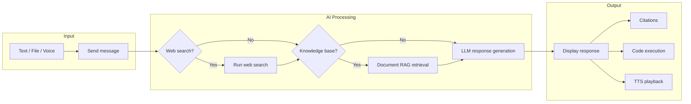

Cloosphere Chat goes beyond simple conversation: it's a **comprehensive AI workspace** supporting file analysis, code execution, web search, and voice conversations.

<Frame caption="Full chat interface">
  
</Frame>

## Chat Flow

When you send a message, it's processed through this flow.

## Chat Screen Layout

| Area | Description |
|------|-------------|
| **Sidebar** | Chat list, search, tag filter, folder management, Workspace access |
| **Chat Header** | Model selection, multi-model add, chat menu (share/download/delete) |
| **Message Area** | Conversation display, response branch navigation, response tool panel |
| **Input Area** | Text input, file attachment, voice input, capability toggles |
| **Control Panel** | System prompt, model parameters, conversation flow visualization |

## Key Features

<Columns cols={2}>
  <Card title="Conversations" icon="messages" href="/en/chat/conversations">
    Manage chat history — create, search, organize into folders, pin, export
  </Card>
  <Card title="Model Selection" icon="robot" href="/en/chat/models">
    Choose models, compare multiple models, adjust parameters like Temperature
  </Card>
  <Card title="Special Features" icon="wand-magic-sparkles" href="/en/chat/capabilities">
    Enable and use web search, image generation, code execution
  </Card>
  <Card title="Files & RAG" icon="file-lines" href="/en/chat/files-and-rag">
    File attachment, knowledge base integration, citation review
  </Card>
  <Card title="Sharing & Organization" icon="share-nodes" href="/en/chat/sharing">
    Share links, tags, archives, folder management
  </Card>
</Columns>

## Command System

Use special-prefix commands in the input box to invoke features quickly.

| Command | Function | Example |
|---------|----------|---------|
| `@modelname` | Ask a specific model directly | `@gpt-4o review this code` |
| `/promptname` | Invoke a saved prompt template | `/email-draft project delay notice` |
| `#kbname` | Reference a specific Knowledge Base | `#hr-policy What's the leave application process?` |

<Tip>
  Typing `@`, `/`, or `#` opens an autocomplete dropdown for selection.
</Tip>

## Keyboard Shortcuts

| Shortcut | Action |
|----------|--------|
| `Enter` | Send message |
| `Shift + Enter` | Line break |
| `Ctrl + N` | New chat |
| `Ctrl + K` | Search |
| `Ctrl + /` | Toggle sidebar |
| `Esc` | Close modal |

## AI Response Toolbar

A set of action buttons sits below each AI response.

<Frame caption="AI response toolbar">
  
</Frame>

| Button | Action |
|--------|--------|
| **Edit** | Edit the AI response content directly |
| **Copy** | Copy the full response to the clipboard |
| **Voice** | Read the response aloud with TTS |
| **Info** | View tokens used and processing time |
| **Rating** | Provide quality feedback (like/dislike + comment) |
| **Continue** | Continue generating a truncated response |
| **Regenerate** | Request a new response for the same prompt |

<Note>
  Editing a user message preserves the original and creates a new branch.
  Use the left/right arrows to navigate between branches.
</Note>

## Next Steps

- See [Conversations](/en/chat/conversations) for organizing chat history.
- Visit [Model Selection](/en/chat/models) to pick the right model and tune parameters.
- Use [Special Features](/en/chat/capabilities) for web search, image generation, and code execution.
