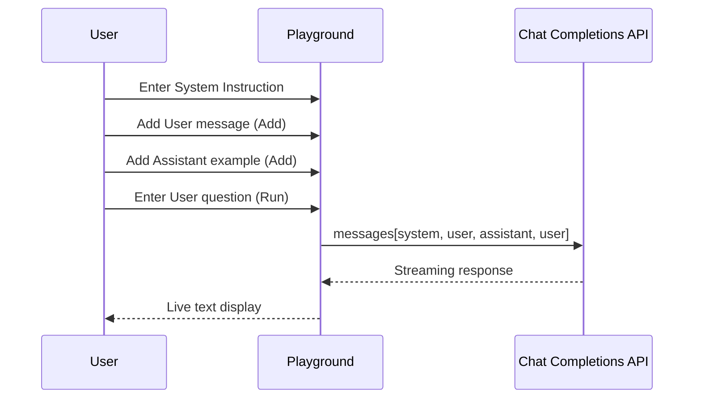

The Playground is an **admin-only** experimentation environment for quickly testing LLM models without saving conversation history.
Use for prompt engineering, model comparison, System Instruction validation, etc.

Access directly via `/playground` URL. There's no separate sidebar link.

<Frame caption="Playground Chat mode full screen">
  
</Frame>

<Warning>
  Only the admin role can access this. Regular users are redirected to home when accessing `/playground`.
</Warning>

<Note>
  All Playground conversations are **ephemeral**. Content disappears when you leave the page; not recorded in chat history or audit logs.
</Note>

---

## Mode Switching

Top tabs offer two modes.

| Mode | Path | Use |
|------|------|-----|
| **Chat** | `/playground` | Multi-turn conversation testing (System Instruction + role-based messages) |
| **Completions** | `/playground/completions` | Single-text completion testing |

---

## Chat Mode

Compose multi-turn conversations to test model responses. Set System Instructions, switch message roles, and edit conversation history.

### Basic Usage

<Steps>
  <Step title="Pick a model">
    From the model selector dropdown in the right Settings sidebar (click the gear icon), pick a model to test. The user's default model is auto-selected. If no default is set, manual selection is needed.
  </Step>
  <Step title="Set System Instruction (optional)">
    Expand the **System Instructions** section at the top and enter a system prompt.
    Specify the model's role, constraints, response style, etc.

    
  </Step>
  <Step title="Enter message and run">
    Type a message in the bottom input and click **Run**.
    The model generates a response with real-time streaming.
  </Step>
</Steps>

### Message Role Management

In Chat mode, you can freely structure each message's role (User/Assistant).

<Frame caption="Message role management">
  
</Frame>

| Feature | Description |
|---------|-------------|
| **Role toggle** | Toggle User ↔ Assistant role with the button on the left of the input |
| **Add** | Add the current message to the conversation (without calling the model). Auto-toggles role on click |
| **Run** | Add the current message and generate a model response |
| **Edit message** | Directly edit existing message text |
| **Delete message** | Remove with the delete button shown on hover |

<Tip>
  Useful for **few-shot prompting** tests. Alternate User and Assistant messages to compose an example dialog, then Run on the final User message.
</Tip>

### System Instruction

- Collapsible header for efficient screen space
- Shows first-line preview when collapsed
- Edits apply from the next Run (no effect on previous responses)

---

## Completions Mode

Test the model's continuation of a single text input. Focus on pure text generation without conversation structure.

<Frame caption="Completions mode">
  
</Frame>

<Steps>
  <Step title="Pick a model">
    Pick a model from the top dropdown.
  </Step>
  <Step title="Enter starting text">
    Enter the starting text to complete in the text area.
  </Step>
  <Step title="Run">
    Click **Run** — the model generates continuation text in real time.
    Generated text appears appended to the input text.
  </Step>
</Steps>

<Note>
  Completions mode doesn't use System Instruction. The input text is passed to the model as-is.
</Note>

---

## Common Features

### Streaming Response

Both modes support real-time streaming via Server-Sent Events (SSE).

- Response is displayed token by token in real time
- Click **Cancel** during generation to stop immediately
- Text area auto-expands to fit content

### Model Selection

- All models enabled in admin settings are available
- Auto-picks the user's default model
- Model name in the dropdown; model ID at the top of the input box

---

## Use Cases

<Accordion title="Prompt Engineering">
  Combine System Instruction and few-shot examples to iteratively test optimal prompts.
  When satisfied, apply the prompt to an [Agent](/en/workspace/agents) or [Prompt](/en/workspace/prompts).
</Accordion>

<Accordion title="Model Performance Comparison">
  Sequentially test multiple models with the same prompt to compare response quality, speed, and cost.
  Chat mode's easy model switching enables fast comparison.
</Accordion>

<Accordion title="System Instruction Validation">
  Pre-test System Instructions before applying to agents.
  Verify consistent responses across various user inputs.
</Accordion>

<Accordion title="Text Completion Testing">
  In Completions mode, check text generation quality for document drafts, code snippets, translations, etc.
</Accordion>

---

## Chat vs. Completions

| Item | Chat | Completions |
|------|------|-------------|
| System Instruction | ✓ | ✗ |
| Multi-turn conversation | ✓ | ✗ |
| Role specification | User / Assistant | None |
| Message edit/delete | ✓ | ✗ (edit full text) |
| Use | Conversational prompt testing | Text completion/generation testing |
