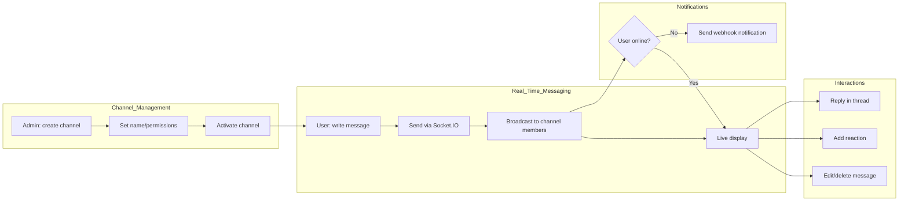
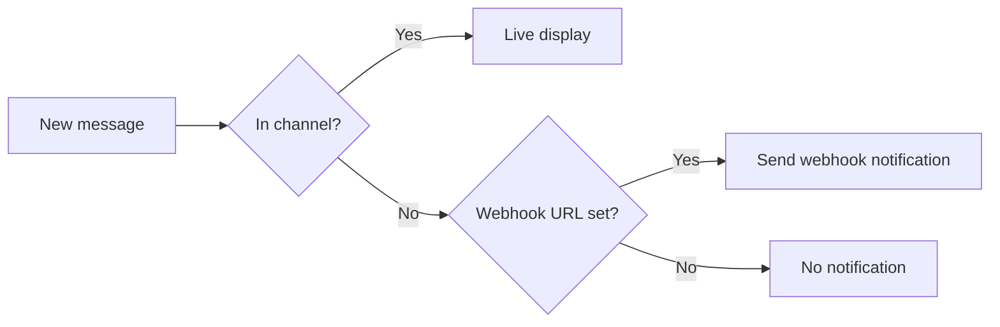

Channels are **real-time messaging spaces** for teammates. Slack-like exchanges, threaded discussions on specific topics, and reactions for quick acknowledgment. Backed by Socket.IO for instant message delivery.

<Frame caption="Real-time messaging with teammates in a channel">
  
</Frame>

---

## Channel Flow

---

## Creating a Channel

Channels can only be created by **admins**.

<Note>
  The Channels feature only appears in the sidebar when the `enable_channels` feature flag is enabled in admin settings.
</Note>

<Steps>
  <Step title="Open the channel creation menu">
    In the sidebar **Channels** section, click the **"+"** button.
  </Step>

  <Step title="Enter channel info">
    | Field | Description | Example |
    |-------|-------------|---------|
    | **Name** | Channel name (spaces auto-converted to hyphens, lowercase) | "dev-team" |
    | **Visibility** | Groups/organizations allowed to join | Engineering group |

    

    <Note>
      On creation, channel names auto-convert spaces to hyphens and uppercase to lowercase. Example: "Dev Team" → "dev-team"
    </Note>
  </Step>

  <Step title="Done">
    Click **"Create"** — the channel is created and appears in the sidebar.
  </Step>
</Steps>

---

## Editing and Deleting Channels

Channel edits and deletions are **admin-only**. Hover over a channel name in the sidebar and click the gear icon to access settings.

| Action | Method | Notes |
|--------|--------|-------|
| **Rename** | Edit name in channel settings | Auto-converts spaces→hyphens, lowercase |
| **Change visibility** | Edit visibility in channel settings | Group/organization level |
| **Delete** | Click delete in channel settings | Channel itself is deleted |

<Warning>
  Deleting a channel removes the channel only — message data may be handled separately. Cannot be recovered after deletion, so proceed carefully.
</Warning>

---

## Sending Messages

### Basic Messaging

Type a message in the input at the bottom of the channel and send.

<Frame caption="Input supports text, file attachments, and screen capture">
  
</Frame>

| Feature | Description |
|---------|-------------|
| **Text messages** | Rich text input (formatting, links, etc.) |
| **File attachment** | Upload images, documents, etc. |
| **Screen capture** | Browser-native screen capture |
| **Voice recording** | Record voice, transcribe to text, then send |

### Live Typing Indicator

When other users are typing, an indicator shows above the input. Auto-disappears after 5 seconds of inactivity.

---

## Threads

Group replies to a message into a thread. Have in-depth discussion on a specific topic without disrupting the main channel flow.

<Steps>
  <Step title="Start a thread">
    Hover over a message and click the **Reply in thread** icon button.
  </Step>
  <Step title="Write a reply">
    A thread panel opens on the right of the screen. Write and send the reply.
  </Step>
  <Step title="Track threads">
    Below the original message, the reply count and last reply time are shown.
  </Step>
</Steps>

### Thread Display

| Screen Size | Behavior |
|-------------|----------|
| **Desktop (1024px+)** | Side-by-side split panels showing channel and thread together. Resizable |
| **Mobile/Tablet** | Thread panel overlays as a Drawer |

<Tip>
  On desktop, you can view channel messages and the thread side by side, keeping context while discussing.
</Tip>

---

## Reactions

Add emoji reactions to messages for quick acknowledgment.

| Feature | Description |
|---------|-------------|
| **Add reaction** | Hover over a message and pick an emoji |
| **Remove reaction** | Click your own reaction to remove |
| **Count display** | Each reaction shows the user count |
| **Real-time sync** | Reaction add/remove instantly reflects to all participants |

---

## Editing and Deleting Messages

### Edit

Only the author can edit their own message.

<Note>
  Message editing is restricted to the author. Even admins cannot edit others' messages.
</Note>

### Delete

| Role | Delete Scope |
|------|--------------|
| **Regular user** | Can delete only own messages |
| **Admin** | Can delete any user's messages (channel moderation) |

Deleting a message also removes all its reactions. Deleting a parent message keeps thread replies intact.

---

## Channel Member Management

Channel access is controlled by the `access_control` field, with **read** and **write** permissions configurable independently.

| Visibility | Description |
|-----------|-------------|
| **Public (`null`)** | All authenticated users can join |
| **Group-restricted** | Only specified group members can join |
| **Organization-restricted** | Only specified organizational unit members can join |

Each group/organization can be granted read-only or read+write permission. For example, you can allow only read for one group and read+write for another.

<Note>
  When visibility is `null` (unset), all authenticated users can read and write in the channel. To restrict, the admin must set visibility explicitly.
</Note>

---

## Notifications

Webhook notifications are sent to users not currently in the channel.

| Item | Description |
|------|-------------|
| **Notification target** | Users with channel access who aren't currently online |
| **Notification content** | Channel name, message content, channel URL |
| **Configuration** | User personal settings > Notifications > Webhook URL |

<Tip>
  Set webhook URLs for Slack, Teams, Discord Incoming Webhooks to forward channel messages to external tools.
</Tip>

---

## Channel Access Paths

| Method | Description |
|--------|-------------|
| **Sidebar** | Click channel name in the Channels section |
| **Direct URL** | URL format `/channels/{channel_id}` |

Accessing the channel page initializes the chat session (`chatId`) and switches to the channel-only view.

---

## FAQ

<Accordion title="Can regular users create channels?">
  No — channel creation/modification/deletion is admin-only. Ask your admin if you need a channel.
</Accordion>

<Accordion title="Can I chat with the AI in a channel?">
  Channels are user-to-user messaging only. Use the Chat feature for AI conversations.
</Accordion>

<Accordion title="Can I attach files to channel messages?">
  Yes — image and document files can be attached. Use the attach button in the input or drag and drop.
</Accordion>

<Accordion title="Are there limits on thread reply count?">
  By default, there's no per-thread reply limit. Replies load 50 at a time via pagination.
</Accordion>

<Accordion title="Can I leave or mute channels?">
  In permission-restricted channels, admins manage membership. Disable webhook notifications in personal settings to silence notifications.
</Accordion>

<Accordion title="Is there an @mention feature?">
  Currently, no dedicated @mention feature. Mention users by name directly in the message body.
</Accordion>
