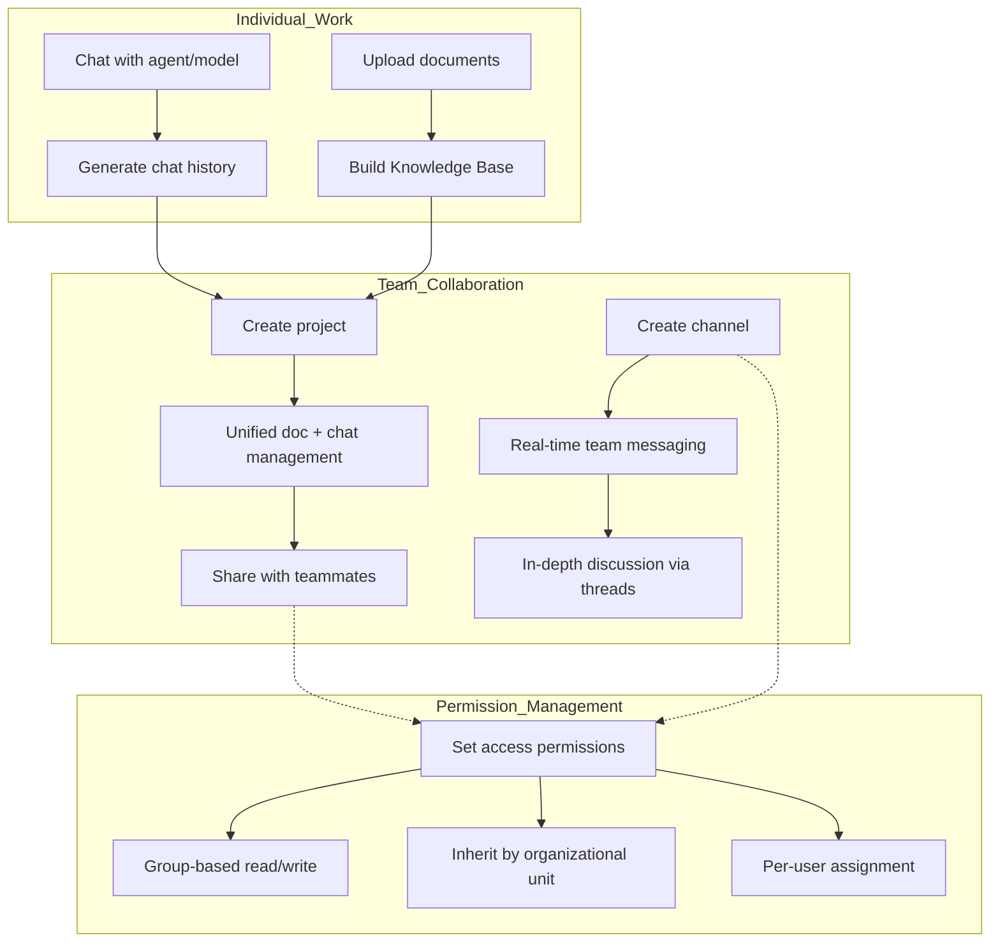
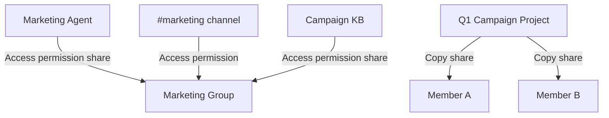

Cloosphere extends AI use beyond individual work to team-level collaboration. Bundle documents and chats into Projects, communicate in real time with teammates in Channels, and safely share resources with fine-grained access control.

<Frame caption="Access Projects and Channels directly from the sidebar">
  
</Frame>

---

## Collaboration Features

<Columns cols={3}>
  <Card title="Projects" icon="folder-open" href="/en/collaboration/projects">
    Bundle Knowledge Bases + chats into one space and share with teammates. The AI references project documents to answer.
  </Card>
  <Card title="Channels" icon="hashtag" href="/en/collaboration/channels">
    Team messaging space. Slack-style communication with threads, reactions, and real-time typing indicators.
  </Card>
  <Card title="Sharing & Permissions" icon="shield-halved" href="/en/collaboration/sharing-permissions">
    Granular control over resource read/write permissions by group, organization, or individual.
  </Card>
</Columns>

---

## Collaboration Flow

The flow: bundle documents and chats from individual work into projects, communicate with the team in channels, and safely share via access permissions.

---

## Feature Comparison

| Feature | Projects | Channels | Sharing & Permissions |
|---------|----------|----------|------------------------|
| **Purpose** | Unified doc + chat management | Real-time team messaging | Resource access control |
| **Audience** | Individual / small team | Whole team / department | All workspace resources |
| **AI integration** | Project-doc-based RAG chat | - | - |
| **Real-time** | - | Socket.IO real-time messaging | - |
| **Sharing model** | Copy-based | Access-permission-based | Group/Org/User assignment |
| **Creation permission** | All users | Admins only | Admins set per group |

---

## Sharing Model Comparison

Cloosphere offers two sharing models depending on resource type.

<Tabs>
  <Tab title="Access-permission-based">
    Add groups/organizations/users to the original resource. Edits to the original are reflected immediately to all sharees.

    **Applies to:** Agents, Knowledge Bases, channels, tools, guardrails, prompts, glossaries

    | Pro | Con |
    |-----|-----|
    | Real-time sync | No personalization |
    | Storage-efficient | Original changes affect everyone |
  </Tab>
  <Tab title="Copy-based">
    A separate copy is created on share. Each user can edit freely.

    **Applies to:** Projects, Schedules

    | Pro | Con |
    |-----|-----|
    | Each can edit freely | Original changes don't propagate |
    | Personalization possible | More storage used |
  </Tab>
</Tabs>

---

## Example Setup: Marketing Team Collaboration

| Resource | Sharing Model | Audience |
|----------|---------------|----------|
| **Marketing Agent** | Access permission (read) | Entire marketing group |
| **Campaign KB** | Access permission (read) | Entire marketing group |
| **Q1 Project** | Copy share | Individual copy per member |
| **#marketing channel** | Access permission | Marketing group |

---

## Get Started

<Steps>
  <Step title="Create a project">
    Create a project from the sidebar and upload documents. Talk to the AI in the project context.
  </Step>
  <Step title="Join channels">
    Join team channels from the channel list in the sidebar. Send messages and discuss in threads.
  </Step>
  <Step title="Set permissions">
    Configure access permissions for workspace resources (agents, Knowledge Bases, etc.) per group to share with the team.
  </Step>
</Steps>

<Tip>
  Projects are personal document spaces using **copy-based sharing**, while channels and workspace resources use **access-permission-based sharing**. Pick the right model for your use case.
</Tip>

---

## Per-Role Guide

| Role | Main Activities | Reference |
|------|-----------------|-----------|
| **Regular user** | Create projects, join channels, send messages | [Projects](/en/collaboration/projects), [Channels](/en/collaboration/channels) |
| **Team lead** | Share projects, manage resource permissions | [Sharing & Permissions](/en/collaboration/sharing-permissions) |
| **Admin** | Create/manage channels, set up groups/organizations | [User Management](/en/admin/users), [Organization Management](/en/admin/organizations) |
