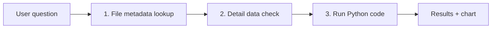

A Project is a **personal document management unit that bundles a Knowledge Base + chats into one space**. When you select a project and chat with the AI, it answers using only that project's documents. When you share a project, an independent copy is created so each member can use it freely.

<Frame caption="A Project is a personal document management unit that bundles a Knowledge Base + chats into one space">
  
</Frame>

---

## Project vs. Knowledge Base

| Aspect | Project | Knowledge Base |
|--------|---------|----------------|
| **Purpose** | Personal/team document space | Knowledge store for agents |
| **Ownership** | Personally owned, copy-based sharing | Workspace-shared |
| **Access** | Direct from the sidebar | Connected to an agent for use |
| **Chat** | Project-specific chat | Referenced from agent chat |
| **Internal structure** | Wraps an auto-generated Knowledge Base | Independent entity |

<Note>
  When you create a project, an internal Knowledge Base named `[Project] {project_name}` is auto-generated. KBs prefixed with `[Project]` also appear in the workspace KB list — we recommend not modifying them directly.
</Note>

---

## Use Cases

| Scenario | Description |
|----------|-------------|
| **Work doc management** | Group materials per project and ask the AI |
| **Team collaboration** | Bundle department documents into a project and share with the team |
| **Research** | Organize research materials and analyze with AI |
| **Customer proposals** | Manage per-customer requirements and draft with AI |
| **Data analysis** | Upload CSV/Excel and let the AI analyze and visualize via Python |

---

## Project List

In the **Projects** section at the bottom of the sidebar, view your projects and projects shared with you.

<Frame caption="Create projects and access them directly from the sidebar">
  
</Frame>

---

## Creating a Project

<Steps>
  <Step title="Create a new project">
    Click the **"+"** button in the Projects section in the sidebar.

    
  </Step>

  <Step title="Enter basic info">
    | Field | Description | Example |
    |-------|-------------|---------|
    | **Name** | Project display name | "2026 Marketing Strategy" |
    | **Description** | Project purpose (optional) | "Materials for Q1 marketing campaign" |
    | **Type** | General / Data Analysis | "General" (default) |

    <Note>
      The **Data Analysis** type uploads CSV/Excel files and analyzes them with Python code. See [Data Analysis Projects](#data-analysis-projects) below.
    </Note>
  </Step>

  <Step title="Done">
    Click **Create Project** — the project and its connected Knowledge Base are created. You're auto-redirected to the project detail screen.
  </Step>
</Steps>

---

## File Management

### Upload Files

In the project detail screen's **Settings** tab, upload files. Uploaded files are auto-vectorized and become AI-searchable.

<Frame caption="Drag-and-drop or use the upload button to add files">
  
</Frame>

<Tabs>
  <Tab title="Drag and Drop">
    Drag files directly onto the project area.
  </Tab>
  <Tab title="File Picker">
    Click the upload button and select files in the file dialog.
  </Tab>
  <Tab title="Cloud Storage">
    Pull files directly from Google Drive, OneDrive, SharePoint (when admin configures).
  </Tab>
</Tabs>

**Supported file formats:**

| Category | Formats |
|----------|---------|
| **Documents** | PDF, DOCX, PPTX, TXT, MD |
| **Spreadsheets** | XLSX, CSV |
| **Other** | When LibreOffice PDF conversion is enabled, additional formats are supported |

### File List

Uploaded files are visible in the **Project Files** section under the **Settings** tab on the project detail screen.

| Info | Description |
|------|-------------|
| **Filename** | Uploaded file name |
| **Size** | File size |
| **Status** | Processing state (uploading / processed / error) |

### Delete a File

Click the **X button** on the right of the file. The deleted file is also removed from the vector DB.

<Warning>
  File deletion is irreversible. The vector index is also removed — keep originals if needed.
</Warning>

---

## Data Analysis Projects

<Info>
  **New feature** — Selecting **Data Analysis** as the project type lets you upload CSV/Excel files and have the AI **directly run Python code** to analyze data and create charts.
</Info>

### Differences from General Projects

| | General Project | Data Analysis Project |
|--|----------------|------------------------|
| **File formats** | All documents — PDF, DOCX, TXT, etc. | Only CSV, XLSX, XLS, TSV, Parquet |
| **Processing** | Text extraction → chunking → vector DB (RAG) | Metadata extraction → mount file in Jupyter |
| **AI response style** | Document-search-based answers | Python-execution-based answers |
| **Charts** | None | Plotly interactive charts, matplotlib images |
| **Required env** | None | **Jupyter server** connection required |

### Prerequisites

<Warning>
  Data Analysis projects require a **Jupyter server** to be connected. If a Jupyter server isn't configured under Admin > Settings > Code Execution, project creation is blocked.
</Warning>

### Create and Use

<Steps>
  <Step title="Choose 'Data Analysis' type at creation">
    On the project creation screen, choose **Data Analysis** as the type.

    {/* SCREENSHOT NEEDED: projects-create-data-analysis */}
  </Step>

  <Step title="Upload data files">
    Upload CSV, Excel (XLSX/XLS), TSV, or Parquet files. Uploaded files are auto-mounted into the Jupyter environment, and metadata like column info is extracted.

    {/* SCREENSHOT NEEDED: projects-data-analysis-files */}
  </Step>

  <Step title="Ask the AI to analyze">
    Select the project and request analysis in chat. The AI auto-writes and runs Python code, returning results.
  </Step>
</Steps>

### Analysis Flow

The AI uses 3 tools sequentially to analyze data.



| Step | Tool | Description |
|:----:|------|-------------|
| 1 | **data_file_info** | List uploaded files, columns, data types, etc. |
| 2 | **get_file_details** | Sample detail data for a specific file (head, describe, etc.) |
| 3 | **code_interpreter** | Run Python code in the Jupyter kernel (pandas, plotly, matplotlib, etc.) |

### Chart Generation

When the AI is asked to visualize data, it generates **Plotly interactive charts**. Charts can be inspected directly in chat — zoom, hover for info, etc.

{/* SCREENSHOT NEEDED: projects-data-analysis-chart */}

| Chart Library | Support | Form |
|---------------|:-------:|------|
| **Plotly** | Default | Interactive (zoom, hover, filter) |
| **matplotlib** | Supported | Displayed as PNG image |

### Example Conversation

```
Q: Show me the monthly trend in the sales data
A: Analyzing the uploaded sales_2025.csv file.

   [Code Interpreter execution: pandas monthly aggregation + Plotly chart]

   📊 Monthly sales trend:
   [Interactive chart]

   Key findings:
   - March is up 23% MoM
   - Q1 total revenue is ₩12.5M
```

<Note>
  The Jupyter kernel **persists per project**. Variables and dataframes created in earlier conversations remain available later. When the Jupyter container restarts, files are auto-remounted.
</Note>

---

## Chat in a Project

### Project-Context Chat

When a project is selected and you start chatting, the AI references only that project's documents.

<Steps>
  <Step title="Pick a project">
    Click a project in the sidebar.
  </Step>
  <Step title="Type your question">
    Type your question in the chat input. The AI auto-searches the project documents.
  </Step>
  <Step title="Review the response">
    The AI searches the project's documents and answers with citations.
  </Step>
</Steps>

<Frame caption="Selecting a project and chatting references only that project's documents">
  
</Frame>

**Example:**
```
Q: What's this quarter's marketing budget plan?
A: Based on the project documents, this quarter's marketing budget is...
   [Source: Q1_marketing_plan.pdf, page 12]
```

### Chat Management

Chats inside a project appear in the **Chat** tab of the project detail screen.

| Info | Description |
|------|-------------|
| **Chat title** | Auto-generated conversation title |
| **Preview** | First user message preview (max 150 chars) |
| **Modified** | Last conversation time |

<Tip>
  Project chats don't appear in the main sidebar chat list. They're separated per project for clean management.
</Tip>

---

## Project Sharing

You can share projects with other users. Sharing is **copy-based**.

<Steps>
  <Step title="Open the Settings tab">
    On the project detail screen, go to the **Settings** tab.
  </Step>
  <Step title="Pick share targets">
    In the **Copy to Users** section, search for and select users. You can share with multiple at once.
  </Step>
  <Step title="Run the share">
    Click **Copy to Users** — a project copy is created for each selected user.
  </Step>
</Steps>

<Frame caption="Copy-based sharing — independent copies are created for the recipients">
  
</Frame>

### Sharing Characteristics

| Item | Description |
|------|-------------|
| **Independent copy** | A separate project + Knowledge Base is created for each recipient |
| **File copy** | Original project files are copied along with vector re-indexing |
| **Independent edits** | After sharing, each user can freely edit their own project |
| **Origin tracking** | The copy's metadata records origin info (owner, project name, copy time) |

<Note>
  Sharing is a one-time copy. Edits to the original don't propagate to copies. Use access-permission sharing on workspace Knowledge Bases when real-time sync is needed.
</Note>

---

## Project Settings

In the project detail screen's **Settings** tab, edit project info.

<Frame caption="Edit project name/description or delete the project from Settings">
  
</Frame>

| Item | Description |
|------|-------------|
| **Name** | Rename project (the linked Knowledge Base is auto-renamed too) |
| **Description** | Edit project description |
| **Project Files** | Manage and upload files linked to the project |
| **Default model** | Pick the default AI model for project chats |
| **Project Instructions** | Set a project-specific system prompt for the AI |
| **Copy to Users** | Share project copies with selected users |
| **Delete** | Permanently delete the project and all linked resources |

---

## Deleting a Project

Deleting a project removes all linked resources together.

<Warning>
  Project deletion permanently removes:
  - The project itself
  - The linked Knowledge Base and vector index
  - All chat history within the project

  Deleted projects can't be recovered. Recipients' copies are unaffected.
</Warning>

---

## FAQ

<Accordion title="Are there file count limits per project?">
  Depends on system settings. Typically, no file count limit, but file size limits follow admin settings.
</Accordion>

<Accordion title="Does sharing a project sync in real time?">
  No — sharing creates an independent copy. Edits to the original don't propagate. Use workspace Knowledge Base access permissions for real-time sharing.
</Accordion>

<Accordion title="Can I convert an existing Knowledge Base into a project?">
  Direct conversion isn't possible. Create a project and re-upload the files.
</Accordion>

<Accordion title="Do project chats appear in the regular chat list?">
  No — project chats only appear in the Chat tab of the project detail screen. They're separated from the main sidebar chat list for clean organization.
</Accordion>

<Accordion title="Can I see origin info on a shared project?">
  Yes — the shared project's metadata records the original owner, project name, and copy time.
</Accordion>

<Accordion title="What file formats does Data Analysis projects support?">
  Only **CSV, XLSX, XLS, TSV, Parquet**. Use a General project for documents like PDF or DOCX.
</Accordion>

<Accordion title="What environment is needed for Data Analysis projects?">
  An admin must connect a **Jupyter server**. The Jupyter server URL must be set under Admin > Settings > Code Execution for project creation. Without Jupyter, choosing the Data Analysis type displays guidance.
</Accordion>

<Accordion title="Can I reuse variables from earlier conversations in Data Analysis?">
  Yes — the Jupyter kernel is preserved per project, so variables and dataframes from earlier conversations remain available later.
</Accordion>
