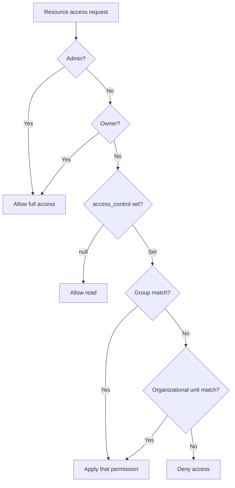
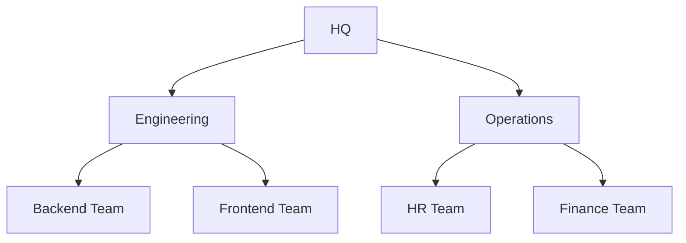
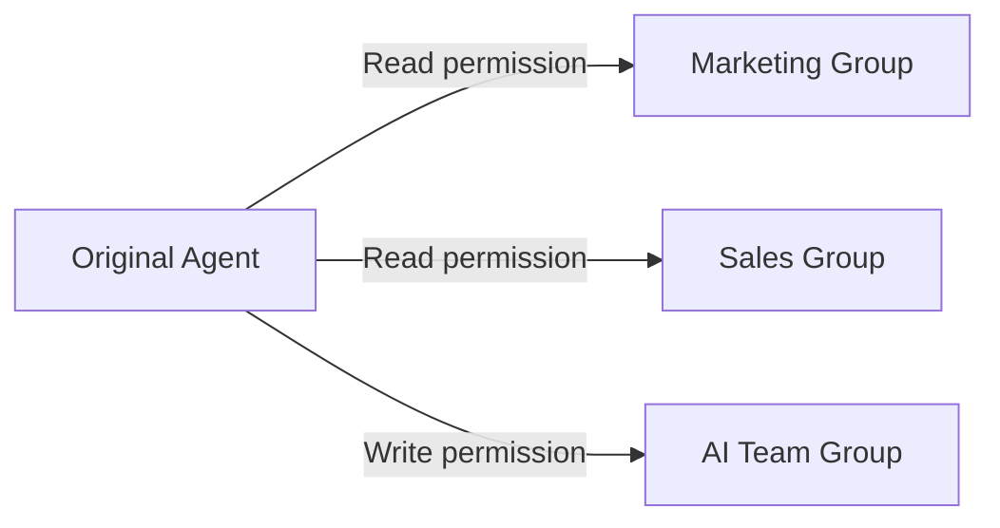
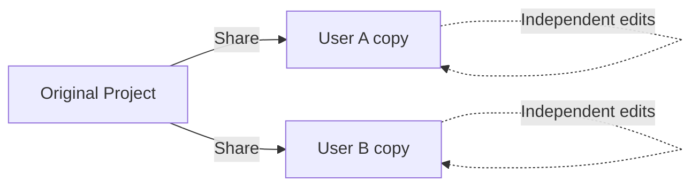

All Cloosphere workspace resources are managed by a unified access control model (`access_control`). Grant read/write permissions to groups and organizational units to share resources safely.

<Frame caption="Set Visibility and group/organizational-unit access permissions per resource">
  
</Frame>

---

## Access Control Model

### Resource Access Permission (access_control)

Resource access is managed in 2 levels: **read** and **write**.

| Level | Description |
|-------|-------------|
| **Read** (`read`) | Can view and use the resource |
| **Write** (`write`) | Can modify and manage the resource |

### Workspace Creation Permission

Per-group workspace feature creation permission has 4 levels. This controls **whether you can create new resources**, separately from individual resource access control.

| Level | Value | Numeric | Description |
|-------|-------|---------|-------------|
| **None** | `none` | 0 | Feature not available |
| **Access** | `access` | 1 | Basic access |
| **Read** | `read` | 2 | View access |
| **Write** | `write` | 3 | Create and modify |

<Note>
  Permissions maintain backward compatibility. `true` is treated as `write` and `false` as `none`.
</Note>

### Permission Evaluation Order

Permissions are evaluated in this order.



| Order | Check | Description |
|-------|-------|-------------|
| 1 | **Admin** | If `admin` role, allow all access |
| 2 | **Owner** | If `resource.user_id == user.id`, allow access |
| 3 | **Group** | Whether the user's groups are in `access_control.{type}.group_ids` |
| 4 | **Organizational Unit** | Whether the user's organizations are in `access_control.{type}.org_unit_ids` |

---

## access_control Structure

All resource permissions are managed in the `access_control` JSON field.

<Tabs>
  <Tab title="Public (default)">
    When `access_control` is `null`, **all authenticated users get read permission**.

    ```json
    {
      "access_control": null
    }
    ```
  </Tab>
  <Tab title="Group-restricted">
    Grant read/write permissions to specific groups individually.

    ```json
    {
      "access_control": {
        "read": {
          "group_ids": ["marketing-group-id", "sales-group-id"],
          "org_unit_ids": []
        },
        "write": {
          "group_ids": ["marketing-group-id"],
          "org_unit_ids": []
        }
      }
    }
    ```

    Here, the marketing group has read + write while the sales group has read only.
  </Tab>
  <Tab title="Organization-restricted">
    Grant permissions per organizational hierarchy.

    ```json
    {
      "access_control": {
        "read": {
          "group_ids": [],
          "org_unit_ids": ["engineering-dept-id"]
        },
        "write": {
          "group_ids": [],
          "org_unit_ids": []
        }
      }
    }
    ```
  </Tab>
  <Tab title="Mixed">
    Combine groups and organizational units.

    ```json
    {
      "access_control": {
        "read": {
          "group_ids": ["all-staff-group-id"],
          "org_unit_ids": ["partner-org-id"]
        },
        "write": {
          "group_ids": ["admin-group-id"],
          "org_unit_ids": []
        }
      }
    }
    ```
  </Tab>
</Tabs>

---

## Resource Permissions

### Where access_control Applies

The `access_control` model applies uniformly to:

| Resource | Read Permission | Write Permission |
|----------|----------------|------------------|
| **Agent** | Use agent (select in chat) | Modify agent settings |
| **Knowledge Base** | View KB, browse documents | Add/delete documents, change settings |
| **Database** | Use DB queries | Change DB connection settings |
| **Agent Flow** | Run flow | Edit flow |
| **Guardrail** | Apply guardrail | Modify guardrail rules |
| **Tool** | Use tool | Change tool settings |
| **Prompt** | Use prompt | Modify prompt |
| **Glossary** | Reference terms | Add/modify terms |
| **Channel** | Read/write messages | Admin-only channel management |
| **Project** | View project, chat | Add/delete files, change settings |
| **Schedule** | View schedule, history | Modify schedule |

### UI Behavior by Read/Write

**Write permission automatically includes Read** — no need to add read separately.

For read-only (no write) users, the UI behavior is:

| UI Element | Read-only | Write |
|------------|-----------|-------|
| **Save & Update buttons** | Disabled | Active |
| **Add/delete item buttons** | Disabled | Active |
| **Permission settings (lock) button** | Hidden | Visible to owner/admin |
| **Workspace list [...] menu** | Visible to owner only | Visible |

<Tip>
  Read-only users can **view and use** resource content but can't modify or delete settings. For example, with read-only on an agent, you can chat with it but can't modify its prompt or model.
</Tip>

### How to Set Permissions

<Steps>
  <Step title="Open resource settings">
    Open the settings screen for the resource in the workspace.
  </Step>
  <Step title="Set Visibility">
    Find the **Visibility** section in settings. Pick scope from the **Private** / **Public** dropdown.
  </Step>
  <Step title="Choose permission type">
    | Type | Method |
    |------|--------|
    | **Public** | Pick **Public** in the Visibility dropdown (`null`) |
    | **Private** | Pick **Private** and don't add any group/organization |
    | **Group** | In Private state, add a group and click the Read/Write badge to switch |
    | **Organization** | In Private state, add an OU and click the Read/Write badge to switch |
  </Step>
  <Step title="Save">
    Save changes. Permissions apply immediately.
  </Step>
</Steps>

<Note>
  Adding a group or OU shows a **Read** badge by default. Click that badge to switch to **Write**.
</Note>

---

## Group-based Permissions

Groups are the basic unit for grouping users. Admins create groups and manage members in **Admin > Users > Groups**.

### Group Permission Merging

When a user belongs to multiple groups, **the highest permission applies** (Most Permissive).

```
Group A: read permission
Group B: write permission
→ Final: write permission (highest level)
```

| Scenario | Group A | Group B | Final |
|----------|---------|---------|-------|
| Read + Write | `read` | `write` | `write` |
| None + Read | `none` | `read` | `read` |
| Access + Write | `access` | `write` | `write` |

### Per-Group Workspace Permissions

Groups can also have workspace feature creation permissions. Admins control per-feature permissions in group settings.

| Permission Key | Target Feature |
|----------------|---------------|
| `workspace.knowledge` | Knowledge Base creation |
| `workspace.agents` | Agent creation |
| `workspace.tools` | Tool creation |
| `workspace.prompts` | Prompt creation |
| `workspace.guardrails` | Guardrail creation |
| `workspace.glossaries` | Glossary creation |
| `workspace.databases` | Database creation |
| `workspace.agent_flows` | Agent Flow creation |
| `features.scheduled_tasks` | Schedule creation |

### Public Sharing Permissions (`sharing.public_*`)

Per-group, control whether users can set resources to **Public** (publicly accessible). When disabled, users in that group can't change a resource's Visibility to Public.

| Permission Key | Target Feature |
|----------------|---------------|
| `sharing.public_agents` | Agent public sharing |
| `sharing.public_knowledge` | Knowledge Base public sharing |
| `sharing.public_prompts` | Prompt public sharing |
| `sharing.public_tools` | Tool public sharing |
| `sharing.public_databases` | Database public sharing |
| `sharing.public_glossaries` | Glossary public sharing |

<Note>
  **Agent Flow** Public sharing is **admin-only**. Regular users can't change a flow's Visibility to Public regardless of group `sharing.public_*` permissions.
</Note>

<Tip>
  When admins set default user permissions in **Admin > Settings > General**, those defaults apply to users without explicit group permissions.
</Tip>

---

## Organization-based Permissions

Organizational Units reflect organizational hierarchy like departments and teams. Integrate with Azure AD (Entra ID) to auto-manage organization members.

### Organizational Hierarchy Inheritance

OUs have hierarchy — users in sub-organizations **inherit permissions from parent organizations**.



For example, granting "Engineering" OU permission on a resource also lets backend and frontend team members access it.

### Organization Member Matching

| Method | Description |
|--------|-------------|
| **OAuth Subject ID** | Match `member_ids` field with Azure AD `sub` value |
| **Email** | Match by email in OU `meta.members` |

<Note>
  OUs are configured by admins in **Admin > Organizations**. With Azure AD integration, organizational structure auto-syncs.
</Note>

---

## Sharing Model Comparison

Cloosphere offers two sharing models per resource type.

| Model | Applies to | Characteristics |
|-------|-----------|-----------------|
| **Access-permission-based** | Agents, Knowledge Bases, channels, tools, projects, schedules, etc. | Share original by group/org. Real-time sync |
| **Copy-based** | Projects, Schedules | Independent copy created. Each can edit freely |

<Note>
  **Projects** and **Schedules** support both models. Set `access_control` for access permissions, and additionally use copy-based sharing to create independent copies.
</Note>

### Access-permission-based Sharing

Add groups/organizational units to the original resource. Edits to the original are reflected immediately to all sharees.



### Copy-based Sharing

Projects and schedules also support copy-based sharing. An independent copy is created for each user.



| Item | Access-permission | Copy-based |
|------|-------------------|------------|
| **Sync** | Real-time | Independent after share |
| **Edit impact** | Original changes propagate | Each edits independently |
| **Storage** | Single original | Storage grows with each copy |
| **Use case** | Shared resources | Resources requiring personalization |

---

## Real-world Setup Examples

### Per-Department Agent Access Control

| Agent | Read Permission | Write Permission |
|-------|----------------|------------------|
| **Shared Assistant** | Public (`null`) | AI Team group |
| **HR Assistant** | HR Team group | HR Team admin |
| **Sales Analytics** | Executive group, Sales group | Data Team group |
| **Dev Helper** | Engineering OU | Backend Team group |

### Multi-level Permissions

In complex organizational structures, combine groups and OUs for fine-grained permissions.

<Accordion title="Example: Project Report Agent">
  ```json
  {
    "access_control": {
      "read": {
        "group_ids": ["all-staff"],
        "org_unit_ids": ["partner-org-id"]
      },
      "write": {
        "group_ids": ["finance-team"],
        "org_unit_ids": []
      }
    }
  }
  ```

  - **Read**: All-staff group + partner organization
  - **Write**: Only Finance Team group can change settings
</Accordion>

---

## Admin Permission Management

### Default User Permissions

Admins set default permissions for new users / users without group assignment in **Admin > Settings > General**.

### Permission Check Flow

```
1. Group permission check → Apply if explicit permission exists
2. Default permission check → Apply admin default if no group permission
3. Apply the maximum from the two paths
```

---

## FAQ

<Accordion title="What if access_control is null?">
  When `access_control` is `null`, all authenticated users get **read permission**. Write is restricted to owner and admin. To make it private, set an empty `access_control` object.
</Accordion>

<Accordion title="What's the difference between groups and organizational units?">
  **Groups** are units managed inside Cloosphere — admins create them and add members freely. **Organizational Units** reflect Azure AD (Entra ID) department/team structure and support hierarchical permission inheritance.
</Accordion>

<Accordion title="How are permissions decided when a user belongs to multiple groups?">
  The highest permission applies (Most Permissive). For example, with `read` in group A and `write` in group B, the user gets `write` permission.
</Accordion>

<Accordion title="Do parent organization permissions auto-apply to children?">
  No — the direction is reversed. When you set "Engineering" permission on a resource, members of **child organizations** (Backend Team, Frontend Team) of Engineering can access it. The match is from the user's organization upward.
</Accordion>

<Accordion title="Can I share with only specific users?">
  There's no UI to specify individual users directly. Create a group containing only those users, then grant permission to that group.
</Accordion>

<Accordion title="Are permission changes applied immediately?">
  Yes — access permission changes apply on save. No deployment or restart needed.
</Accordion>
