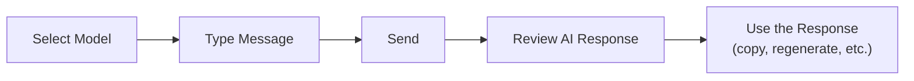

Now that you've signed in, let's start your first AI conversation. This guide covers the basic flow from model selection to using the response.



---

## Starting a Conversation

<Steps>
  <Step title="Open a new chat">
    Click the **New Chat** button at the top of the sidebar, or use the keyboard shortcut `Ctrl + Shift + O`.

    A model selector dropdown and an input box appear in the center of the screen.
  </Step>

  <Step title="Select an AI model">
    Click the **model selector dropdown** at the top of the screen to choose which AI model to use. Clicking the "Select a model" text shows the list of available models.

    

    <Tip>
      You can set a frequently used model as your **default**. After picking a model in the dropdown, click the **"Set as default"** button that appears below — it'll be selected automatically in future chats.
    </Tip>
  </Step>

  <Step title="Type your message">
    Type your question or request in the input box at the bottom of the screen.
  </Step>

  <Step title="Send the message">
    Press `Enter` or click the **send button** (arrow icon) at the right of the input box.

    <Note>
      Use `Shift + Enter` to insert a line break. Pressing `Enter` alone sends the message.
    </Note>
  </Step>

  <Step title="Read the AI response">
    The AI streams its response in real time, token by token, until generation completes.

    Click the **stop button** (square icon) during generation to cancel the response.
  </Step>
</Steps>

---

## Model Selection Guide

Pick the model that best fits your task from the list registered by the admin. Below are typical model characteristics.

| Model Type | Strengths | Recommended For |
|-----------|-----------|------------------|
| **GPT-4o** | High-performance multimodal model | Complex analysis, image understanding, coding |
| **GPT-4o-mini** | Fast and economical | General chat, simple Q&A, translation |
| **Claude** | Excellent long-context handling | Document summarization, report writing, analysis |
| **Ollama models** | On-premises execution | Sensitive internal data where security matters |

<Note>
  The list of available models depends on admin settings. If a model you need isn't visible, ask your admin.
</Note>

---

## Input Options

Beyond plain text, you can pass information to the AI in several ways.

### Attaching Files

Click the **+** button on the left of the input box, or **drag and drop** a file onto the input area.

| File Type | Supported Extensions | Examples |
|-----------|---------------------|----------|
| **Documents** | PDF, DOCX, TXT, MD | Document summarization, content analysis, translation |
| **Spreadsheets** | XLSX, CSV | Data analysis, deriving insights |
| **Images** | PNG, JPG, GIF, WebP | Image analysis, OCR (multimodal model required) |
| **Code** | PY, JS, TS, etc. | Code review, bug analysis, refactoring |

<Tip>
  Pair file attachments with a specific question to get more accurate answers.

  Example: "Summarize chapter 3 of the attached PDF and put the key conclusions in a table."
</Tip>

### Cloud Storage Integration

When configured by the admin, you can pull files directly from **SharePoint**. Choose the cloud storage option from the + button menu.

### Prompt Commands

Type `/` in the input box to open the registered **prompt template** list. Quickly invoke frequently used question patterns.

<Frame caption="Slash command prompt list">
  
</Frame>

---

## Using the Response

Action buttons below an AI response provide several follow-up actions.

<Frame caption="AI response action buttons">
  
</Frame>

| Action | Description |
|--------|-------------|
| **Copy** | Copies the entire response to the clipboard |
| **Regenerate** | Generates a new response for the same prompt. After multiple regenerations you can switch between responses |
| **Listen** | Plays the response with TTS (Text-to-Speech) |
| **Like / Dislike** | Provides feedback on response quality |

For responses containing code blocks, click the **Copy** button at the top-right of each block to copy just the code.

---

## Continuing the Conversation

Cloosphere maintains conversation context. It remembers previous turns, so follow-up questions flow naturally.

```
[First question] Write Python code that calls a REST API
[Follow-up] Add error handling
[Follow-up] Convert it to an async version
```

<Note>
  As conversations grow long, the influence of earlier messages can fade. When the topic shifts, starting a fresh **New Chat** often produces more accurate answers.
</Note>

---

## Tips for Effective Prompts

<Accordion title="Be specific">
  Specific conditions yield more accurate results than vague requests.

  | Less effective | More effective |
  |---------|--------|
  | "Write a report" | "Write a Q1 2024 marketing performance report. About 2 A4 pages, including key KPIs and improvement areas." |
  | "Fix this code" | "This Python code throws a TypeError. Find the cause and provide the fixed code." |
</Accordion>

<Accordion title="Specify the output format">
  Specifying the desired output format reduces post-processing time.

  - "Organize as a **table**"
  - "Write in **markdown**"
  - "Output as **JSON**"
  - "Explain step by step with **numbered items**"
</Accordion>

<Accordion title="Assign a role">
  Giving the AI a specific role yields more expert-level answers.

  - "You're a senior Python developer. Review this code."
  - "Analyze this campaign strategy from a marketing expert's perspective."

  <Tip>
    If you reuse the same role often, register it as an [Agent](/en/workspace/agents) so you don't have to specify the role each time.
  </Tip>
</Accordion>

<Accordion title="Break it into steps">
  For complex work, splitting into steps tends to produce better results than asking for everything at once.

  ```
  Step 1: Find the top 3 trends in the attached data
  Step 2: Analyze the cause of each trend
  Step 3: Organize the analysis into an executive briefing slide structure
  ```
</Accordion>

---

## Keyboard Shortcuts

| Shortcut | Action |
|----------|--------|
| `Enter` | Send message |
| `Shift + Enter` | Line break |
| `Ctrl + Shift + O` | New chat |
| `Ctrl + Shift + S` | Toggle sidebar |
| `Ctrl + /` | Show keyboard shortcuts |
| `Shift + Esc` | Focus chat input |

---

## Next Steps

Once you've completed your first chat, explore more powerful features.

<Columns cols={3}>
  <Card title="Understand the UI" icon="desktop" href="/en/getting-started/ui-overview">
    Learn about the sidebar, search, folders, and the rest of the UI
  </Card>
  <Card title="Manage Conversations" icon="folder" href="/en/chat/conversations">
    Organize chats with folders, pinning, and tags
  </Card>
  <Card title="Use Agents" icon="robot" href="/en/workspace/agents">
    Build task-specific AI assistants to boost productivity
  </Card>
</Columns>
