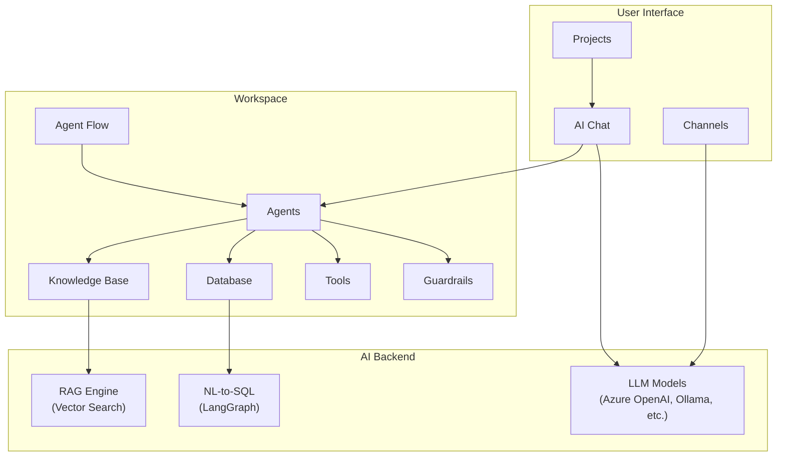

Cloosphere is an **enterprise AI chat platform** optimized for corporate environments. Use diverse LLM models safely and efficiently, and manage RAG, agents, and workflows in a single platform.

<video autoPlay muted loop playsInline style={{width: '100%', borderRadius: '8px'}}>
  <source src="/videos/getting-started/landing-scroll.mp4" type="video/mp4" />
</video>

---

## Why Cloosphere?

<Columns cols={3}>
  <Card title="Enterprise-grade Security" icon="lock">
    Operates within private network environments. Role-based access control (RBAC) and complete audit logs satisfy enterprise security policies.
  </Card>
  <Card title="Maximum Productivity" icon="bolt">
    Custom AI Agents, Knowledge Base integration, and Tool integrations deliver an AI experience optimized for each department's work.
  </Card>
  <Card title="Cost Efficiency" icon="chart-pie">
    Per-department/per-user usage tracking and multi-model support let you select the optimal model for each task.
  </Card>
</Columns>

---

## Key Features

### AI Chat and Model Management

<Columns cols={2}>
  <Card title="AI Chat" icon="comments" href="/en/chat/overview">
    Natural conversations with various LLMs including Azure OpenAI and Ollama. Supports extensions like file attachment, web search, and code execution.
  </Card>
  <Card title="Model Selection" icon="robot" href="/en/chat/models">
    Choose the right model for the job — GPT-4o, Claude, Ollama local models, and more.
  </Card>
</Columns>

### Workspace

<Columns cols={2}>
  <Card title="Agent" icon="robot" href="/en/workspace/agents">
    Build custom AI assistants combining a System Prompt, Knowledge Bases, Tools, and Guardrails.
  </Card>
  <Card title="Knowledge Base (RAG)" icon="book" href="/en/workspace/knowledge">
    Upload internal documents and let the AI ground its answers on them. Supports Retrieval-Augmented Generation backed by vector search.
  </Card>
  <Card title="Database (NL-to-SQL)" icon="database" href="/en/workspace/database">
    Query databases in natural language. Supports 8 DBs including PostgreSQL, MySQL, MSSQL.
  </Card>
  <Card title="Agent Flow" icon="diagram-project" href="/en/workspace/flows">
    Design and run multi-agent workflows in a visual builder.
  </Card>
  <Card title="Tool Integration" icon="wrench" href="/en/workspace/tools">
    Extend agent capabilities by connecting to external APIs and MCP servers.
  </Card>
  <Card title="Prompt Management" icon="file-lines" href="/en/workspace/prompts">
    Create and share team-wide prompt templates. Invoke them quickly via `/` commands.
  </Card>
  <Card title="Guardrails" icon="shield" href="/en/workspace/guardrails">
    Safely control AI inputs and outputs with PII detection and content filtering.
  </Card>
  <Card title="Glossary" icon="spell-check" href="/en/workspace/glossary">
    Register domain-specific terminology so the AI uses the correct terms in its answers.
  </Card>
</Columns>

### Collaboration and Administration

<Columns cols={2}>
  <Card title="Projects" icon="folder-open" href="/en/collaboration/projects">
    Group chats by team and apply shared settings (model, knowledge bases, etc.) at the project level.
  </Card>
  <Card title="Channels" icon="hashtag" href="/en/collaboration/channels">
    Real-time team messaging — share AI responses and collaborate with threads and reactions.
  </Card>
  <Card title="Admin Panel" icon="gear" href="/en/admin/overview">
    Provides various system setting tabs: user/organization management, model setup, document processing, branding, and more.
  </Card>
  <Card title="Monitoring" icon="chart-line" href="/en/monitoring/overview">
    Track operations through usage, audit logs, LLM tracing, and guardrail logs. (Admin &gt; Monitoring)
  </Card>
  <Card title="Evaluation" icon="clipboard-check" href="/en/monitoring/evaluations">
    Score LLM response quality automatically/manually and track performance over time. (Admin &gt; Evaluations)
  </Card>
</Columns>

---

## Platform Architecture

---

## Quick Start

<Steps>
  <Step title="Sign in">
    [Sign in](/en/getting-started/login) with SSO (Microsoft Entra ID) or email/password.
  </Step>
  <Step title="Get oriented">
    Familiarize yourself with the [main UI layout](/en/getting-started/ui-overview) — sidebar, model selector, chat area, and input box.
  </Step>
  <Step title="Start your first chat">
    Pick a model and start [your first AI conversation](/en/getting-started/first-chat).
  </Step>
</Steps>

---

## Supported Browsers

| Browser | Minimum Version | Recommended |
|---------|----------------|-------------|
| **Chrome** | 90+ | Latest version |
| **Edge** | 90+ | Latest version |
| **Firefox** | 88+ | Latest version |
| **Safari** | 14+ | Latest version |

<Warning>
  Internet Explorer is not supported. For the best experience, use the latest version of Chrome or Edge.
</Warning>

---

## Next Steps

<Columns cols={2}>
  <Card title="Sign In" icon="right-to-bracket" href="/en/getting-started/login">
    Connect via SSO or email
  </Card>
  <Card title="Start Your First Chat" icon="message" href="/en/getting-started/first-chat">
    Have your first conversation with AI
  </Card>
</Columns>
