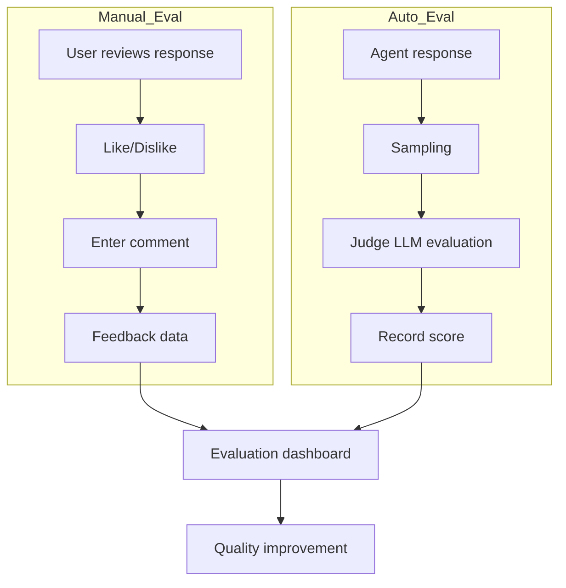
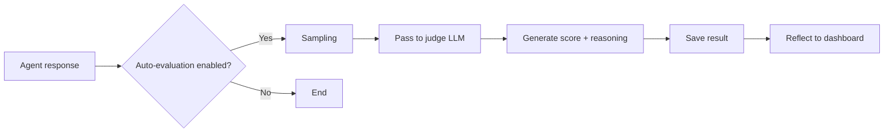

The evaluation feature measures AI response quality via two methods: **manual feedback and auto-evaluation**.
Combine direct user assessment with LLM-based auto-quality measurement to build a systematic quality management framework.

---

## Manual Evaluation (Feedbacks tab)

A feature where users directly evaluate AI responses.

View all feedback in **Admin > Evaluations > Feedbacks** tab.

<Frame caption="Evaluations tab main — feedback list table">
  
</Frame>

### How Feedback is Collected

Collected via feedback buttons below AI responses on the chat screen.

| Feedback Type | Description |
|---------------|-------------|
| **Like** | When the response is useful and accurate |
| **Dislike** | When the response is inaccurate or not helpful |
| **Comment** | Additional text feedback |

### Feedback Data

| Field | Description |
|-------|-------------|
| **User** | User who left feedback |
| **Type** | Like/Dislike |
| **Model ID** | Model that generated the response |
| **Reason** | Feedback reason |
| **Comment** | Detailed opinion |
| **Created** | Feedback creation time |

### Feedback Management

| Feature | Description | Permission |
|---------|-------------|------------|
| **View all** | View feedback from all users | Admin |
| **Export** | Export all feedback as JSON | Admin |
| **Delete all** | Bulk delete all feedback | Admin |
| **Per-item delete** | Delete own feedback | Regular user |

<Frame caption="Feedback detail — user info, model, evaluation, comment">
  
</Frame>

---

## Arena Evaluation

A feature for blind-comparing two model responses side by side.

### Setup

Configure in **Admin > Settings (gear) > Evaluations**.

| Setting | Description |
|---------|-------------|
| **Enable Arena** | Toggle Arena mode |
| **Arena models** | Compose model pairs to compare |

When Arena is enabled, two models' responses appear anonymously side by side during chat, and users select the better one.

---

## Leaderboard (Leaderboard tab)

In **Admin > Evaluations > Leaderboard**, see model rankings.

Based on Arena blind comparison results, calculates **Elo rating**-based model rankings. Each time a user picks the better response in Arena, that model's Elo score updates — providing objective real-usage-based model quality rankings.

<Frame caption="Leaderboard tab — Elo rating-based model ranking table">
  
</Frame>

| Field | Description |
|-------|-------------|
| **Model** | Evaluated model |
| **Elo Rating** | Score derived from Arena comparison results |
| **Matches** | Number of Arena comparisons |
| **Win rate** | Selected ratio |

---

## Auto-evaluation (Auto Evaluations tab)

When auto-evaluation is enabled on an agent, after each response, a **judge LLM** asynchronously evaluates quality and records results.

View results in **Admin > Evaluations > Auto Evaluations** tab.

<Frame caption="Auto-evaluation results screen — Score Trend chart, filters, results table">
  
</Frame>

<Note>
  Auto-evaluation is a licensed feature. Requires a license with `evaluation` feature enabled.
</Note>

### Evaluation Types

| Type | Description |
|------|-------------|
| **Retrieval Quality** | Evaluate whether retrieved documents are relevant to the question |
| **Faithfulness** | Evaluate whether the answer is grounded on retrieved content (hallucination detection) |
| **Response Quality** | Evaluate overall usefulness and accuracy |

### Evaluation Process

### Evaluation Result Fields

| Field | Description |
|-------|-------------|
| **Chat/Message ID** | Evaluated message |
| **Model ID** | Model that generated the response |
| **Judge Model ID** | LLM used for evaluation |
| **Evaluation type** | retrieval, faithfulness, quality |
| **Score** | 0.0 ~ 1.0 (1.0 is best) |
| **Reasoning** | LLM's explanation of the score |
| **Status** | pending, completed, failed |
| **Error message** | Error content on evaluation failure |

---

## Score Trend Chart

Visualizes daily average score trends.

| Mode | Description |
|------|-------------|
| **All types** | Average score line per model |
| **Specific type** | Detailed lines per model + type |

### Filter Options

| Filter | Description |
|--------|-------------|
| **Date range** | Pick evaluation period |
| **Model** | Filter by specific model |
| **Evaluation type** | Retrieval Quality, Faithfulness, Response Quality |
| **Status** | pending, completed, failed |
| **Score range** | Min/max score (0.0 ~ 1.0) |

---

## Auto-evaluation Statistics

Provides summary statistics for all auto-evaluations.

| Metric | Description |
|--------|-------------|
| **Total** | Total auto-evaluation count |
| **Completed** | Successfully completed evaluation count |
| **Pending** | Evaluations still being processed |
| **Failed** | Evaluations failed with errors |
| **Average score** | Overall average score |
| **Per-model statistics** | Count and average score per model |
| **Per-type statistics** | Count and average score per evaluation type |

---

## Export

Export auto-evaluation data.

| Format | Description |
|--------|-------------|
| **CSV** | For spreadsheet analysis (id, chat_id, message_id, model_id, score, reasoning, etc.) |
| **JSON** | Full data for programmatic integration |

---

## Configuring Auto-evaluation on an Agent

Auto-evaluation is enabled per agent.

<Steps>
  <Step title="Edit agent">
    Open the target agent's edit screen in **Workspace > Agents**.
  </Step>
  <Step title="Activate auto-evaluation">
    Activate in the **Auto-evaluation** section of agent settings.

    | Setting | Description |
    |---------|-------------|
    | **Enabled** | Whether auto-evaluation is used |
    | **Sampling rate** | Share of responses to evaluate (1%~100%, default 10%) |
    | **Judge model** | LLM model used for evaluation |
    | **Evaluation types** | Pick which types to enable |

    **Sampling rate guidance:**

    | Situation | Recommended | Reason |
    |-----------|:-----------:|--------|
    | New agent | 50–100% | Quickly assess initial quality |
    | Stabilized | 5–10% | Cost saving + monitoring |
    | Critical business | 20–30% | Quality assurance |
  </Step>
  <Step title="Save">
    After saving the agent, auto-evaluation runs on subsequent responses from this agent.
  </Step>
</Steps>

<Tip>
  Use a judge model that's equal or higher caliber than the model being evaluated. For example, evaluating GPT-4o responses with GPT-4o-mini may reduce accuracy.
</Tip>

---

## Use Cases

<AccordionGroup>
  <Accordion title="Response Quality Monitoring" icon="chart-line">
    1. Check daily/weekly score trends in the Score Trend chart
    2. When a model's score drops, check that period's traces
    3. Click low-score individual evaluations to review reasoning
    4. Adjust prompts, Knowledge Bases, tool settings
  </Accordion>

  <Accordion title="Cross-model Quality Comparison" icon="scale-balanced">
    1. Enable Arena evaluation to collect blind comparison data
    2. Compare per-model average scores in auto-evaluation statistics
    3. Set the model with best cost-quality efficiency as default
  </Accordion>

  <Accordion title="Feedback-based Improvement" icon="comments">
    1. Identify models/agents with high "Dislike" rates from manual feedback
    2. Analyze comments to understand common dissatisfaction patterns
    3. Improve the agent's system prompt or Knowledge Base
    4. Track auto-evaluation score changes after improvement
  </Accordion>

  <Accordion title="What if auto-evaluation fails?" icon="triangle-exclamation">
    When auto-evaluation is in `failed` state:
    - **Check error message**: Review the error details for that item in the result table
    - **Common causes**: Judge model API errors, timeouts, token limit exceeded
    - **Re-run**: Auto re-run isn't currently supported. Re-enable auto-evaluation in agent settings to evaluate subsequent responses.
  </Accordion>
</AccordionGroup>

---

## Next Steps

<Columns cols={3}>
  <Card title="Tracing" icon="route" href="/en/monitoring/tracing">
    Trace causes of low evaluation scores
  </Card>
  <Card title="Agent Settings" icon="robot" href="/en/workspace/agents">
    Configure auto-evaluation on agents
  </Card>
  <Card title="Usage" icon="coins" href="/en/monitoring/usage">
    Check token usage including evaluation cost
  </Card>
</Columns>
