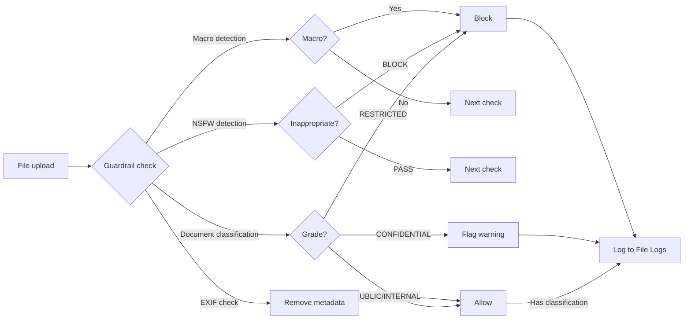

File Logs is a security monitoring feature for **files with guardrail analysis results**.
Admins get a unified view of uploaded file sensitivity classification, blocking status, and security check results.

Access via **Admin > Monitoring > File Logs**.

<Frame caption="File Logs main screen — filter bar, table, source/classification badges">
  
</Frame>

<Note>
  Not all uploaded files appear here. Only files with **classification results or guardrail blocks** are shown in the log.
</Note>

---

## Document Sensitivity Classification

On file upload, an LLM-based classifier auto-determines document sensitivity.

| Classification | Description | Action |
|----------------|-------------|--------|
| **PUBLIC** | Generally shareable documents | Allow |
| **INTERNAL** | Internal-use documents | Allow |
| **CONFIDENTIAL** | Sensitive — PII, financial info | Flag (warn) |
| **RESTRICTED** | Top secret, regulated | Block (reject upload) |

Each classification result includes a **confidence** score (0–100%) and the classification reason.

---

## Guardrail Check Types

Multiple security checks apply automatically per file type.

<Tabs>
  <Tab title="Document Classification">
    LLM-based sensitivity classification. Analyzes document text to assign PUBLIC ~ RESTRICTED grade.

    - **Target**: All files with extractable text (PDF, DOCX, TXT, etc.)
    - **Result**: Classification grade + confidence + reason
    - **Action**: CONFIDENTIAL → flag, RESTRICTED → block
  </Tab>
  <Tab title="Macro Detection">
    Detect VBA macros in Office files.

    - **Target**: `.doc`, `.docm`, `.xls`, `.xlsm`, `.ppt`, `.pptm`
    - **Result**: Macro count, code preview
    - **Action**: Block when macros are found
  </Tab>
  <Tab title="EXIF Metadata Removal">
    Auto-remove EXIF metadata (location, device info) from image files.

    - **Target**: `.jpg`, `.jpeg`, `.tiff`, `.tif`, `.webp`
    - **Result**: EXIF presence + removal completion
    - **Action**: Allowed after removal (no block)
  </Tab>
  <Tab title="NSFW Detection">
    LLM-based image inappropriate content check.

    - **Target**: All image files
    - **Result**: PASS or BLOCK
    - **Action**: Block when inappropriate content found
  </Tab>
</Tabs>

---

## Viewing Logs

### Filter Options

| Filter | Options | Description |
|--------|---------|-------------|
| **Search** | Text input | Search by filename, uploader name/email |
| **Source** | Chat / Knowledge / Project | Filter by upload path |
| **Classification** | PUBLIC / INTERNAL / CONFIDENTIAL / RESTRICTED | Filter by sensitivity grade |
| **Status** | Flagged / Blocked | Filter by processing result |

### Table Columns

| Column | Description |
|--------|-------------|
| **Filename** | Original filename + content type |
| **Uploader** | User name (email subtitle) |
| **Source** | Upload path (color badges: Chat=blue, Knowledge=purple, Project=green) |
| **Classification** | Sensitivity grade (color badges: PUBLIC=green, INTERNAL=blue, CONFIDENTIAL=yellow, RESTRICTED=red) |
| **Upload time** | Upload timestamp |
| **Status** | Blocked (red) or Flagged (yellow) badge |

### Pagination

- 20 entries per page
- Total file count shown at top
- Page navigation controls when over 20

---

## Detail View

Click a table row to see the file's guardrail analysis in a modal.

**Items shown:**

- **File info**: Filename, content type, size (KB)
- **Uploader info**: Name, email, upload time
- **Source**: Upload path badge
- **Classification result**:
  - Sensitivity grade + confidence (%)
  - Classification reason
  - Classification model used
  - Error message on errors
- **Guardrail details** (when applicable):
  - Block reason and detail JSON
  - EXIF removal result
  - NSFW detection result

---

## File Processing Flow

---

## Use Cases

<Accordion title="Sensitive Document Monitoring">
  1. Set **Classification** filter to `CONFIDENTIAL`
  2. Review the flagged file list
  3. Confirm classification reason and confidence in the detail modal
  4. Adjust policy in [Guardrail Settings](/en/workspace/guardrails) as needed
</Accordion>

<Accordion title="Per-Source Upload Pattern Analysis">
  1. Use the **Source** filter to view upload status by Chat / Knowledge / Project
  2. If a source has many blocks, inspect that workflow
  3. Review Knowledge upload classification results to manage RAG data quality
</Accordion>

<Accordion title="Blocked File Investigation">
  1. Set **Status** filter to `Blocked`
  2. Confirm uploader and reason for blocked files
  3. Review guardrail detail JSON in the detail modal
  4. Consider revising guardrail rules if false positives
</Accordion>

---

## Best Practices

- **Periodic monitoring**: Review file logs at least weekly to detect anomaly patterns
- **Guardrail integration**: When blocks/flags occur frequently, review [Guardrail Settings](/en/workspace/guardrails)
- **False positive management**: When CONFIDENTIAL/RESTRICTED classification confidence is low, consider changing the classification model
- **Source analysis**: Watch for patterns where sensitive files concentrate in a specific source
