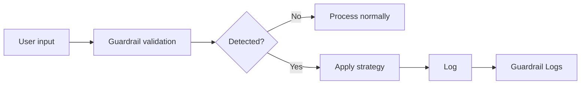

Guardrail logs record **all events detected and processed** by guardrails configured on agents.
Transparently track which user entered which sensitive info and how which guardrail processed it.

Access via **Admin > Monitoring > Guardrail Logs**.

<Note>
  The same guardrail logs can also be viewed from **Admin > Code Gateway > Guardrail Logs**.
</Note>

<Frame caption="Guardrail Logs main screen — filter area, log table">
  
</Frame>

---

## What are Guardrail Logs?

When users converse with the AI, guardrails validate inputs and outputs. When sensitive info is detected, the configured strategy (block, redact, mask, etc.) is applied and the result is logged.

---

## Log Entry Structure

Each guardrail log entry includes:

| Field | Description |
|-------|-------------|
| **Timestamp** | Detection event time |
| **User** | Input user (name, email) |
| **Chat ID** | Conversation session |
| **Message ID** | Message identifier |
| **Guardrail name** | Applied guardrail |
| **Action** | Processing strategy (block, redact, mask, etc.) |
| **Detection Pattern** | Detection method (Rule-based / LLM-based) |
| **Detection Detail** | Specific detected content |
| **Original content** | Original input text |
| **Processed Content** | Text after strategy applied |

---

## Action Types

| Action | Description |
|--------|-------------|
| **block** | Block entire message |
| **redact** | Replace sensitive info with label (e.g., `[REDACTED_EMAIL]`) |
| **mask** | Show only some characters (e.g., `j***@***.com`) |
| **hash** | Convert to hash value |
| **log** | Log without blocking (shown as "Warning" in UI) |

## Detection Pattern

Detection methods are grouped into two categories.

| Group | Sources | Description |
|-------|---------|-------------|
| **Rule-based** | pii, custom_pattern, blocked_word | Regex/pattern-based detection |
| **LLM-based** | llm_judge | LLM-based content risk assessment |

Individual source meanings:

| Source | Description |
|--------|-------------|
| **pii** | Detect PII patterns (email, credit card, IP address, etc.) |
| **custom_pattern** | Detect user-defined regex patterns |
| **blocked_word** | Detect prohibited words/phrases |
| **llm_judge** | LLM-based content risk assessment |

---

## Filter Options

| Filter | Description |
|--------|-------------|
| **Time range** | Start/end date range |
| **Action** | block, redact, mask, hash, log (multi-select) |
| **Detection Pattern** | Rule-based / LLM-based group selection |
| **User search** | Search by user ID, email, or name |
| **Chat ID** | Logs for a specific chat session only |
| **Source** | Request origin filter (e.g., `code_gateway`) |

---

## Log Detail View

Click a log entry to see details.

<Tabs>
  <Tab title="Detection Details">
    | Item | Description |
    |------|-------------|
    | **Guardrail** | Applied guardrail name and ID |
    | **Detection Pattern** | Rule-based (PII, custom pattern, blocked word) or LLM-based (LLM Judge) |
    | **Detection Detail** | Specific detected pattern or item |
    | **Original content** | User-entered original |
    | **Processed Content** | Result after strategy applied |
  </Tab>
  <Tab title="Context">
    | Item | Description |
    |------|-------------|
    | **User** | Name, email |
    | **Chat ID** | Conversation session identifier |
    | **Message ID** | Message identifier |
    | **Metadata** | Additional context (source, etc.) |
  </Tab>
</Tabs>

---

## Tracing Integration

In guardrail log details, the **Trace** button lets you see the complete processing of that message.

<Steps>
  <Step title="Pick an entry in Guardrail Logs">
    Click the log entry for the guardrail event you're investigating.
  </Step>
  <Step title="Click Trace">
    Click the **Trace** button in the detail modal.
  </Step>
  <Step title="View full processing">
    On the **Evaluations > Tracing** screen, view the full Run tree including the guardrail check for that message. Guardrail Runs are shown with red **GD** badges.
  </Step>
</Steps>

---

## Use Cases

<Accordion title="Guardrail Policy Tuning">
  1. Set a time range and view logs by **Detection Pattern**
  2. Review `log` action events to gauge false positive rate
  3. Adjust regex or exclude patterns with many false positives
  4. Add new patterns or blocked words for missed detections
</Accordion>

<Accordion title="Security Incident Response">
  1. Look up a specific user's guardrail events via user search
  2. Check repeated `block` patterns
  3. Review original content to determine intentional sensitive info leak attempts
  4. Cross-analyze with related audit logs for full context
</Accordion>

<Accordion title="LLM Judge Effectiveness Analysis">
  1. Filter **Detection Pattern** to `LLM-based`
  2. Review original content of blocked messages
  3. If excessive blocking, strengthen allow examples in the Judge prompt
  4. If missing blocks, add block examples
</Accordion>

---

## Guardrail Settings Integration

Improve guardrail settings based on patterns found in guardrail logs.

| Log Analysis Finding | Recommended Action |
|---------------------|--------------------|
| Specific PII type detected frequently | Strengthen that type's strategy from `log` → `redact` |
| Frequent false positives | Narrow custom pattern regex |
| LLM Judge over-blocking | Add allow examples to Judge prompt |
| New sensitive info pattern found | Add regex via custom pattern |

<Note>
  See [Guardrails](/en/workspace/guardrails) for guardrail configuration.
</Note>
