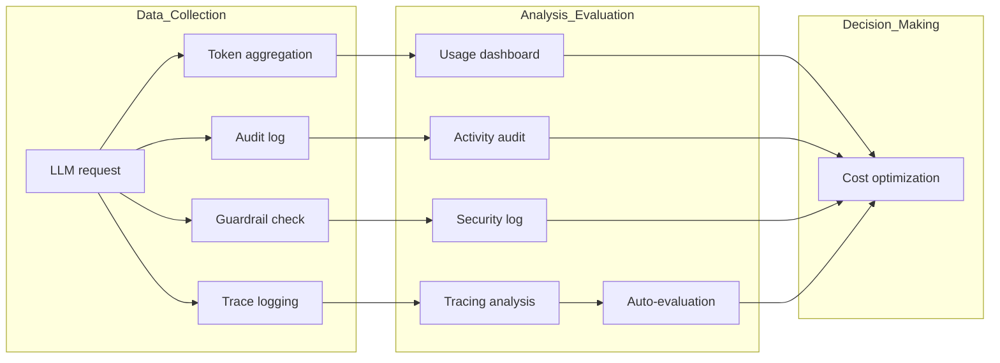

Monitoring is the core feature providing **operational visibility** for the Cloosphere platform.
Track AI usage in real time, transparently record all user activity, and systematically evaluate response quality.

---

## Monitoring Targets

| Area | Purpose | Target Users |
|------|---------|--------------|
| **BI Dashboard** | Visualize operational data, AI auto-chart generation, sharing | Admin, Executives |
| **Usage** | Token consumption, cost, usage pattern analysis | Admin, Team Lead |
| **Audit Log** | User activity records, compliance | Admin, Security |
| **Guardrail Logs** | Track sensitive info detection/blocking events | Admin, Security |
| **Tracing** | Step-by-step LLM request processing tracking | Admin, Developer |
| **Evaluation** | Response quality measurement (manual feedback + auto-evaluation + Leaderboard) | Admin, Quality Manager |

---

## How to Access

Monitoring features are accessed in two places.

<Tabs>
  <Tab title="Admin > Monitoring">
    Access via **Admin > Monitoring** in the sidebar. The **Audit Logs** tab is the default landing.

    

    | Tab | Function |
    |-----|----------|
    | **Dashboard** | BI Dashboard — AI-based panel charts, sharing, HTML export |
    | **Audit Logs** | View user activity records |
    | **Guardrail Logs** | View guardrail detection/blocking events |
    | **Conversation Logs** | View conversation records |
    | **File Logs** | File upload security monitoring (guardrail classification, blocked/flagged file tracking) |
    | **Usage** | Token usage, cost, statistics dashboard |

    <Note>
      The **Conversation Logs** tab views conversation records. A separate guide page is coming later.
    </Note>

    <Note>
      The **File Logs** tab is shown conditionally by feature flag. May not appear in the menu depending on environment settings.
    </Note>
  </Tab>
  <Tab title="Admin > Evaluations">
    Access via **Admin > Evaluations** in the sidebar.

    

    | Tab | Function |
    |-----|----------|
    | **Evaluations** | View user feedback (like/dislike) |
    | **Auto-evaluation** | LLM-based response quality auto-measurement results |
    | **Leaderboard** | Cross-model evaluation score comparison and ranking dashboard |
    | **Tracing** | LLM request processing tracking |
  </Tab>
</Tabs>

---

## Use Cases

<Columns cols={2}>
  <Card title="Monthly AI Cost Analysis" icon="chart-pie">
    Check token consumption by organization/model in the usage dashboard, export to CSV for cost reports.
  </Card>
  <Card title="Security Incident Investigation" icon="shield">
    Filter suspicious activity in audit logs by time range/user to trace incident details.
  </Card>
  <Card title="Response Quality Debugging" icon="magnifying-glass">
    In tracing, review step-by-step processing for specific messages and generate LLM analysis reports.
  </Card>
  <Card title="Guardrail Policy Improvement" icon="lock">
    Analyze detection patterns in guardrail logs to reduce false positives and strengthen security policy.
  </Card>
</Columns>

---

## Recommended Review Cadence

| Cadence | Items |
|---------|-------|
| **Daily** | Anomalous usage patterns, guardrail blocking events |
| **Weekly** | Usage trends, auto-evaluation score trend review |
| **Monthly** | Cost analysis report, audit log summary, guardrail policy review |
| **Quarterly** | Overall utilization assessment, model cost-effectiveness analysis |

---

## Detailed Features

<Columns cols={2}>
  <Card title="BI Dashboard" icon="chart-column" href="/en/monitoring/dashboard">
    AI-based panel dashboard — auto-generate SQL charts from natural language and share
  </Card>
  <Card title="Usage" icon="gauge" href="/en/monitoring/usage">
    Token usage, cost, per-model/user/organization analysis
  </Card>
  <Card title="Audit Log" icon="clipboard-list" href="/en/monitoring/audit-logs">
    User activity records and compliance audit
  </Card>
  <Card title="Guardrail Logs" icon="shield-check" href="/en/monitoring/guardrail-logs">
    Sensitive info detection/blocking event log
  </Card>
  <Card title="Tracing" icon="route" href="/en/monitoring/tracing">
    Step-by-step LLM request processing tracking
  </Card>
  <Card title="Evaluation" icon="star" href="/en/monitoring/evaluations">
    Manual feedback and automatic quality evaluation
  </Card>
</Columns>
