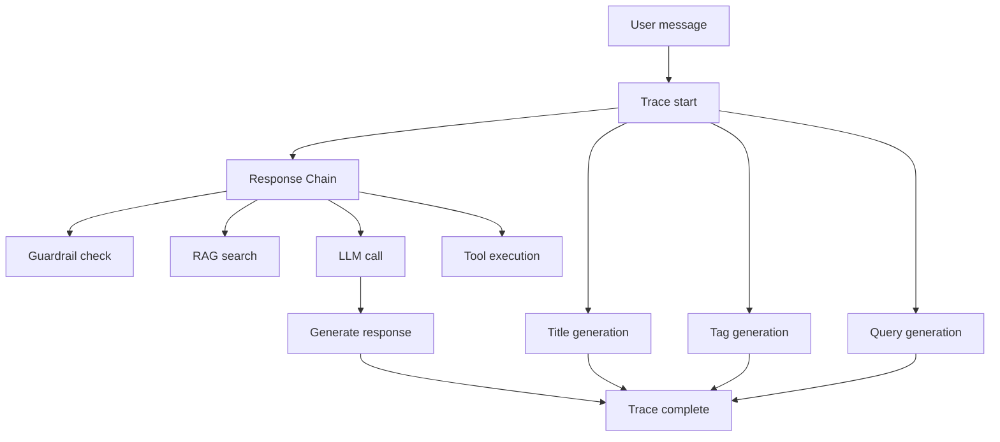
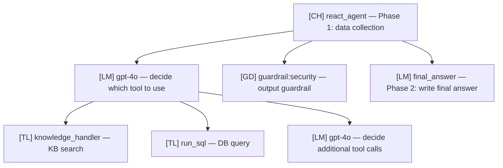

When an agent gives an off-topic answer, frustrated by not knowing "why it answered that way"?

Tracing **tracks every step of AI request processing**. What documents were searched, what tools were invoked, what prompt was sent to the LLM — every step is transparently visible.

### Example

> Agent answered "I can't find that information"

| State | What's Possible | Result |
|-------|----------------|--------|
| Without tracing | Only guessing | Cannot identify cause |
| Using tracing | RAG search → 0 results confirmed in Run tree | KB document missing → resolved by adding documents |

Access via **Admin > Evaluations > Tracing**.

{/* SCREENSHOT: tracing-main */}
<Frame caption="Track every AI request's processing in Admin > Evaluations > Tracing">
  
</Frame>

<Note>
  Tracing is a licensed feature. Requires a license with `trace` feature enabled.
</Note>

---

## Tracing Concepts

Processing a single user message involves multiple steps. Tracing records all these steps in a **Trace > Run** hierarchy.



| Concept | Description |
|---------|-------------|
| **Trace** | Full processing for a single message |
| **Run** | Individual processing step within a Trace |
| **Run tree** | Run hierarchy with parent-child relationships |

---

## Searching Traces

### Search Methods

| Search Type | Description |
|-------------|-------------|
| **Chat ID** | View all traces for a specific chat |
| **Message ID** | View only the trace for a specific message |

### Filter Options

| Filter | Options |
|--------|---------|
| **Period** | Last 1, 7, 30 days, all |
| **Status** | Success, Error, Running, Pending |
| **Type** | Chain, LLM, Tool, Retrieval, Web Search, Guardrail, Embedding |
| **User** | Filter by specific user (admin only) |

<Note>
  When searching by Chat ID or Message ID, date filters don't apply. All traces for that ID are shown regardless of period.
</Note>

<Tip>
  In the chat screen, click **View Tracing** in the message option menu to navigate directly to that message's trace screen.
</Tip>

---

## Message Card

Search results are displayed as a list of message cards.

| Item | Description |
|------|-------------|
| **User message** | Original input message (max 2 lines) |
| **Message ID** | Message identifier (abbreviated) |
| **Time** | Request time |
| **Total latency** | Total processing time (ms) |
| **Total tokens** | Total token usage (prompt + completion) |
| **Trace badges** | Status display per Run type |

---

## Trace Detail View

Click a message card to open the trace detail modal. The Run tree is on the left, and the selected Run's details are on the right.

{/* SCREENSHOT: tracing-detail-modal */}
<Frame caption="Pick a step in the Run tree on the left to see its I/O on the right">
  
</Frame>

### Run Tree Structure

The left panel shows processing steps as a tree.

```
[CH] Response               2.34s
  ├─ [GD] guardrail:security 0.05s
  ├─ [RG] KnowledgeBase      0.32s
  ├─ [LM] GPT-4              1.89s
  └─ [TL] web_search         0.13s
```

### Run Types

| Code | Type | Color | Description |
|:----:|------|:-----:|-------------|
| **CH** | Chain | Purple | Composite work (full message processing) |
| **LM** | LLM | Blue | LLM API call |
| **TL** | Tool | Green | Tool execution |
| **RG** | Retrieval | Orange | RAG document search |
| **WB** | Web Search | Cyan | Web search |
| **GD** | Guardrail | Red | Guardrail check |
| **EM** | Embedding | Yellow | Embedding generation |
| **IM** | Image | Indigo | Image generation |
| **ACT** | Action | Purple | Tool + sub-task group (expandable) |
| **TK** | Task | Gray | Background task |

### Status Display

| Status | Symbol | Color |
|--------|:------:|:-----:|
| **Success** | ● | Green |
| **Error** | ● | Red |
| **Running** | ◐ | Yellow |
| **Pending** | ○ | Gray |

<Note>
  Trace overall status: **Error if any included Run has Error**, Running if no Error and a Running exists.
</Note>

---

## Run Details

The right panel shows details of the selected Run.

| Section | Description |
|---------|-------------|
| **Status** | Status, latency, model ID |
| **Inputs** | Input data (system prompt, user message, etc.) |
| **Outputs** | Output data (AI response, search results, etc.) |
| **Error** | Error message (on errors) |
| **Token Usage** | prompt_tokens, completion_tokens, total_tokens (LLM type) |

### View Modes

Inputs/Outputs can be viewed in three formats.

| Mode | Description |
|------|-------------|
| **Tree** | Hierarchical tree structure (default) |
| **JSON** | Raw JSON format |
| **Text** | Plain text |

### Text Search

Search text in the Outputs area.

| Action | Method |
|--------|--------|
| **Search** | Yellow highlight on entered query |
| **Next match** | Enter |
| **Previous match** | Shift + Enter |
| **Match count** | Shown next to search box as `1/5` |

---

## Trace Types

### Main Response

The process of generating an AI response to a user message.

| Type | Description |
|------|-------------|
| **Response** | Full response generation (top-level Chain) |
| **LLM** | LLM API call |
| **RAG** | Knowledge Base search |
| **Tool** | Tool execution |
| **Search** | Web search |
| **Guard** | Guardrail check |

### Background Tasks

Background tasks for chat support features.

| Type | Description |
|------|-------------|
| **Title** | Auto-generate chat title |
| **Tag** | Auto-generate chat tags |
| **Query** | RAG search query generation |
| **Emoji** | Generate chat emoji |
| **Autocomplete** | Autocomplete suggestion |
| **Function** | Function call decision |

---

## How to Read the Run Tree

The agent's Run tree consists of **2 phases**. Understanding this structure helps you quickly find the cause of problems.



| Phase | Run Name | What It Does |
|:-----:|----------|--------------|
| **Phase 1** | `react_agent` (CH) | Stage where the LLM calls tools to collect data. KB search, DB query, web search, etc. happen here |
| **Phase 2** | `final_answer` (LM) | Stage that synthesizes collected data into a final answer |

### Debugging Points

<AccordionGroup>
  <Accordion title="Agent didn't search the Knowledge Base?" icon="magnifying-glass">
    Check the Inputs of Phase 1's first **LM Run**. Verify the KB tool is included in `tool_descriptions`.

    - **Tool not in list** → KB not connected to agent or tool description empty
    - **Tool present but not called** → LLM judged low relevance between question and tool. Make tool description more specific
  </Accordion>

  <Accordion title="Search ran but answer is inaccurate?" icon="file-circle-question">
    Check searched document content in **RG (Retrieval) Run** Outputs.

    - **Search results irrelevant** → KB document quality issue or search settings (Top K, Reranker) need adjustment
    - **Search results good but answer is off** → Check passed context in Phase 2 `final_answer` LM Run Inputs. Adjust response format prompt
  </Accordion>

  <Accordion title="Tool execution failed?" icon="circle-exclamation">
    Click the **TL (Tool) Run** marked red ● to check the Error section. Also verify passed parameters in Inputs.
  </Accordion>

  <Accordion title="Response too slow?" icon="clock">
    Compare **latency (ms)** next to each step in the Run tree. The longest step is the bottleneck.

    - LM Run slow → consider faster model
    - RG/TL Run slow → check search settings or external service
    - GD Run slow → disable LLM Judge or change to faster model
  </Accordion>
</AccordionGroup>

---

## Trace Analysis Report

A feature that analyzes trace data with LLM to **automatically identify the root cause of problems**.

<Steps>
  <Step title="Start analysis">
    Click **Trace Analysis** at the top of the trace detail modal.

    | Input | Description | Required |
    |-------|-------------|:--------:|
    | **Analysis model** | LLM model used for analysis | Required |
    | **Problem description** | Description of observed problem | Optional |

    <Note>
      The analysis model list excludes models with base_model_id (custom models), preset models, and arena models. Only base models are selectable.
    </Note>
  </Step>
  <Step title="Review analysis result">
    The LLM analyzes trace data and generates a structured report.

    The LLM comprehensively analyzes trace data + agent settings + conversation history + KB/DB/guardrail settings to generate the report.

    | Report Section | Content |
    |----------------|---------|
    | **Summary** | 2~3 sentence core summary of analysis |
    | **Trace overview** | ID, status, latency, tokens, Run count, error count |
    | **Root cause analysis** | Primary cause + contributing factors |
    | **Phase 1 analysis** | Whether tool selection was appropriate, available vs. actual tool calls |
    | **Phase 2 analysis** | Appropriateness of final answer relative to collected data |
    | **Prompt/setting issues** | System prompt, model selection issues |
    | **KB/RAG issues** | Search settings, document quality, filter issues |
    | **DB/SQL issues** | NL-to-SQL conversion, schema issues |
    | **Guardrail issues** | Excessive blocking, false positives |
    | **Error analysis** | Error Run detailed diagnosis |
    | **Improvement recommendations** | Immediate actions, setting changes, data improvements |

    <Tip>
      Entering a problem description enables analysis focused on that context. Example: "KB found documents but they weren't reflected in the answer"
    </Tip>
  </Step>
  <Step title="Save/share report">
    | Feature | Description |
    |---------|-------------|
    | **Copy** | Copy full text to clipboard |
    | **Download** | Download as markdown file (.md) |
  </Step>
</Steps>

<Note>
  When a previously analyzed report exists, **View Report** button shows it directly without re-analysis.
</Note>

---

## Trace Management

### Permissions

| Role | Permission |
|------|------------|
| **Regular user** | Can only view own traces |
| **Admin** | View and manage traces of all users |

### Data Cleanup

Old traces can be cleaned by admins via the `/api/traces/cleanup` API.
Bulk-delete traces before a specific timestamp (in milliseconds, ms).

<Warning>
  Trace deletion is irreversible. Download necessary analysis reports before deleting.
</Warning>

---

## Use Cases

<AccordionGroup>
  <Accordion title="Response Quality Debugging" icon="magnifying-glass-chart">
    1. Click **View Tracing** on a chat message
    2. Expand the Run tree of the problem message
    3. **RG (Retrieval) Run** → check searched documents in Outputs
    4. **LM (final_answer) Run** → check passed context in Inputs
    5. Generate a **Trace Analysis Report** to auto-identify root cause
  </Accordion>

  <Accordion title="Latency Analysis" icon="clock">
    1. View traces of slow responses
    2. Compare **latency (ms)** next to each step in the Run tree
    3. Identify the longest step (e.g., RAG 0.8s, LLM 3.2s)
    4. Optimize that step (adjust search settings, change model, etc.)
  </Accordion>

  <Accordion title="Tool Execution Error Tracking" icon="circle-exclamation">
    1. Filter by **Error** status
    2. Pick the failed Run marked red ●
    3. Check error message in the **Error** section
    4. Verify passed parameters in **Inputs**
  </Accordion>

  <Accordion title="Token Usage Analysis" icon="coins">
    1. Check **total tokens** count on the message card
    2. Compare per-LM Run `prompt_tokens` / `completion_tokens` in the Run tree
    3. Check token ratio of Phase 1 (react_agent) vs Phase 2 (final_answer)
    4. Identify unnecessarily large prompts or repeated calls
  </Accordion>
</AccordionGroup>

---

## Accessing Tracing from Chat

Click **View Tracing** in the message option menu on the chat screen to navigate directly to that message's trace screen.

| Permission | Visible Button |
|------------|----------------|
| Admin or evaluation read/write permission | **View Tracing** → navigate to trace screen |
| Other users | **Copy Message ID** → forward to admin for investigation |

<Tip>
  When regular users encounter response problems, **copy the Message ID** and forward to an admin. The admin can look up the trace by ID to identify the cause.
</Tip>

---

## FAQ

<AccordionGroup>
  <Accordion title="Is tracing recorded automatically?" icon="circle-question">
    Yes — when message tracing is enabled (default: enabled), all AI requests are auto-recorded. No additional setup needed.
  </Accordion>

  <Accordion title="How long is trace data retained?" icon="circle-question">
    Default retention is **30 days**. Admins can change settings or manually clean up.
  </Accordion>

  <Accordion title="Does tracing affect response speed?" icon="circle-question">
    Trace recording is asynchronously processed in the background, so it has nearly no impact on response speed.
  </Accordion>

  <Accordion title="Do analysis reports also consume tokens?" icon="circle-question">
    Yes — trace analysis is a separate LLM call, tracked in usage as `trace_analysis`. Analysis only runs when manually triggered.
  </Accordion>
</AccordionGroup>

---

## Related Pages

<Columns cols={3}>
  <Card title="Guardrail Logs" icon="shield-check" href="/en/monitoring/guardrail-logs">
    Dedicated log for guardrail detection events
  </Card>
  <Card title="Auto-evaluation" icon="chart-line" href="/en/monitoring/evaluations">
    Agent response quality auto-evaluation results
  </Card>
  <Card title="Usage" icon="coins" href="/en/monitoring/usage">
    Token usage and cost analysis
  </Card>
</Columns>
