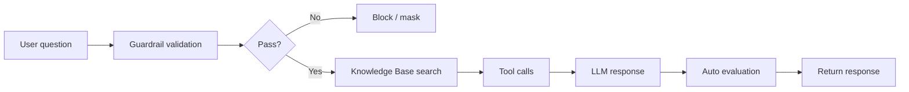

Tired of repeating context to the base AI model, manually pasting internal documents, and re-stating answer formats every time?

An Agent bundles a **Knowledge Base + Tool + Guardrail + System Prompt** together to create a per-department-optimized AI assistant.

<Note>
In one line — bundle a **system prompt + knowledge base + tools + guardrails** into a task-specific AI tailored per team.

- **When does it fit?** When the same context repeats turn after turn, or when answer format and internal-source citations must stay consistent
- **How long to build?** A minimal prompt-only agent takes ~5 min · a full setup with KB, tools, and guardrails is closer to 30 min
- **What about cost?** Each response adds KB retrieval and tool routing on top of the base model, so token usage is higher — for casual questions, the base model is cheaper
- **Is this the right tool?** If branching and loops dominate, look at [Flows](/en/workspace/flows). If you only need one or two tools, [Tools](/en/workspace/tools) alone may be enough
</Note>

### Example

> "Show me this month's sales status"

| State | Behavior | Result |
|-------|----------|--------|
| Base model | Guesses from general AI knowledge | "I cannot access sales data" |
| Agent (DB + KB connected) | Queries the sales DB + applies report format | Accurate sales data + tabular response |

{/* SCREENSHOT: agents-list */}
<Frame caption="View created agents in Workspace > Agents">
  
</Frame>

---

## Agent Processing Pipeline

The agent receives a user question and generates a response through this pipeline.



A guardrail validates the input, the Knowledge Base retrieves related documents, tools (API, DB) are invoked when needed, and the LLM produces the final response.

---

## Which Should You Use?

Agent, Base Model, and Flow look similar but fit different situations.

<Columns cols={3}>
  <Card title="Base Model" icon="comments">
    **When** — One-off questions, free-form answers, general knowledge.

    Casual prompts like "what does this code mean?" or "what's today's FX rate" are fastest and cheapest here. No KB retrieval or tool routing means lower token usage.
  </Card>

  <Card title="Agent" icon="robot">
    **When** — Repeated KB citations, fixed tone or format, guardrails required.

    HR policy Q&A, code reviewers, data analysts — the pattern of **letting the LLM decide which KB to cite and which tool to call**.
  </Card>

  <Card title="Flow" icon="diagram-project">
    **When** — Branching, loops, or external API chains dominate.

    Form input → automated processing → notification, multi-step approvals, and similar automation. **You specify the decision flow as nodes**, so behavior is predictable.
  </Card>
</Columns>

<Tip>
  When in doubt, **start with an Agent**. If it feels like overkill for simple questions, drop down to the base model; if you find yourself wanting if/else branches, move it to a [Flow](/en/workspace/flows). You don't have to pick the right one on the first try.
</Tip>

---

## Creating an Agent

<Steps>
  <Step title="Enter basic info">
    Click **Workspace > Agents > "+ New Agent"** and fill in basic info.

    {/* SCREENSHOT: agents-create-basic */}
    <Frame caption="Set the agent's name, description, and profile image">
      
    </Frame>

    | Field | Description | Example |
    |-------|-------------|---------|
    | **Name** | Agent display name | "Marketing Assistant" |
    | **Description** | What the agent does | "Marketing content creation and analysis support" |
    | **Profile image** | Agent icon | Marketing-related image |
    | **Tags** | Classification tags | marketing, content |
  </Step>

  <Step title="Pick the base model">
    Choose the AI model the agent will use. Pick from the model list registered by the admin.
  </Step>

  <Step title="Write the prompts">
    Define the agent's role, persona, and response rules.

    | Field | Description |
    |-------|-------------|
    | **Task Prompt** | Defines the agent's role, persona, restrictions, and concrete task instructions. Plays the role of the general system prompt. |
    | **Response Format Prompt** | Specifies the response format and structure (markdown, table, etc.). Separated from the task prompt so format can be managed independently. |

    Click the **AI auto-generate button** next to each prompt field — it analyzes the agent's name, description, and connected resources to draft the prompt automatically.

    <Note>
      During AI auto-generation, technical instructions (tool usage, SQL writing rules, etc.) are **automatically excluded**. The platform handles those — the prompt only contains role, persona, and restrictions.
    </Note>

    {/* SCREENSHOT: agents-task-prompt */}
    <Frame caption="Write the Task Prompt (role definition) and Response Format Prompt (output format) separately">
      
    </Frame>

    <Accordion title="Example of a good task prompt">
      ```markdown
      You are Cloocus's marketing assistant.

      ## Role
      - Support marketing content creation
      - Draft social media posts
      - Analyze marketing data

      ## Response Rules
      - Always respond in Korean
      - Maintain a professional yet friendly tone
      - Provide data-driven insights
      - Comply with brand guidelines

      ## Restrictions
      - Do not disparage competitors
      - Do not use unverified statistics
      ```
    </Accordion>

    <Accordion title="Why are the Task Prompt and Response Format Prompt separated?">
      The two prompts are used at **different stages** of agent execution.

      ```mermaid
      flowchart TD
          A["① Apply Task Prompt"] --> B[Agent calls tools to gather data]
          B --> C[KB search, DB lookup, web search, etc.]
          C --> D["② Apply Response Format Prompt"]
          D --> E[Compose the final answer from collected data]
      ```

      | | Task Prompt | Response Format Prompt |
      |---|---|---|
      | **When applied** | While the agent is using tools | When composing the final answer |
      | **Role** | "What to do" (role, restrictions) | "How to answer" (markdown, tables, length) |
      | **Include** | Role definition, behavior rules, restrictions | Output format, tone, structure |
      | **Don't include** | Output format specs | Role definition, behavior rules |

      Separating them lets you **change just the output format while keeping the role**, or vice versa.
    </Accordion>
  </Step>

  <Step title="Configure prompt suggestions (optional)">
    Set conversation-starter suggestions shown when an agent is selected in chat.

    | Option | Description |
    |--------|-------------|
    | **Default** | Use system default suggestions |
    | **Custom** | Set agent-specific suggestions |

    <Tip>
      Providing example questions matched to the agent's purpose helps users start conversations quickly.
      Examples: "Summarize this month's sales", "Draft a social media post"
    </Tip>
  </Step>

  <Step title="Connect Knowledge Bases">
    Attach documents the agent should reference.

    1. Click **"+ Add"** in the "Knowledge Base" section
    2. Select Knowledge Bases to connect (multiple supported)

    Connected Knowledge Bases are searched via RAG and used in answers, with citations.

    {/* SCREENSHOT: agents-knowledge */}
    <Frame caption="When you connect multiple Knowledge Bases, the agent automatically picks the right one based on the question">
      
    </Frame>
  </Step>

  <Step title="Connect databases (optional)">
    Connect a [Database (DbSphere)](/en/workspace/database) for natural-language data queries (NL-to-SQL).

    1. Click **"+ Add"** in the "Database" section
    2. Select databases (multiple supported)

    Ask questions in natural language about the connected DB; the AI generates and runs SQL, returning results.
  </Step>

  <Step title="Connect glossaries (optional)">
    Connect a [Glossary](/en/workspace/glossary) so the agent understands your organization's business terminology.

    1. Click **"+ Add"** in the "Glossary" section
    2. Select glossaries (multiple supported)

    Term definitions, synonyms, and context registered in the glossary are reflected in agent responses.
  </Step>

  <Step title="Connect tools (optional)">
    Connect tools for external system integration. In the "Tool Connections" section, choose MCP servers or OpenAPI servers.

    | Tool Type | Description |
    |-----------|-------------|
    | **OpenAPI server** | Interact with external services via REST API |
    | **MCP server** | Tool integration via Model Context Protocol |

    <Warning>
      If a connected tool's **description is empty, a warning banner appears at the top of the editor**. The tool description is the LLM's primary cue for "when to call this tool", so a missing description leads to incorrect calls or unused tools. When the banner appears, fill in the description from the [tool definition](/en/workspace/tools).
    </Warning>
  </Step>

  <Step title="Capability settings (optional)">
    Configure advanced features the agent can use. Each capability has **3 states**.

    | State | Description |
    |-------|-------------|
    | **Disabled** | The capability is completely hidden in chat (default) |
    | **Default On** | Auto-enabled at chat start, user can turn off |
    | **Default Off** | Visible in chat, but user must turn it on |

    | Capability | Description |
    |------------|-------------|
    | **Web Search** | Real-time web search for up-to-date info. Configurable result count and domain filter |
    | **Image Generation** | AI image generation engine integration. Pick which connection to use |
    | **Code Interpreter** | Run Python code for calculations and data analysis |

    {/* SCREENSHOT: agents-capabilities */}
    <Frame caption="Each capability is set to one of Disabled / Default On / Default Off">
      
    </Frame>
  </Step>

  <Step title="Response format (optional)">
    Constrain the agent's response to a **structured JSON format**.

    | Mode | Description |
    |------|-------------|
    | **Chat** | Default freeform text response |
    | **Structured** | Structured response per JSON Schema (Structured Output) |

    In Structured mode, define the response schema with the visual field builder or the raw JSON editor.

    {/* SCREENSHOT: agents-response-format */}
    <Frame caption="Define the response structure with JSON Schema in Structured mode">
      
    </Frame>
  </Step>

  <Step title="Guardrail settings (optional)">
    Attach security guardrails to validate I/O.

    - Auto-detect and mask PII
    - Custom pattern filtering
    - Block prohibited words
    - LLM-based content validation
  </Step>

  <Step title="Auto-evaluation settings (optional)">
    Automatically monitor response quality.

    | Setting | Description |
    |---------|-------------|
    | **Sampling rate** | Share of responses to evaluate (1%–100%) |
    | **Evaluation type** | Choose from retrieval quality, faithfulness, response quality |
    | **Judge model** | LLM to use for evaluation |

    <Accordion title="Evaluation type details">
      | Type | Description |
      |------|-------------|
      | **Retrieval Quality** | Relevance of documents retrieved from the Knowledge Base |
      | **Faithfulness** | Whether the response is faithful to retrieved content (no hallucination) |
      | **Response Quality** | Overall quality, usefulness, and accuracy of the response |
    </Accordion>

    **Sampling-rate guidance:**

    | Situation | Recommended | Reason |
    |-----------|:-----------:|--------|
    | New agent (validation phase) | 50–100% | Need initial quality picture |
    | Stabilized agent | 5–10% | Save costs while monitoring |
    | Critical-business agent | 20–30% | Continuous quality assurance needed |

    <Note>
      **Retrieval Quality** and **Faithfulness** evaluations only run when there are Knowledge Base search results. For agents without a KB, choose **Response Quality** only.
    </Note>

    {/* SCREENSHOT: agents-auto-eval */}
    <Frame caption="Enable auto-evaluation to continuously monitor response quality">
      
    </Frame>
  </Step>

  <Step title="Access permissions">
    Set who can use the agent.

    | Option | Description |
    |--------|-------------|
    | **Public** | Available to all users |
    | **Private** | Available only to you |
    | **Group/Organization** | Available to specified groups or organizations |

    {/* SCREENSHOT: agents-access-control */}
    <Frame caption="Refine agent access by group or organizational unit">
      
    </Frame>
  </Step>

  <Step title="Save">
    Click **Save** to create the agent.
  </Step>
</Steps>

---

## Using Agents

### Select in Chat

In the model selector dropdown at the top of the chat, pick an agent. Agents appear in the list alongside regular models.

### Invoke with @

Call a specific agent in chat with `@agent-name`.

```
@MarketingAssistant Draft 5 social posts for this month's promotion
```

---

## Agent Management

| Action | Description |
|--------|-------------|
| **Activate / Deactivate** | Toggle on the agent card to enable/disable. Inactive agents can't be selected in chat |
| **Edit** | Modify settings via the edit button or "more" menu on the agent card |
| **Clone** | Quickly create a new agent by copying an existing one |
| **Export / Import** | Back up and migrate agent settings between environments via JSON |
| **Delete** | Permanently delete the agent (no recovery) |

<Note>
  Use export/import to move agents created in a development environment over to production.
</Note>

---

## Real-World Scenarios

Concrete situations from operations and how to configure for them — use these as a starting point if your case is similar.

<AccordionGroup>
  <Accordion title="HR Assistant — Policy Q&A" icon="user-tie">
    **Situation**: HR fields the same questions about leave, benefits, and employment policy. Answers need to cite the specific policy article to be trusted.

    **Configuration**:
    | Field | Value |
    |-------|-------|
    | Base model | GPT-4o-mini (low cost, sufficient for fact-based answers) |
    | Knowledge Base | HR policy, benefits guide PDFs |
    | System prompt | "HR specialist. Always cite the article number at the end. Never speculate" |
    | Guardrail | Output PII masking (block employee identifiers) |
    | Permissions | Private / Read access for company-wide group |

    **Build sequence**: Create KB → upload PDFs → create Agent → connect KB → write system prompt → attach guardrail → publish to org

    **Common pitfalls**:
    - Stuffing too many docs in one KB hurts retrieval accuracy → keep HR domain separate
    - Without explicit "cite source" instruction, the LLM hallucinates → bake into system prompt
  </Accordion>

  <Accordion title="Code Reviewer — Internal Conventions" icon="code">
    **Situation**: Each team has different coding rules (naming, error handling, lint), and new hires keep asking on Slack.

    **Configuration**:
    | Field | Value |
    |-------|-------|
    | Base model | Claude Sonnet 4.x (strong code-context understanding) |
    | Knowledge Base | Coding guidelines wiki, API reference |
    | System prompt | "Tag review items as [Improvement] / [OK] / [Question]. Cite guideline section" |
    | Tools | None (direct codebase access belongs in a separate MCP server) |

    **Build sequence**: Organize guidelines into a KB → create Agent → assign `@code-reviewer` handle → invoke in chat with `@code-reviewer review this function`

    **Common pitfalls**:
    - Outdated guidelines → set a KB sync cadence
    - Pasting whole files explodes token cost → guide users toward function-level review
  </Accordion>

  <Accordion title="Data Analyst — DB Connection + Data Dictionary" icon="chart-line">
    **Situation**: Non-technical users want answers like "TOP 5 sellers this month" without bothering BI for SQL.

    **Configuration**:
    | Field | Value |
    |-------|-------|
    | Base model | GPT-4o (stable for SQL generation and tabular rendering) |
    | Database | Sales DB attached via DbSphere |
    | Knowledge Base | Data dictionary (table/column meanings) |
    | System prompt | "Render query results as a table. Cite the source table name" |
    | Guardrail | Block SQL injection input patterns |

    **Build sequence**: Register DB in DbSphere + extract schema → write data dictionary KB → create Agent → connect DB and KB

    **Common pitfalls**:
    - Skipping schema extraction makes the LLM guess column names → bad SQL
    - Full-table SELECTs blow up costs → enforce LIMIT in the system prompt
    - For sensitive columns (e.g., salary), use column-level blocking on the DB connection
  </Accordion>

  <Accordion title="Embedded Customer Support — External Site" icon="headset">
    **Situation**: Embed a chatbot on the product site so anonymous visitors can ask FAQs — but **no internal information** must leak.

    **Configuration**:
    | Field | Value |
    |-------|-------|
    | Base model | GPT-4o-mini (low-cost, handles external traffic) |
    | Knowledge Base | Public FAQ and product manual only (no internal docs) |
    | System prompt | "Never speculate about internal info or pricing. If unsure, ask the visitor to contact a human" |
    | Guardrail | Block PII / internal codenames / unreleased pricing in output |
    | Embed widget | Guest mode ON, side-bottom placement |

    **Build sequence**: Split a public-only KB → write guardrail policies → create Agent (public visibility) → select this agent in [Embed Widget settings](/en/admin/settings/embed-widgets) → enable guest mode

    **Common pitfalls**:
    - Mixing internal and public KBs leaks internal info → separate at the KB level
    - Guardrails validate output, KB separation isolates information — you need both
  </Accordion>

  <Accordion title="Meeting Notes Summarizer — Minimal Build" icon="file-lines">
    **Situation**: Summarize weekly meeting notes for Slack. No KB or tools needed — just text shaping.

    **Configuration**:
    | Field | Value |
    |-------|-------|
    | Base model | Claude Sonnet 4.x |
    | Knowledge Base | None |
    | System prompt | "Given meeting notes, output: 1) Decisions 2) Action items (owner / due) 3) Next agenda" |
    | Tools | None |

    **Build sequence**: Create Agent → write system prompt only → paste notes in chat

    **When this is enough**: When you only want to bundle "prompt + model" without KB/tools/guardrails. 5 minutes to build. If even simpler, the [Prompts](/en/workspace/prompts) feature may be all you need.
  </Accordion>
</AccordionGroup>

---

## Best Practices

### Prompt Writing

1. **Define the role clearly** — "You are a content specialist on Cloocus's marketing team"
2. **Provide concrete instructions** — response language, length, citation rules, etc.
3. **Set restrictions** — no competitor disparagement, no PII exposure, etc.

### Knowledge Base Connection

- **Connect only relevant documents**: Too many documents actually degrade retrieval accuracy
- **Keep documents up-to-date**: Refresh stale information regularly
- **Write tool descriptions**: Detailed tool descriptions for Knowledge Bases improve agent KB selection accuracy

### Access Permissions

- **Principle of least privilege**: Grant access only to those who need it
- **Manage by group/organization**: More efficient than per-user assignment
- **Review periodically**: Check permission settings on a regular cadence

---

## FAQ

<AccordionGroup>
  <Accordion title="What's the difference between an agent and a base model?" icon="circle-question">
    Agents add Knowledge Bases, Tools, system prompts, and Guardrails to a base model, optimizing it for a specific task. Use the base model for general-purpose chat and agents for task-specialized chat.
  </Accordion>

  <Accordion title="Can I connect multiple Knowledge Bases to one agent?" icon="circle-question">
    Yes — connect multiple Knowledge Bases and databases at once. The agent automatically picks the appropriate resource based on the question. Writing a detailed **Tool Description** for each Knowledge Base improves selection accuracy.
  </Accordion>

  <Accordion title="Web Search / Image Generation / Code Interpreter doesn't work" icon="triangle-exclamation">
    Check the agent's capability settings:
    - **Disabled**: The capability is completely hidden in chat
    - **Default Off**: User must turn it on in the chat input
    - **Default On**: Auto-enabled. If still not working, check admin settings (web search/image generation connections)

    Code Interpreter requires both the agent setting **and** the user toggle in chat to be on.
  </Accordion>

  <Accordion title="Is agent usage tracked?" icon="circle-question">
    Yes — view per-agent usage, token consumption, and auto-evaluation results in the monitoring dashboard.
  </Accordion>

  <Accordion title="Can I move an agent to another environment?" icon="circle-question">
    Yes — use **Export** to download the JSON, then **Import** in the other environment. Note: connected Knowledge Bases, tools, and guardrails must be set up separately in the target environment.
  </Accordion>

  <Accordion title="Can I hide an agent?" icon="circle-question">
    Yes — click **More menu > Hide** on the agent card to hide it from the chat model selector. The agent isn't deleted and can be unhidden.
  </Accordion>
</AccordionGroup>

---

## Related Pages

<Columns cols={3}>
  <Card title="Knowledge Base" icon="database" href="/en/workspace/knowledge">
    Document-based knowledge stores you can attach to agents
  </Card>
  <Card title="Guardrails" icon="shield-check" href="/en/workspace/guardrails">
    Validate agent I/O for security
  </Card>
  <Card title="Tools" icon="wrench" href="/en/workspace/tools">
    OpenAPI / MCP external service integration
  </Card>
</Columns>
