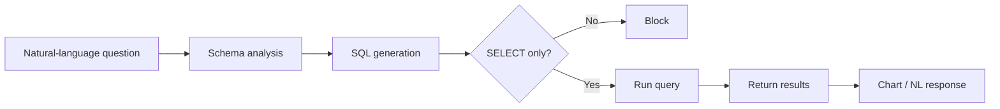
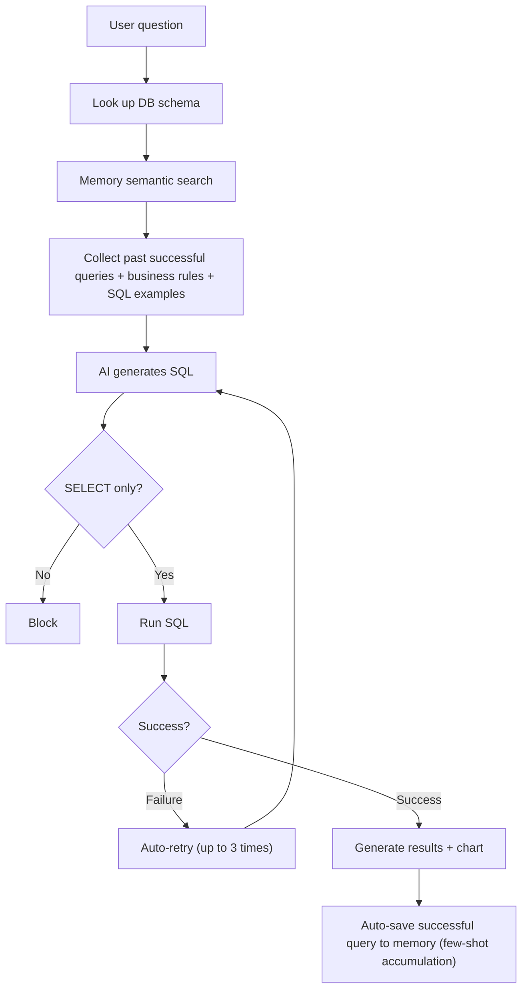

Tired of writing SQL or asking the data team every time you need to analyze internal data?

DbSphere **auto-converts natural language to SQL** to query databases. Ask "show me this month's sales" and the AI generates SQL, executes it, and responds with natural-language summary and charts.

### Example

> "Compare sales by department this quarter"

| Method | Process | Time |
|--------|---------|:----:|
| Write SQL yourself | Write SQL → execute → interpret | 10–30 min |
| Ask the data team | Request → wait → receive | Hours to days |
| DbSphere | Natural-language question → instant answer + chart | **10 sec** |

{/* SCREENSHOT: database-list */}
<Frame caption="View connected DBs in Workspace > Database">
  
</Frame>

---

## NL-to-SQL Pipeline



| Stage | Description |
|-------|-------------|
| **Schema analysis** | The AI analyzes connected table structure and column descriptions |
| **SQL generation** | Converts the natural-language question to SQL in the right DB dialect |
| **Safety check** | Allows only SELECT queries; blocks INSERT, UPDATE, DELETE, etc. |
| **Run query** | Executes validated SQL on the database |
| **NL response** | Converts query results to natural-language text or chart |

---

## Supported Databases

10 databases are supported by default.

| Database | Type | Strengths |
|----------|------|-----------|
| **PostgreSQL** | RDBMS | Advanced features, JSON support, open-source |
| **MySQL** | RDBMS | Most widely used RDBMS |
| **Microsoft SQL Server** | RDBMS | Enterprise environments |
| **Oracle** | RDBMS | Large enterprise |
| **SQLite** | RDBMS | Lightweight embedded database |
| **Snowflake** | Cloud DW | Cloud data warehouse |
| **BigQuery** | Cloud DW | Google Cloud data warehouse, service account key auth |
| **Databricks** | Lakehouse | Databricks SQL Warehouse, Delta Lake integrated |
| **Azure Synapse** | Cloud DW | Azure unified analytics platform |
| **Microsoft Fabric** | Lakehouse / DW | Power BI integrated analytics environment |

<Note>
  All 10 are **enabled by default**. Admins can narrow or expand the visible list with the `DBSPHERE_TYPES` environment variable.
</Note>

---

## Connect a Database

<Steps>
  <Step title="Create a new connection">
    Click **Workspace > Database > "+ New Connection"** and enter basic info.

    {/* SCREENSHOT: database-create */}
    <Frame caption="Enter name, description, and DB type">
      
    </Frame>

    | Field | Description | Example |
    |-------|-------------|---------|
    | **Name** | Connection display name | "Sales Analytics DB" |
    | **Description** | Database purpose | "Sales team revenue data" |
    | **DB type** | Database type | PostgreSQL |
  </Step>

  <Step title="Enter connection info">
    Enter the credentials needed to connect to the database.

    **Common fields:**

    | Field | Description |
    |-------|-------------|
    | **Host** | DB server address |
    | **Port** | Connection port |
    | **Database name** | DB name to connect to |
    | **Username** | DB account |
    | **Password** | DB password |

    <Accordion title="Per-DB additional fields">
      | DB Type | Additional Fields | Description |
      |---------|-------------------|-------------|
      | **Snowflake** | Account, Warehouse, Role, Schema | Snowflake account identifier, warehouse, role, schema |
      | **PostgreSQL** | Schema | Schema name (default: `public`) |
      | **MSSQL** | Schema | Schema name (default: `dbo`) |
      | **SQLite** | Database (file path) | No host/port/auth — only the DB file path |
      | **BigQuery** | Project ID, Dataset, Service Account JSON | GCP project ID, default dataset, service account key (paste JSON). No host/port/username/password |
    </Accordion>
  </Step>

  <Step title="Test connection">
    Click **"Test Connection"** to verify access.
  </Step>

  <Step title="Pick tables">
    After successful connection, select tables the AI will reference.

    {/* SCREENSHOT: database-tables */}
    <Frame caption="Select only tables the AI should access — exclude tables with sensitive data">
      
    </Frame>

    <Warning>
      Always exclude tables containing sensitive info (PII, passwords, etc.). Selected tables are accessible by the AI.
    </Warning>
  </Step>

  <Step title="Add schema descriptions (optional)">
    Add Korean/English descriptions for tables and columns. The more detailed, the more accurate SQL the AI generates.

    {/* SCREENSHOT: database-schema-desc */}
    <Frame caption="Adding business descriptions to tables and columns greatly improves SQL generation accuracy">
      
    </Frame>

    <Tip>
      Use **AI auto-extraction** to let the LLM auto-generate table structures, column descriptions, and sample Q&A. You don't have to write them manually, but reviewing and correcting auto-generated results improves accuracy further.
    </Tip>

    <Accordion title="Example schema description">
      ```
      Table: orders
      Description: Order history table
      Columns:
      - order_id: Unique order number
      - customer_id: Customer ID (references customers table)
      - order_date: Order timestamp
      - total_amount: Total order amount (KRW)
      - status: Order status (pending/confirmed/shipped/delivered)
      ```
    </Accordion>
  </Step>

  <Step title="Set tool description (optional)">
    Write a tool description that tells the agent when and how to use this database.

    **AI auto-generation:** Click the auto-generate button next to the tool description field — the AI drafts it based on connected table structure and column info.

    <Accordion title="Example tool description">
      ```
      This database holds the sales team's order, customer, and inventory info.
      Use for revenue analysis, customer lookup, inventory checks, and similar.
      JOIN the orders table with the customers table
      to get per-customer purchase history.
      ```
    </Accordion>

    <Tip>
      The more accurate the tool description, the more accurately the agent picks the right database among many.
    </Tip>
  </Step>

  <Step title="Set access permissions">
    Set who can use the database.

    | Option | Description |
    |--------|-------------|
    | **Public** | Available to all users |
    | **Private** | Available only to you |
    | **Group/Organization** | Available only to specified groups or organizations |
  </Step>
</Steps>

---

## How the AI Generates SQL

When you connect a DB to an agent, user questions go through this process to become SQL.



<Note>
  Successful queries auto-accumulate in memory. The more you use it, the more accurate SQL the AI generates for similar questions.
</Note>

---

## Memory System

DbSphere uses 4 types of memory to improve SQL generation accuracy. The more memory, the more accurate the AI's queries.

| Memory | Badge | Content | Creation |
|--------|:-----:|---------|----------|
| **DDL Schema** | DDL | Table structure + column descriptions | Auto on schema extraction |
| **SQL Memory** | SQL | Question-SQL pairs (past successful queries) | **Auto-accumulated** on query success |
| **Documentation** | DOC | Business terms, rules, context | Manual entry |
| **SQL Example** | EX | Reference SQL examples (use case, tags) | Manual entry or auto on extraction |

{/* SCREENSHOT: database-memory */}
<Frame caption="Manage 4 memory types in the Memory tab">
  
</Frame>

### SQL Memory is Key

SQL Memory is a few-shot learning memory where **successful queries are auto-saved**.

| Use Count | SQL Memory | AI Behavior |
|:---------:|:----------:|-------------|
| First | 0 | Guess SQL from schema only |
| 5 | 5 | Generate referencing similar past queries |
| 50+ | 50+ | Generate accurate SQL using validated patterns |

### Documentation Use

Tell the AI about business rules it doesn't know via Documentation.

| Type | Example |
|------|---------|
| **Term** | "MRR is the abbreviation for Monthly Recurring Revenue, stored in the monthly_revenue column" |
| **Rule** | "When aggregating revenue, orders with status='cancelled' must be excluded" |
| **Context** | "Customer tiers are 4 levels: S/A/B/C, with S being the highest" |

<Tip>
  When the AI repeatedly generates wrong SQL with a recurring pattern, **add the rule to Documentation**. The AI references it from the next question onward.
</Tip>

---

## Data Visualization

Based on SQL execution results, the AI auto-generates appropriate charts.

| Chart Type | Suitable Data |
|------------|---------------|
| **Bar** | Comparison by category |
| **Line** | Time-series trend |
| **Pie** | Ratio / composition |
| **Scatter** | Correlation |
| **Heatmap** | Cross analysis |
| **Histogram** | Distribution |
| **Grouped bar** | Multi-dimensional comparison |
| **Table** | Detailed data |

If you don't specify a chart type, **Auto mode** picks the optimal chart based on data structure.

---

## Querying Databases

### Connect to an Agent

1. In the agent edit screen, click **"+ Add"** in the "Database" section
2. Pick the database to connect
3. Save

### Use in Chat

When you chat with an agent that has databases connected, the AI analyzes the question and auto-generates and runs SQL.

```
User: What's the revenue growth rate this quarter vs. last?

AI: Quarterly revenue analysis:

| Quarter | Revenue | QoQ |
|---------|---------|-----|
| Q4 2024 | ₩1.25B | - |
| Q1 2025 | ₩1.42B | +13.6% |

This quarter's revenue grew 13.6% QoQ.
Key drivers: new customer acquisition (+23%), repeat-buyer rate up (+8%)
```

### Example Questions

<Tabs>
  <Tab title="Revenue Analysis">
    ```
    - What's this month's revenue?
    - Show daily revenue trend last week
    - List the top 10 customers by revenue
    - What's the share of revenue by product category?
    ```
  </Tab>
  <Tab title="Customer Analysis">
    ```
    - How many new sign-ups this month?
    - Show me the VIP customer list
    - Which customers haven't purchased in the last 3 months?
    - Distribution of customers by region
    ```
  </Tab>
  <Tab title="Inventory">
    ```
    - List products with inventory below 10
    - What products are arriving this week?
    - Top 5 products with low inventory turnover
    ```
  </Tab>
  <Tab title="HR">
    ```
    - Show headcount by department
    - How many joined/left this month?
    - What's the average tenure?
    ```
  </Tab>
</Tabs>

### Reviewing SQL Execution Results

A **"SQL Query" button** appears below the AI response. Click to see the actual SQL run and detailed results.

| Feature | Description |
|---------|-------------|
| **View SQL** | Show the executed SQL with formatting (uppercase keywords, indentation) |
| **Copy SQL** | Copy SQL to clipboard — useful when re-running in a separate query tool |
| **Result table** | View query results as a table |
| **CSV download** | Save results as a CSV file |

<Note>
  Result data is shown up to **100 rows**. When the total exceeds 100, "Showing 100 of N rows" notice appears. Download CSV for the complete data.
</Note>

---

## DB Dialect Differences

Each DB has slightly different SQL syntax. Cloosphere **dynamically injects per-DB dialect rules into the system prompt** when converting natural language to SQL, guiding the AI to produce correct SQL. Still, expressing intent clearly produces more accurate SQL.

### Key Differences

| Item | PostgreSQL | MySQL | Oracle | MSSQL/Synapse/Fabric | SQLite | Snowflake | BigQuery | Databricks |
|------|:----------:|:-----:|:------:|:--------------------:|:------:|:---------:|:--------:|:----------:|
| **Identifier quoting** | `"name"` | `` `name` `` | `"NAME"` | `[name]` | `"name"` | `"NAME"` | `` `name` `` | `` `name` `` |
| **LIMIT expression** | `LIMIT n` | `LIMIT n` | `FETCH FIRST n ROWS ONLY` | `TOP n` | `LIMIT n` | `LIMIT n` | `LIMIT n` | `LIMIT n` |
| **Date literal** | `'2026-04-26'` | `'2026-04-26'` | `TO_DATE('2026-04-26', 'YYYY-MM-DD')` | `'2026-04-26'` | `'2026-04-26'` | `'2026-04-26'` | `DATE '2026-04-26'` | `'2026-04-26'` |
| **Date format function** | `TO_CHAR()` | `DATE_FORMAT()` | `TO_CHAR()` | `FORMAT()` | `strftime()` | `TO_CHAR()` | `FORMAT_DATE()` | `date_format()` |
| **Date arithmetic** | `+ INTERVAL '1 day'` | `DATE_ADD(d, INTERVAL 1 DAY)` | `+ 1` (direct) | `DATEADD(day, 1, d)` | `date(d, '+1 day')` | `DATEADD(day, 1, d)` | `DATE_ADD(d, INTERVAL 1 DAY)` | `date_add(d, 1)` |
| **String concat** | `\|\|` | `CONCAT()` | `\|\|` | `+` | `\|\|` | `\|\|` | `CONCAT()` | `\|\|` |
| **Empty string = NULL** | ✗ | ✗ | **✓ ⚠️** | ✗ | ✗ | ✗ | ✗ | ✗ |
| **Case-sensitive identifiers** | When quoted ✓ | Default ✗ | Uppercase by default | Default ✗ | When quoted ✓ | When quoted ✓ | Default ✗ | When quoted ✓ |

### System Auto-Correction vs. User Responsibility

**Handled automatically:**
- Dashboard period filter (`$st`/`$ed` placeholders): auto-converted to per-DB date literals
- Identifier quoting during Knowledge Graph value extraction: auto-selects per-DB quotes
- Per-DB dialect rules dynamically injected into the AI's system prompt (LIMIT, date, identifiers, etc.)

**User/AI responsibility:**
- When you write Korean/special-char column names directly in natural-language queries — the AI may miss quotes and fail
- Oracle empty-string comparisons (see Oracle quirks below)
- Complex window functions and CTEs vary by DB — verify AI output

---

## Oracle DB Quirks

Oracle has some behaviors that differ from ANSI SQL — worth knowing.

<AccordionGroup>
  <Accordion title="Empty strings are treated as NULL ⚠️" icon="circle-exclamation">
    Oracle treats `''` (empty string) the same as `NULL`. So conditions like the following **always return 0 rows**:

    ```sql
    -- ❌ All wrong patterns (Oracle)
    WHERE col <> ''
    WHERE col = ''
    WHERE TRIM(col) <> ''
    ```

    **Correct usage:**

    ```sql
    -- ✅ Use NULL checks instead
    WHERE col IS NOT NULL
    WHERE TRIM(col) IS NOT NULL
    ```

    Cloosphere's system prompt includes this rule, and the AI auto-avoids it. Still, when natural-language queries use ambiguous phrasing like **"non-empty items"** and 0 rows are returned, suspect this pattern.
  </Accordion>

  <Accordion title="Date literals must use TO_DATE()" icon="calendar">
    Unlike other DBs, Oracle doesn't auto-cast strings to dates.

    ```sql
    -- ❌ Fails on Oracle
    WHERE created_at >= '2026-04-01'

    -- ✅ Oracle recommended
    WHERE created_at >= TO_DATE('2026-04-01', 'YYYY-MM-DD')
    ```

    BI dashboard period filters (`$st`/`$ed`) auto-substitute as `TO_DATE(...)` when using Oracle. But you must specify it yourself when writing SQL directly in the SQL result screen.
  </Accordion>

  <Accordion title="Date arithmetic uses direct ± instead of INTERVAL" icon="plus-minus">
    ```sql
    -- ❌ Oracle doesn't support INTERVAL '1 day'
    WHERE created_at >= SYSDATE - INTERVAL '1 day'

    -- ✅ Oracle recommended
    WHERE created_at >= SYSDATE - 1
    ```

    Use `TRUNC(col, 'DD')` instead of `DATE_TRUNC()`, and `TO_CHAR(col, 'D')` instead of `EXTRACT(DOW FROM col)` for day-of-week.
  </Accordion>

  <Accordion title="Quoting Korean/special-char column names" icon="quote-left">
    In Oracle, using a Korean column alias (`AS 공장코드`) directly causes `ORA-00936: missing expression`.

    ```sql
    -- ❌ Fails on Oracle
    SELECT plant_code AS 공장코드 FROM plants

    -- ✅ Oracle recommended
    SELECT plant_code AS "공장코드" FROM plants
    ```

    The system prompt includes this rule and the AI auto-applies quotes — but in environments with many Korean columns, verify the result and fix manually if needed.
  </Accordion>

  <Accordion title="Use FETCH FIRST instead of LIMIT" icon="arrow-down-1-9">
    ```sql
    -- ❌ Oracle 12c minimum, or wrong usage
    SELECT * FROM users LIMIT 10

    -- ✅ Oracle 12c+
    SELECT * FROM users FETCH FIRST 10 ROWS ONLY

    -- ✅ Oracle 11g compatible (subquery)
    SELECT * FROM (SELECT * FROM users) WHERE ROWNUM <= 10
    ```
  </Accordion>
</AccordionGroup>

---

## Security

### Read-only

DbSphere only executes **SELECT queries**. Data modification is not possible.

| Allowed | Blocked |
|---------|---------|
| SELECT | INSERT, UPDATE, DELETE |
| Aggregate functions (COUNT, SUM, AVG) | DROP, ALTER, TRUNCATE |
| JOIN, subqueries | CREATE, GRANT |

### Credential Protection

- DB passwords are stored encrypted
- Connection info is only viewable by users with access permission

---

## Best Practices

### Database Account Setup

1. **Create a dedicated account**: Make a read-only account just for AI use
2. **Grant least privilege**: Grant SELECT permission only on needed tables
3. **Set query limits**: Configure timeout and result row limits

### Table Selection

1. **Pick only what's needed**: Connecting all tables can confuse the AI
2. **Exclude sensitive data**: Always exclude tables with PII or passwords
3. **Pick related tables together**: Pick tables that need to JOIN together

### Schema Description Writing

1. **Korean descriptions encouraged**: Describe tables and columns using business terminology
2. **Add business context**: Document possible values and meanings of "status" columns
3. **State relationships explicitly**: Describe foreign-key relationships and JOIN conditions

---

## Troubleshooting

<AccordionGroup>
  <Accordion title="Connection test fails" icon="triangle-exclamation">
    | Cause | Solution |
    |-------|----------|
    | Network issue | Check firewall rules, VPN connection |
    | Auth failure | Re-verify account, password, permissions |
    | Port blocked | Verify the DB port is open |
    | SSL config | Check SSL certificate requirements |
  </Accordion>

  <Accordion title="The AI generates wrong SQL" icon="triangle-exclamation">
    | Cause | Solution |
    |-------|----------|
    | Insufficient schema description | Add detailed descriptions for tables and columns |
    | Business rules not reflected | Add rules to **Documentation memory** |
    | Related tables missing | Pick tables that need JOIN together |
    | Ambiguous question | Include specific conditions (date range, filters) in the question |
    | No past reference queries | Add correct query examples to **SQL Example memory** |
  </Accordion>

  <Accordion title="Slow responses" icon="triangle-exclamation">
    | Cause | Solution |
    |-------|----------|
    | Large data volume | Add conditions like date range to the question |
    | Complex query | Simplify the question or break into multiple |
    | DB performance | Optimize indexes, check DB resources |
  </Accordion>
</AccordionGroup>

---

## FAQ

<AccordionGroup>
  <Accordion title="Can the data be modified?" icon="circle-question">
    No — DbSphere is read-only. Only SELECT queries are executed; data can't be modified or deleted. Any SQL not starting with `SELECT` is blocked immediately.
  </Accordion>

  <Accordion title="Can I see the executed SQL?" icon="circle-question">
    Yes — the AI response shows the generated SQL. You can also see the executed SQL and results in detail under Tracing.
  </Accordion>

  <Accordion title="Can I JOIN multiple tables?" icon="circle-question">
    Yes — pick all related tables and describe inter-table relationships in the schema description. The AI will generate appropriate JOIN queries.
  </Accordion>

  <Accordion title="Can one agent connect multiple databases?" icon="circle-question">
    Yes — when multiple databases are connected to an agent, the AI auto-picks the right one based on the question. Writing detailed **tool descriptions** for each DB improves selection accuracy.
  </Accordion>

  <Accordion title="What's different when picking a model during schema extraction?" icon="circle-question">
    With a model, the LLM **auto-generates business descriptions** for tables/columns and **sample Q&A pairs**. Without a model, only DDL structure is stored. Picking a model is recommended.
  </Accordion>
</AccordionGroup>

---

## Related Pages

<Columns cols={3}>
  <Card title="Agents" icon="robot" href="/en/workspace/agents">
    Connect a DB to an agent to enable natural-language queries
  </Card>
  <Card title="Glossary" icon="book" href="/en/workspace/glossary">
    Tell the AI about DB business terminology to improve accuracy
  </Card>
  <Card title="Tracing" icon="chart-line" href="/en/monitoring/tracing">
    Track the SQL generation and execution process step by step
  </Card>
</Columns>
