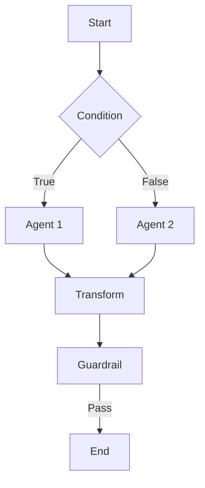
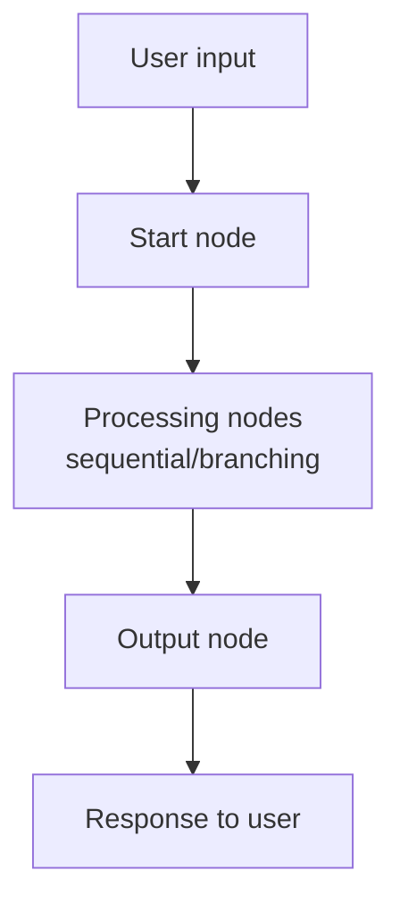

Agent Flow lets you build complex AI pipelines by visually connecting multiple agents, models, tools, and Knowledge Bases.
Similar to n8n or Dify, it's a **visual workflow builder** — orchestrate multi-agent pipelines via drag and drop.



<Warning>
  Agent Flow is only available when **developer mode (`developer_mode`)** is enabled and the **`agent_flow` license** is granted.
  Enable developer mode in admin settings and verify the license condition.
</Warning>

---

## Flow vs. Single Agent

| Aspect | Single Agent | Agent Flow |
|--------|-------------|------------|
| **Complexity** | Simple Q&A | Multi-step pipeline |
| **Agent connections** | Standalone | Data passed between agents |
| **Conditional branching** | Not possible | Branch via Condition / Router nodes |
| **Data transformation** | Not possible | Extract Field / Format Text transforms |
| **Safety validation** | Per agent | Validate within the flow via Guardrail node |
| **Reusability** | Individual calls | Nest pipelines via Subflow |

<Tip>
  A single agent suffices for simple Q&A or RAG search.
  Use a Flow when you need to chain or branch across multiple agents.
</Tip>

---

## Flow List

In **Workspace > Flow**, view all created flows.

<Frame caption="Flow list">
  
</Frame>

Each flow card shows:

| Element | Description |
|---------|-------------|
| **Name** | Flow identifier name |
| **Description** | Purpose of the flow |
| **Active / Inactive badge** | Flow active/inactive state |
| **Node count** | Number of nodes in the flow |
| **Author** | Shown as "By {{name}}" |
| **Modified** | Last modified time (relative) |

---

## Creating a Flow

<Steps>
  <Step title="Create a new flow">
    In **Workspace > Flow**, click the **"+"** button (aria-label: "Create Flow") at the top-right.

    

    | Field | Description | Example |
    |-------|-------------|---------|
    | **Flow ID** | Lowercase letters, digits, hyphen, underscore (2–50 chars) | `doc-analysis`, `3step-review` |
    | **Name** | Flow display name | "Document Analysis Flow" |
    | **Description** | Purpose of the flow | "Summarizes documents and extracts key points" |

    <Warning>
      Flow ID cannot be changed after creation. Must start with a lowercase letter or digit, using only lowercase letters/digits/hyphen/underscore (regex: `^[a-z0-9][a-z0-9_-]*$`).
    </Warning>
  </Step>

  <Step title="Place nodes">
    From the **Nodes** panel on the left, drag desired nodes onto the canvas.
    Every flow must contain a **Start** node and an **End** node.

    
  </Step>

  <Step title="Connect nodes">
    Drag from a node's **output handle** (bottom dot) to the next node's **input handle** (top dot).
    Data flows top to bottom.

    <Note>
      Handle positions: **top** = input, **bottom** = output.
      Branching nodes like Guardrail and Condition have multiple output handles at the bottom.
    </Note>
  </Step>

  <Step title="Configure nodes">
    Click a node to open the **settings panel** on the right.
    For an Agent node, pick the agent to run; for a Model node, set the LLM model and system/user prompts.

    
  </Step>

  <Step title="Validate and save">
    The top toolbar has **Validate** and **Save** as separate buttons.

    - **Validate**: Checks for missing Start/End nodes, disconnected nodes, cyclic references, etc.
    - **Save**: Saves the current flow. This is a separate action and doesn't auto-validate.
  </Step>
</Steps>

---

## Build with AI

Click the **"AI Assistant" button** (purple lightning icon) at the bottom of the flow editor to open the conversational AI builder. Describe the flow you want in natural language, and the AI auto-generates nodes and connections.

{/* TODO: screenshot — AI Assistant panel open */}

### Conversational Build Flow

The AI builder doesn't generate immediately — it **asks about key decisions first**:

<Steps>
  <Step title="Describe your intent">
    Describe the flow, e.g., "Make a flow that classifies customer inquiries by department".
  </Step>
  <Step title="Answer the AI's questions">
    The AI asks about guardrail use, routing approach, detail options, etc., as **buttons**. Click the option you want.

    Examples:
    - "Use a guardrail?" → **[Privacy]** **[Banned Words]** **[None]**
    - "Which routing approach?" → **[Router]** **[Condition]** **[Direct]**
  </Step>
  <Step title="Auto-generation">
    Once enough info is gathered, the AI generates and places nodes and edges on the canvas.
  </Step>
</Steps>

<Tip>
  Asking specifically up front skips the questions. Example: "Build a flow with a PII guardrail → sentiment-analysis router → branch to positive/negative agents"
</Tip>

### AI Builder Features

- **Conversation history retained**: Conversation logs are stored on the flow so you can resume editing later
- **Edit existing flows**: Opening AI on an existing flow recognizes the current structure and suggests edits
- **Real-time canvas updates**: AI-generated nodes appear on the canvas immediately
- **Resizable panel**: Drag the top handle to adjust panel size

---

## Node Types

Agent Flow provides 10 node types in 4 categories that you can drag from the Node Palette.

| Category | Nodes |
|----------|-------|
| **General** | Start, Output |
| **AI** | Agent, Model |
| **Logic & Data** | Condition, Router, Merge, Transform |
| **Workspace** | Guardrail, Glossary |

<Tip>
  See the [Node Reference](/en/workspace/flows-nodes) for detailed settings of each node.
</Tip>

---

## Running a Flow

### Run from Chat

1. Start a new chat
2. In the model selector, the connection-type filter shows **Flow**. Pick that.
3. Select the flow you want and enter a message

<Note>
  Flows appear in the model selector as a **connection-type filter**, not as a separate tab.
</Note>

### Execution Flow



During execution, each node's status is shown in real time.

| State | Description |
|-------|-------------|
| **Running** | Node currently being processed |
| **Completed** | Node has finished |
| **Sources** | When using KBSphere, the retrieved document sources |

---

## Validation

Items checked by the **Validate** button in the top toolbar:

| Check | Type | Description |
|-------|------|-------------|
| Missing Start node | Error | At least 1 Start node required |
| Missing Output node | Error | At least 1 Output node required |
| Resource not selected | Error | Agent/Model/Guardrail/Subflow nodes have no resource specified |
| Cyclic reference | Error | Cycles between nodes detected (infinite loop risk) |
| Disconnected nodes | Warning | Nodes not connected to anything |

---

## AI Auto-build Builder

Build flows by chatting in natural language with the **AI chat panel** at the bottom of the flow editor. Instead of placing nodes one by one, just describe the workflow you want.

{/* SCREENSHOT: AI chat panel
<Frame caption="AI flow builder chat">
  
</Frame>
*/}

### How to Use

<Steps>
  <Step title="Open the chat panel">
    In the AI chat area at the bottom of the flow editor, **select a model**.
  </Step>
  <Step title="Describe the workflow in natural language">
    Type the flow you want.

    Examples:
    - "Classify customer inquiries, then route technical questions to the tech agent and general questions to the CS agent"
    - "Validate input with a guardrail; if it passes, run Agent A → Agent B in order"
    - "Run 3 agents in parallel and merge the results"
  </Step>
  <Step title="Review the AI's response">
    The AI generates the flow structure and applies it to the editor automatically. The AI may ask follow-up questions; click button choices when shown.
  </Step>
  <Step title="Iterate">
    Continue the conversation to add, change, or delete nodes.
    - "Replace the Router node with a Condition"
    - "Insert Agent C in the middle"
    - "Remove the guardrail node"
  </Step>
</Steps>

<Info>
  The AI builder is only available to users with **flow write permission**. Conversation history is saved on the flow so you can resume editing.
</Info>

### One-shot Generation vs. Conversational Edit

| Mode | Description | When to Use |
|------|-------------|-------------|
| **One-shot generation** | Generate the entire flow from a one-sentence description | Building a new flow from scratch |
| **Conversational edit** | Add/change/delete panels gradually through multi-turn conversation | Improving an existing flow |

<Tip>
  AI-generated flows can be modified manually. It's effective to use the AI builder to scaffold the structure and then tune detailed settings per node.
</Tip>

---

## Export / Import

Export and import are done from the **flow editor (FlowEditor) top toolbar**.

<Tabs>
  <Tab title="Export">
    Click **Export** in the top toolbar of the flow editor to download as JSON.
    The export includes flow name, description, node configuration, and connection info.
  </Tab>
  <Tab title="Import">
    Click **Import** in the top toolbar and upload an exported JSON file.
    Only JSON files of `type: "agent_flow"` are allowed for import.

    <Note>The agents, models, and guardrails referenced by the imported flow must exist in the current environment for it to run correctly.</Note>
  </Tab>
</Tabs>

---

## Use Cases

<Accordion title="Example 1: Document Analysis Flow">
  ```
  [Start] → [Agent: Document Summary] → [Agent: Key Extraction] → [End]
  ```
  The summary agent processes user input, then the key extraction agent organizes the main points from the summary.
</Accordion>

<Accordion title="Example 2: Conditional Customer Support">
  ```
                       ┌─ True ─→ [Agent: Tech Support] ─┐
  [Start] → [Condition] ──────────────────────────────→ [End]
                       └─ False → [Agent: General] ─────┘

  State Key: input
  Condition Type: Contains
  Value: "error"
  ```
  If the user input contains "error", route to the tech-support agent; otherwise, route to the general agent.
</Accordion>

<Accordion title="Example 3: Data Report Flow">
  ```
  [Start] → [Agent: DBSphere] → [Transform: Format Text] → [Model: Report Generation] → [End]
  ```
  The DBSphere agent queries data, the Transform node formats the result with Format Text, and the Model node writes the final report.
</Accordion>

<Accordion title="Example 4: Guardrail-Applied Flow">
  ```
                                          ┌─ Pass → [Agent: Q&A] → [End]
  [Start] → [Guardrail: PII Check] ─┤
                                          └─ Block → [Transform: Error Message] → [End (Error)]
  ```
  Block input containing PII; only safe input goes to the agent.
  When Block Action is set to `Continue`, the block info can be processed by the Transform node and shown to the user.
</Accordion>

---

## Access Control

Flows have the same access control as other workspace resources.

| Option | Description |
|--------|-------------|
| **Public** | Available to all users |
| **Private** | Available only to the creator |
| **Group** | Read/write access granted to specific groups |

---

## FAQ

<Accordion title="The Flow menu doesn't appear">
  Agent Flow appears in Workspace only when both conditions are met:
  1. **Developer mode** (`developer_mode`) is enabled
  2. The **`agent_flow` license** is granted

  Ask your admin to verify the settings.
</Accordion>

<Accordion title="Which agents can be used in a flow?">
  All agents registered in the workspace.
  General mode, KBSphere (enhanced RAG), and DBSphere (database) modes are all supported.
</Accordion>

<Accordion title="What happens if an error occurs during flow execution?">
  Execution stops at the failing node and an error message is shown.
  Use an Error Handler node to provide an alternate path on errors.
  Check node settings (resource selection, parameters) and try again.
</Accordion>

<Accordion title="Can I connect multiple agents in one flow?">
  Yes — connect agents sequentially, or branch with Condition/Router nodes.
  Each agent's output is automatically passed as input to the next.
</Accordion>

<Accordion title="What's the execution order in a flow?">
  Starts at the Start node and follows connected nodes in order.
  Condition nodes branch based on the evaluation result (True or False),
  Router nodes branch to the matching Route,
  and Aggregator nodes merge multiple parallel paths.
</Accordion>

<Accordion title="How do I move a flow to another environment?">
  Use the Export button in the top toolbar to download the JSON, then Import it in the target environment's editor.
  Referenced agents, models, and guardrails must exist in the target environment.
</Accordion>

---

## Next Steps

<Columns cols={2}>
  <Card title="Build Agents" icon="robot" href="/en/workspace/agents">
    Configure the agents your flow will use
  </Card>
  <Card title="Configure Guardrails" icon="shield" href="/en/workspace/guardrails">
    Set up filters for safer responses inside the flow
  </Card>
</Columns>
