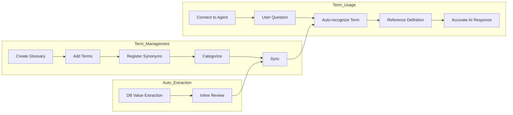
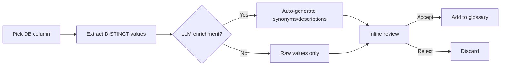

The Glossary feature systematically manages **domain-specific terms, abbreviations, and business rules** used within your organization.
It enables AI to accurately understand company-specific terminology and provide consistent answers.



---

## What is a Glossary?

A glossary stores domain-specific terms and their definitions, and the system references them automatically during AI conversations.

{/* SCREENSHOT: glossary-detail */}
<Frame caption="Add terms on the left and manage registered terms on the right">
  
</Frame>

### Why You Need a Glossary

| Problem | After Using a Glossary |
|---------|------------------------|
| "What's MRR?" → AI doesn't know | "MRR is Monthly Recurring Revenue" |
| Different teams use different terms | Standardized terms and definitions |
| New employee onboarding is hard | Instant term lookup |
| Inconsistent AI answers | Consistent answers based on defined terms |

### Key Features

| Feature | Description |
|---------|-------------|
| **Term definition** | Clear definitions and usage examples |
| **Synonym support** | Multiple expressions linked to a single term |
| **Category classification** | Group terms by domain for organized management |
| **DB value extraction** | Auto-convert DB column values into terms |
| **Auto search** | AI auto-references related terms when asked |
| **Search engine sync** | Index terms in the search engine for fast lookup |

---

## Glossary List

In **Workspace > Glossary**, view all glossaries. The list shows name, description, author, and modified date.

<Frame caption="View all glossaries in Workspace > Glossary">
  
</Frame>

---

## Creating a Glossary

<Steps>
  <Step title="Create a new glossary">
    In **Workspace > Glossary**, click the **+** button at the top-right.

    <Frame caption="Enter name and description">
      
    </Frame>

    | Field | Description | Example |
    |-------|-------------|---------|
    | **Name** | Glossary name | "Marketing Glossary" |
    | **Description** | Glossary description | "Marketing team terminology and KPI definitions" |
  </Step>

  <Step title="Set access permissions">
    Set the sharing scope for the glossary.

    | Option | Description |
    |--------|-------------|
    | **Public** | Available to all users |
    | **Private** | Available only to selected groups or organizational units. If unspecified, only the creator can access |
  </Step>

  <Step title="Save">
    Click **Save** to create the glossary.
  </Step>
</Steps>

---

## Adding Terms

### Adding a Single Term

In the left panel of the glossary detail page, enter term info and click **"Add"**.

| Field | Description | Example |
|-------|-------------|---------|
| **Term** | Term to define | MRR |
| **Synonyms** | Other expressions (comma-separated) | Monthly Recurring Revenue |
| **Description** | Term description | Recurring subscription revenue generated each month |
| **Example** | Real usage example | "This month's MRR is ₩1B" |
| **Category** | Group the term (optional) | Revenue Metrics |

<Tip>
  When entering a category, existing categories appear as tag chips. Click to select one, or type a new category name directly.
</Tip>

### Example of a Good Description

```markdown
## MRR (Monthly Recurring Revenue)

### Description
Refers to the recurring subscription-based revenue generated each month.
Net recurring revenue reflecting new contracts, upgrades, downgrades, and churn.

### Calculation
MRR = Monthly subscription fee x Active subscribers

### Related Metrics
- ARR (Annual Recurring Revenue) = MRR x 12
- Net MRR = New MRR + Expansion MRR - Contraction MRR - Churn MRR

### Examples
- "MRR grew 5% MoM this month"
- "MRR increased ₩200M from new customer acquisition"
```

<Tip>
  Keep the description to 1-2 sentences for the core, and include examples and related terms so the AI references it more accurately.
</Tip>

### Bulk Import

Import multiple terms at once via a JSON file.

<Frame caption="Import multiple terms at once via JSON">
  
</Frame>

```json
[
  {
    "term": "MRR",
    "synonyms": ["Monthly Recurring Revenue"],
    "description": "Recurring subscription revenue generated each month",
    "example": "This month's MRR is ₩1B"
  },
  {
    "term": "CAC",
    "synonyms": ["Customer Acquisition Cost"],
    "description": "Cost of acquiring a new customer",
    "example": "Marketing optimization reduced CAC by 20%"
  }
]
```

<Note>
  Re-importing an existing term (by name, case-insensitive) updates the existing term. No duplicates are created.
</Note>

---

## Term Management

### Search and Filter

- **Search**: Search by term, synonym, or description content in the search bar
- **Category filter**: Click category chips at the top to show terms by category — "All" / "Uncategorized" / per-category filter
- **Sort**: By name (default), newest, oldest
- The term list uses **infinite scroll** (50 entries at a time)

### Edit and Delete

Click a term to edit its content or delete it. Scroll position is preserved during edit/delete, and changes auto-sync with the search index.

### Export

Export all terms as a JSON file. Use for backup, team sharing, or migration to another environment.

### Sync and Reindex

Adding/editing/deleting terms **auto-syncs** to the search index.

If the search index becomes broken, **manual reindex** is possible:
- Click the **kebab menu (⋮) → Reindex** on the glossary card in the list
- Re-pushes all terms to the search engine

<Note>
  Sync only works when a search engine is configured. Without a search engine, sync is ignored.
</Note>

---

## Category Management

Categories let you systematically classify terms by domain.

### Category Management Screen

Click the **gear icon** to the right of the category filter on the detail page to open the category management modal.

{/* TODO: screenshot — category management modal */}


| Action | Method |
|:-------|:-------|
| **Rename** | Hover over category → pencil icon → edit inline → Enter or Save |
| **Delete** | Hover over category → delete icon |

<Warning>
  Deleting a category also deletes **all terms in that category**. Confirm carefully before deleting.
</Warning>

### Categories and the Knowledge Graph

When **extraction sources** are configured for a category, Knowledge Graph sync auto-generates `maps_to` edges from the category to DB columns. This lets the agent map business terms to actual data columns.

---

## DB Value Extraction

This feature auto-converts distinct DB column values into glossary terms. Instead of manually entering hundreds or thousands of data values, build the glossary quickly by extracting directly from the DB.

### Extraction Flow



### Run Extraction

<Steps>
  <Step title="Start extraction">
    Click **"Extract from database"** at the top-right of the glossary detail page
  </Step>
  <Step title="Configure extraction">
    | Field | Description | Required |
    |:------|:------------|:--------:|
    | **Database** | DbSphere connection to extract from | O |
    | **Table** | Target table | O |
    | **Term column** | Column to extract DISTINCT values from | O |
    | **Category** | Category to assign to extracted terms | O |
    | **Synonym column** | Column to read as synonyms | X |
    | **Description column** | Column to read as descriptions | X |
    | **Reference columns** | Additional columns to pass as LLM context | X |

    <Info>
      Category is **required**. It must be specified to track extraction sources and auto-generate mapping edges in the Knowledge Graph.
    </Info>
  </Step>
  <Step title="LLM enrichment settings (optional)">
    Toggle on **LLM enrichment** to auto-generate synonyms, descriptions, and examples for each value.

    | Option | Description |
    |:-------|:------------|
    | Synonyms | Auto-generate synonyms |
    | Description | Auto-generate descriptions |
    | Example | Auto-generate examples |
    | Model | LLM model to use |
    | Batch size | Items processed per batch (default 10) |

    Checking each item (Synonyms / Description / Example) reveals **per-item instruction fields**. Provide different domain/tone/length guidance per item.

    <Tip>
      Examples:
      - **Synonyms instruction**: "Prioritize internal abbreviations and English acronyms"
      - **Description instruction**: "One sentence, understandable by non-technical readers"
      - **Example instruction**: "Format usable in finance team reports"

      If empty, the system default prompt is used (same as before).
    </Tip>

    <Note>
      If you've specified synonym/description columns from the DB, LLM generation for those items is auto-disabled.
    </Note>
  </Step>
  <Step title="Run">
    Click **"Extract"** → Confirm the count of values found → Click **OK**

    Extraction runs in the background with a progress banner at the top. Identical terms already in the glossary are auto-skipped.
  </Step>
</Steps>

### Inline Review

Once extraction completes, new term candidates appear at the top of the list with a **green background + "NEW" badge**.

{/* TODO: screenshot — inline review screen */}


**Review methods:**

| Method | Description |
|:-------|:------------|
| **Per-item review** | Click a term → Accept / Edit / Reject |
| **Bulk accept** | Click **"Add all"** in the top banner → accept everything |
| **Bulk reject** | Click **"Exclude all"** in the top banner → discard everything |

<Tip>
  Use the "New" tab filter to view only extracted candidates.
</Tip>

---

## Using a Glossary

### Connect to an Agent

<Steps>
  <Step title="Open the agent edit screen">
    In **Workspace > Agents**, open the target agent's edit screen.
  </Step>
  <Step title="Pick glossaries">
    In the **Glossary** section, choose the glossaries to connect.
    You can connect multiple glossaries to one agent.
  </Step>
  <Step title="Save">
    Save the agent settings.
  </Step>
</Steps>

### Auto-reference in Chat

When you chat with an agent that has glossaries connected, the AI auto-recognizes related terms and references their definitions.

```
User: What's MRR?

AI: MRR (Monthly Recurring Revenue) refers to monthly recurring revenue.

Description:
Recurring subscription-based revenue generated each month.
Net recurring revenue reflecting new contracts, upgrades, downgrades, and churn.

Calculation:
MRR = Monthly subscription fee x Active subscribers

Related Metrics:
- ARR (Annual Recurring Revenue) = MRR x 12
- Net MRR Growth: Net MRR growth rate

[Source: Marketing Glossary]
```

The AI auto-recognizes terms in the conversation without you asking explicitly.

```
User: What's a healthy LTV-to-CAC ratio?

AI: Generally, an LTV/CAC ratio of 3:1 or higher is considered healthy.

Term definitions:
- CAC (Customer Acquisition Cost): Cost of acquiring a customer
- LTV (Customer Lifetime Value): Lifetime value of a customer
```

---

## Glossary Examples

<Tabs>
  <Tab title="Marketing">
    | Term | Synonyms | Description |
    |------|----------|-------------|
    | MRR | Monthly Recurring Revenue | Monthly recurring revenue |
    | CAC | Customer Acquisition Cost | Cost to acquire a new customer |
    | LTV | Customer Lifetime Value, CLV | Value a customer brings over their lifetime |
    | ARPU | Average Revenue Per User | Average revenue per user |
    | Churn Rate | — | Customer churn percentage |
    | NPS | Net Promoter Score | Customer recommendation indicator |
  </Tab>

  <Tab title="IT">
    | Term | Synonyms | Description |
    |------|----------|-------------|
    | API | — | Application Programming Interface |
    | CI/CD | — | Continuous Integration / Continuous Delivery |
    | SLA | Service Level Agreement | Service quality guarantee contract |
    | MSA | Microservices | Microservices Architecture |
    | K8s | Kubernetes | Container orchestration platform |
  </Tab>

  <Tab title="Finance">
    | Term | Synonyms | Description |
    |------|----------|-------------|
    | EBITDA | — | Earnings Before Interest, Taxes, Depreciation, and Amortization |
    | ROI | Return on Investment | Return ratio relative to investment |
    | P&L | Profit and Loss | Statement of revenue and expenses |
    | CAPEX | Capital Expenditure | Capital expenditures |
    | OPEX | Operating Expenses | Operating expenses |
  </Tab>

  <Tab title="HR">
    | Term | Synonyms | Description |
    |------|----------|-------------|
    | OKR | Objectives and Key Results | Goals and key result metrics |
    | KPI | Key Performance Indicator | Key performance indicator |
    | 1:1 | One-on-One | Regular check-in with manager |
    | PIP | Performance Improvement Plan | Performance improvement program |
  </Tab>
</Tabs>

---

## Best Practices

<Accordion title="Writing term descriptions">
  1. **Be concise**: Core explanation in 1–2 sentences
  2. **Include examples**: Add real usage examples
  3. **Link related terms**: Explain related concepts together
  4. **Keep current**: Update immediately when descriptions change
</Accordion>

<Accordion title="Synonym management">
  - Register the various commonly used expressions
  - Include both English and Korean spellings
  - Register both abbreviation and full name
  - Example: MRR, Monthly Recurring Revenue
</Accordion>

<Accordion title="Glossary composition">
  - **Separate by domain**: Run separate glossaries for marketing, IT, finance, HR, etc.
  - **Set access permissions**: Expose only the glossaries each department needs
  - **Periodic review**: Quarterly term updates and cleanup of unused terms
</Accordion>

---

## FAQ

<AccordionGroup>
  <Accordion title="Can the AI understand terminology without a glossary?" icon="circle-question">
    The AI understands common terminology, but may not accurately know company-specific terms (internal project codes, internal metric names) or recent domain-specific terms.
    Use a glossary to provide accurate descriptions to the AI.
  </Accordion>

  <Accordion title="Can I connect multiple glossaries to one agent?" icon="circle-question">
    Yes — connect multiple glossaries to a single agent.
    Connecting a marketing + finance glossary together lets the agent reference terms from both domains.
  </Accordion>

  <Accordion title="What's the difference between a Knowledge Base and a glossary?" icon="circle-question">
    - **Knowledge Base**: Stores entire document content and finds related content via vector search (RAG)
    - **Glossary**: Stores only individual terms and definitions for fast reference

    Use Knowledge Bases for document-based Q&A and glossaries for term reference.
  </Accordion>

  <Accordion title="How many synonyms can I register?" icon="circle-question">
    No limit. The more expressions you register, the better the AI recognizes terms.
  </Accordion>

  <Accordion title="I'm worried about LLM costs for DB value extraction" icon="coins">
    Turn off LLM enrichment to extract only DB values without LLM cost. If synonym/description columns are already in the DB, specifying those columns is the most economical.
  </Accordion>

  <Accordion title="What's the relationship between glossary and Knowledge Graph?" icon="share-nodes">
    The glossary manages **term definitions**, while the Knowledge Graph **connects terms to DB columns and documents**. When extraction sources are configured on a category, the KG auto-generates term-to-column mapping edges.
  </Accordion>
</AccordionGroup>

---

## Next Steps

<Columns cols={3}>
  <Card title="Connect to an Agent" icon="robot" href="/en/workspace/agents">
    Connect a glossary to an agent to improve AI answer quality
  </Card>
  <Card title="Knowledge Graph" icon="share-nodes" href="/en/workspace/knowledge-graph">
    Connect glossary + DB + documents into one unified graph
  </Card>
  <Card title="Database" icon="database" href="/en/workspace/database">
    Connect a database as the source for DB value extraction
  </Card>
</Columns>
