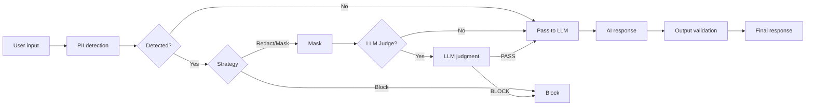
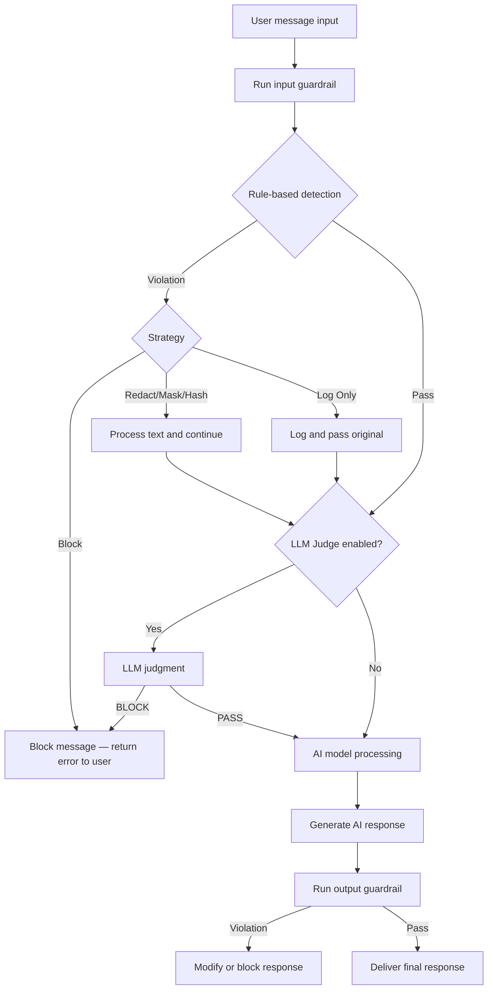
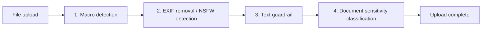

When you ask the AI to "organize the customer email list", there's a real risk of personal information being exposed or leaked. Guardrails **automatically validate AI conversation inputs and outputs** to prevent these risks.

### Example

> "The customer's inquiry email is hong@company.com and the card number is 1234-5678-9012-3456"

| State | Behavior | Result |
|-------|----------|--------|
| No guardrail | AI processes as-is | PII may be included in the response |
| Guardrail applied (masking) | Sensitive info auto-masked | Becomes `h***@***.com`, `****-****-****-3456` |



---

## What is a Guardrail?

A guardrail combines rule-based detection and LLM-based judgment to ensure conversation safety.

{/* SCREENSHOT: guardrails-detail */}
<Frame caption="Guardrails ensure AI conversation safety by combining rule-based detection and LLM judgment">
  
</Frame>

### Key Features

| Feature | Description |
|---------|-------------|
| **PII detection** | Detects PII like email, credit card, IP address, MAC address, URL, API key |
| **Custom patterns** | Detects user-defined patterns via regex (employee ID, document number, etc.) |
| **Banned words** | Filters messages containing specific words/phrases |
| **LLM-based judgment** | Semantic content validation using AI (LLM-as-a-Judge) |

### Use Cases

- **PII protection**: Prevent customer emails, phone numbers, and credit card info from being exposed to the AI
- **Security hardening**: Detect sensitive credentials like API keys, passwords, auth tokens
- **Content filtering**: Block inappropriate expressions or prohibited topics
- **Compliance**: Industry-specific regulations like GDPR, PIPA

---

## Guardrail List

In **Workspace > Guardrails**, view all guardrails.

{/* SCREENSHOT: guardrails-list */}
<Frame caption="View created guardrails in Workspace > Guardrails">
  
</Frame>

| Element | Description |
|---------|-------------|
| **Name** | Guardrail identifier name |
| **Description** | Guardrail purpose |
| **LLM badge** | Indicates LLM-based detection is enabled |
| **Author** | User who created the guardrail |
| **Modified** | Last modified time |

---

## Creating a Guardrail

<Steps>
  <Step title="Enter basic info">
    In **Workspace > Guardrails**, click the **+** button at the top-right.

    {/* SCREENSHOT: guardrails-create */}
    <Frame caption="Enter name and description, and set access permissions">
      
    </Frame>

    | Field | Description | Example |
    |-------|-------------|---------|
    | **Name** | Guardrail name | "Customer Info Protection" |
    | **Description** | Purpose | "Prevent customer PII leakage" |
    | **Visibility** | Access permissions | Private / Shared with team |

    Saving takes you to the guardrail edit screen.
  </Step>

  <Step title="Pick PII detection types">
    Select pre-defined PII types in the edit screen.

    | PII Type | Description | Example |
    |----------|-------------|---------|
    | **Email** | Detect email addresses | `user@example.com` |
    | **Credit card** | Credit card numbers (with Luhn validation) | `1234-5678-9012-3456` |
    | **IP address** | IPv4 address detection | `192.168.1.1` |
    | **MAC address** | MAC address detection | `00:1A:2B:3C:4D:5E` |
    | **URL** | Web address detection | `https://example.com` |
    | **API key** | API key pattern detection | `sk-xxxxxxxx` |
  </Step>

  <Step title="Set the processing strategy">
    Pick how to handle detected sensitive info.

    | Strategy | Description | Example Result |
    |----------|-------------|----------------|
    | **Block** | Block the entire message | "Sensitive info detected — cannot process" |
    | **Redact** | Replace sensitive info with a label | "Contact: `[REDACTED_EMAIL]`" |
    | **Mask** | Show only some characters | "`j***@***.com`", "`****-****-****-1234`" |
    | **Hash** | Convert to a hash value | "Contact: `<email_hash:a1b2c3d4e5f6>`" |
    | **Log Only** | Log without blocking | Original passed through |

    **Recommended strategies by situation:**

    | Situation | Recommended | Reason |
    |-----------|-------------|--------|
    | Initial deployment / testing | Log Only | Identify false positives, then adjust |
    | Customer-facing service | Mask or Block | Prevent PII exposure at the source |
    | Internal analysis tool | Hash | Keep identifiers without originals (stats possible) |
    | Compliance required | Block | Prevent processing of sensitive info entirely |
    | Standard business | Redact | Preserve flow + protect info |
  </Step>

  <Step title="Add custom patterns (optional)">
    Add user-defined patterns via regex.

    | Name | Pattern | Use |
    |------|---------|-----|
    | Employee ID | `EMP-\d{6}` | Detect employee numbers |
    | Internal doc number | `DOC-[A-Z]{2}-\d{4}` | Document number detection |
    | Project code | `PRJ-\d{4}` | Project code detection |
  </Step>

  <Step title="Register banned words (optional)">
    Filter messages containing specific words or phrases.
    Example: register competitor names, secret project names, internal codenames.
  </Step>

  <Step title="Set application scope">
    Choose when the guardrail applies.

    | Option | Description |
    |--------|-------------|
    | **Input validation** | Applied to user messages |
    | **Output validation** | Applied to AI responses |

    <Note>
      Security-first: validate both input and output. Performance-first: validate input only (minimizes latency).
    </Note>
  </Step>

  <Step title="Save">
    Click **Save** to save the settings.
  </Step>
</Steps>

---

## Guardrail Execution Flow

When connected to an agent, the guardrail runs automatically in this order during a conversation.



### Internal Behaviors Worth Knowing

<AccordionGroup>
  <Accordion title="LLM Judge's safety-first principle" icon="shield-check">
    If the LLM Judge fails to make a decision or returns an unclear response, it **defaults to PASS**. This is by design to prevent excessive blocking from disrupting normal conversations.
  </Accordion>

  <Accordion title="How output guardrails work" icon="arrow-right-from-bracket">
    After the AI response **finishes streaming**, the entire response is re-checked. When a violation is detected, the frontend message is **automatically replaced** with the processed content.
  </Accordion>

  <Accordion title="What happens with multiple guardrails?" icon="layer-group">
    When multiple guardrails are connected to an agent, **all must pass sequentially**. If any one blocks, the message is blocked.
  </Accordion>

  <Accordion title="Are tool execution results scanned?" icon="wrench">
    No. SQL query results, Knowledge Base search results, etc. — **tool execution results are excluded from guardrail scanning**. This is by design to prevent false positives on internal data IP addresses or numeric patterns.
  </Accordion>
</AccordionGroup>

---

## LLM-based Detection

The AI judges complex patterns difficult to detect with rules. Using **LLM-as-a-Judge**, a separate LLM model judges message appropriateness.

### Settings

| Item | Description |
|------|-------------|
| **Enabled** | Toggle LLM-based detection |
| **Model** | LLM model used for judgment |
| **Prompt** | Prompt defining judgment criteria |
| **Allow examples** | Examples that should be judged PASS |
| **Block examples** | Examples that should be judged BLOCK |
| **Apply to input** | Whether to apply LLM Judge to user input |
| **Apply to output** | Whether to apply LLM Judge to AI response |

### Example Prompt

```markdown
You are a content reviewer. Determine whether the following message complies with corporate security policy.

## Block when
- Requests for confidential info (financial data, personnel info, etc.)
- Questions about system hacking or security bypass
- Requests for illegal or unethical actions

## Allow when
- General work questions
- Inquiries about public info
- Product/service questions

Return "PASS" if appropriate, "BLOCK" if not.
```

<Warning>
  LLM Judge introduces additional LLM calls, increasing response time. For performance-sensitive cases, use rule-based detection only or pick a fast model as the Judge.
</Warning>

---

## Testing Guardrails

You can test directly with text in the guardrail settings screen.

{/* SCREENSHOT: guardrails-test */}
<Frame caption="Enter test text to immediately see detection results and processed text">
  
</Frame>

1. Enter test text
2. Click the **Test** button
3. Review results: detected items, processed text, blocked or not

| Input | Strategy | Result |
|-------|----------|--------|
| "My email is test@example.com" | Redact | "My email is `[REDACTED_EMAIL]`" |
| "Card number: 1234-5678-9012-3456" | Mask | "Card number: `****-****-****-3456`" |
| "API key: sk-abc123def456" | Hash | "API key: `a1b2c3d4...`" |
| "Analyze CompetitorX internal docs" | Block | "Sensitive info detected — cannot process" |

---

## Applying Guardrails

Guardrails can be applied at the **agent level** and **group level**. When both apply, all guardrails are merged and run sequentially.

### Connect to an Agent

<Steps>
  <Step title="Open the agent edit screen">
    In **Workspace > Agents**, open the target agent's edit screen.
  </Step>
  <Step title="Pick guardrails">
    In the **Guardrails** section, choose guardrails to apply.
    You can apply multiple guardrails to one agent — all must pass sequentially before the message is processed.
  </Step>
  <Step title="Save">
    Save the agent settings. The guardrails apply to all conversations with this agent thereafter.
  </Step>
</Steps>

### Connect to a Group

<Info>
  **New feature** — Setting a guardrail at the group level auto-applies to **all conversations** of users in that group, even when the agent has no guardrail.
</Info>

In **Admin > Users > Groups** tab, open the group edit modal and pick a guardrail in **Chat Guardrail**.

{/* SCREENSHOT NEEDED: group-guardrail-select */}

| Item | Description |
|------|-------------|
| **Applied to** | All users in the group |
| **Scope** | All conversations of those users (regardless of agent) |
| **Guardrail count** | One per group |

### Connect to an Organizational Unit

In **Admin > Organizations**, you can assign a guardrail to an Organizational Unit (OU). It auto-applies to users in that OU (determined by IdP sync).

| Item | Description |
|------|-------------|
| **Applied to** | All users in the OU (based on IdP sync result) |
| **Scope** | Same as group guardrail — all conversations of those users |
| **Permission view modal** | The guardrail assigned to the OU appears in the user's [permission view] |

<Tip>
  Useful when different safety policies are needed per department — e.g., assign a strengthened PII guardrail to HR and a code-leak-prevention guardrail to Engineering, all by OU.
</Tip>

### Application Priority

When a user chats, guardrails from these 4 paths are **all merged** and applied:

```
1. Agent level         — Guardrails directly connected to the agent
2. Group level         — Guardrails of groups the user belongs to
3. Organizational Unit — Guardrails of the user's OU
4. Global              — Guardrails set in admin settings
```

<Note>
  When the same guardrail is set in multiple paths, it is **not executed twice** (auto-deduplication). Guardrails selected at group/OU level are removed from the global guardrail selection list to prevent duplicate setup.
</Note>

<Warning>
  **The LLM-based guardrail's detection model selector does not include agents or flows** — guardrails can only use plain LLM models. To build guardrail detection with an agent, implement it via separate guardrail patterns (keyword/regex/LLM prompt).
</Warning>

---

## File Upload Guardrails

A separate security check on uploaded files. **Independent from chat guardrails** — automatically runs 4 stages of checks when a file is uploaded.

Configure in the **Admin > Settings > File Guardrails** tab.



| Stage | Feature | Target Files | On Violation |
|:-----:|---------|--------------|--------------|
| 1 | **Macro detection** | .doc, .docm, .xls, .xlsm, .ppt, .pptm | Block or warn |
| 2 | **EXIF metadata removal** | .jpg, .jpeg, .tiff, .webp | Auto-removed (not blocked) |
| 2 | **NSFW image detection** | All images | Block after Vision LLM judgment |
| 3 | **Text guardrail** | Entire document | Apply specified guardrail rules (always Block strategy) |
| 4 | **Document sensitivity classification** | Entire document | Allow/warn/block per classification |

### Document Sensitivity Classification

The LLM analyzes document content and auto-classifies sensitivity. Default categories:

| Classification | Default Action | Description |
|----------------|:--------------:|-------------|
| **PUBLIC** | Allow | Documents that can be public |
| **INTERNAL** | Allow | Internal documents |
| **CONFIDENTIAL** | Warn (Flag) | Confidential — allow upload but log |
| **RESTRICTED** | Block | Top secret — block upload |

<Note>
  For large documents, only beginning/middle/end portions are sampled (max 8,000 characters) and passed to the LLM. Since the entire document isn't analyzed, classification can be inaccurate if key sensitive info is concentrated in a specific section.
</Note>

---

## Monitoring Integration

### Auto-recorded in Tracing

When a guardrail detects sensitive info, the event is **auto-recorded in the message trace**.

| Field | Description |
|-------|-------------|
| **Run type** | `guardrail` |
| **Run name** | `guardrail:guardrail-name` |
| **Inputs** | Detection type, original content (partial) |
| **Outputs** | Strategy, detection details, guardrail name |

### Guardrail Logs

In **Admin > Monitoring > Guardrail Logs**, view all detection events as a dedicated log.

| Filter | Description |
|--------|-------------|
| **Time range** | 1 hour ~ 30 days, custom |
| **Strategy** | Block, Redact, Mask, Hash |
| **Detection type** | PII, banned words, LLM Judge |
| **User** | Filter by specific user |

Click a log entry to view details (original content, processed content, detection time, etc.). Use the **Trace** button to see the full processing context for that message.

<Note>
  For details on guardrail logs, see [Guardrail Logs](/en/monitoring/guardrail-logs).
</Note>

---

## Best Practices

<Tabs>
  <Tab title="Phased rollout">
    1. Start with **Log Only** to gauge detection frequency
    2. Identify and adjust false-positive patterns
    3. Switch to **Redact** strategy
    4. After stabilizing, apply **Block** to required items
  </Tab>
  <Tab title="Per-role guardrails">
    | Role | Recommended |
    |------|-------------|
    | Customer support bot | All PII + Mask |
    | Internal analysis tool | API keys only + Hash |
    | HR assistant | All PII + LLM Judge + Block |
    | General work bot | Default PII + Redact |
  </Tab>
  <Tab title="Periodic review">
    - Add new sensitive-info patterns
    - Exclude false-positive patterns or narrow regex scope
    - Update LLM Judge allow/block examples
    - Improve policy based on guardrail logs
  </Tab>
</Tabs>

---

## Troubleshooting

<AccordionGroup>
  <Accordion title="Many false positives" icon="triangle-exclamation">
    1. Narrow the regex scope of custom patterns
    2. Refine the banned-words list (case-insensitive exact match)
    3. Add **allow-case examples** to the LLM Judge
    4. Identify false-positive patterns in guardrail logs and adjust rules
  </Accordion>

  <Accordion title="Detection misses" icon="triangle-exclamation">
    1. Add missing PII types
    2. Register a new regex as a custom pattern
    3. Enable LLM Judge and add **block examples**
    4. Specify semantic patterns hard to catch with rules in the LLM Judge prompt
  </Accordion>

  <Accordion title="Slow responses" icon="triangle-exclamation">
    1. Disable LLM Judge and use rule-based only (rule-based has near-zero latency)
    2. Disable output validation (input only)
    3. Choose a faster model as the Judge model
  </Accordion>

  <Accordion title="Cannot delete a guardrail" icon="triangle-exclamation">
    Guardrails connected to agents can't be deleted. First disconnect from agents using the guardrail, then delete.
  </Accordion>
</AccordionGroup>

---

## Next Steps

<Columns cols={3}>
  <Card title="Apply to Agents" icon="robot" href="/en/workspace/agents">
    Connect created guardrails to agents
  </Card>
  <Card title="Guardrail Logs" icon="shield-check" href="/en/monitoring/guardrail-logs">
    View and analyze detection event logs
  </Card>
  <Card title="Tracing" icon="chart-line" href="/en/monitoring/tracing">
    See guardrail execution within the full conversation context
  </Card>
</Columns>
