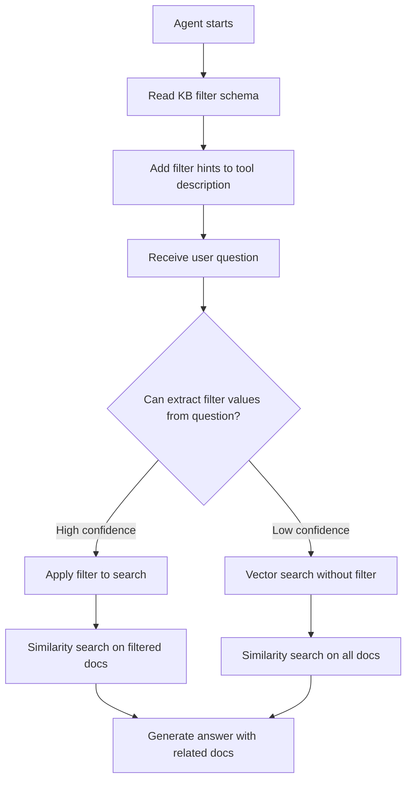

Standard RAG search performs only **question → vector similarity search**.
Dynamic filters first **narrow scope by metadata** then perform vector search, improving accuracy.

### Example

> Question: "Show me revenue trends from the Finance team's 2024 reports"

| Method | Behavior | Result |
|--------|----------|--------|
| Without filter | Vector similarity over all documents | Other teams' docs may be mixed in |
| With filter | Narrow first by `department=Finance, year=2024`, then vector search | Only relevant docs retrieved |

---

## How to Configure Filters

<Steps titleSize="h3">
  <Step title="Define filter fields">
    On the Knowledge Base edit screen, click **Add Filter** to define a filter field.

    | Item | Description | Example |
    |------|-------------|---------|
    | **Label** | Filter name shown to users | "Department", "Year" |
    | **Type** | Data type | Enum, Collection, Number, Date |
    | **Options** | Allowed values (Enum/Collection only) | "Finance, HR, Engineering" |
    | **Description** | Description so the AI understands purpose | "Indicates the document's department" |
    | **Extraction prompt** | Instruction for AI auto-extraction | "Extract the department name from the filename" |
    | **Required** | Show orange warning when missing | Required check |
  </Step>

  <Step title="Choose extraction mode">
    Toggle **Manual / AI** at the top of the filter schema.

    | | Manual mode | AI mode |
    |---|---|---|
    | **Input method** | User enters per file | LLM auto-extracts from file content |
    | **Accuracy** | 100% (human-entered) | Depends on LLM performance |
    | **Time** | Proportional to file count | One-click bulk extraction |
    | **Cost** | None | LLM call cost |
    | **Recommended for** | Few files or accuracy-critical | Many files needing fast classification |

    <Tip>
      AI-mode results can be edited manually. The most efficient flow is bulk-extract with AI first, then fix only the errors.
    </Tip>
  </Step>

  <Step title="Save">
    Click **Save** to save the filter schema.
    In AI mode, metadata is auto-extracted on subsequent file uploads.
  </Step>
</Steps>

---

## Filter Type Details

| Type | Slots | Max Count | Search Behavior | Use Cases |
|------|-------|:---------:|-----------------|-----------|
| **Enum** | f_str_1 ~ f_str_4 | 4 | Exact match | Department, category, status |
| **Collection** | f_col_1 ~ f_col_4 | 4 | Match any one of multiple values | Tags, related teams |
| **Number** | f_int_1 ~ f_int_2 | 2 | Exact match | Year, version |
| **Date** | f_date_1 ~ f_date_2 | 2 | Range search | Created date, expiry date |

### Date Filter Input Format

Date filters accept varying precision:

| Input | Meaning | Search Range |
|-------|---------|--------------|
| `2024` | All of 2024 | 2024-01-01 ~ 2024-12-31 |
| `2024-03` | March 2024 | 2024-03-01 ~ 2024-03-31 |
| `2024-03-15` | Specific date | That day only |

---

## Metadata State Display

In the file list, each file's metadata state is shown as a **color dot**.

| Color | State | Meaning |
|:-----:|-------|---------|
| 🟢 **Green** | Complete | All filter fields have values |
| 🟡 **Yellow** | Partial | Only some fields are set |
| 🟠 **Orange** | Missing Required | Required field is empty |
| ⚪ **Gray border** | Empty | No metadata set |
| 🟣 **Purple spinner** | Extracting | AI extraction in progress |

<Warning>
  Files in **Orange (Missing Required)** state may be omitted from filter searches. Make sure to fill in required fields.
</Warning>

---

## AI Auto-Extraction

### Writing Extraction Prompts

The extraction prompt is the instruction the AI uses when extracting metadata values from file content.

**Examples of good extraction prompts:**

| Filter | Extraction Prompt |
|--------|-------------------|
| Department | "Extract the department from document content or filename. Options: Finance, HR, Engineering" |
| Year | "Extract the publication year from the document. If the filename contains a year, use it" |
| Document type | "Determine the document type. Options: policy, guide, report, form" |

<Note>
  The AI analyzes the **first ~4,000 characters** of the file. The closer key information is to the beginning, the better extraction accuracy.
</Note>

### Running Extraction

| Method | Description | When to Use |
|--------|-------------|-------------|
| **Auto-extraction** | Runs automatically on upload | When AI mode is active and a new file is added |
| **Single-file extraction** | File metadata edit > Extract button | Re-extract a specific file |
| **Bulk extraction** | Bulk extract button at the top of the KB | Re-apply across all files after schema change |

---

## How Agents Use Filters

When you connect a KB with dynamic filters to an agent, auto-filtering happens through this flow.



### Step Details

<Steps titleSize="h4">
  <Step title="Inform the AI about filters">
    On agent start, the system reads the KB's filter schema and **auto-adds filter hints to the tool description**.

    For example, with a "Department" filter, the AI knows "I can filter this KB by `department`".
  </Step>

  <Step title="Extract filter values from the question">
    When a user asks a question, the AI **auto-extracts** filter values from the content.

    ```
    Question: "Show me revenue trends from the Finance team's 2024 reports"

    AI extraction:
      department → "Finance" (high confidence)
      year → 2024 (high confidence)
    ```

    <Note>
      The AI **only applies filters with high confidence**. If filter values can't be determined from the question, it falls back to standard vector search without filters.
    </Note>
  </Step>

  <Step title="Build the search filter">
    Extracted filter values are internally converted to a filter query the search engine understands.

    ```
    User input: department=Finance, year=2024
         ↓
    Internal: f_str_1='Finance' AND f_int_1=2024
         ↓
    Passed to the search engine query
    ```
  </Step>

  <Step title="Run filtered search">
    The search engine performs vector similarity search **only on documents matching the filter conditions**. Documents from other teams or years are excluded from search.
  </Step>

  <Step title="Generate the answer">
    Filtered relevant documents are passed to the AI to generate an accurate answer.
  </Step>
</Steps>

---

## Tool Description and Filters

The tool description is the key signal that helps the AI agent decide **when to use a Knowledge Base, and which filter to apply**.

| | Without Tool Description | With Tool Description |
|---|---|---|
| **KB selection** | Decided by KB general description (may be inaccurate) | Clear purpose guidance for accurate selection |
| **Filter usage** | May not know filters exist | Knows which filter to use in which situation |

**AI auto-generation recommended**: Click the auto-generate button next to the tool description field — the AI drafts the tool description based on the KB name + description + file list + filter info.

<Tip>
  After changing the filter schema, **regenerate the tool description**. New filter info must be reflected in the tool description for the AI to use filters accurately.
</Tip>

---

## Caveats

<AccordionGroup>
  <Accordion title="Are files with empty required fields omitted from search?" icon="triangle-exclamation">
    Yes. Files without values in fields marked Required are not included in results when searching with that filter condition. Look for orange dots and fill in values.
  </Accordion>

  <Accordion title="Can AI extraction be wrong?" icon="triangle-exclamation">
    AI extraction analyzes about the first 4,000 characters of the document — if key information is in later sections, extraction can be inaccurate. Review results and edit manually as needed.
  </Accordion>

  <Accordion title="What happens to existing metadata when I change the filter schema?" icon="triangle-exclamation">
    Adding a filter field leaves existing files' values empty. Run bulk extraction in AI mode to populate the new field. Removing a field also removes that metadata.
  </Accordion>

  <Accordion title="Why are there filter slot count limits?" icon="circle-question">
    Slot counts are limited per type to optimize the search engine index structure:
    - Enum: max 4
    - Collection: max 4
    - Number: max 2
    - Date: max 2

    Sufficient for most document classifications. If you need finer classification, consider splitting into separate Knowledge Bases.
  </Accordion>
</AccordionGroup>
