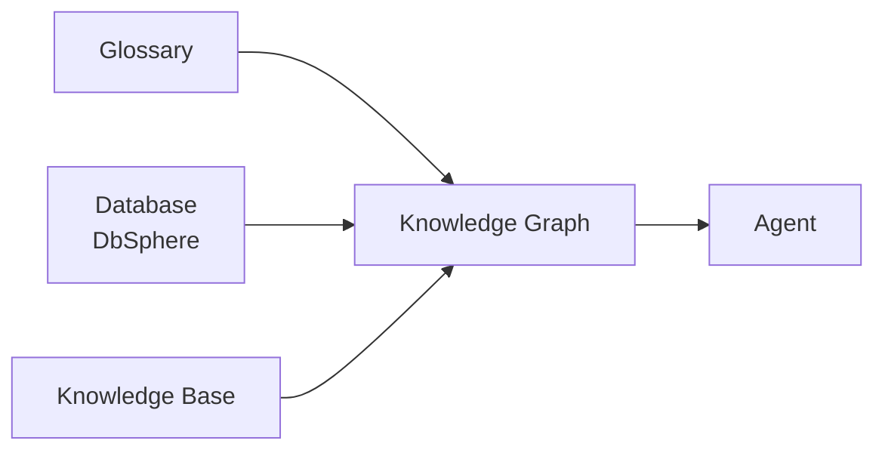
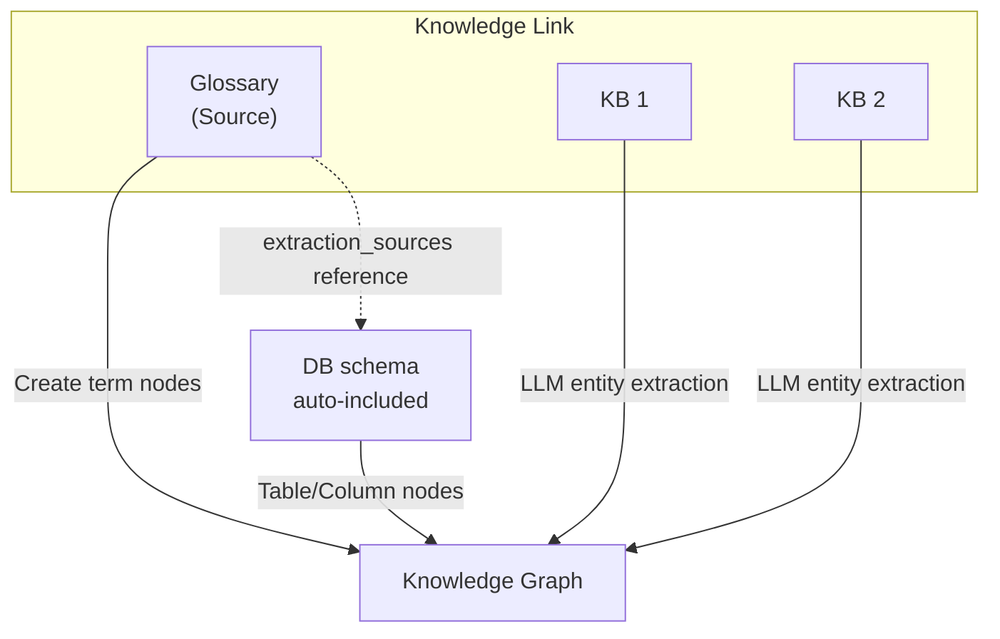
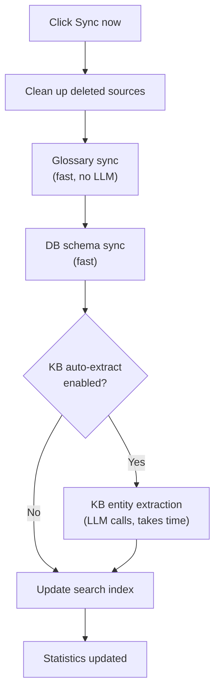

## Overview

Knowledge Graph (KG) is a unified knowledge structure that connects **glossaries, databases, and Knowledge Bases** into a single graph.

It lets AI agents automatically understand which table column maps to a business term, and which document context relates to it.

### Problems KG Solves

When you use glossaries, databases, and Knowledge Bases separately, the agent **can't connect meanings**.

| Using only one | Limitation |
|:---------------|:-----------|
| Glossary only | Knows what "VIP customer" means but not which table it lives in |
| Database only | Knows the table schema but not that "VIP" is the `tier='VIP'` filter |
| Knowledge Base only | Finds document content but can't connect to actual data |
| **Using KG** | **Connects term → column/filter → related document in one step** |

### Use Case

```
User: What are the TOP 3 products bought most by VIP customers at the Gangnam branch?

Agent behavior:
  1. kg_resolve_term("VIP customer")
     → Found mapping: users.tier = 'VIP'
  2. kg_resolve_term("Gangnam branch")
     → Found mapping: stores.region = 'Gangnam'
  3. kg_find_related_tables("users")
     → Found connected tables: orders, products
  4. Auto-generate and execute SQL

Response: Gangnam VIP customer sales TOP 3:
  1. Wireless Earbuds Pro — 1,523 units
  2. Smart Watch X — 1,287 units
  3. Noise-cancelling Headphones — 892 units
```

### Three Information Sources



| Source | Contains | Role in KG |
|:-------|:---------|:-----------|
| **Glossary** | Business term definitions (VIP, MRR, Gangnam branch, etc.) | Term / Concept nodes + synonym/category edges |
| **Database** | Tables/column schema + FK relationships | Table / Column nodes + structural edges |
| **Knowledge Base** | Documents (policies, strategies, manuals) | Doc Entity nodes + LLM-extracted relationship edges |

---

## Creating a Knowledge Graph

<Steps>
  <Step title="Create a new KG">
    In **Workspace → Knowledge Graph** list, click **"+ New Knowledge Graph"**.

    {/* TODO: screenshot — KG list page */}
    
  </Step>
  <Step title="Enter name and description">
    | Field | Description | Example |
    |:------|:------------|:--------|
    | **Name** | KG identifier name (max 200 chars) | "Company-wide Knowledge Graph" |
    | **Description** | Purpose | "Unified analysis for sales/customer/product" |

    Use Access Control to set read/write permissions per group/user.
  </Step>
  <Step title="Open the detail page">
    After creation you're auto-redirected to the KG detail page. Now connect information sources.
  </Step>
</Steps>

---

## KG Detail Page

{/* TODO: screenshot — full KG detail page */}


The KG detail page consists of a **left node list** and a **right config/exploration area**.

### Statistics Cards

Three statistics cards appear at the top.

| Item | Meaning |
|:-----|:--------|
| **Nodes** | Total node count in the graph |
| **Edges** | Total edge count in the graph |
| **Last synced** | Timestamp of the last sync |

### LLM Model Setting

Pick the LLM model to use for the KG. Used for category definition generation, KB document matching, AI tool description auto-generation, and more.

<Warning>
After changing the LLM model, you must click **Save** for the change to take effect.
</Warning>

---

## Knowledge Links

A Knowledge Link is the core structure of a KG. Bundles **1 glossary + N Knowledge Bases** into one link to automatically connect meanings between terms and documents.

### Link Structure



<Tip>
When **extraction sources** are configured on a glossary's category, the corresponding DB schema is automatically included in the Knowledge Link. No need to add the DB separately.
</Tip>

### Add a Link

<Steps>
  <Step title="Click Add Knowledge Link">
    In the **Knowledge Links** section of the KG detail page, click **"Add knowledge link"**.
  </Step>
  <Step title="Pick a glossary">
    Select the glossary to connect. Already-connected glossaries are excluded from the list.
  </Step>
  <Step title="Pick DbSphere / Knowledge Bases">
    With checkboxes, select the **sources to actually sync to this Knowledge Link**. Choose only some of the auto-detected candidates, or add additional ones.

    | Source | Effect |
    |--------|--------|
    | **DbSphere** | Tables, columns, and foreign keys of the selected DB are extracted as graph nodes |
    | **Knowledge Base** | The LLM extracts entities and relationships from the selected KB's document chunks |

    <Info>
      Unchecked sources are **not included in this Knowledge Link** even if auto-detected. Unlike older versions, sources aren't force-connected automatically — explicitly select only what you need to control sync cost and time.
    </Info>
  </Step>
  <Step title="Pick KB filter slots to extract (optional)">
    If you selected a KB, use checkboxes to specify **which dynamic-filter slots (department/year/document-type) to promote into KG nodes**.

    Selected slots are added to the graph as `DOC_ATTR` nodes and `has_<label>` edges, letting the agent filter by those properties during search.

    <Tip>
      Example: if your KB has a "department" filter and you promote that slot to KG, the agent automatically translates queries like "find from finance team docs" into a department filter.
    </Tip>
  </Step>
  <Step title="Sync after creation">
    After creation, click the **"Sync entities"** button to sync the link. Only the selected DbSphere/KBs are processed, and `kg.data.sources` is auto-recalculated.
  </Step>
</Steps>

### Nodes and Edges Created by a Link

<Tabs>
  <Tab title="Glossary → Nodes">
    | Source | Node Created | Connecting Edge |
    |:-------|:-------------|:----------------|
    | Each term (entry) | `Term` node | — |
    | Synonyms | — | `synonym_of` edge |
    | Category | `Concept` node | `broader_than` edge |
    | Category → DB column mapping | — | `maps_to` edge |

    Performs only structural transformation without LLM calls — completes quickly.
  </Tab>
  <Tab title="Database → Nodes">
    | Source | Node Created | Connecting Edge |
    |:-------|:-------------|:----------------|
    | Table | `Table` node | — |
    | Column | `Column` node | `belongs_to` (column → table) |
    | Foreign keys | — | `foreign_key` edge |

    <Warning>
    To create DB schema nodes, you must **run schema extraction in DbSphere first**. Without it, nodes show as 0.
    </Warning>
  </Tab>
  <Tab title="Knowledge Base → Nodes">
    | Source | Node Created | Connecting Edge |
    |:-------|:-------------|:----------------|
    | Entities in document chunks | `Doc Entity` node | LLM-extracted relationship edges |
    | KB filter values (selected slots only) | `Doc Attr` node | `has_<slot>` (document → attribute node) |

    `Doc Entity` is the result of an LLM analyzing each document chunk to extract entities and relationships. `Doc Attr` is a non-LLM path that lifts KB filter values directly into the graph — see [Promoting KB Filters to KG Nodes](#promoting-kb-filters-to-kg-nodes) below.

    <Warning>
    `Doc Entity` extraction **incurs LLM call costs**. Only connect KBs you need. `Doc Attr` does not call the LLM, so it has no cost.
    </Warning>
  </Tab>
</Tabs>

### Promoting KB Filters to KG Nodes

KB filter values (country, category, department, etc.) can be lifted directly into the graph as nodes for use in retrieval, exploration, and agent routing. Because **no LLM call is made**, structured metadata flows into the graph at zero cost.

<Steps>
  <Step title="Open Node Filter Settings on the KG Link card">
    On the KG detail page, open the **Node Filter Settings** modal on a Knowledge Link card that has a KB attached.
  </Step>
  <Step title="Select filter slots to promote">
    The connected KB's `filter_schema` is shown grouped by KB. Pick the slots to promote into nodes via checkboxes.

    | Filter Type | Promotable | Note |
    |:-----------|:----------:|:-----|
    | `string`, `enum`, `collection` | ✓ | Best fit for moderate-cardinality categorical values |
    | `int`, `date` | ✓ | High cardinality — node count can explode, choose carefully |
    | `glossary` | — | Reserved for glossary anchor mapping — handled separately (existing `Term` nodes are reused automatically) |
  </Step>
  <Step title="Save → applied on next sync">
    Saving writes to the KG link's `config.extracted_filter_slots`. On the next sync, the selected slots' values become `Doc Attr` nodes, and each document is connected to the values it holds via `has_<slot>` edges.
  </Step>
</Steps>

#### How It Works

| Step | Behavior |
|------|----------|
| 1. Slot registration | `{kb_id, slot}` pairs are stored at the KG-link level. **KB filter schema is untouched** — KBs work the same in deployments that don't use KG |
| 2. Value collection | All distinct values for the selected slots are collected from KB documents |
| 3. Glossary match | If a value normalizes to an existing `Term` label in a linked glossary, **the existing Term node is reused** — preventing graph fragmentation |
| 4. Node creation | Unmatched values become new `Doc Attr` nodes |
| 5. Edge wiring | Each document → its attribute node via `has_<slot_suffix>` edges (e.g., `has_country`, `has_department`) |

<Note>
  The edge name uses the slot name with its prefix (`f_str_`, `f_col_`, `f_int_`, `f_date_`, `f_glossary_`) stripped. If the routing LLM suggests a more meaningful edge name, that name is used instead.
</Note>

<Tip>
  `Doc Attr` is a lightweight path that brings KB filters into the graph without LLM calls. If chunk-level entity extraction (`Doc Entity`) is cost-prohibitive, start with `Doc Attr` only, then enable LLM extraction selectively on KBs that warrant it.
</Tip>

### Link Detail View

Expand each Knowledge Link card to see column-mapping status per DB table.

- **Table groups**: Grouped by table within the connected DB
- **Column mappings**: Column name, data type, PK/FK indicators, mapped category, term count
- **Matched documents**: Count of documents matched with KB

---

## Sync

After connecting resources, you must run **sync** to actually create the nodes and edges.

### Sync Methods

| Method | Button | Scope |
|:-------|:-------|:------|
| **Full sync** | Top **"Sync now"** | Rebuild everything across all sources |
| **Per-link sync** | Each link's **"Sync entities"** | Only that link's glossary + DB + KBs |

### Full Sync Flow



### Tracking Progress

- When sync starts, the button changes to **"Syncing..."**
- Real-time toast notifications appear on completion/failure
- Duplicate runs are blocked when sync is already in progress

<Tip>
KB entity extraction is **incremental**. Previously processed chunks are skipped, so re-syncing only processes newly added documents.
</Tip>

### Sync Time

| Source | Time | Cost |
|:-------|:-----|:-----|
| Glossary | Seconds | None |
| DB schema | Seconds to minutes | None |
| KB entity extraction | Minutes to hours (proportional to doc volume) | LLM call costs |

---

## Graph Exploration

### Graph Visualization

On the KG detail page, toggle **"Show graph"** to display an interactive graph view.

{/* TODO: screenshot — graph visualization */}


#### How to Interact

| Action | Method |
|:-------|:-------|
| Zoom | Mouse wheel or trackpad |
| Pan | Drag background |
| Select node | Click node → highlights neighbors + shows detail panel |
| Select edge | Click edge → shows connection info panel |
| Fit to view | Toolbar **Fit** button |
| Focus by type | Click type buttons at top (Term, Concept, Table, etc.) → shows that type + 1-hop neighbors |

#### Node Types and Colors

| Type | Color | Meaning |
|:-----|:------|:--------|
| **Term** | Blue | Business terms from glossary |
| **Concept** | Purple | Term parent category |
| **Table** | Green | DB table |
| **Column** | Orange | DB column |
| **Doc Entity** | Pink | Entities extracted from KB documents |

<Info>
When nodes exceed 500, a **"Truncated"** warning appears. Use type-focus to view only the area you care about.
</Info>

#### Node Detail Panel

Click a node to show the detail panel on the right.

- **Property table**: Node properties (label, type, description)
- **Connections list**: Neighbor nodes connected to this node (direction arrow + edge type + neighbor info)
- Click a neighbor node to navigate to it

### Node List

Browse all nodes as a list in the left panel.

- **Search**: Search by node label (server-side, fast even on large graphs)
- **Type filter**: All / Term / Concept / Table / Column / Doc Entity
- **Pagination**: Navigate 20 at a time

### Semantic Search

In the **Semantic Search** section of the KG detail page, search nodes in natural language.

- Returns the most relevant nodes by vector similarity, with scores
- Each result shows a node-type badge and similarity score

<Warning>
Semantic search requires a system admin to configure the **Search Engine**. Without it, a warning banner appears.
</Warning>

---

## Agent Integration

The real power of KG comes when **connected to an agent**.

### Connect KG to an Agent

In the agent edit page's **Knowledge Graph** section, pick the KG to use.

{/* TODO: screenshot — agent editor KG section */}


<Tip>
When you connect a KG, the **glossaries, databases, and Knowledge Bases** included in that KG are auto-inherited by the agent. No need to add the same resources separately.
</Tip>

### 7 KG Tools

Agents with a KG connected automatically gain access to these 7 tools.

| Tool | Use | Example |
|:-----|:----|:--------|
| **kg_resolve_term** | Map business term → DB column/filter | "VIP customer" → `tier='VIP'` |
| **kg_search_concepts** | Semantic node search + neighbor expansion | "Find sales-related terms" |
| **kg_neighbors** | Explore N-hop neighbors of a node | All terms connected to a specific table |
| **kg_find_related_tables** | FK-connected tables + JOIN hints | "Tables joinable with users" |
| **kg_explore_context** | Explore subgraph around seed entities | Understand context of complex multi-step questions |
| **kg_fetch_data** | Run SQL + return actual data (max 100 rows) | `SELECT * FROM orders LIMIT 10` |
| **kg_fetch_document** | Search document chunks in KG-connected KBs | "Find VIP policy docs" |

<Note>
`kg_fetch_data` automatically falls back to related document search when 0 rows are returned. Combines data and document lookup into one tool.
</Note>

### Tool Tester

Before connecting to an agent, test each tool directly in the **"Try KG Tools"** section.

<Steps>
  <Step title="Open the tool tester">
    Click the **"Show"** toggle at the bottom of the KG detail page
  </Step>
  <Step title="Pick a tool and run">
    Choose a tool from the dropdown, fill in inputs, and click **"Run"**
  </Step>
  <Step title="Review results">
    Results appear at the bottom as JSON. Verify sync results and term-mapping accuracy.
  </Step>
</Steps>

---

## Node Management

### Manual Curation

Beyond auto-generated nodes from sync, you can manually add edges and edit nodes.

**Supported actions:**
- Edit node labels/properties
- Delete nodes (related edges auto-removed)
- Merge nodes (combine duplicate nodes — edges auto-transferred)
- Manually create edges (`maps_to`, `related_to`, `broader_than`, etc.)

### Node Type Summary

| Type | Source | Description |
|:-----|:-------|:------------|
| Term | Glossary | Business term (e.g., VIP, MRR) |
| Concept | Glossary | Term parent category (e.g., customer tier, revenue type) |
| Table | DB | Database table |
| Column | DB | Table column |
| Doc Entity | KB | Entity extracted from documents by LLM |

---

## FAQ

<AccordionGroup>
  <Accordion title="What's the difference between KG and Glossary?" icon="circle-question">
    A glossary manages **term definitions** only. KG connects glossaries to **database columns and document entities** so agents can answer with actual data.
  </Accordion>
  <Accordion title="What's the difference between KG and DbSphere (Database)?" icon="circle-question">
    DbSphere specializes in **schema-based SQL generation**. KG adds **business terminology and document context** so it understands non-schema expressions like "VIP customer".
  </Accordion>
  <Accordion title="Sync takes too long" icon="clock">
    - **Glossary/DB sync**: Seconds to minutes (fast)
    - **KB entity extraction**: Minutes to hours, proportional to document count

    KB extraction is incremental — already-processed chunks are skipped on the next sync. Large KBs only take long the first time.
  </Accordion>
  <Accordion title="Sync failed" icon="triangle-exclamation">
    - **DB-related errors**: Check that DbSphere schema extraction succeeded first
    - **KB extraction errors**: Verify LLM model setting and API key
    - Duplicate runs are blocked while sync is in progress — retry shortly
  </Accordion>
  <Accordion title="I'm worried about LLM costs" icon="coins">
    Only **KB entity extraction** uses the LLM. To control cost:

    - Connect only KBs you need
    - Even with just glossaries and DBs, `kg_resolve_term` and `kg_find_related_tables` work fine
  </Accordion>
  <Accordion title="Can I connect multiple KGs to one agent?" icon="layer-group">
    Yes. With multiple KGs connected, tools work over the **unified** nodes and edges from all KGs. Run separate KGs per domain while querying them together from the agent.
  </Accordion>
</AccordionGroup>

---

## Related Guides

<Columns cols={3}>
  <Card title="Glossary" icon="book" href="/en/workspace/glossary">
    Business term definitions, synonyms, category management
  </Card>
  <Card title="Database" icon="database" href="/en/workspace/database">
    DB connection, schema extraction, SQL execution
  </Card>
  <Card title="Agents" icon="robot" href="/en/workspace/agents">
    AI agent configuration, tool integration, workflows
  </Card>
</Columns>
