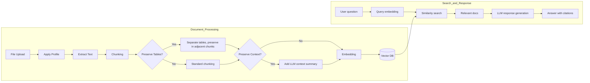
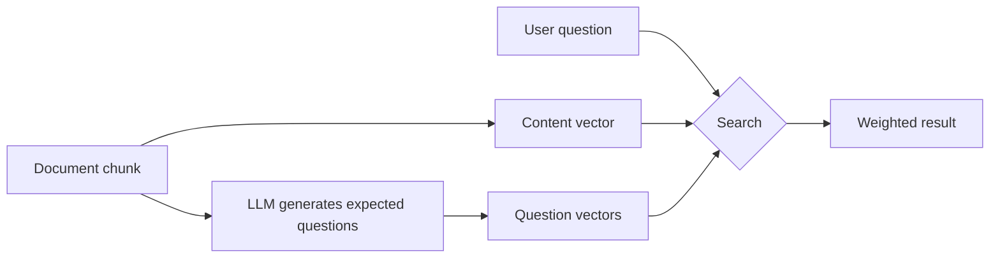

When you ask the AI a question and it replies "I don't know" or gives an off-topic answer, that's where the Knowledge Base comes in. By converting your internal documents into a form the AI can reference directly, the Knowledge Base enables **accurate, document-grounded answers**.

### Example

> "What is our company's annual leave policy?"

| State | Behavior | Result |
|-------|----------|--------|
| No Knowledge Base | Answers from general AI knowledge | Inaccurate or "I don't know" |
| Knowledge Base connected | Searches `hr-policy.pdf` for related content, then answers | Accurate policy + citation |

<Info>
  Each Knowledge Base can use a different **Document Processing Profile** with its own extraction method and chunking strategy. See [Document Processing Profile Selection](#document-processing-profile-selection) below for details.
</Info>

{/* SCREENSHOT: knowledge-list */}
<Frame caption="View Knowledge Bases in Workspace > Knowledge Base">
  
</Frame>

---

## RAG Pipeline

Uploaded documents go through this pipeline before becoming searchable.



| Stage | Description |
|-------|-------------|
| **Apply Profile** | Applies the extraction/chunking strategy from the KB's document processing profile |
| **Extract Text** | Extracts text from documents (default, OCR, LLM Vision, etc., depending on profile) |
| **Chunking** | Splits long documents into search-friendly sizes (fixed-size or semantic) |
| **Preserve Tables** | Keeps tables intact in adjacent chunks instead of splitting (per profile) |
| **Preserve Context** | Adds an LLM-generated summary of the document context to each chunk (per profile) |
| **Embedding** | Converts text to high-dimensional vectors |
| **Similarity Search** | Finds chunks most similar to the question |
| **LLM Response Generation** | Generates an answer using the retrieved documents as context |

---

## Creating a Knowledge Base

<Steps>
  <Step title="Create a new Knowledge Base">
    In **Workspace > Knowledge Base**, click the **+** button at the top-right.

    {/* SCREENSHOT: knowledge-create */}
    <Frame caption="Enter name and description, and set access permissions">
      
    </Frame>

    | Field | Description | Example |
    |-------|-------------|---------|
    | **Name** | KB name (required) | "HR Policy 2024" |
    | **Description** | Purpose and content (required) | "HR team policies and guidelines" |
    | **Access** | Public/Private and groups/organizational units | Public, or restricted to specific groups/organizations |
    | **Document Processing Profile** | Extraction/chunking strategy applied to this KB | "Default Extraction", "LLM Vision High Precision", etc. |
  </Step>

  <Step title="Upload documents">
    Add documents to the new Knowledge Base. Click the **Add Content (+)** button to choose an upload method.

    {/* SCREENSHOT: knowledge-detail */}
    <Frame caption="Use Add Content (+) to choose file upload, text input, or cloud sources">
      
    </Frame>

    **Upload methods:**

    | Method | Description |
    |--------|-------------|
    | **Drag and Drop** | Drag files onto the upload area |
    | **Upload Files** | Select "Upload Files" from the "Add Content" menu |
    | **Upload Directory** | Select "Upload Directory" — bulk-upload all files in a folder |
    | **Add Text** | Write text directly to add as content |
    | **Cloud Storage** | Google Drive, OneDrive, SharePoint (visible when admin has configured) |
  </Step>

  <Step title="Wait for processing">
    Uploaded documents go through text extraction → chunking → embedding → indexing automatically.
    A real-time notification appears when processing completes.

    <Note>
      Files that take more than 10 minutes to process are auto-failed. Delete and re-upload the file in that case.
    </Note>

    **Bulk uploads:**
    - 5+ files or directory uploads switch to **batch mode**
    - A progress bar shows steps (upload → processing) at the top, with failures shown in red
    - 3 files are processed in parallel
    - Progress state persists across page refreshes
  </Step>

  <Step title="Verify and validate">
    Click a document to view extracted text and connect it to an agent to validate retrieval quality. Toggle **Summary** in the file list to see the AI-generated document summary.
  </Step>
</Steps>

### Supported File Formats

| Category | Formats | Max Size |
|----------|---------|----------|
| **Documents** | PDF, DOCX, PPTX, TXT, MD | 50MB |
| **Spreadsheets** | XLSX, CSV | 20MB |
| **Web** | HTML | - |
| **Code** | PY, JS, TS, JSON, YAML | 10MB |

---

## Dynamic Filters

Dynamic filters let you classify documents in a KB by metadata and automatically narrow the search scope.

<Info>
  For internal mechanics of dynamic filters — Manual vs. AI comparison, 5-step search flow, and more — see the [Dynamic Filters Deep-Dive](/en/workspace/knowledge-filters).
</Info>

### Defining the Filter Schema

Click **"Add Filter"** in Knowledge Base settings to define filter fields.

{/* SCREENSHOT: knowledge-filter-schema */}
<Frame caption="Define filter fields to classify documents by metadata">
  
</Frame>

| Setting | Description | Example |
|---------|-------------|---------|
| **Name** | Filter field name | "Department", "Year" |
| **Type** | Data type | Enum, Collection, Number, Date |
| **Options** | List of allowed values (Enum/Collection types) | "Finance, HR, Engineering" |
| **Description** | Description so the AI understands the filter | "Filter by the document's department" |
| **Required** | Marks files missing this field with a warning | Required check |

### Filter Types

| Type | Description | Slot Limit |
|------|-------------|------------|
| **Enum** | Single selection from predefined options | Max 4 |
| **Collection** | Multiple selections from predefined options | Max 4 |
| **Number** | Integer filter | Max 2 |
| **Date** | Date range filter | Max 2 |
| **Document Type (doc_type)** | Document type auto-classified from chunk content (policy/guide/report/form, etc.) | Auto |

<Tip>
  The **Document Type (doc_type)** filter is a system filter — the LLM auto-classifies based on chunk content. Without entering metadata, you can automatically separate search scope by document format — even when policy docs and manuals coexist in the same KB, the agent picks the right type for each question.
</Tip>

### Per-File Metadata Settings

After defining the filter schema, set metadata values per file. The metadata state is shown by color in the file list.

{/* SCREENSHOT: knowledge-metadata */}
<Frame caption="Per-file metadata state is shown by color">
  
</Frame>

| Color | Meaning |
|-------|---------|
| **Green** | All filter fields have values |
| **Yellow** | Only some fields are set |
| **Orange** | A required field is empty |
| **Gray border** | No metadata set |
| **Purple spinner** | AI extraction in progress |

<Note>
  When metadata changes, the vector index is updated automatically. Existing vectors are kept — no re-embedding required.
</Note>

### AI Auto-Extraction

When you set an **extraction prompt** on the filter schema, the LLM analyzes document content and filename at upload time and auto-extracts metadata.

<Steps>
  <Step title="Set extraction mode">
    Click the **Manual / AI** toggle in the filter schema and switch to AI mode.
  </Step>
  <Step title="Write the extraction prompt">
    Write an extraction prompt for each filter.
    Example: "Extract the country name from the filename"
  </Step>
  <Step title="Pick an AI model">
    Select the LLM model for extraction.
  </Step>
  <Step title="Run extraction">
    Runs automatically on upload, or run single/all extraction manually.
  </Step>
</Steps>

| Method | Description |
|--------|-------------|
| **Auto-extraction** | Runs automatically at upload (when AI mode is active) |
| **Single extraction** | Click the extract button on a file's metadata edit screen |
| **Bulk extraction** | Re-extract metadata for all files at once |

<Tip>
  You can use "filename" as a condition in the extraction prompt.
  Example: "If the filename starts with [XX] (country code), extract that country code"
</Tip>

### Filter Use During Search

When a connected KB has dynamic filters, the AI auto-infers filter conditions from the user's question to narrow search scope.

```
Q: Show me the Finance team's 2024 policies
→ Filters auto-applied: department=Finance, year=2024
→ Searches only matching documents
```

---

## Tool Description

The tool description is an AI-only description that tells the agent **when and in what situations** to use this Knowledge Base.

<Accordion title="Example of a good tool description">
  ```
  Use when there are questions about company HR policies and internal guidelines.
  Reference for HR-related questions like leave, benefits, and travel policies.
  ```
</Accordion>

If no tool description is set, the KB's general description is used instead. We recommend writing detailed tool descriptions so the AI can pick the right Knowledge Base among many.

**AI auto-generation:** Click the auto-generate button next to the tool description field — the AI drafts the description based on the KB name, description, and file list.

---

## Knowledge Base Management

### Document Management

| Action | Method |
|--------|--------|
| **Add document** | **Add Content (+)** button or drag-and-drop |
| **Delete document** | Select a document and click delete |
| **View content** | Click a document to preview the extracted text |
| **Search** | Search by filename (server-side, fast even on large KBs) |
| **Sort** | Newest (default) / Oldest / By name |

The file list uses **infinite scroll** to load 50 entries at a time.

**File state badges:**

| Badge | Meaning |
|:------|:--------|
| **Failed** (red) | Processing failed — click Retry to retry |
| **Processing** (orange) | Processing in progress |
| **Summary** (toggle) | Processed + summary available — click to view inline summary |

<Note>
  Re-uploading a file with the same name shows a **duplicate confirmation dialog**.

  | Option | Behavior |
  |:-------|:---------|
  | **Overwrite** | Delete the existing file and replace |
  | **Skip** | Skip the duplicate, keep the existing file |
  | **Cancel** | Cancel upload |
</Note>

### Reindexing

To rebuild the vector index for the entire KB, run reindex from **Admin Settings > Documents**. This is admin-only and processes all KBs at once.

When you edit and save an individual file's content, only that file is automatically re-processed.

### Using in Chat

<Tabs>
  <Tab title="@ Command">
    Reference directly during chat with `@kb-name`.
    ```
    @hr-policy What is the leave application process?
    ```
  </Tab>
  <Tab title="Agent Connection">
    When a Knowledge Base is connected in agent settings, it's referenced automatically. Users just chat — no command needed.
  </Tab>
</Tabs>

Click citation numbers in the AI response to view the source content.

---

## Document Processing Profile Selection

<Info>
  **New feature** — Apply different document processing strategies (extraction engine, chunking method, table preservation) per Knowledge Base.
</Info>

Choose one of the profiles defined by the admin in **Admin > Settings > Documents**. If you don't pick one, the default profile applies.

{/* SCREENSHOT NEEDED: knowledge-profile-selector */}

### Profile Use Cases

| Knowledge Base | Recommended Profile | Reason |
|----------------|--------------------|--------|
| HR policy (text PDF) | Default Extraction | Plain text, no extra cost |
| Financial report (many tables) | Table Preservation enabled | Improves table data search accuracy |
| Scanned documents (image PDF) | LLM Vision | Accurately extracts text inside images |
| Technical docs (long reports) | Semantic Chunking + Context Preservation | Topic-based separation + preserved opening context |

<Tip>
  Only admins can create profiles. If a needed profile is missing, ask your admin. See [Admin > Settings > Documents](/en/admin/settings/documents#document-processing-profile) for profile setup.
</Tip>

---

## Advanced Settings

Adjust document processing and search parameters in admin settings.

<Note>
  These settings are **global defaults for KBs without a Document Processing Profile**. KBs with a profile use the profile settings instead.
</Note>

### Document Processing Options

| Setting | Description | Default |
|---------|-------------|---------|
| **Chunk Size** | Document split unit (characters) | 1000 |
| **Chunk Overlap** | Overlapping characters between chunks | 100 |
| **OCR Enabled** | Extract text from images | Enabled |

### Content Extraction Engine

Choose the engine for extracting text from documents in admin settings.

| Engine | Strengths | Best For |
|--------|-----------|----------|
| **Default (PyPDF/Langchain)** | No setup needed | Plain-text PDF, DOCX |
| **Tika** | Server required, supports many formats | Mixed file formats |
| **Docling** | Server required | Complex layout documents |
| **Azure Document Intelligence** | Azure subscription required, high-precision OCR | Scanned documents, table-heavy PDFs |
| **Google Document AI** | GCP subscription required | Documents with embedded images |
| **Mistral OCR** | Mistral API required | PDF OCR |
| **LLM Vision** | Vision LLM-based, high precision | Complex layouts, charts |

### Embedding Engine

| Engine | Strengths |
|--------|-----------|
| **Local (SentenceTransformer)** | No external transmission, strong security |
| **OpenAI** | High quality, API costs |
| **Azure OpenAI** | Optimized for enterprise |
| **Ollama** | Local server, custom models |

### Search Settings

Search settings have two layers — **global** (admin) and **per-KB**.

| Setting | Default | Description |
|---------|:-------:|-------------|
| **Top K** | 10 | Chunks to retrieve via vector search |
| **Reranker Top K** | 3 | Final chunks after reranking |
| **Reranker Threshold** | 0.1 | Minimum reranker score (lower = more pass through) |

<Tip>
  Override search settings per Knowledge Base. Click the **Search Settings** icon on the KB edit screen. Leaving values empty applies the global admin settings.
</Tip>

### Per-KB Document Summary Settings

Control **document summary generation** per KB. Configure under the **"File Summary"** section in the search settings modal.

| Setting | Description | Default |
|:--------|:------------|:-------:|
| **Enable File Summary** | Auto-generate AI summary on file processing completion | On |
| **Summary Model** | LLM model for summarization | Uses Task Model |

For files with summaries, click the **"Summary"** toggle in the list to view inline.

### Question Generation (Multi-Vector Search)

When question generation is enabled, the LLM pre-generates **"questions a user might ask to find this content"** for each chunk and stores them as separate vectors.



| State | Search Method | Effect |
|-------|---------------|--------|
| Disabled | Content vectors only | Standard search |
| Enabled | Weighted sum of content + question vectors | Improved accuracy with user-question-style phrasing |

<Warning>
  Enabling question generation adds LLM calls during document processing. Processing time and cost may increase.
</Warning>

<Tip>
  Configure question generation per KB independently of the global setting. Use the **"Question Generation"** section in the search settings modal to enable/disable and select the LLM model.
</Tip>

---

## Best Practices

### Document Preparation

1. **Clean format**: Distinguish titles and subheadings clearly with consistent styling
2. **Keep current**: Update documents regularly and remove old ones
3. **Right size**: Split large documents by topic and group related content together

### Knowledge Base Composition

1. **Separate by topic**: Create separate KBs for "HR Policy", "IT Guide", "Product Manual", etc.
2. **Granular access**: Manage sensitive info separately and restrict access by department
3. **Write tool descriptions**: Detailed tool descriptions help agents auto-pick the right KB

---

## Use Cases

<AccordionGroup>
  <Accordion title="New Employee Onboarding" icon="user-plus">
    Build Knowledge Bases of HR policy, work manuals, and IT guides so new hires can adapt quickly by asking the AI.

    - Knowledge Bases: "HR Policy", "Work Manual", "IT Usage Guide"
    - Connect 3 KBs to the agent
    - Differentiate KB purposes via tool descriptions
  </Accordion>

  <Accordion title="Customer Support Automation" icon="headset">
    Build Knowledge Bases of product manuals, FAQs, and technical docs to provide accurate answers to customer inquiries.

    - Dynamic filters: filter by product name, version
    - Agent: customer-support system prompt + Knowledge Base connection
    - Use citation display to ensure trust
  </Accordion>

  <Accordion title="Per-Department Policy Management" icon="building">
    Classify per-department documents with dynamic filters and search the right policies by department.

    - Dynamic filters: department, year, document type
    - AI auto-extraction for metadata
    - Access control to protect sensitive documents
  </Accordion>
</AccordionGroup>

---

## FAQ

<AccordionGroup>
  <Accordion title="Are there KB capacity limits?" icon="circle-question">
    By default, there's no limit on file count or capacity. Admins can set limits via environment variables.
  </Accordion>

  <Accordion title="What happens if I re-upload the same file?" icon="circle-question">
    When a file with the same name is detected, a **duplicate confirmation dialog** appears with Overwrite, Skip, or Cancel options.
  </Accordion>

  <Accordion title="Is text inside PDF images recognized?" icon="circle-question">
    The default extraction engine supports OCR, but for scanned documents or image-heavy PDFs, **Azure Document Intelligence** or **Google Document AI** engines are more accurate. Check the extraction engine setting with your admin.
  </Accordion>

  <Accordion title="Does changing dynamic filter metadata require re-embedding?" icon="circle-question">
    No. Metadata changes only update the vector index's filter fields; existing vectors stay intact. Processed quickly without re-embedding.
  </Accordion>

  <Accordion title="What happens to search settings when multiple KBs are connected to one agent?" icon="circle-question">
    When multiple KBs are connected, search settings merge as follows:
    - **Top K, Reranker Top K**: Use the **largest value** across KBs
    - **Reranker Threshold**: Use the **lowest value** across KBs (more results pass)
  </Accordion>

  <Accordion title="Does changing the Document Processing Profile affect existing documents?" icon="circle-question">
    Existing documents' vectors are not auto-reprocessed when the profile changes. To apply the new profile to existing documents, delete and re-upload them, or run a full reindex from admin settings.
  </Accordion>

  <Accordion title="What's the cost of LLM Vision or Context Preservation?" icon="circle-question">
    - **LLM Vision**: page count × ~2 LLM calls (extraction + boundary correction)
    - **Context Preservation**: chunk count × 1 LLM call

    For a 10-page PDF + 20 chunks: LLM Vision (19 calls) + Context Preservation (20 calls) ≈ 39 LLM calls. Bulk uploading large documents can cost a lot, so use selectively for important docs.
  </Accordion>
</AccordionGroup>

---

## Related Pages

<Columns cols={2}>
  <Card title="Dynamic Filters Deep-Dive" icon="filter" href="/en/workspace/knowledge-filters">
    Filter internals, Manual vs AI, the 5-step search flow
  </Card>
  <Card title="Knowledge Graph" icon="share-nodes" href="/en/workspace/knowledge-graph">
    Connect Knowledge Bases + glossaries + DBs into one graph
  </Card>
  <Card title="Agents" icon="robot" href="/en/workspace/agents">
    Connect a Knowledge Base to an agent
  </Card>
  <Card title="Glossary" icon="book" href="/en/workspace/glossary">
    Improve AI understanding by defining domain terms
  </Card>
</Columns>
