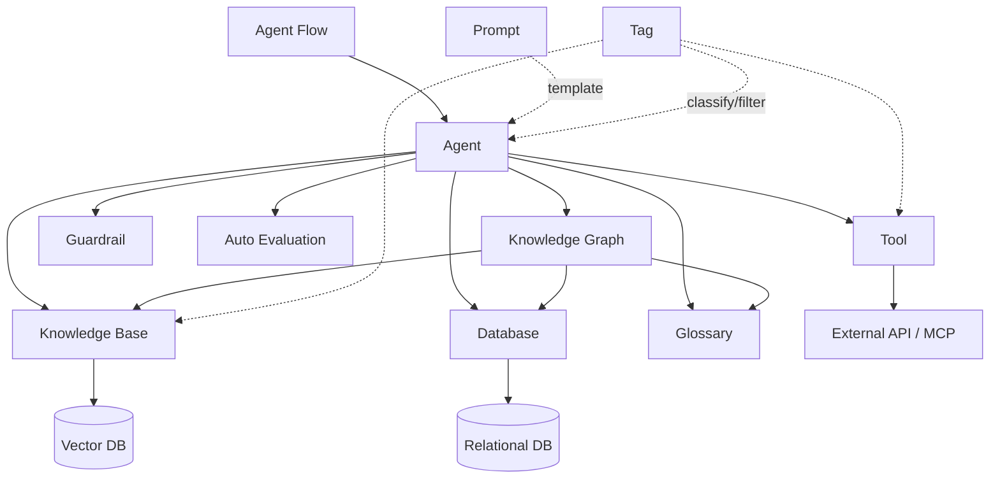

The Workspace is where you tailor AI to your work and share it with your team.
With agents at the center, combine Knowledge Bases, Databases, Tools, Guardrails, and more to build an **AI environment customized for your organization**.

<Frame caption="Workspace main screen">
  
</Frame>

---

## Core Features

<Columns cols={3}>
  <Card title="Agents" icon="robot" href="/en/workspace/agents">
    Create and manage custom AI assistants combining Knowledge Bases, Tools, and Guardrails.
  </Card>
  <Card title="Knowledge Base" icon="book" href="/en/workspace/knowledge">
    Upload internal documents and run vector search via the RAG pipeline.
  </Card>
  <Card title="Database" icon="database" href="/en/workspace/database">
    Query databases in natural language. Analyze data without writing SQL.
  </Card>
</Columns>

<Columns cols={3}>
  <Card title="Agent Flows" icon="diagram-project" href="/en/workspace/flows">
    Visually connect multiple agents to compose multi-step workflows.
  </Card>
  <Card title="Guardrails" icon="shield-halved" href="/en/workspace/guardrails">
    Configure AI I/O security policies — PII detection, content filtering, blocked terms.
  </Card>
  <Card title="Tools" icon="wrench" href="/en/workspace/tools">
    Connect OpenAPI or MCP servers so agents can interact with external systems.
  </Card>
</Columns>

<Columns cols={3}>
  <Card title="Prompts" icon="message" href="/en/workspace/prompts">
    Save frequently used prompts as templates and share with the team. Invoke quickly via `/` commands.
  </Card>
  <Card title="Glossary" icon="spell-check" href="/en/workspace/glossary">
    Register domain terms so the AI accurately understands industry, abbreviation, and internal terminology.
  </Card>
  <Card title="Knowledge Graph" icon="share-nodes" href="/en/workspace/knowledge-graph">
    Connect glossaries, databases, and documents into one graph to deepen agent understanding.
  </Card>
  <Card title="Tags" icon="tags" href="/en/workspace/tags">
    Tag workspace resources to classify and filter them.
  </Card>
</Columns>

---

## How the Pieces Connect

The heart of the Workspace is the **Agent**. Agents combine other workspace features to operate.

| Connection | Role |
|------------|------|
| **Agent + Knowledge Base** | RAG-based answers grounded on internal documents |
| **Agent + Database** | Data lookup via NL-to-SQL |
| **Agent + Knowledge Graph** | Unified glossary/DB/document linking — map business terms to data |
| **Agent + Tool** | External API calls (ticket creation, email sending, etc.) |
| **Agent + Guardrail** | I/O security validation (PII masking, content filter) |
| **Agent + Glossary** | Auto-recognition and accurate interpretation of specialized terms |
| **Flow + Agent** | Workflows that run multiple agents sequentially or in parallel |

---

## Access Control

All workspace resources follow the same access-control model.

| Option | Description |
|--------|-------------|
| **Public** | Available to all users |
| **Private** | Available only to members of selected groups or organizational units. If unspecified, only the creator can access |

Each resource manages **read** and **write** permissions independently. For example, granting a group only read access lets that group use an agent but not modify its settings.

<Tip>
  Admins can restrict regular users' ability to create workspace resources per feature in **Admin Settings > General**.
</Tip>

---

## Get Started

<Columns cols={2}>
  <Card title="Build an Agent" icon="robot" href="/en/workspace/agents">
    Create a custom AI by linking a base model, system prompt, and Knowledge Bases
  </Card>
  <Card title="Build a Knowledge Base" icon="book" href="/en/workspace/knowledge">
    Upload internal documents and configure RAG search
  </Card>
  <Card title="Connect a Database" icon="database" href="/en/workspace/database">
    Connect a business DB and enable natural language queries
  </Card>
  <Card title="Use in Chat" icon="comments" href="/en/chat/overview">
    Select your agent and start a conversation
  </Card>
</Columns>
