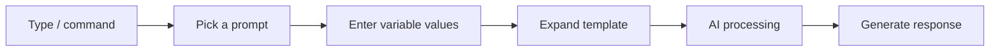

Prompts let you **save frequently used question patterns or instructions as templates** and invoke them quickly with `/` commands.
Sharing validated prompts with your team yields consistent-quality AI responses.



---

## What is a Prompt?

A prompt is a **reusable template** for the questions or instructions you send to the AI. Instead of typing long instructions every time, invoke them with a single command.

### Why Use Prompts?

| Benefit | Description |
|---------|-------------|
| **Time saving** | No need to retype long instructions each time |
| **Consistency** | Repeatedly produce same-format outputs |
| **Team collaboration** | Share effective prompts with teammates |
| **Quality** | Drive better answers with validated prompts |

---

## Prompt List

In **Workspace > Prompts**, view all prompts.

{/* SCREENSHOT: prompts-list */}
<Frame caption="Manage registered prompt templates in Workspace > Prompts">
  
</Frame>

| Item | Description | Example |
|------|-------------|---------|
| **Command** | Shortcut used to invoke | `/email-draft` |
| **Title** | Prompt name | "Business Email Draft" |
| **Author** | User who created the prompt | "By John Doe" |

---

## Creating a Prompt

<Steps>
  <Step title="Create a new prompt">
    In **Workspace > Prompts**, click the **+** button at the top-right.

    {/* SCREENSHOT: prompts-create */}
    <Frame caption="Enter command, title, and prompt content">
      
    </Frame>

    | Field | Description | Example |
    |-------|-------------|---------|
    | **Command** | Shortcut starting with `/` | `email-draft` |
    | **Title** | Prompt display name | "Business Email Draft" |

    <Warning>
      Commands can only contain **lowercase letters, digits, and hyphens (`-`)**. Korean characters, spaces, and special characters are not allowed.
    </Warning>
  </Step>

  <Step title="Write the prompt content">
    Write the prompt template. Markdown is supported.

    ```markdown
    Write a professional business email based on the following.

    ## Writing Rules
    - Polite and professional tone
    - Clear and concise sentences
    - Include appropriate greeting and closing

    ## Email Content
    {{content}}
    ```
  </Step>

  <Step title="Set variables (optional)">
    Use `{{variable_name}}` syntax to accept dynamic values.
    When using the prompt, real values are substituted at the variable positions.

    ```markdown
    Write an email to {{recipient}} regarding {{purpose}}.

    Content: {{content}}
    ```

    <Tip>
      Variable names can be in Korean. Examples: `{{recipient}}`, `{{topic}}`
    </Tip>

    #### System Variables

    The following built-in variables are filled automatically.

    | Variable | Description |
    |----------|-------------|
    | `{{CLIPBOARD}}` | Clipboard content |
    | `{{USER_NAME}}` | Current user's name |
    | `{{USER_LANGUAGE}}` | User's language setting |
    | `{{USER_LOCATION}}` | User's location |
    | `{{CURRENT_DATE}}` | Today's date |
    | `{{CURRENT_TIME}}` | Current time |
    | `{{CURRENT_DATETIME}}` | Current date and time |
    | `{{CURRENT_TIMEZONE}}` | Current timezone |
    | `{{CURRENT_WEEKDAY}}` | Current day of week |
  </Step>

  <Step title="Set access permissions">
    Choose the prompt's sharing scope.

    | Option | Description |
    |--------|-------------|
    | **Public** | All users can invoke via `/` command |
    | **Private** | Available only to selected groups or organizational units. If unspecified, only the creator can access |

    <Note>
      The Public option is only available to admins or users with the prompt-public permission (`sharing.public_prompts`).
    </Note>
  </Step>

  <Step title="Save">
    Click **Save and Create**.
  </Step>
</Steps>

---

## Using Prompts

### Invoke with `/`

Typing `/` in the chat input shows an autocomplete list of available prompts.

```
/email-draft Coordinate meeting schedule with the client
```

If the prompt has a `{{content}}` variable, the text after the command is substituted into that variable.

<Tip>
  When using prompts with multiple variables, press **Tab** after entering each variable's value to move to the next input.
</Tip>

---

## Prompt Examples

<Tabs>
  <Tab title="Email Drafting">
    **Command:** `/email-draft`

    ```markdown
    Write a professional business email based on the following.

    ## Requirements
    - Polite and professional tone
    - Clearly convey key content
    - Include appropriate greeting and closing
    - Specify next steps (Action Items) when needed

    ## Email Content
    {{content}}
    ```

    **Usage:**
    ```
    /email-draft Request to reschedule next week's meeting to Tuesday 2pm
    ```
  </Tab>

  <Tab title="Report Writing">
    **Command:** `/report`

    ```markdown
    Write a structured report on the following topic.

    ## Report Structure
    1. Executive Summary
    2. Current State Analysis
    3. Issues and Causes
    4. Improvement Plan
    5. Action Plan
    6. Expected Outcomes

    ## Topic
    {{topic}}
    ```
  </Tab>

  <Tab title="Code Review">
    **Command:** `/code-review`

    ```markdown
    Review the following code and suggest improvements.

    ## Review Perspectives
    1. **Readability**: Is the code easy to understand?
    2. **Efficiency**: Is there room for performance improvement?
    3. **Security**: Any security vulnerabilities?
    4. **Best Practices**: Follows conventions?
    5. **Error Handling**: Handles exceptions properly?

    ## Code
    {{code}}
    ```
  </Tab>

  <Tab title="Meeting Notes">
    **Command:** `/meeting-notes`

    ```markdown
    Summarize the following meeting content.

    ## Meeting Notes Format
    ### Meeting Info
    - Date/Time:
    - Attendees:
    - Agenda:

    ### Discussion
    ### Decisions
    ### Action Items
    | Owner | Task | Due |
    |-------|------|-----|

    ## Meeting Content
    {{content}}
    ```
  </Tab>

  <Tab title="Translation">
    **Command:** `/translate`

    ```markdown
    Translate the following text to {{target_lang}}.

    ## Translation Rules
    - Preserve original meaning and nuance
    - Use natural expressions
    - Handle technical terminology appropriately
    - Consider cultural context

    ## Original Text
    {{text}}
    ```
  </Tab>
</Tabs>

---

## Prompt Management

### Edit and Clone

- **Edit**: Click the **pencil icon** in the prompt list to open the edit page
- **Clone**: Choose **Clone** from the prompt menu (⋮) to create a new version

<Note>
  Users with write permission or admins can edit other users' prompts. If you don't have permission, **Clone** to create your own version, then modify.
</Note>

### Export / Import

Export and import prompts as JSON files.

- Share prompts with teammates
- Back up and restore
- Move to other environments

<Note>
  Bulk export/import is **admin-only**. Individual prompt export is available to all users from the prompt menu (⋮).
</Note>

### Delete

Delete prompts no longer needed. The creator, users with write permission, or admins can delete.

---

## Tips for Effective Prompts

<Accordion title="1. Define a role">
  Giving the AI a clear role yields more expert answers.

  ```markdown
  You are a marketing expert with 10 years of experience.
  ```
</Accordion>

<Accordion title="2. Concrete instructions">
  Describe the desired output specifically. State length, tone, and content to include.

  ```markdown
  ## Requirements
  - About 500 words
  - Professional yet friendly tone
  - Include 3 key messages
  ```
</Accordion>

<Accordion title="3. Specify output format">
  Specifying the format (table, list, markdown) yields consistent results.

  ```markdown
  ## Output Format
  | Item | Content |
  |------|---------|
  | Title | ... |
  | Body | ... |
  ```
</Accordion>

<Accordion title="4. Provide examples">
  Showing examples of the desired output helps the AI understand format and style precisely.

  ```markdown
  ## Examples
  Input: "Project Meeting"
  Output: "Project A — 2nd Iteration Status Sync"
  ```
</Accordion>

<Accordion title="5. State constraints">
  Telling the AI what to avoid prevents undesired output.

  ```markdown
  ## Restrictions
  - Minimize jargon
  - No profanity
  - No PII
  ```
</Accordion>

---

## Sharing Prompts with the Team

### Access Permissions

Set access at prompt creation to specify the sharing scope.

| Option | Description |
|--------|-------------|
| **Public** | All users can invoke via `/` command |
| **Private** | Available only to selected groups/organizational units. If unspecified, only the creator can access |

---

## FAQ

<AccordionGroup>
  <Accordion title="Can I use Korean characters in prompt commands?" icon="circle-question">
    No. Commands only allow **lowercase letters, digits, and hyphens (`-`)**. Examples: `/email-draft`, `/code-review`, `/meeting-notes`
  </Accordion>

  <Accordion title="Can I include files in prompts?" icon="circle-question">
    The prompt template itself can't include files, but you can attach files alongside the prompt when using it.
  </Accordion>

  <Accordion title="Can I edit someone else's prompts?" icon="circle-question">
    Only with write permission granted, or as an admin. Without permission, **Clone** to create your own version, then modify.
  </Accordion>

  <Accordion title="Can variables hold long text?" icon="circle-question">
    Yes — there's no length limit for text input into variables. You can pass an entire document as a variable.
  </Accordion>
</AccordionGroup>

---

## Next Steps

<Columns cols={2}>
  <Card title="Use Prompts in Agents" icon="robot" href="/en/workspace/agents">
    Apply validated instructions to an agent's system prompt
  </Card>
  <Card title="Chat Advanced Features" icon="comments" href="/en/chat/capabilities">
    Use advanced chat features like web search and file attachment
  </Card>
</Columns>
