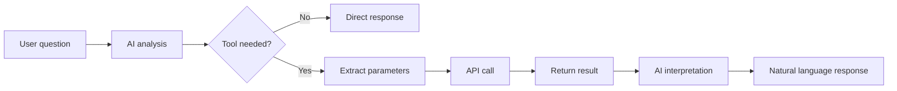

Tool integration lets the AI invoke external system functions (Function Calling).
Connect a REST API based on an OpenAPI spec or an MCP (Model Context Protocol) server, and the AI automatically calls tools at the right moment during a conversation.



---

## What is a Tool?

A tool is an interface that extends the AI's capabilities to external systems. The AI can fetch real-time information beyond its training data or trigger actions on external systems.

### Use Cases

| Connect to | What's Possible |
|-----------|------------------|
| **CRM system** | Look up customer info, register sales opportunities |
| **Ticket system** | Create issues, update status |
| **HR system** | Submit leave requests, look up employee info |
| **Weather/stock APIs** | Provide real-time external data |
| **Internal data APIs** | Look up business data like sales, inventory |

### Supported Protocols

<Columns cols={2}>
  <Card title="OpenAPI" icon="plug">
    Standard REST API spec (formerly Swagger). The general-purpose protocol most web services provide.
  </Card>
  <Card title="MCP" icon="link">
    Model Context Protocol. AI-dedicated tool server protocol with safer and more efficient integration.
  </Card>
</Columns>

---

## Tool List

In **Workspace > Tools**, view all registered tool integrations.

<Frame caption="Manage registered tool integrations in Workspace > Tools">
  
</Frame>

Each tool in the list shows:

| Item | Description |
|------|-------------|
| **Name** | Tool display name |
| **Description** | Tool purpose |
| **Author** | User who created the tool |
| **Modified** | Last modified time (relative) |

There's a search box at the top of the list to find tools by name or description.
The menu (`...`) on each tool card lets you **delete**.

---

## Creating a Tool

Tool creation has two steps: enter basic info (CreateTool), then configure the connection on the detail page (ToolDetail).

<Steps>
  <Step title="Create a new tool">
    Click the **+** button at the top-right of the **Workspace > Tools** list.

    Fill in the create form.

    <Frame caption="Set tool name, description, and access permissions">
      
    </Frame>

    | Field Label | Description | Example |
    |-------------|-------------|---------|
    | **What does this tool do?** (name) | Tool display name | "Customer Management API" |
    | **How can this tool be used?** (description) | Tool purpose | "Look up and manage customer info in the CRM system" |
    | **Access** | Public, or restricted to specific groups/users | Public, or specified groups/users |

    <Note>Access is split into Public and Private (specific groups/users). For Private, you can refine Read and Write permissions per group/user.</Note>

    Clicking **Create Tool** creates the tool and auto-redirects to the detail settings page.
  </Step>

  <Step title="Configure the connection on the detail page">
    Set up the actual connection on the auto-loaded detail page (`/workspace/tools/{id}`).
    See the [OpenAPI Tool Connection](#openapi-tool-connection) and [MCP Tool Connection](#mcp-tool-connection) sections below for the detail page configuration.
  </Step>
</Steps>

---

## OpenAPI Tool Connection

How to connect a REST API that provides an OpenAPI (formerly Swagger) spec.
Configure the following on the tool detail page.

<Frame caption="On the tool detail page, configure connection type, URL, auth, and Tool Description">
  
</Frame>

### Connection Settings

| Field | Description | Default |
|-------|-------------|---------|
| **Connection Type** | OpenAPI or MCP dropdown | OpenAPI |
| **API Base URL** | OpenAPI server's base URL | — |
| **OpenAPI Spec Path** | Path to the OpenAPI spec file | `openapi.json` |
| **Auth Type** | Authentication method | Bearer Token |
| **API Key** | Token value when using Bearer Token | — |
| **Enabled** | Toggle connection enable/disable | Enabled |

<Tabs>
  <Tab title="Bearer Token Auth">
    Enter the Bearer token in the API Key field. It's sent as the `Authorization: Bearer <token>` header on API calls.

    ```
    API Base URL: https://api.example.com
    OpenAPI Spec Path: openapi.json
    Auth Type: Bearer Token
    API Key: sk-xxxxxxxxxxxxxxxx
    ```
  </Tab>
  <Tab title="Session Auth">
    Uses the current signed-in user's session credentials directly. No separate API key entry needed.
    Suitable when an internal API server uses the same auth scheme as Cloosphere.
  </Tab>
</Tabs>

### Test Connection and Verify Functions

After configuration, click the **Test Connection** button.

When the connection succeeds, the **Available Functions** panel on the right auto-displays the API endpoint list.
Each function shows HTTP method (GET, POST, etc.), name, description, and path. Hover to see parameter details.

<Frame caption="On successful connection, the available API endpoint list is displayed automatically">
  
</Frame>

---

## MCP Tool Connection

MCP (Model Context Protocol) is a dedicated protocol for communication between AI models and external tools.
On the tool detail page, change **Connection Type** to **MCP** and configure the following.

<Frame caption="Change Connection Type to MCP and configure server URL and authentication">
  
</Frame>

### Connection Settings

| Field | Description | Default |
|-------|-------------|---------|
| **Connection Type** | Select MCP | — |
| **MCP Server URL** | MCP server URL (SSE endpoint) | — |
| **Auth Type** | Auth method (None / Bearer Token / API Key) | None |
| **Token / API Key** | Auth value per method | — |
| **Additional Headers** | Extra HTTP headers (optional) | — |
| **Enabled** | Toggle connection enable/disable | Enabled |

### MCP Authentication Methods

<Tabs>
  <Tab title="None">
    Connect to the MCP server without auth. Suitable for local or internal-network MCP servers.
  </Tab>
  <Tab title="Bearer Token">
    Auth using a Bearer token. The token is sent as the `Authorization: Bearer <token>` header on requests.
  </Tab>
  <Tab title="API Key">
    Auth using an API key. The key is sent in an auth header per the server's requirements.
  </Tab>
</Tabs>

### Additional Headers

If the MCP server requires custom headers, enter them in the **Additional Headers** field. One per line in `key: value` form.

```
X-Custom-Header: value
X-Another-Header: another-value
```

### Test Connection

Click **Test Connection** to connect to the MCP server and fetch the list of provided tools.
On success, the MCP tool list is shown in the **Available Functions** panel on the right.

---

## Tool Description (for the agent)

The **Tool Description** field at the top of the tool detail page is used by the agent to decide when to use this tool server.

- Write the description directly, or click the **AI** button to auto-generate based on the connected function list
- For AI generation, choose the model from the dropdown (default: system default model)
- AI generation is only possible after Test Connection has loaded the function list

<Tip>
  A well-written Tool Description improves the agent's accuracy in choosing the right tool at the right time.
  Example: "Use when project issue management, message sending, or API integration is needed."
</Tip>

---

## Using Tools

### Connect a Tool to an Agent

When you connect a tool to an agent, the AI auto-invokes it at appropriate moments during a conversation.

1. In **Workspace > Agents**, open the agent edit screen
2. Pick the tool to connect in the **Tools** section
3. Save

### Tool Invocation in Chat

The AI analyzes the user's question, decides if a tool is needed, and calls it automatically when so.

```
User: Look up customer ID 12345

AI: [Calling CRM API...]

Customer info retrieved:

| Item | Value |
|------|-------|
| Name | John Doe |
| Email | hong@example.com |
| Tier | VIP |
| Last purchase | 2024-01-15 |
```

---

## Tool Management

### Edit

Click a card in the tool list to go to the detail page where you can edit connection settings, name, description, Tool Description, and more.
Save changes with the **Save** button at the top-right of the detail page.

### Delete

In the tool list, click the menu (`...`) on the right of a card and select **Delete**.
Confirm in the deletion dialog and the tool is permanently deleted.

### Change Access

Click the **Access** button at the top-right of the detail page to change access permissions.
Specify Read and Write permissions per group/user, or set to Public.

---

## Security Considerations

| Security Feature | Description |
|------------------|-------------|
| **Encrypted communication** | All API calls are TLS-encrypted |
| **Credential storage** | API keys are stored as JSON in the database |
| **Access control** | Restrict tool usage by Read/Write permissions |

<Warning>
  API keys are stored as plain text — rotate them regularly.
  Connect only APIs within private networks, and use IP allowlisting or VPN/Private Endpoint when needed.
  Restrict database access appropriately to protect credentials.
</Warning>

---

## Troubleshooting

<AccordionGroup>
  <Accordion title="Connection failed" icon="triangle-exclamation">
    | Cause | Solution |
    |-------|----------|
    | URL error | Re-verify API Base URL and OpenAPI Spec Path |
    | Auth failure | Check API key/token validity |
    | Network | Check firewall/proxy settings |
    | CORS | Check server-side CORS settings |
  </Accordion>

  <Accordion title="API call failed" icon="triangle-exclamation">
    | Cause | Solution |
    |-------|----------|
    | Insufficient permissions | Check API permissions (scope) |
    | Rate Limit | Throttle call frequency |
    | Server error | Check external service status |
  </Accordion>

  <Accordion title="MCP server connection failed" icon="triangle-exclamation">
    | Cause | Solution |
    |-------|----------|
    | URL format | Check SSE endpoint URL format (e.g., `https://mcp.example.com/sse`) |
    | Auth method mismatch | Confirm config matches the server's required auth (None/Bearer Token/API Key) |
    | Connection disabled | Verify the Enabled toggle is on |
  </Accordion>
</AccordionGroup>

---

## FAQ

<AccordionGroup>
  <Accordion title="Can I connect any API?" icon="circle-question">
    Any API providing an OpenAPI (Swagger) spec can be connected.
    Without a spec, build your own MCP server or write the OpenAPI spec separately.
  </Accordion>

  <Accordion title="Are there API call costs?" icon="circle-question">
    The external service's pricing applies when using its API.
    Cloosphere itself charges no extra cost for tool calls.
  </Accordion>

  <Accordion title="Is sensitive data safe?" icon="circle-question">
    All communication is TLS-encrypted, and access can be finely controlled to limit usage.
    Combined with guardrails, you can further prevent sensitive info leaks.
  </Accordion>

  <Accordion title="Should I use OpenAPI or MCP?" icon="circle-question">
    If you already have a REST API providing an OpenAPI spec, choose OpenAPI.
    If you're building a new AI-dedicated tool server or already have an MCP-compatible server, choose MCP.
  </Accordion>
</AccordionGroup>

---

## Next Steps

<Columns cols={3}>
  <Card title="Connect a Tool to an Agent" icon="robot" href="/en/workspace/agents">
    Extend AI capabilities by connecting tools to agents
  </Card>
  <Card title="Admin Tool Servers" icon="gear" href="/en/admin/settings/tools">
    Global tool server settings (Admin)
  </Card>
  <Card title="Tracing" icon="chart-line" href="/en/monitoring/tracing">
    Step-by-step tracking of tool invocation
  </Card>
</Columns>
