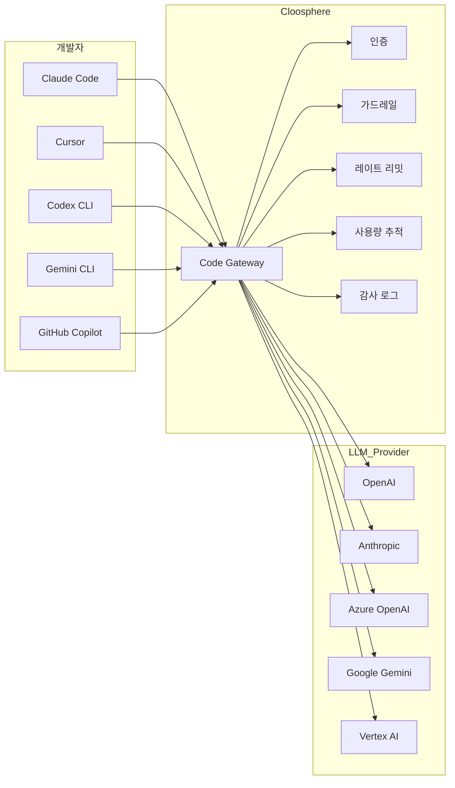
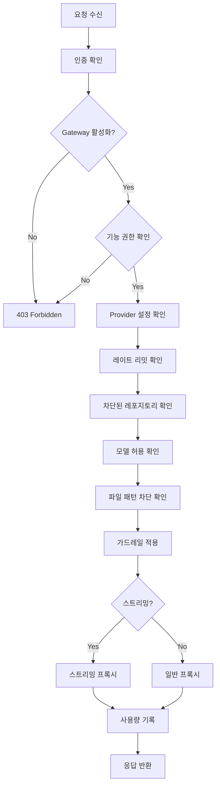

Code Gateway는 AI 코딩 CLI 도구(Claude Code, Cursor, Codex CLI, Gemini CLI, GitHub Copilot 등)의 LLM API 요청을 Cloosphere를 경유하도록 하는 엔터프라이즈 프록시 게이트웨이입니다. 가드레일, 사용량 추적, 감사 로그, 레이트 리밋을 통해 AI 코딩 도구의 사용을 중앙에서 관리합니다.

<Frame caption="Code Gateway 설정 메인 화면">
  
</Frame>

---

## 개념



| 구성 요소 | 설명 |
|----------|------|
| **개발자** | AI 코딩 도구에서 Cloosphere Code Gateway를 BASE_URL로 설정 |
| **Code Gateway** | 인증, 가드레일, 레이트 리밋, 사용량 추적을 수행한 후 upstream provider로 프록시 |
| **LLM Provider** | 실제 LLM API를 제공하는 서비스 (OpenAI, Anthropic, Azure 등) |

<Note>
  Code Gateway는 백엔드 API 전용이며, Cloosphere 웹 UI에서의 채팅과는 별도로 동작합니다. 관리자 설정에서만 구성하며, 사용자는 자신의 코딩 도구에 Cloosphere API 키를 설정하여 사용합니다.
</Note>

---

## 활성화 및 설정

### Code Gateway 활성화

<Steps>
  <Step title="관리자 설정 진입">
    관리자 패널에서 **Code Gateway** 설정 페이지로 이동합니다.
  </Step>
  <Step title="게이트웨이 활성화">
    **"Code Gateway 활성화"** 토글을 켭니다.
  </Step>
  <Step title="Provider 추가">
    **"+ Provider 추가"**를 클릭하여 LLM Provider를 등록합니다.
  </Step>
  <Step title="보안 설정">
    허용 모델, 레이트 리밋, 가드레일, 파일 패턴 차단을 구성합니다.
  </Step>
</Steps>

<Frame caption="Code Gateway 활성화 및 전체 설정">
  
</Frame>

### 전역 설정

| 설정 | 설명 | 기본값 |
|------|------|:------:|
| **활성화** | Code Gateway ON/OFF | OFF |
| **허용 모델** | 사용 가능한 모델 목록 (비어있으면 전체 허용) | 전체 |
| **레이트 리밋** | 사용자당 분당 최대 요청 수 (0 = 무제한) | 0 |
| **가드레일** | 적용할 가드레일 ID 목록 | 없음 |
| **파일 패턴 차단** | 차단할 파일 패턴 (glob 형식) | 없음 |
| **파일 차단 동작** | 차단 시 동작 (block / warn) | block |
| **차단된 레포지토리** | AI 코딩 도구 사용을 차단할 레포지토리 패턴 | 없음 |
| **레포지토리 메타데이터 필수** | 헬퍼 스크립트 미설정 시 요청 차단 | OFF |

---

## Provider 설정

Provider는 Code Gateway가 요청을 전달할 upstream LLM 서비스입니다. 여러 Provider를 동시에 등록할 수 있으며, 각 Provider는 고유한 `provider_id`로 식별됩니다.

### 지원 Provider

| 타입 | 서비스 | 인증 방식 |
|------|--------|----------|
| **openai** | OpenAI, OpenAI-compatible 엔드포인트 | Bearer token |
| **anthropic** | Anthropic API | x-api-key 헤더 |
| **gemini** | Google Gemini API | x-goog-api-key 헤더 |
| **azure_openai** | Azure OpenAI Service | api-key 헤더 |
| **azure_ai_foundry** | Azure AI Foundry | api-key 헤더 |
| **vertex_ai** | Google Vertex AI (네이티브) | GCP Service Account |

### Provider 프리셋

Provider 추가 시 프리셋을 선택하면 타입과 기본 URL이 자동으로 설정됩니다.

<Note>
  **Azure AI Foundry**는 두 가지 서브 프리셋으로 나뉩니다:
  - **Azure AI Foundry - OpenAI**: OpenAI 호환 모델용 (`openai` 타입). Cursor, Codex CLI, GitHub Copilot에서 사용.
  - **Azure AI Foundry - Claude**: Claude 모델용 (`azure_ai_foundry` 타입). Claude Code, Cursor에서 사용.

  동일한 AI Foundry 엔드포인트라도 사용하는 모델에 따라 적합한 프리셋을 선택하세요.
</Note>

### Provider 추가

<Frame caption="Code Gateway Provider 추가">
  
</Frame>

<Tabs>
  <Tab title="OpenAI / Anthropic / Gemini">

    | 설정 | 설명 |
    |------|------|
    | **Provider ID** | 고유 식별자 (URL 경로에 사용) |
    | **타입** | openai / anthropic / gemini |
    | **API URL** | Provider API 엔드포인트 |
    | **API Key** | 인증 키 |
    | **모델 ID** | 이 Provider에서 허용할 모델 목록 (비어있으면 전체) |
    | **활성화** | Provider ON/OFF |

  </Tab>
  <Tab title="Azure OpenAI">

    | 설정 | 설명 |
    |------|------|
    | **Provider ID** | 고유 식별자 |
    | **타입** | azure_openai |
    | **API URL** | Azure 엔드포인트 (`https://{name}.openai.azure.com`) |
    | **API Key** | Azure API 키 |
    | **API Version** | API 버전 (예: `2024-12-01-preview`) |
    | **Deployment Map** | 모델명 → 배포명 매핑 (선택) |

  </Tab>
  <Tab title="Vertex AI">

    | 설정 | 설명 |
    |------|------|
    | **Provider ID** | 고유 식별자 |
    | **타입** | vertex_ai |
    | **Project ID** | GCP 프로젝트 ID |
    | **Location** | GCP 리전 (기본: us-central1) |
    | **Service Account Key** | GCP 서비스 계정 JSON 키 |
    | **글로벌 GCP 키 사용** | 서버의 글로벌 GCP 키를 fallback으로 사용 |

  </Tab>
</Tabs>

---

## 개발자 사용법

개발자는 AI 코딩 도구의 BASE_URL을 Cloosphere Code Gateway로 설정하고, Cloosphere API 키를 사용합니다.

### 엔드포인트 구조

```
{CLOOSPHERE_URL}/api/v1/code-gateway/{provider_id}/{path}
```

**예시:**
- OpenAI Provider: `https://cloosphere.company.com/api/v1/code-gateway/openai/v1/chat/completions`
- Anthropic Provider: `https://cloosphere.company.com/api/v1/code-gateway/anthropic/v1/messages`

### 인증

Code Gateway는 다음 네 가지 방식으로 API 키를 전달받습니다 (우선순위 순).

| 방식 | 헤더/파라미터 | 사용 도구 |
|------|-------------|----------|
| **Bearer Token** | `Authorization: Bearer {api_key}` | Cursor, Codex CLI, GitHub Copilot |
| **x-api-key** | `x-api-key: {api_key}` | Claude Code (Anthropic SDK) |
| **x-goog-api-key** | `x-goog-api-key: {api_key}` | Gemini CLI |
| **Query Parameter** | `?key={api_key}` | Fallback |

<Tip>
  API 키는 Cloosphere 사용자 설정의 **"API 키"** 섹션에서 생성합니다. Provider의 원본 API 키가 아닌 Cloosphere API 키를 사용하세요.
</Tip>

### 도구별 설정 예시

<Tabs>
  <Tab title="Claude Code">
    ```bash
    # .bashrc 또는 .zshrc
    export ANTHROPIC_BASE_URL="https://cloosphere.company.com/api/v1/code-gateway/anthropic"
    export ANTHROPIC_API_KEY="sk-cloosphere-..."
    ```
  </Tab>
  <Tab title="Cursor">
    Cursor 설정에서 **Override OpenAI Base URL**을 다음으로 설정:
    ```
    https://cloosphere.company.com/api/v1/code-gateway/openai/v1
    ```
    API Key를 Cloosphere API 키로 설정합니다.
  </Tab>
  <Tab title="Codex CLI">
    ```bash
    export OPENAI_BASE_URL="https://cloosphere.company.com/api/v1/code-gateway/openai/v1"
    export OPENAI_API_KEY="sk-cloosphere-..."
    ```
  </Tab>
  <Tab title="Gemini CLI">
    ```bash
    export GOOGLE_GEMINI_BASE_URL="https://cloosphere.company.com/api/v1/code-gateway/gemini"
    export GEMINI_API_KEY="sk-cloosphere-..."
    ```
  </Tab>
  <Tab title="GitHub Copilot">
    GitHub Copilot CLI는 OpenAI 호환 엔드포인트를 통해 연결합니다:
    ```bash
    export OPENAI_BASE_URL="https://cloosphere.company.com/api/v1/code-gateway/openai/v1"
    export OPENAI_API_KEY="sk-cloosphere-..."

    # Start GitHub Copilot CLI
    gh copilot
    ```
  </Tab>
</Tabs>

### Claude Code 셋업 스크립트

Claude Code 사용자를 위한 자동 셋업 스크립트를 제공합니다. 스크립트는 헬퍼 스크립트 설치와 `~/.claude/settings.json` 설정을 자동으로 수행합니다.

<Tabs>
  <Tab title="Linux / macOS">
    ```bash
    # 1. 환경 변수 설정
    export ANTHROPIC_AUTH_TOKEN="sk-cloosphere-..."
    export ANTHROPIC_BASE_URL="https://cloosphere.company.com/api/v1/code-gateway/anthropic"

    # 2. 셋업 스크립트 실행
    curl -s https://cloosphere.company.com/api/v1/code-gateway/setup-script | bash
    ```
  </Tab>
  <Tab title="Windows (PowerShell)">
    ```powershell
    # 1. 환경 변수 설정
    $env:ANTHROPIC_AUTH_TOKEN = "sk-cloosphere-..."
    $env:ANTHROPIC_BASE_URL = "https://cloosphere.company.com/api/v1/code-gateway/anthropic"

    # 2. 셋업 스크립트 실행
    irm "https://cloosphere.company.com/api/v1/code-gateway/setup-script?os=powershell" | iex
    ```
  </Tab>
</Tabs>

셋업 스크립트가 수행하는 작업:

1. **헬퍼 스크립트 설치** (`~/cloosphere-helper.sh` 또는 `~/cloosphere-helper.ps1`): 레포지토리 메타데이터(Git remote URL, 작업 디렉토리)를 API 키에 자동 첨부
2. **`~/.claude/settings.json` 구성**: `ANTHROPIC_AUTH_TOKEN`, `ANTHROPIC_BASE_URL`, `apiKeyHelper` 자동 설정

<Tip>
  헬퍼 스크립트는 레포지토리 메타데이터 기반 차단 정책(`blocked_repos`, `require_repo_metadata`)이 활성화된 환경에서 필수입니다.
</Tip>

---

## 보안 기능

### 가드레일

Code Gateway에 가드레일을 적용하여 코딩 도구의 입력에서 PII 감지, 콘텐츠 필터링 등을 수행합니다. [가드레일 관리](/ko/workspace/guardrails)에서 생성한 가드레일 ID를 지정합니다.

가드레일 위반, 파일 패턴 차단, 레포지토리 차단 등의 이벤트는 모두 **모니터링 > 가드레일 로그** 탭에서 확인할 수 있습니다.

<Frame caption="Code Gateway 보안 설정">
  
</Frame>

### 허용 모델

특정 모델만 사용하도록 제한합니다. 전역 레벨과 Provider 레벨에서 각각 설정할 수 있습니다.

| 레벨 | 설정 필드 | 설명 |
|------|----------|------|
| **전역 허용 모델** | `allowed_models` | Code Gateway 전체에서 사용 가능한 모델 (전역 설정) |
| **Provider 모델 ID** | `model_ids` | 특정 Provider에서 허용할 모델 (Provider별 설정) |

<Note>
  `allowed_models`(전역)과 `model_ids`(Provider별) 모두에서 모델 제한이 설정된 경우, 양쪽 모두에서 허용된 모델만 사용 가능합니다. `allowed_models`는 Code Gateway 전체 정책이고, `model_ids`는 개별 Provider 내에서의 추가 제한입니다.
</Note>

### 레이트 리밋

사용자당 분당 최대 요청 수를 제한합니다. 60초 슬라이딩 윈도우 기반으로 동작합니다.

<Warning>
  레이트 리밋은 인메모리 방식이므로 서버 재시작 시 리셋됩니다.
</Warning>

### 파일 패턴 차단

코딩 도구가 전송하는 파일 내용에서 특정 패턴의 파일을 차단합니다. glob 형식으로 패턴을 지정합니다.

| 설정 | 설명 | 예시 |
|------|------|------|
| **패턴** | 차단할 파일 경로 패턴 | `*.env`, `*credentials*`, `*.pem` |
| **동작** | block (요청 차단) 또는 warn (로그만 기록) | block |

### 차단된 레포지토리

특정 Git 레포지토리에서의 AI 코딩 도구 사용을 차단합니다. 헬퍼 스크립트를 통해 전달되는 레포지토리 메타데이터(repo URL, 작업 디렉토리)를 기반으로 매칭합니다.

| 설정 | 설명 | 예시 |
|------|------|------|
| **차단 패턴** | 차단할 레포지토리 URL 또는 경로 패턴 (부분 문자열 매칭) | `secret-project`, `github.com/org/private-repo` |

패턴은 대소문자 구분 없이 레포지토리 URL과 작업 디렉토리 경로에 대해 부분 문자열 매칭됩니다. Git SSH URL(`git@github.com:org/repo.git`)도 자동으로 정규화하여 매칭합니다.

<Note>
  차단된 레포지토리 접근은 **가드레일 로그**에 자동 기록됩니다.
</Note>

### 레포지토리 메타데이터 필수

`require_repo_metadata`를 활성화하면, 헬퍼 스크립트를 통한 레포지토리 메타데이터가 없는 요청을 차단합니다. 이를 통해 모든 Code Gateway 사용자가 헬퍼 스크립트를 설정하도록 강제할 수 있습니다.

<Warning>
  이 옵션을 활성화하면 헬퍼 스크립트가 설정되지 않은 사용자의 요청이 모두 차단됩니다. 활성화 전 사용자에게 헬퍼 스크립트 설정을 안내하세요.
</Warning>

---

## 사용량 추적

Code Gateway를 통한 모든 요청은 자동으로 사용량이 기록됩니다. 관리자는 사용 로그를 조회하여 팀별, 사용자별, 모델별 사용 현황을 확인할 수 있습니다.

| 항목 | 설명 |
|------|------|
| **사용자** | 요청한 사용자 |
| **모델** | 사용된 LLM 모델 |
| **Provider** | 사용된 Provider |
| **입력/출력 토큰** | 요청/응답 토큰 수 |
| **시간** | 요청 시간 |

### 사용량 통계

기간별 사용량 통계를 조회하여 비용과 사용 추이를 분석합니다.

### 필터

| 필터 | 설명 |
|------|------|
| **사용자** | 특정 사용자로 필터링 |
| **모델** | 특정 모델로 필터링 |
| **기간** | 시작일 ~ 종료일 |

---

## 프록시 처리 흐름

Code Gateway가 요청을 처리하는 전체 흐름입니다.



---

## 트러블슈팅

<Accordion title="403 Forbidden: Code Gateway is disabled">
  관리자 설정에서 Code Gateway가 비활성화 상태입니다. 관리자에게 활성화를 요청하세요.
</Accordion>

<Accordion title="403 Forbidden: Code Gateway access not permitted">
  사용자의 기능 권한에 Code Gateway 접근이 허용되지 않았습니다. 관리자가 그룹 권한 설정에서 `features.code_gateway`를 활성화해야 합니다.
</Accordion>

<Accordion title="404 Not Found: Provider not found">
  요청 URL의 `provider_id`가 등록된 Provider와 일치하지 않습니다. Provider ID를 확인하세요.
</Accordion>

<Accordion title="403 Forbidden: Model not allowed">
  요청한 모델이 전역 허용 모델 또는 Provider 허용 모델 목록에 포함되지 않았습니다. 관리자에게 모델 추가를 요청하세요.
</Accordion>

<Accordion title="429 Too Many Requests: Rate limit exceeded">
  분당 요청 한도를 초과했습니다. 잠시 대기 후 재시도하세요.
</Accordion>

<Accordion title="403 Forbidden: Repository metadata is required">
  `require_repo_metadata`가 활성화되었으나 헬퍼 스크립트가 설정되지 않았습니다. Claude Code 셋업 스크립트를 실행하여 헬퍼 스크립트를 설치하세요.
</Accordion>

<Accordion title="403 Forbidden: AI coding tool usage is blocked for repository">
  요청의 레포지토리 URL 또는 작업 디렉토리가 `blocked_repos` 패턴과 일치합니다. 관리자에게 차단 해제를 요청하세요.
</Accordion>
