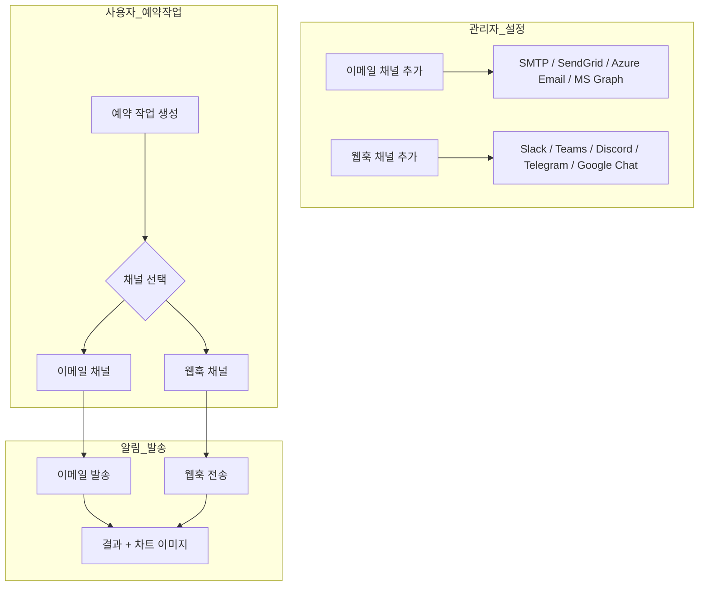

알림 시스템은 예약 작업 결과를 이메일과 웹훅을 통해 자동으로 전달합니다. 관리자가 알림 채널을 사전 구성하면, 사용자는 예약 작업 생성 시 채널을 선택하여 결과 알림을 받을 수 있습니다.

<Frame caption="알림 설정 메인 화면">
  
</Frame>

---

## 알림 아키텍처

| 단계 | 담당 | 설명 |
|------|------|------|
| **채널 설정** | 관리자 | SMTP, SendGrid, Azure Email, Slack 등 채널 사전 구성 |
| **채널 선택** | 사용자 | 예약 작업에서 알림 채널과 트리거 조건 지정 |
| **알림 발송** | 시스템 | 예약 작업 실행 후 결과를 선택된 채널로 전달 |

---

## 이메일 채널

**관리자 > 설정 > 알림** 또는 별도 알림 관리 화면에서 이메일 채널을 추가합니다. 여러 채널을 등록하여 팀별로 다른 발신 설정을 사용할 수 있습니다.

### 채널 추가

이메일 섹션 우측의 **"+"** 아이콘 버튼을 클릭합니다. (툴팁: "Add Email Channel")

<Frame caption="이메일 채널 추가">
  
</Frame>

| 필드 | 설명 |
|------|------|
| **채널 이름** | 식별 이름 (예: "기본", "마케팅팀 메일") |
| **Email Provider** | SMTP, SendGrid, Azure Email, MS Graph 중 선택 |

### 제공자별 설정

<Tabs>
  <Tab title="SMTP">
    사내 메일 서버 또는 외부 SMTP 서비스(Gmail, Outlook 등)를 연결합니다.

    | 설정 | 설명 | 예시 |
    |------|------|------|
    | **서버** | SMTP 서버 주소 | smtp.gmail.com |
    | **포트** | SMTP 포트 | 587 (TLS) / 465 (SSL) |
    | **사용자명** | 인증 계정 | noreply@company.com |
    | **비밀번호** | 인증 비밀번호 | |
    | **TLS 사용** | TLS 암호화 활성화 | 포트 587에서 사용 |
    | **SSL 사용** | SSL 암호화 활성화 | 포트 465에서 사용 |
    | **발신자 주소** | From 이메일 주소 | noreply@company.com |
    | **발신자 이름** | From 이름 | Cloosphere |

    <Warning>
      TLS와 SSL은 동시에 사용할 수 없습니다. 포트 587에는 TLS, 포트 465에는 SSL을 사용하세요.
    </Warning>
  </Tab>
  <Tab title="SendGrid">
    SendGrid API를 사용한 이메일 발송입니다.

    | 설정 | 설명 |
    |------|------|
    | **API 키** | SendGrid API 키 |
    | **발신자 주소** | SendGrid에서 인증된 발신자 이메일 |
    | **발신자 이름** | From 이름 |
  </Tab>
  <Tab title="Azure Email">
    Azure Communication Services를 사용한 이메일 발송입니다.

    | 설정 | 설명 |
    |------|------|
    | **Connection String** | Azure Communication Services 연결 문자열 |
    | **발신자 주소** | Azure에서 프로비저닝된 발신자 이메일 (예: `DoNotReply@your-domain.azurecomm.net`) |
    | **발신자 이름** | From 이름 |
  </Tab>
  <Tab title="MS Graph">
    Microsoft 365 사서함에서 직접 발송합니다 — 사내 도메인 발신자 주소를 그대로 쓸 수 있어 SPF/DKIM 설정 부담이 없습니다.

    | 설정 | 설명 |
    |------|------|
    | **Tenant ID** | Microsoft Entra ID 테넌트 ID (GUID) |
    | **Client ID** | Entra 앱 등록의 Application(Client) ID |
    | **Client Secret** | Entra 앱의 클라이언트 시크릿 (저장 시 자동 마스킹) |
    | **Sender Email** | 발신할 사서함의 이메일 주소 (예: `noreply@your-domain.com`) |
    | **발신자 이름** | From 이름 |

    <Note>
      Entra 앱에 **`Mail.Send`** Application 권한이 부여되고 관리자 동의가 완료되어 있어야 합니다. 사용자 위임이 아닌 앱 권한 방식이므로, sender email로 지정한 사서함에서 시스템이 직접 메일을 보낼 수 있어야 합니다.
    </Note>
  </Tab>
</Tabs>

### Test Connection

**"Test"** 버튼으로 메일 서버 연결 상태를 확인합니다.

<Note>
  Test Connection과 Send Test Email은 채널을 저장한 후 편집 모드에서만 사용할 수 있습니다. 새 채널을 추가할 때는 먼저 저장(Save)한 뒤, 채널을 다시 열어 테스트하세요.
</Note>

| 결과 | 설명 |
|------|------|
| **성공** | 서버 연결, 인증 모두 정상 |
| **인증 실패** | 사용자명/비밀번호 확인 필요 |
| **연결 실패** | 서버 주소, 포트, 방화벽 확인 필요 |
| **타임아웃** | 네트워크 연결 확인 필요 |

### Send Test Email

**"Send Test Email"** 섹션에서 수신자 주소를 입력하고 **"Send"** 버튼으로 실제 이메일 수신을 확인합니다.

<Steps>
  <Step title="수신자 이메일 입력">
    테스트 이메일을 받을 주소를 입력합니다.
  </Step>
  <Step title="Send 클릭">
    **"Send"** 버튼을 클릭합니다.
  </Step>
  <Step title="수신 확인">
    받은 편지함(스팸함 포함)에서 테스트 이메일 수신을 확인합니다.
  </Step>
</Steps>

---

## 웹훅 채널

외부 메시징 서비스와 연동하여 알림을 전송합니다.

### 채널 추가

웹훅 섹션 우측의 **"+"** 아이콘 버튼을 클릭합니다. (툴팁: "Add Webhook Channel")

<Frame caption="웹훅 채널 추가">
  
</Frame>

| 필드 | 설명 |
|------|------|
| **채널 이름** | 식별 이름 (예: "개발팀 Slack") |
| **제공자** | Slack / Microsoft Teams / Discord / Telegram / Google Chat |
| **웹훅 URL** | 제공자에서 발급받은 수신 웹훅 URL (Telegram 제외 -- 하단 참조) |

<Note>
  Telegram은 웹훅 URL 대신 **Bot Token**과 **Chat ID**를 사용합니다. Telegram을 선택하면 입력 폼이 자동으로 변경됩니다.
</Note>

### 제공자별 설정

<Tabs>
  <Tab title="Slack">
    **웹훅 URL 생성:**
    1. Slack 앱 관리 페이지에서 **Incoming Webhooks** 활성화
    2. **Add New Webhook to Workspace** 클릭
    3. 채널 선택 후 **Allow**
    4. 생성된 URL 복사 (`https://hooks.slack.com/services/...`)

    **알림 형식:** Header 블록 + Fields (프롬프트, 완료 시간) + Section (결과) + 차트 이미지
  </Tab>
  <Tab title="Teams">
    **웹훅 URL 생성:**
    1. Teams 채널에서 **커넥터** 또는 **워크플로우** 설정
    2. **Incoming Webhook** 추가
    3. 이름 지정 후 **만들기**
    4. 생성된 URL 복사 (`https://...webhook.office.com/...`)

    **알림 형식:** Adaptive Card 1.5 -- TextBlock, FactSet, Table + 차트 이미지
  </Tab>
  <Tab title="Discord">
    **웹훅 URL 생성:**
    1. Discord 채널 설정 > **연동** > **웹후크**
    2. **새 웹후크** 클릭
    3. 이름 설정 후 **웹후크 URL 복사** (`https://discord.com/api/webhooks/...`)

    **알림 형식:** Embed -- Title + Fields + Description + 차트 이미지 (첫 번째만)
  </Tab>
  <Tab title="Telegram">
    Telegram은 웹훅 URL이 아닌 **Bot Token + Chat ID** 방식을 사용합니다.

    **Bot 설정:**
    1. `@BotFather`로 봇 생성 후 **Bot Token** 획득
    2. 봇을 채널/그룹에 추가
    3. **Chat ID** 확인 (그룹/채널 ID, 예: `-1001234567890`)

    | 설정 | 설명 |
    |------|------|
    | **Bot Token** | BotFather에서 발급받은 토큰 |
    | **Chat ID** | 알림을 보낼 채팅방 ID |

    <Info>
      Telegram 선택 시 웹훅 URL 입력란 대신 Bot Token과 Chat ID 필드가 표시됩니다.
    </Info>
  </Tab>
  <Tab title="Google Chat">
    **웹훅 URL 생성:**
    1. Google Chat 스페이스에서 **Apps & integrations** > **Webhooks** 선택
    2. 이름 지정 후 **Save**
    3. 생성된 URL 복사 (`https://chat.googleapis.com/v1/spaces/.../messages?key=...`)

    **알림 형식:** Simple text message (Slack과 동일한 text payload 방식)
  </Tab>
</Tabs>

### Test Webhook

**"Test Webhook"** 버튼을 클릭하면 선택한 제공자 형식에 맞는 테스트 메시지를 전송합니다.

<Note>
  Test Webhook은 채널을 저장한 후 편집 모드에서만 사용할 수 있습니다.
</Note>

---

## 예약 작업 알림 연동

관리자가 채널을 설정한 후, 사용자는 예약 작업에서 알림을 구성합니다.

### 트리거 조건

| 조건 | 설명 | 사용 사례 |
|------|------|----------|
| **항상** | 성공/실패 모두 알림 | 중요 스케줄 모니터링 |
| **성공 시만** | 정상 완료 시에만 알림 | 정기 보고서 전달 |
| **실패 시만** | 오류 발생 시에만 알림 | 장애 감지 알림 |

### 다중 알림

하나의 예약 작업에 여러 알림 채널을 동시에 설정할 수 있습니다.

| 알림 | 채널 | 대상 | 조건 |
|------|------|------|------|
| 알림 1 | 이메일 | 팀장 | 항상 |
| 알림 2 | Slack 웹훅 | 개발팀 채널 | 실패 시만 |
| 알림 3 | Teams 웹훅 | 경영진 채널 | 성공 시만 |

---

## 차트 이미지 전달

DbSphere 에이전트가 생성한 Plotly 차트는 서버사이드 렌더링으로 PNG 이미지로 변환되어 알림에 포함됩니다.

| 채널 | 방식 | 설명 |
|------|------|------|
| **이메일** | 인라인 Base64 | 본문에 이미지 직접 포함 |
| **Slack** | 이미지 URL | 이미지 블록으로 표시 |
| **Teams** | Adaptive Card | 카드 내 이미지 요소 |
| **Discord** | Embed 이미지 | 첫 번째 차트만 포함 |
| **Google Chat** | 텍스트 | Slack과 동일한 text payload 방식 |

<Note>
  차트 이미지는 알림 발송 전에 자동으로 추출됩니다. 알림 본문에서는 차트 마커가 제거되어 깔끔한 텍스트가 전달됩니다.
</Note>

---

## 트러블슈팅

<Accordion title="이메일 문제">

| 증상 | 확인 사항 |
|------|----------|
| **연결 실패** | 서버 주소, 포트 확인. 방화벽에서 SMTP 포트 허용 여부 확인 |
| **인증 실패** | 사용자명/비밀번호 확인. Google은 앱 비밀번호 사용 필요 |
| **이메일 미수신** | 수신자 스팸함 확인. 발신 도메인의 SPF/DKIM 설정 확인 |
| **TLS 오류** | TLS/SSL 설정과 포트 조합 확인 (587-TLS, 465-SSL) |
| **SendGrid 오류** | API 키 권한 확인. 발신자 주소가 인증되었는지 확인 |
| **Azure Email 오류** | Connection String 유효성 확인. 발신자 주소가 Azure에서 프로비저닝되었는지 확인 |

</Accordion>

<Accordion title="웹훅 문제">

| 증상 | 확인 사항 |
|------|----------|
| **전송 실패** | 웹훅 URL 유효성 확인. URL이 만료되지 않았는지 확인 |
| **메시지 미표시** | 대상 채널/앱의 권한 확인. 봇이 채널에 접근 가능한지 확인 |
| **타임아웃** | 네트워크 연결 확인. 방화벽에서 외부 HTTPS 요청 허용 여부 |
| **형식 깨짐** | 제공자 설정 확인 (Slack/Teams/Discord/Telegram/Google Chat 중 올바른 항목 선택) |

</Accordion>

<Accordion title="일반 문제">

| 증상 | 확인 사항 |
|------|----------|
| **알림이 오지 않음** | 예약 작업의 알림 설정 확인. 트리거 조건이 올바른지 확인 |
| **차트 이미지 없음** | 에이전트가 DbSphere와 연결되어 있는지 확인 |

</Accordion>
