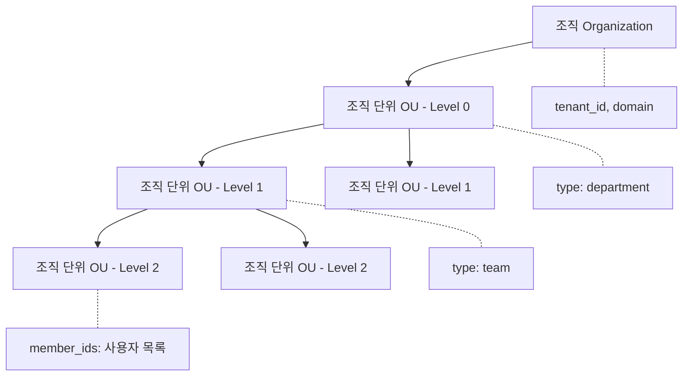
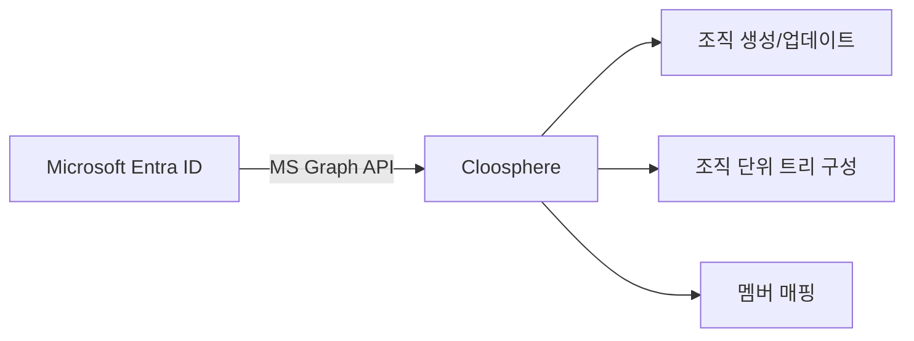
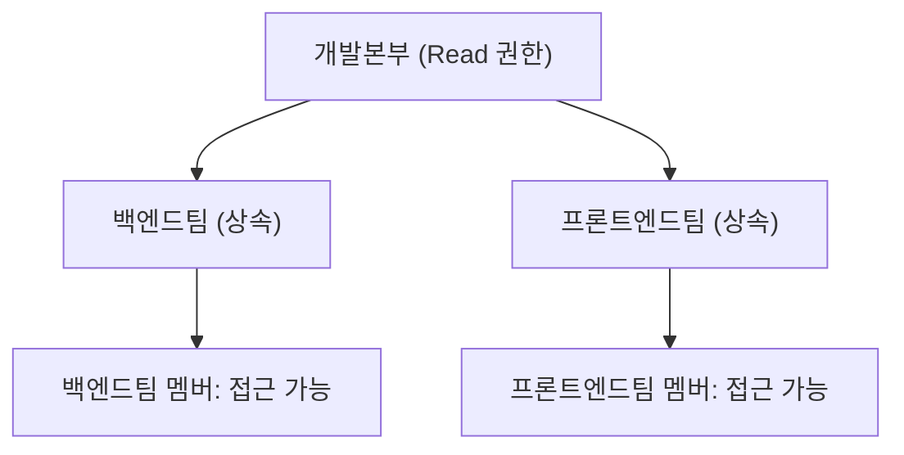

조직 관리는 기업의 부서 구조를 Cloosphere에 반영하여 리소스 접근을 체계적으로 제어하는 기능입니다. Microsoft Entra ID(Azure AD)와 동기화하거나, JSON Import로 조직 구조를 직접 구성할 수 있습니다.

<Frame caption="조직 관리 화면">
  
</Frame>

---

## 조직 계층 구조

Cloosphere의 조직 시스템은 조직(Organization)과 조직 단위(Organizational Unit)의 계층 구조로 구성됩니다.



| 개념 | 설명 | 예시 |
|------|------|------|
| **조직 (Organization)** | 최상위 엔터티. 테넌트 ID와 도메인으로 식별 | "Cloocus Inc." |
| **조직 단위 (OU)** | 부서, 팀 등 하위 단위. 계층적으로 중첩 가능 | "개발본부 > 백엔드팀" |
| **멤버** | 조직 단위에 소속된 사용자 목록 | user_id 배열 |

### 조직 단위 타입

조직 단위는 `type` 필드로 용도를 구분합니다.

| 타입 | 설명 |
|------|------|
| **department** | 부서 (본부, 실 등 상위 조직) |
| **team** | 팀 (실무 단위 조직) |
| **group** | 그룹 (프로젝트팀 등 기능적 단위) |

---

## 조직과 그룹의 차이

Cloosphere는 **그룹**과 **조직** 두 가지 사용자 묶음을 제공합니다. 목적에 따라 적절히 사용하세요.

| 구분 | 그룹 (Group) | 조직 (Organization) |
|------|-------------|-------------------|
| **목적** | 권한 관리 | 조직 구조 반영 |
| **구조** | 평면 (계층 없음) | 트리 (계층 구조) |
| **권한 설정** | 그룹에 직접 권한 할당 | 리소스의 access_control에서 OU 지정 |
| **외부 연동** | 수동 관리 | Entra ID 자동 동기화 |
| **사용 시나리오** | "에이전트 생성 권한 부여" | "인사팀만 인사규정 KB 접근" |

<Tip>
  **권한 제어** (무엇을 할 수 있는가)에는 그룹을 사용하고, **접근 제어** (무엇을 볼 수 있는가)에는 조직을 사용하는 것을 권장합니다. 두 시스템을 병행할 수 있습니다.
</Tip>

---

## 조직 생성

조직과 조직 단위는 **동기화(Sync)**를 통해서만 생성됩니다. 수동으로 직접 생성하는 UI는 제공되지 않습니다.

지원되는 동기화 방식:

| 방식 | 설명 |
|------|------|
| **Microsoft Graph** | Entra ID(Azure AD)에서 조직 구조를 자동 동기화 |
| **JSON Import** | JSON 데이터를 업로드하여 조직 구조를 구성 |

자세한 동기화 방법은 아래 [Microsoft Entra ID 동기화](#microsoft-entra-id-동기화) 및 [JSON Import](#json-import) 섹션을 참고하세요.

---

## Microsoft Entra ID 동기화

Microsoft Entra ID(Azure AD)와 연동하여 조직 구조를 자동으로 동기화합니다.



### 사전 요구사항

<Warning>
  Entra ID 동기화를 위해서는 Microsoft OAuth 설정이 필요합니다. 다음 환경 변수를 서버에 설정하세요.
</Warning>

| 환경 변수 | 설명 |
|----------|------|
| `MICROSOFT_CLIENT_ID` | Azure App Registration의 Client ID |
| `MICROSOFT_CLIENT_SECRET` | Client Secret |
| `MICROSOFT_CLIENT_TENANT_ID` | Azure AD Tenant ID |

### 동기화 실행

<Steps>
  <Step title="동기화 옵션 선택">
    동기화 시 가져올 데이터 소스를 선택합니다.

    | 옵션 | 설명 | 기본값 |
    |------|------|:------:|
    | **Administrative Units** | Entra ID Administrative Units 가져오기 | ON |
    | **보안 그룹 (Security Groups)** | Entra ID Security Groups 가져오기 | OFF |
    | **Departments** | 사용자 부서 정보 기반 구성 | OFF |
    | **Group Filter** | 특정 그룹만 필터링 (선택) | - |
  </Step>
  <Step title="동기화 실행">
    **"동기화"** 버튼을 클릭합니다.
  </Step>
  <Step title="결과 확인">
    동기화된 조직 단위 트리와 멤버 매핑 결과를 확인합니다.
  </Step>
</Steps>

<Frame caption="Entra ID 동기화 옵션">
  
</Frame>

### JSON Import

Entra ID가 없는 환경에서는 JSON 데이터로 조직 구조를 직접 import할 수 있습니다.

```json
{
  "organization": {
    "tenant_id": "my-company",
    "name": "My Company",
    "domain": "mycompany.com"
  },
  "units": [
    {
      "id": "dept-1",
      "name": "Engineering",
      "type": "department",
      "children": [
        { "id": "team-1", "name": "Backend Team", "type": "team" },
        { "id": "team-2", "name": "Frontend Team", "type": "team" }
      ]
    }
  ]
}
```

---

## 조직 기반 접근 제어

조직 단위를 활용하여 리소스(에이전트, 지식기반, 데이터베이스 등)의 접근 범위를 제어합니다.

### 리소스에 조직 단위 권한 설정

각 워크스페이스 리소스의 **접근 권한** 설정에서 조직 단위를 지정합니다.

| 접근 레벨 | 설명 |
|----------|------|
| **읽기 (Read)** | 해당 OU 멤버가 리소스를 조회/사용 가능 |
| **쓰기 (Write)** | 해당 OU 멤버가 리소스를 편집 가능 |

### 권한 상속

상위 조직 단위에 부여된 권한은 하위 조직 단위로 상속됩니다.



<Note>
  상위 OU에 리소스 접근 권한이 설정되면, 하위 OU의 모든 멤버도 동일한 권한을 자동으로 부여받습니다.
</Note>

### 활용 예시

| 리소스 | 접근 제어 | 설명 |
|--------|----------|------|
| **인사규정 KB** | 인사팀 OU (Read) | 인사팀만 인사규정 조회 가능 |
| **영업 에이전트** | 영업본부 OU (Read) | 영업 부서 전체가 사용 가능 |
| **매출 DB** | 경영지원본부 OU (Read) | 경영지원 부서만 매출 데이터 조회 |
| **전사 공지 KB** | 최상위 OU (Read) | 전체 조직이 접근 가능 |

---

## 조직 단위별 리소스 권한 조회

관리자는 특정 조직 단위에 할당된 모든 리소스 권한을 한눈에 조회할 수 있습니다.

<Frame caption="조직 단위별 리소스 권한 목록">
  
</Frame>

| 리소스 종류 | 조회 항목 |
|------------|----------|
| **지식기반** | 이름, 읽기/쓰기, 상속 여부 |
| **도구** | 이름, 읽기/쓰기, 상속 여부 |
| **프롬프트** | 이름, 읽기/쓰기, 상속 여부 |
| **모델** | 이름, 읽기/쓰기, 상속 여부 |
| **데이터베이스** | 이름, 읽기/쓰기, 상속 여부 |
| **용어 사전** | 이름, 읽기/쓰기, 상속 여부 |

---

## 조직별 사용량 제한

조직 단위 상세 패널에서 **일별 토큰 제한**을 설정할 수 있습니다.

| 설정 | 설명 |
|------|------|
| **일별 토큰 제한** | 해당 OU 소속 사용자의 일일 토큰 한도 (0 = 무제한) |

<Warning>
  이 기능은 관리자 설정에서 **사용량 제한** (`enable_usage_limit`) 기능이 활성화되어 있어야 동작합니다.
</Warning>

<Note>
  사용량 제한은 전역, 사용자, 그룹, 조직 네 계층에서 설정 가능합니다. 여러 계층에 설정된 경우 **가장 관대한(높은) 값**이 적용됩니다.
</Note>

---

## 조직 단위별 가드레일

조직 단위(OU)에 **가드레일을 연결**하여 해당 OU 소속 사용자의 AI 입출력을 자동으로 검증할 수 있습니다.

조직 단위 상세 패널의 **가드레일 설정**에서 구성합니다.

| 설정 | 설명 |
|------|------|
| **가드레일 선택** | 이 OU에 적용할 가드레일 목록 (복수 선택 가능) |
| **전역 가드레일 상속** | 켜면 전역(코드 게이트웨이) 가드레일도 함께 적용. 끄면 OU에 지정한 가드레일만 적용 |

### 적용 우선순위

가드레일은 여러 계층에서 설정할 수 있으며, 사용자에게는 **모든 계층의 가드레일이 합산**되어 적용됩니다.

```
에이전트 가드레일  ─┐
그룹 가드레일      ─┼─  모두 합쳐서 적용
조직 단위 가드레일  ─┤
전역 가드레일      ─┘  (전역 상속이 켜진 경우)
```

<Info>
  전역 가드레일은 **관리자 > 코드 게이트웨이**에서 설정합니다. 조직 단위에서 `전역 가드레일 상속`을 끄면 해당 OU는 전역 가드레일의 영향을 받지 않습니다.
</Info>

---

## 동기화 Provider 목록

현재 지원하는 동기화 Provider는 다음과 같습니다.

| Provider | 설명 | 요구 사항 |
|----------|------|----------|
| **JSON Import** | JSON 데이터로 직접 구성 | 없음 |
| **Microsoft Graph** | Entra ID에서 자동 동기화 | `MICROSOFT_CLIENT_ID`, `CLIENT_SECRET`, `TENANT_ID` |

<Tip>
  향후 Okta, Google Workspace 등 추가 Provider 지원이 예정되어 있습니다.
</Tip>

---

## FAQ

<Accordion title="조직 동기화가 실패해요">
  1. Azure App Registration에 `Directory.Read.All` 권한이 있는지 확인하세요.
  2. 환경 변수 `MICROSOFT_CLIENT_ID`, `MICROSOFT_CLIENT_SECRET`, `MICROSOFT_CLIENT_TENANT_ID`가 올바르게 설정되었는지 확인하세요.
  3. 서버 로그에서 상세 오류 메시지를 확인하세요.
</Accordion>

<Accordion title="조직과 그룹을 모두 사용해야 하나요?">
  반드시 모두 사용할 필요는 없습니다. **권한 관리**만 필요하면 그룹으로 충분합니다. Entra ID와 연동하여 **부서 기반 접근 제어**가 필요한 경우 조직을 추가로 활용하세요.
</Accordion>

<Accordion title="조직 단위를 삭제하면 멤버도 삭제되나요?">
  조직 단위를 삭제해도 소속 사용자 계정은 삭제되지 않습니다. 해당 OU에 설정된 리소스 접근 권한만 해제됩니다.
</Accordion>
