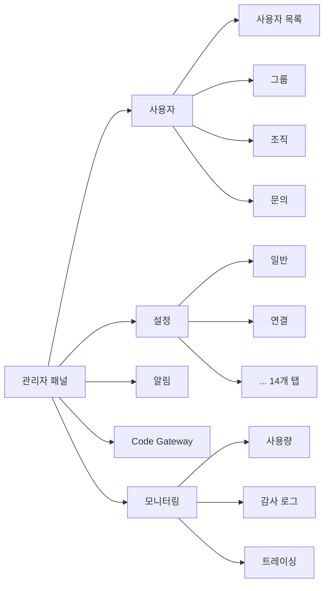

관리자 패널은 Cloosphere 플랫폼 전체를 운영하는 중앙 관리 인터페이스입니다. 사용자 관리, 조직 구조, LLM 연결, 보안 정책, 알림 채널 등 플랫폼의 모든 설정을 제어합니다.

<Frame caption="관리자 패널 메인 화면">
  
</Frame>

---

## 관리자 패널 접근

<Note>
  관리자 패널은 **Admin** 역할을 가진 사용자만 접근할 수 있습니다. 일반 사용자(User)에게는 관리자 메뉴가 표시되지 않습니다.
</Note>

사이드바 하단의 사용자 이름을 클릭하면 **"관리자 패널"** 메뉴가 나타납니다. 클릭하면 관리자 대시보드로 이동합니다.

---

## 역할별 접근 권한

Cloosphere는 세 가지 사용자 역할을 제공합니다. 관리자 패널 접근은 역할에 따라 결정됩니다.

| 역할 | 관리자 패널 | 워크스페이스 | 채팅 |
|------|:----------:|:-----------:|:----:|
| **Admin** | 전체 접근 | 전체 접근 | 전체 접근 |
| **User** | 접근 불가 (기본) | 그룹 권한에 따름 | 그룹 권한에 따름 |
| **Pending** | 접근 불가 | 접근 불가 | 접근 불가 |

<Tip>
  그룹 권한 설정을 통해 일반 사용자에게도 관리자 기능의 일부(사용자 관리, 모니터링 등)를 읽기 또는 쓰기 수준으로 위임할 수 있습니다. 자세한 내용은 [사용자 관리](/ko/admin/users) 페이지의 그룹 권한 섹션을 참고하세요.
</Tip>

---

## 관리 기능 구성

관리자 패널은 다음 기능으로 구성됩니다.

<Columns cols={2}>
  <Card title="사용자 관리" icon="users" href="/ko/admin/users">
    사용자 목록 조회, 역할 할당, 그룹 관리, 권한 설정, 문의 관리
  </Card>
  <Card title="조직 관리" icon="building" href="/ko/admin/organizations">
    조직 구조 관리, Microsoft Entra ID 동기화, 조직 기반 접근 제어
  </Card>
  <Card title="시스템 설정" icon="gear" href="/ko/admin/settings/general">
    LLM 연결, 문서/검색/오디오/이미지, 인터페이스, 라이선스 등 14개 탭
  </Card>
  <Card title="알림 설정" icon="bell" href="/ko/admin/notifications">
    이메일(SMTP/SendGrid) 및 웹훅(Slack/Teams/Discord/Telegram) 알림 채널 구성
  </Card>
  <Card title="Code Gateway" icon="code" href="/ko/admin/code-gateway">
    AI 코딩 도구(Claude Code, Cursor 등)용 LLM API 프록시 게이트웨이
  </Card>
  <Card title="모니터링" icon="chart-line" href="/ko/monitoring/overview">
    사용량, 감사 로그, 가드레일 로그, 트레이싱, 평가
  </Card>
</Columns>

---

## 시스템 설정 14개 탭

시스템 설정은 플랫폼 운영에 필요한 모든 구성을 14개 탭으로 분류하여 관리합니다.

| 탭 | 설명 | 바로가기 |
|----|------|---------|
| **일반** | 인증, 기본 역할, 로그 수준, 사용량 제한 | [설정](/ko/admin/settings/general) |
| **연결** | OpenAI, Ollama 등 LLM Provider 연결 | [설정](/ko/admin/settings/connections) |
| **모델** | 모델 목록 관리, 기본 모델 지정, 모델 필터 | [설정](/ko/admin/settings/models) |
| **문서** | 임베딩 엔진/모델, 청크 크기, Vector DB 설정 | [설정](/ko/admin/settings/documents) |
| **검색 엔진** | Azure Search, Elasticsearch 등 검색 엔진 연결 | [설정](/ko/admin/settings/search-engine) |
| **웹 검색** | SearXNG, Google PSE, Bing 등 웹 검색 엔진 | [설정](/ko/admin/settings/web-search) |
| **코드 실행** | 코드 인터프리터 (Jupyter/Sandbox) 설정 | [설정](/ko/admin/settings/code-execution) |
| **인터페이스** | UI 커스터마이징, 기본 프롬프트, 랜딩 페이지 | [설정](/ko/admin/settings/interface) |
| **오디오** | STT/TTS 엔진 및 모델 설정 | [설정](/ko/admin/settings/audio) |
| **이미지** | 이미지 생성 엔진 (DALL-E, Stable Diffusion) | [설정](/ko/admin/settings/images) |
| **파이프라인** | Pipeline 서버 연결 및 관리 | [설정](/ko/admin/settings/pipelines) |
| **도구** | OpenAPI/MCP 도구 서버 글로벌 설정 | [설정](/ko/admin/settings/tools) |
| **브랜딩** | 로고, 파비콘, 색상, 로그인 화면 커스터마이징 | [설정](/ko/admin/settings/branding) |
| **라이선스** | 라이선스 키 관리, 기능 활성화 | [설정](/ko/admin/settings/license) |

---

## 관리자 패널 네비게이션

관리자 패널은 상단 탭 네비게이션으로 각 기능 영역을 전환합니다.

---

## 빠른 시작

<Steps>
  <Step title="LLM 연결 설정">
    [연결 설정](/ko/admin/settings/connections)에서 OpenAI API 키 또는 Ollama 서버 URL을 등록합니다.
  </Step>
  <Step title="사용자 관리">
    [사용자 관리](/ko/admin/users)에서 사용자를 추가하고 역할을 할당합니다. 그룹을 생성하여 권한을 체계적으로 관리합니다.
  </Step>
  <Step title="보안 설정">
    [일반 설정](/ko/admin/settings/general)에서 인증 방식, JWT 만료 시간, 회원가입 허용 여부를 구성합니다.
  </Step>
  <Step title="알림 채널 구성">
    [알림 설정](/ko/admin/notifications)에서 이메일 또는 웹훅 채널을 등록하여 예약 작업 알림을 활성화합니다.
  </Step>
</Steps>

---

## Service Request (SR)

관리자가 Cloosphere 운영팀에 **서비스 요청(사용량 증가, 기능 문의, 버그 리포트 등)**을 직접 제출하는 기능입니다.

### 활성화 조건

환경변수 `SR_KEY`와 `CLOOCUS_PUBLIC_URL`이 **모두 설정**되어야 활성화됩니다. 설정되지 않으면 메뉴가 표시되지 않습니다.

### 사용 방법

1. 사이드바 하단의 **사용자 아바타** 클릭
2. 드롭다운 메뉴에서 **"Service Request"** 선택
3. SR 제출 모달에서 내용 작성 후 전송

| 필드 | 설명 |
|------|------|
| **Type** | 요청 유형 — 사용량 한도, 기능 요청, 버그 리포트, 계정, 기타 |
| **Title** | 요청 제목 (간단한 요약) |
| **Content** | 요청 상세 내용 |

<Note>
  요청자 이름과 이메일은 로그인 정보에서 자동으로 첨부됩니다. SR은 **관리자(Admin) 역할**에게만 표시됩니다.
</Note>
