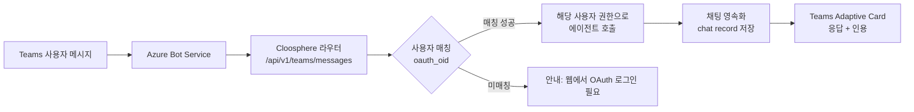

Cloosphere를 **Microsoft Teams 앱**으로 배포하여, 사용자가 Teams를 떠나지 않고도 사내 에이전트와 대화할 수 있게 하는 기능입니다. 1:1 채팅, 팀 채널, 그룹 채팅 어느 표면에서든 동일한 권한·에이전트 설정으로 동작합니다.

<Note>
  Teams 봇은 **알림 채널**(`/admin/notifications`의 Teams 웹훅)과 다릅니다. 알림 채널은 단방향 메시지 발송용이고, Teams 봇은 사용자가 봇과 직접 대화하는 양방향 통합입니다.
</Note>

---

## 왜 필요한가

| 기존 방식 | Teams 봇 통합 |
|----------|--------------|
| 사용자가 Cloosphere 웹앱을 별도 창으로 열어야 함 | Teams 안에서 바로 대화 시작 |
| 별도 로그인 | Entra ID 기반 자동 사용자 매칭 (Object ID → Cloosphere 계정) |
| 모바일에서 사용 불편 | Teams 모바일 앱 그대로 활용 |
| 채널 협업과 단절 | 팀 채널·그룹챗에서 봇을 호출해 함께 답변 확인 |

**활용 시나리오:**
- 사내 IT 헬프데스크 봇을 Teams 1:1로 배포하여 직원의 비번 초기화·접근 권한 문의 자동화
- 영업팀 채널에 매출 분석 에이전트를 추가해 회의 중 즉석 데이터 질의
- 그룹 채팅에서 회의록 요약 에이전트 호출

---

## 동작 원리



핵심 포인트:
- **JWT 검증**: M365 Agents SDK가 Teams Activity의 JWT를 Azure로부터 검증
- **사용자 매칭**: Teams 사용자의 **AAD Object ID** ↔ Cloosphere `User.oauth_oid` 필드로 매칭. OAuth(Entra/Google)로 한 번이라도 로그인한 사용자만 매칭됨
- **권한 적용**: 매칭된 Cloosphere 사용자의 권한 그대로 적용 — Teams에서 호출해도 그 사용자가 워크스페이스에서 가진 에이전트·지식기반 접근 권한 동일
- **대화 영속**: Teams 대화 ID(`teams_conversation_id`)가 Cloosphere `chat.meta`에 저장되어, 같은 Teams 대화창은 항상 같은 채팅 레코드에 연결됨

---

## 설정 절차

### 1단계: 관리자 패널에서 봇 설정

**관리자 > 설정 > 알림 > Teams Bot Config** 탭에서 봇을 구성합니다.

{/* SCREENSHOT: admin-teams-bot-config
     화면: 관리자 > 설정 > 알림 > Teams Bot Config
     영역: 전체 설정 화면
     상태: 인증 정보 입력 후
     하이라이트: Enable Teams Bot 토글 */}

#### 인증 정보 (P2 모드 필수)

| 항목 | 설명 |
|------|------|
| **Enable Teams Bot** | 전체 ON/OFF 토글 |
| **App ID (Client ID)** | Azure Bot 또는 Entra 앱 등록의 Client ID (GUID) |
| **Tenant ID** | Azure AD 테넌트 ID. 멀티 테넌트 봇이면 `common` |
| **App Password** | Entra 앱의 클라이언트 시크릿 (저장 시 자동 마스킹) |
| **Default Agent** | 사용자가 처음 봇과 대화 시 적용될 기본 에이전트/모델 |

<Note>
  운영 환경은 **P2 모드**(인증 인증서 기반) 사용을 권장합니다. P1 모드(익명)는 인증 정보가 비어있을 때 자동 폴백되며 로컬 개발용입니다.
</Note>

#### 브랜딩 (선택)

| 항목 | 제한 | 설명 |
|------|------|------|
| **Bot Name** | 최대 30자 | Teams 사용자 화면에 표시되는 이름 |
| **Short Description** | 최대 80자 | Teams 앱 카탈로그 한 줄 설명 |
| **Full Description** | 최대 4000자 | 앱 상세 화면 설명 |
| **Developer Name / Website** | — | 앱 정보 페이지에 표시 |
| **Color Icon** | 192×192 PNG | Teams 앱 카탈로그용 컬러 아이콘 |
| **Outline Icon** | 32×32 PNG (흰색 실루엣) | Teams 사이드바 모노 아이콘 |
| **Accent Color** | `#RRGGBB` | 매니페스트 액센트 색상 |

#### 배포 범위

| 항목 | 옵션 | 설명 |
|------|------|------|
| **Bot Scopes** | `personal` / `team` / `groupchat` (다중 선택) | 봇이 노출될 표면. 1:1 / 팀 채널 / 그룹챗 중 선택 |
| **Default Group Capability** | `team` / `groupchat` / `meetings` | 다중 scope일 때 기본 표면 |

<Warning>
  `team`/`groupchat` scope를 선택하면 Teams 앱을 설치할 때 **관리자 동의(admin consent)**가 필요합니다 (RSC: `ChannelMessage.Read.Group` 등). 사내 Teams 관리센터에서 앱 승인 정책을 확인하세요.
</Warning>

### 2단계: Azure Bot Service 등록

P2 모드 운영을 위해 Azure Portal에서 Bot 리소스를 만들어야 합니다.

<Steps>
  <Step title="Entra 앱 등록">
    Azure Portal > Microsoft Entra ID > 앱 등록 > **새 등록**.
    - 이름: 임의 (예: "Cloosphere Teams Bot")
    - 지원 계정 유형: 단일 / 멀티 테넌트
    - 등록 후 **Application (client) ID**, **Directory (tenant) ID** 획득
    - **인증서 및 비밀번호** > 새 클라이언트 시크릿 생성 → **App Password**로 사용
  </Step>
  <Step title="Azure Bot 리소스 생성">
    Azure Portal > 리소스 만들기 > **Azure Bot** 검색 후 생성.
    - Microsoft App ID: 1단계의 Client ID 입력
    - 가격 책정 계층: F0 (개발) 또는 S1 (운영)
  </Step>
  <Step title="Messaging endpoint 등록">
    생성된 Bot 리소스 > **Configuration** > Messaging endpoint에 다음을 입력:

    ```
    https://your-cloosphere.com/api/v1/teams/messages
    ```

    <Tip>
      관리자 패널의 Teams Bot Config 화면에 **현재 인스턴스의 messaging endpoint URL**이 표시되어 있어 복사해 사용하면 됩니다.
    </Tip>
  </Step>
  <Step title="Microsoft Teams 채널 추가">
    Bot 리소스 > **Channels** > Microsoft Teams 추가.
  </Step>
</Steps>

### 3단계: Teams 매니페스트 다운로드 및 업로드

<Steps>
  <Step title="매니페스트 ZIP 다운로드">
    관리자 > 설정 > 알림 > Teams Bot Config의 **Download Teams Manifest** 버튼 클릭.
    동적으로 App ID·브랜딩·아이콘이 주입된 `cloosphere-teams.zip`이 다운로드됩니다.
  </Step>
  <Step title="Teams에 업로드">
    Teams 좌측 사이드바 **앱** > **앱 관리** > **앱 업로드** > **사용자 지정 앱 업로드** > 다운로드한 ZIP 선택.

    조직 카탈로그에 배포하려면 Teams 관리센터 > 앱 관리에서 **조직 전체 게시**를 진행하세요.
  </Step>
  <Step title="활성화 대기">
    업로드 후 약 30초~1분 내에 봇이 활성화됩니다. 첫 사용자가 봇과 대화를 시작하면 정상 동작 여부를 확인할 수 있습니다.
  </Step>
</Steps>

---

## 사용자 사용법

### 사전 준비 — Cloosphere에 OAuth 로그인 1회 필요

Teams 봇은 사용자의 **AAD Object ID**를 Cloosphere `User.oauth_oid` 필드로 매칭합니다. 따라서 Teams에서 봇을 사용하기 전에 **각 사용자가 Cloosphere 웹앱에 한 번 OAuth(Entra/Google)로 로그인**해 둬야 합니다.

<Warning>
  로그인 이력이 없는 사용자가 Teams에서 봇을 호출하면 "Cloosphere에 먼저 로그인하세요"라는 안내가 표시됩니다. 매칭이 끝나면 이후엔 자동입니다.
</Warning>

### 첫 대화

Teams에서 봇을 호출하면 자동으로 **에이전트 선택 카드**가 표시됩니다.

| 진입 표면 | 호출 방법 |
|-----------|----------|
| **1:1** | Teams 좌측 채팅 > 봇 검색 후 메시지 |
| **팀 채널** | 채널에서 `@봇이름 질문 내용` 멘션 |
| **그룹 챗** | 그룹챗에 봇을 멤버로 추가 후 멘션 또는 메시지 |

### 슬래시 명령어

| 명령 | 동작 |
|------|------|
| `/agent` | 사용 가능한 에이전트 목록을 Adaptive Card로 표시. 선택 시 30일간 해당 사용자에게 기억됨 |
| `/current` | 현재 선택된 에이전트 확인 |
| `/reset` | 대화 초기화 (이전 맥락 폐기, 새 채팅 레코드 생성) |
| `/lang <code>` | 봇 응답 언어 변경 (예: `/lang ko`, `/lang en`) |
| `/help` | 명령어 도움말 |

### 대화 영속

같은 Teams 대화창에서는 봇이 이전 대화를 기억합니다.

- LLM 컨텍스트로는 **최근 10턴**까지 전송 (긴 대화에서 토큰 절약)
- 전체 대화는 Cloosphere 채팅 레코드에 저장 — 사용자가 웹앱에서도 동일 대화를 이어 볼 수 있음
- `/reset`을 호출하면 새 채팅 레코드로 분리됨

### 인용(Citation) 표시

지식기반·웹검색 결과를 사용한 응답은 **Teams Citation Card**로 표시되어 출처 문서·URL을 클릭으로 확인할 수 있습니다.

---

## 환경 변수 (운영자용)

```bash
# Teams 인증 (P2 모드)
TEAMS_BOT_APP_ID=<Azure Bot Client ID>
TEAMS_BOT_APP_PASSWORD=<Client Secret>
TEAMS_BOT_TENANT_ID=common  # 또는 단일 테넌트 GUID

# 봇 동작
TEAMS_BOT_ENABLED=true
TEAMS_BOT_BACKEND_TIMEOUT=300       # 백엔드 호출 타임아웃 (초)
TEAMS_BOT_DEFAULT_LOCALE=en-US      # i18n 기본값 (ko-KR/en-US 외엔 fallback)
CLOOSPHERE_PUBLIC_URL=https://your-domain.com  # 매니페스트 validDomains 자동 계산

# 멀티워커 환경 (Redis 강력 권장)
REDIS_URL=redis://localhost:6379
REDIS_SENTINEL_HOSTS=host1,host2    # Sentinel 사용 시
REDIS_SENTINEL_PORT=26379

# 개발/테스트 전용
TEAMS_BOT_TEST_JWT=<fallback JWT>   # OAuth 매칭 미설정 사용자 폴백
```

<Warning>
  **멀티워커 환경에서는 Redis 필수.** 사용자별 에이전트 선택 상태를 Redis로 공유하지 않으면 워커마다 다른 상태가 보일 수 있습니다.
</Warning>

---

## 알려진 제약 / 주의사항

<AccordionGroup>
  <Accordion title="OAuth 미로그인 사용자는 봇 사용 불가" icon="circle-exclamation">
    Teams 사용자의 AAD Object ID가 Cloosphere `User.oauth_oid`와 매칭되어야 합니다. OAuth(Entra/Google)로 한 번도 로그인하지 않은 사용자는 봇 호출 시 안내 메시지를 받습니다.
    개발 환경에서는 `TEAMS_BOT_TEST_JWT`로 폴백 가능하지만 운영에서는 사용 금지.
  </Accordion>

  <Accordion title="에이전트 노출 범위" icon="filter">
    `/agent` 명령으로 노출되는 에이전트 목록은 **해당 사용자의 권한**으로 필터링됩니다. 즉 그 사용자가 웹앱에서 볼 수 없는 에이전트는 Teams에서도 보이지 않습니다.
  </Accordion>

  <Accordion title="대화 히스토리 한도" icon="clock-rotate-left">
    LLM 호출에는 **최근 10턴까지만** 전송됩니다. 더 긴 맥락이 필요하면 사용자에게 명시적으로 요약을 요청하거나 `/reset` 후 핵심 정보를 다시 입력하도록 안내하세요.
  </Accordion>

  <Accordion title="i18n 지원 언어" icon="globe">
    봇 시스템 메시지는 **한국어(ko-KR)** 와 **영어(en-US)** 만 완성되어 있습니다. 다른 언어 사용자에게는 `TEAMS_BOT_DEFAULT_LOCALE`(기본 en-US)로 폴백됩니다.
  </Accordion>

  <Accordion title="스트리밍 응답" icon="bolt">
    Cloosphere 내부의 Socket.IO 스트리밍을 구독해 Teams로 relay합니다. Socket.IO 연결이 실패하더라도 최종 응답은 도달하지만, 진행 상태(타이핑/도구 호출)와 인용 카드 일부가 누락될 수 있습니다.
  </Accordion>

  <Accordion title="RSC(Resource-Specific Consent) 권한" icon="shield-halved">
    팀 채널·그룹챗 scope를 활성화하면 매니페스트에 `ChannelMessage.Read.Group` 등 RSC 권한이 선언됩니다. 사내 Teams 관리센터의 앱 승인 정책에 따라 관리자 동의가 필요할 수 있습니다.
  </Accordion>
</AccordionGroup>

---

## 관련 페이지

<Columns>
  <Card title="알림 설정" icon="bell" href="/ko/admin/notifications">
    Teams 웹훅 기반 단방향 알림 채널 (봇 통합과 별개)
  </Card>
  <Card title="에이전트" icon="robot" href="/ko/workspace/agents">
    Teams에서 사용할 수 있는 에이전트 생성 및 권한 설정
  </Card>
  <Card title="사용자 관리" icon="users" href="/ko/admin/users">
    OAuth 로그인 / 권한 / 그룹 설정
  </Card>
  <Card title="채팅 위젯 임베드" icon="code" href="/ko/admin/settings/embed-widgets">
    웹사이트 임베드 형태의 통합 (대안 옵션)
  </Card>
</Columns>
