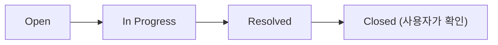

**관리자 > 사용자**에서 플랫폼의 모든 사용자, 그룹, 조직을 관리합니다. 역할 기반 접근 제어와 그룹별 세밀한 권한 설정으로 조직 규모에 맞는 체계적인 사용자 관리가 가능합니다.

<Frame caption="사용자 관리 메인 화면">
  
</Frame>

---

## 탭 구성

사용자 관리 화면은 네 개의 탭으로 구성됩니다.

| 탭 | 설명 |
|----|------|
| **개요** | 개별 사용자 조회, 추가, 편집, 삭제 |
| **그룹** | 권한 그룹 생성 및 관리 |
| **조직** | Entra ID 동기화 기반 조직 단위 관리 ([조직 관리](/ko/admin/organizations) 참고) |
| **문의** | 사용자 문의 접수 및 답변 |

---

## 사용자 목록

### 사용자 조회 및 검색

사용자 목록은 테이블 형태로 표시되며, 다음 컬럼 정보를 제공합니다.

| 컬럼 | 설명 |
|------|------|
| **이름** | 사용자 표시 이름 |
| **이메일** | 로그인 이메일 주소 |
| **역할** | Admin, User, Pending |
| **OAuth ID** | SSO 연동 시 외부 인증 ID |
| **마지막 활동** | 최근 접속 시간 |
| **가입일** | 계정 생성일 |

**검색 기능:**
- 이름 또는 이메일로 실시간 검색
- 이름, 가입일, 최근 활동순 정렬

### 사용자 역할

Cloosphere는 세 가지 역할을 제공합니다.

| 역할 | 설명 | 관리자 패널 | 워크스페이스 | 채팅 |
|------|------|:----------:|:-----------:|:----:|
| **Admin** | 전체 관리 권한 | 전체 접근 | 전체 접근 | 전체 접근 |
| **User** | 일반 사용자 | 그룹 권한에 따름 | 그룹 권한에 따름 | 그룹 권한에 따름 |
| **Pending** | 승인 대기 | 접근 불가 | 접근 불가 | 접근 불가 |

<Warning>
  **Admin** 역할은 모든 설정과 데이터에 접근할 수 있습니다. 최소 인원에게만 부여하세요.
</Warning>

### 슈퍼어드민 (SA)

<Info>
  **신규 기능** — Admin 중 한 명을 **슈퍼어드민(SA)**으로 지정할 수 있습니다.
</Info>

SA는 별도의 역할이 아니라 **Admin 중 대표 관리자**를 표시하는 기능입니다. SA로 지정된 관리자의 이메일은 사용자 가입 후 **계정 활성화 대기 화면**에 연락처로 표시됩니다.

| 항목 | 설명 |
|------|------|
| **지정 대상** | Admin 역할 사용자만 |
| **지정 방법** | 사용자 편집 모달에서 **Set as SA** 버튼 클릭 |
| **표시** | 사용자 목록에서 SA 배지로 표시 |
| **효과** | 계정 활성화 대기 화면에 해당 관리자 이메일이 안내됨 |

{/* 📸 SCREENSHOT NEEDED: users-sa-badge
     화면: 관리자 > 사용자 > 사용자 목록
     영역: SA 배지가 표시된 Admin 사용자 행
     상태: SA 배지가 보이는 상태
     하이라이트: SA 배지 */}

<Note>
  SA는 1명만 지정 가능합니다. 새로운 사용자를 SA로 지정하면 기존 SA 지정은 자동 해제됩니다. SA 지정은 Admin만 할 수 있습니다.
</Note>

### 역할 변경

<Steps>
  <Step title="사용자 목록에서 대상 선택">
    사용자 행의 편집 버튼을 클릭합니다.
  </Step>
  <Step title="역할 변경">
    편집 모달에서 역할 드롭다운을 열고 새 역할을 선택합니다.
  </Step>
  <Step title="저장">
    **저장** 버튼을 클릭하여 변경을 적용합니다.
  </Step>
</Steps>

<Frame caption="사용자 편집 모달">
  
</Frame>

<Note>
  자기 자신의 역할은 변경할 수 없습니다. 또한 최초 가입한 관리자(First User)의 역할도 변경할 수 없습니다.
</Note>

<Tip>
  사용자의 역할 변경은 자동으로 **감사 로그**에 기록됩니다 (`ROLE_CHANGE` 이벤트). 누가 누구의 역할을 언제 어떻게 바꿨는지 [모니터링 > 감사 로그](/ko/monitoring/audit-logs)에서 추적할 수 있습니다.
</Tip>

---

## 사용자 추가 및 편집

### 사용자 추가

**"+"** 아이콘(tooltip: "사용자 추가")을 클릭하여 수동으로 사용자를 생성합니다.

| 필드 | 설명 | 필수 |
|------|------|:----:|
| **이메일** | 로그인에 사용할 이메일 주소 | O |
| **이름** | 표시 이름 | O |
| **비밀번호** | 초기 비밀번호 | O |
| **역할** | Admin / User / Pending | O |

<Tip>
  다수의 사용자를 한 번에 등록하려면 **CSV 파일 가져오기**를 사용할 수 있습니다. 사용자 추가 모달에서 CSV 업로드 옵션을 선택하세요.
</Tip>

### 사용자 편집

사용자의 **이름 또는 썸네일을 클릭**하거나, 행의 편집 버튼을 클릭하면 편집 모달이 열립니다.

**수정 가능 항목:**
- 이름
- 이메일
- 역할
- 프로필 이미지 URL
- 새 비밀번호
- **소속 그룹** — 사용자가 속한 그룹을 확인하고 추가/제거할 수 있습니다
- **소속 조직 단위(OU)** — 해당 사용자가 속한 조직 단위 트리를 읽기 전용으로 표시 (Entra/Google Workspace 동기화 결과)

<Note>
  조직 단위는 사용자 편집 화면에서 **읽기 전용**으로 보입니다. OU 멤버십은 외부 IdP 동기화로 결정되며, 직접 수정하려면 [조직 관리](/ko/admin/organizations) 화면에서 IdP 동기화 설정을 변경해야 합니다.
</Note>

### 사용자 삭제

<Warning>
  사용자를 삭제하면 해당 사용자의 모든 채팅 기록, 설정, 데이터가 영구적으로 삭제됩니다. 이 작업은 되돌릴 수 없습니다.
</Warning>

### 사용자 채팅

관리자는 사용자의 채팅 목록을 조회할 수 있습니다. 사용자 행의 **채팅** 버튼을 클릭합니다.

---

## 사용량 제한

사용자별로 일일 토큰 사용량을 제한할 수 있습니다. 사용자 편집 화면에서 **일별 토큰 제한**을 설정합니다.

| 설정 | 설명 |
|------|------|
| **일별 토큰 제한** | 하루 동안 사용 가능한 최대 토큰 수 (0 = 무제한) |
| **일별 사용량** | 현재까지 사용한 토큰 수 (읽기 전용) |

<Note>
  사용량 제한은 전역, 사용자, 그룹, 조직 네 계층에서 설정할 수 있습니다. 여러 계층에 설정된 경우 **가장 관대한(높은) 값**이 적용됩니다.
</Note>

---

## 그룹 관리

그룹은 사용자를 묶어 권한을 일괄 관리하는 단위입니다. 부서, 역할, 프로젝트 등 조직 구조에 맞게 그룹을 설계합니다.

### 그룹이 필요한 이유

| 개별 관리 | 그룹 관리 |
|----------|----------|
| 사용자마다 개별 권한 설정 | 그룹에 한 번 설정하면 전원 적용 |
| 변경 시 일일이 수정 | 그룹 설정만 변경 |
| 사용자 증가 시 관리 복잡 | 체계적 확장 가능 |

### 그룹 생성

<Steps>
  <Step title="그룹 탭 선택">
    사용자 관리의 **그룹** 탭을 선택합니다.
  </Step>
  <Step title="새 그룹 생성">
    **"+"** 아이콘(tooltip: "그룹 생성")을 클릭합니다.
  </Step>
  <Step title="그룹 정보 입력">
    그룹 이름(예: "마케팅팀")과 설명을 입력합니다.
  </Step>
  <Step title="멤버 추가">
    **멤버** 탭에서 사용자를 검색하여 그룹에 추가합니다.
  </Step>
  <Step title="조직 단위(OU) 연결 (선택)">
    **조직 할당** 영역에서 이 그룹을 특정 조직 단위와 연결합니다. 연결된 OU의 모든 사용자에게 그룹 권한이 자동으로 적용됩니다 — 부서 전체에 동일한 권한 셋을 적용할 때 유용합니다.

    <Tip>
      "마케팅팀" 그룹을 "회사 / 마케팅본부" OU에 연결해두면, IdP 동기화로 새 직원이 마케팅본부에 추가될 때마다 별도 작업 없이 권한이 부여됩니다.
    </Tip>
  </Step>
</Steps>

### 그룹 권한 설정

그룹별로 세밀한 권한을 설정할 수 있습니다. 모든 권한은 **4단계 레벨**로 세분화되어 있습니다.

<Frame caption="그룹 권한 설정">
  
</Frame>

#### 권한 레벨

| 레벨 | 설명 |
|------|------|
| **없음 (None)** | 해당 기능에 접근 불가 |
| **접근 (Access)** | 목록 조회 가능 (상세 내용 확인 불가) |
| **읽기 (Read)** | 목록 조회 + 상세 내용 확인 가능 |
| **쓰기 (Write)** | 조회 + 생성/편집/삭제 가능 |

<Accordion title="워크스페이스 권한 상세">

| 권한 | 없음 | 접근 | 읽기 | 쓰기 |
|------|------|------|------|------|
| **에이전트** | 접근 불가 | 목록만 조회 | 상세 확인 | 생성/편집 |
| **지식기반** | 접근 불가 | 목록만 조회 | 상세 확인 | 생성/편집 |
| **프롬프트** | 접근 불가 | 목록만 조회 | 상세 확인 | 생성/편집 |
| **도구** | 접근 불가 | 목록만 조회 | 상세 확인 | 생성/편집 |
| **데이터베이스** | 접근 불가 | 목록만 조회 | 상세 확인 | 생성/편집 |
| **용어 사전** | 접근 불가 | 목록만 조회 | 상세 확인 | 생성/편집 |
| **가드레일** | 접근 불가 | 목록만 조회 | 상세 확인 | 생성/편집 |
| **플로우 접근** | 접근 불가 | 목록만 조회 | 상세 확인 | 생성/편집 |

</Accordion>

<Accordion title="관리자 권한 상세">

일반 사용자에게도 관리자 기능의 일부를 위임할 수 있습니다.

| 권한 | 없음 | 접근 | 읽기 | 쓰기 |
|------|------|------|------|------|
| **사용자 관리** | 접근 불가 | 사용자 목록 조회 | 상세 확인 | 생성/편집/삭제 |
| **설정 접근** | 접근 불가 | 설정 목록 조회 | 설정 값 확인 | 설정 변경 |
| **평가** | 접근 불가 | 평가 목록 조회 | 상세 확인 | 설정 변경 |
| **모니터링** | 접근 불가 | 모니터링 조회 | 상세 확인 | — |

</Accordion>

<Accordion title="공유/채팅/기능 권한 상세">

**공유 권한** (ON/OFF):
- 에이전트 공유, 지식기반 공유, 프롬프트 공유, 도구 공유, 데이터베이스 공유, 용어 사전 공유

**채팅 권한** (ON/OFF):
- 파일 업로드, 채팅 삭제, 메시지 편집, 채팅 제어
- 음성 입력(STT), 음성 출력(TTS), 음성 통화
- 멀티 모델 동시 사용, 임시 채팅

**기능 권한** (ON/OFF):
- 직접 도구 서버 연결, 웹 검색, 이미지 생성, 코드 실행

</Accordion>

### 기본 권한 설정

그룹에 속하지 않은 사용자에게 적용되는 기본 권한을 설정합니다. 그룹 탭 상단의 **"기본 권한"** 버튼을 클릭합니다.

<Tip>
  기본 권한은 그룹 미소속 사용자의 초기 권한입니다. 최소 권한 원칙에 따라 기본 권한을 제한적으로 설정하고, 그룹을 통해 필요한 권한을 추가 부여하는 것을 권장합니다.
</Tip>

### 그룹 ↔ 조직 단위 매핑

그룹 편집 모달의 **Organizations** 탭에서 이 그룹을 하나 이상의 조직 단위(OU)에 매핑할 수 있습니다. 매핑된 OU의 모든 멤버는 그룹 권한을 자동으로 상속받으므로, IdP 동기화로 새 직원이 OU에 추가되면 별도 작업 없이 권한이 부여됩니다.

| 항목 | 설명 |
|------|------|
| **탭 위치** | 그룹 편집 모달 → `General / Permissions / Organizations / Users` |
| **선택 방식** | 체크박스 다중 선택. 검색창으로 OU 이름·표시명·설명 필터링 |
| **상호 배타성** | **하나의 OU는 한 그룹에만 할당 가능**. 다른 그룹이 이미 점유한 OU는 목록에서 자동 제외 |
| **표시 정보** | OU 표시명 + 내부 이름, 멤버 수, 현재 그룹에 할당된 OU에는 `Assigned` 배지 |
| **저장 시점** | 그룹 저장(Save) 시 `group.meta.org_unit_ids` 로 반영 |

<Note>
  조직 단위 자체는 **관리자 > 조직** 화면에서 IdP 동기화(Entra/Google Workspace OIDC)로 가져오거나 수동으로 만든 후 여기서 그룹에 매핑합니다. OU 생성·동기화는 [조직 관리](/ko/admin/organizations) 참고.
</Note>

<Tip>
  "마케팅팀" 그룹에 "회사 / 마케팅본부" OU를 매핑해두면, 신입사원이 IdP에서 마케팅본부 OU에 추가되는 순간 그룹 권한 셋이 적용됩니다. 그룹별로 직접 사용자를 추가/제거하는 운영 부담을 제거할 수 있습니다.
</Tip>

---

## 문의 관리

사용자가 관리자에게 보내는 문의를 접수하고 답변합니다.

### 사용자 문의 보내기

일반 사용자는 사이드바 하단 메뉴의 **"관리자 문의"**를 클릭하여 문의합니다.

<Frame caption="사용자 문의 모달">
  
</Frame>

| 타입 | 서브타입 | 설명 |
|------|----------|------|
| **사용량 제한** | 한도 증가 요청, 한도 확인 | 토큰 제한 관련 |
| **기능** | 채팅, 에이전트, 지식기반, 데이터베이스, 도구 | 기능 사용 관련 |
| **버그** | 채팅 오류, 에이전트 오류, 업로드 오류 등 | 오류 신고 |
| **계정** | 권한 요청, 계정 문제 | 계정/권한 관련 |
| **기타** | 개선 제안, 기타 | 기타 문의 |

### 관리자 문의 처리

**관리자 > 사용자 > 문의** 탭에서 접수된 문의를 관리합니다.

<Frame caption="문의 관리 칸반 뷰">
  
</Frame>

<Tabs>
  <Tab title="칸반 뷰">
    상태별 열(Open, In Progress, Resolved, Closed)에서 카드를 드래그앤드롭하여 상태를 변경합니다.
  </Tab>
  <Tab title="리스트 뷰">
    전체 문의를 행 단위로 조회하며, 필터와 정렬을 적용할 수 있습니다.
  </Tab>
</Tabs>

**상태 흐름:**

<Warning>
  관리자는 Closed로 직접 변경할 수 없습니다. 사용자만 문의를 닫을 수 있습니다. 관리자는 **"Resolved"**로 설정하여 사용자가 확인 후 직접 닫도록 합니다.
</Warning>

---

## 베스트 프랙티스

<Accordion title="역할 관리 원칙">

1. **Admin 최소화** — 관리자는 필요한 인원만 지정
2. **Pending 활용** — 신규 가입 시 Pending으로 설정하고 검토 후 승인
3. **정기 검토** — 퇴사자 계정 삭제 또는 비활성화(Pending) 주기적 수행

</Accordion>

<Accordion title="그룹 설계 전략">

1. **부서 기반** — 마케팅팀, 개발팀, 영업팀 등 부서별 그룹
2. **역할 기반** — 팀장, 관리직, 신입 등 직급별 그룹
3. **프로젝트 기반** — 특정 프로젝트 참여자 그룹 (한시적)

</Accordion>

<Accordion title="보안 권장 사항">

1. **최소 권한 원칙** — 업무에 필요한 최소한의 권한만 부여
2. **그룹 우선** — 개별 사용자 권한보다 그룹 권한 활용
3. **정기 감사** — 권한 설정을 주기적으로 검토하고 불필요한 권한 회수

</Accordion>

---

## FAQ

<Accordion title="사용자가 비밀번호를 잊어버렸어요">
  관리자가 사용자 편집에서 새 비밀번호를 설정할 수 있습니다. SSO(Entra ID) 사용 시에는 회사 IT 부서에 문의하세요.
</Accordion>

<Accordion title="특정 사용자만 특정 에이전트를 사용하게 하려면?">
  에이전트 편집 화면의 **접근 권한** 설정에서 특정 그룹 또는 조직을 지정하세요. 공개 범위를 "비공개"로 설정한 뒤 허용 그룹을 추가합니다.
</Accordion>

<Accordion title="퇴사자 계정은 어떻게 처리하나요?">
  계정을 삭제하거나 역할을 **Pending**으로 변경하여 비활성화하세요. 삭제하면 채팅 기록도 함께 삭제되므로, 기록 보존이 필요하면 Pending 처리를 권장합니다.
</Accordion>
