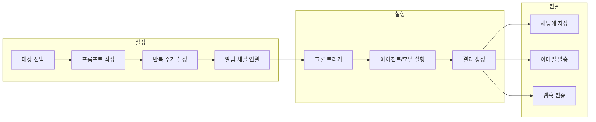
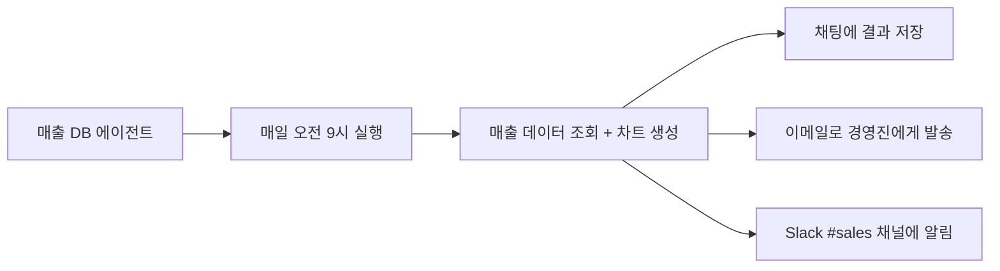

Cloosphere의 자동화 기능은 반복적인 AI 작업을 사람의 개입 없이 정해진 시간에 자동으로 실행합니다. 크론 스케줄러 기반의 예약 작업으로 보고서 생성, 데이터 분석, 상태 모니터링 등을 자동화하고, 결과를 이메일이나 웹훅으로 전달받으세요.

<Frame caption="예약 작업 목록 화면 — 카드 형태의 스케줄 목록">
  
</Frame>

---

## 자동화 기능

<Columns cols={2}>
  <Card title="예약 작업" icon="clock" href="/ko/automation/schedules">
    크론 기반 스케줄러로 에이전트, 플로우, 모델을 정해진 시간에 자동 실행합니다. 결과를 이메일, Slack, Teams 등으로 자동 전달받을 수 있습니다.
  </Card>
  <Card title="향후 계획" icon="lightbulb">
    이벤트 트리거 기반 자동화, 조건부 워크플로우 등 추가 자동화 기능이 계획되어 있습니다.
  </Card>
</Columns>

---

## 자동화 활용 시나리오

| 시나리오 | 대상 | 주기 | 알림 |
|----------|------|------|------|
| **일일 매출 보고서** | 매출 DB 에이전트 | 매일 오전 9시 | 이메일 |
| **주간 데이터 분석** | 분석 에이전트 | 매주 월요일 | Slack 웹훅 |
| **시스템 상태 점검** | 모니터링 에이전트 | 매시간 | 실패 시 Teams |
| **월간 KPI 리포트** | KPI 플로우 | 매월 1일 | 이메일 + Slack |
| **실시간 이상 감지** | 이상 감지 에이전트 | 10분마다 | 웹훅 (즉시) |

---

## 자동화 흐름

---

## 핵심 개념

### 대상 (Target)

자동 실행할 AI 리소스입니다. 에이전트, 플로우, 모델 중 하나를 선택합니다.

| 대상 유형 | 설명 | 적합한 사용 |
|-----------|------|------------|
| **에이전트** | 지식기반/DB 연결된 AI | 데이터 분석, 문서 기반 보고서 |
| **플로우** | 다단계 워크플로우 | 복잡한 멀티 스텝 자동화 |
| **모델** | 기본 LLM | 단순 텍스트 생성, 요약 |

### 크론 표현식 (Cron Expression)

실행 주기를 정의하는 표준 형식입니다. `0 9 * * 1-5`는 "평일 오전 9시"를 의미합니다. 직관적인 크론 에디터가 제공되므로 직접 작성할 필요가 없습니다.

### 알림 채널 (Delivery Channel)

실행 결과를 전달받을 채널입니다. 이메일, Slack, Teams, Discord 등 다양한 채널을 지원합니다.

---

## 사전 조건

<Warning>
  예약 작업을 사용하려면 다음 조건이 충족되어야 합니다:
  - 관리자가 사용자의 그룹에 `features.scheduled_tasks` 권한을 활성화해야 합니다
  - 자동 실행할 에이전트/플로우/모델에 대한 접근 권한이 있어야 합니다
  - 이메일/웹훅 알림을 사용하려면 관리자가 **관리자 > 설정 > 알림**에서 채널을 사전 설정해야 합니다
</Warning>

---

## 시작하기

<Steps>
  <Step title="워크스페이스 준비">
    먼저 자동 실행할 [에이전트](/ko/workspace/agents), [플로우](/ko/workspace/flows), 또는 모델을 준비합니다. 데이터 분석 자동화라면 [데이터베이스](/ko/workspace/database)를 연결한 에이전트를 생성하세요.
  </Step>
  <Step title="예약 작업 생성">
    [예약 작업](/ko/automation/schedules) 페이지에서 대상, 프롬프트, 실행 주기, 알림 채널을 설정합니다.
  </Step>
  <Step title="테스트 실행">
    **"즉시 실행"** 버튼으로 설정을 테스트합니다. 결과가 기대와 다르면 프롬프트를 수정하고 다시 테스트하세요.
  </Step>
  <Step title="활성화">
    테스트가 완료되면 스케줄을 활성화합니다. 설정된 주기에 따라 자동으로 실행됩니다.
  </Step>
</Steps>

---

## 구성 예시: 일일 매출 보고서 자동화

| 설정 항목 | 값 |
|-----------|-----|
| **대상** | 매출 분석 에이전트 (DB 연결) |
| **프롬프트** | "오늘의 매출 데이터를 분석하고 전일 대비 증감율 포함 보고서 작성" |
| **주기** | 매일 오전 9시 (`0 9 * * *`) |
| **알림 1** | 이메일 (성공 시) -> 경영진 |
| **알림 2** | Slack 웹훅 (항상) -> #sales |

<Tip>
  DbSphere 에이전트가 생성한 차트는 서버사이드 렌더링으로 이미지 변환되어 이메일과 웹훅에 자동으로 포함됩니다.
</Tip>
