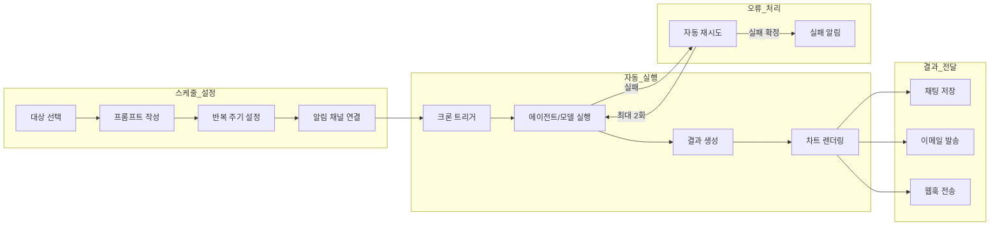

매일 아침 매출 보고서를 수동으로 요청하거나, 매주 시스템 모니터링 결과를 직접 확인하고 계신가요?

예약 작업은 AI에게 **정해진 시간에 자동으로 프롬프트를 보내고**, 결과를 채팅에 저장하거나 이메일/Slack/Teams로 전달합니다.

### 예시

> "매일 오전 9시에 어제 매출을 분석하고 보고서를 이메일로 보내줘"

| 방법 | 과정 | 소요 시간 |
|------|------|:---------:|
| 수동 요청 | 매일 채팅 접속 → 프롬프트 입력 → 결과 복사 → 이메일 작성 | 10~20분/일 |
| 예약 작업 | 한번 설정하면 매일 자동 실행 + 이메일 발송 | **0분** (자동) |

{/* SCREENSHOT: schedules-list
     화면: 예약 작업 목록
     영역: 카드 형태 스케줄 목록 + 상태 배지
     상태: 3~4개 스케줄 (Active/Inactive 혼합)
     하이라이트: 없음 */}
<Frame caption="예약 작업 목록에서 모든 스케줄의 상태, 다음 실행 시간, 대상을 확인합니다">
  
</Frame>

---

## 예약 작업 생명 주기



---

## 예약 작업 목록

사이드바의 **예약 작업** 섹션에서 모든 스케줄을 확인합니다.

| 기능 | 설명 |
|------|------|
| **검색** | 이름, 설명, 프롬프트로 검색 |
| **활성/비활성 전환** | 더보기 메뉴(⋮)에서 활성/비활성 전환 |
| **지금 실행** | 다음 주기를 기다리지 않고 바로 실행 |
| **삭제** | 스케줄 및 실행 이력 삭제 |

---

## 예약 작업 생성

**+** 아이콘 버튼을 클릭하여 스케줄을 생성합니다.

<Steps>
  <Step title="기본 정보">
    이름과 설명을 입력합니다.

    {/* SCREENSHOT: schedules-create-top
         화면: 예약 작업 생성 폼 상단
         영역: 이름, 설명 입력 필드
         상태: 빈 폼
         하이라이트: 없음 */}
    <Frame caption="예약 작업 이름과 설명을 입력합니다">
      
    </Frame>

    | 필드 | 설명 | 예시 |
    |------|------|------|
    | **이름** | 스케줄 이름 | "일일 매출 보고서" |
    | **설명** | 용도 설명 (선택) | "매일 오전 9시 매출 데이터 분석" |
  </Step>

  <Step title="대상 선택">
    실행할 에이전트, 플로우, 또는 모델을 선택합니다.

    | 대상 유형 | 설명 |
    |-----------|------|
    | **에이전트** | 지식기반, 데이터베이스 등이 연결된 AI 에이전트 |
    | **플로우** | 다단계 워크플로우 |
    | **모델** | 기본 LLM 모델 (직접 프롬프트 전달) |
    | **대시보드** | BI 대시보드 HTML 내보내기 (최신 데이터로 갱신하여 전달) |

    <Note>
      대상 에이전트/모델에 대한 접근 권한이 있어야 선택할 수 있습니다. 권한이 없으면 목록에 표시되지 않습니다.
    </Note>
  </Step>

  <Step title="프롬프트 작성">
    실행 시 전달할 프롬프트를 입력합니다.

    **작성 팁:**
    - 구체적인 출력 형태를 명시하세요
    - 에이전트에 구조화된 출력(JSON Schema)이 설정되어 있으면, 결과 필드를 알림 템플릿에서 활용할 수 있습니다

    **예시:**
    ```
    오늘의 매출 데이터를 분석하고, 전일 대비 증감율과 주요 변동 원인을 포함한
    보고서를 작성해주세요. 차트로 시각화하고 핵심 인사이트 3가지를 요약해주세요.
    ```
  </Step>

  <Step title="반복 주기 설정 (크론 에디터)">
    실행 주기를 설정합니다. 직관적인 크론 에디터를 제공합니다.

    {/* SCREENSHOT: schedules-cron-editor
         화면: 예약 작업 생성 > 크론 에디터
         영역: 반복 모드 버튼 + 시간/요일 선택 + 타임존
         상태: "매일" 모드 선택, 오전 9시 설정
         하이라이트: 없음 */}
    <Frame caption="직관적인 크론 에디터로 실행 주기를 설정합니다 — 복잡한 cron 표현식을 몰라도 됩니다">
      
    </Frame>

    | 모드 | 설명 | 예시 |
    |------|------|------|
    | **간격** | N분마다 실행 (1, 2, 3, 5, 10, 15, 20, 30분) | 매 10분마다 |
    | **매시간** | 매시간 특정 분에 실행 | 매시간 30분에 |
    | **매일** | 매일 지정 시간에 실행 | 매일 오전 9:00 |
    | **매주** | 지정 요일 + 시간에 실행 | 월~금 오전 9:00 |
    | **매월** | 지정 일 + 시간에 실행 | 매월 1일 오전 8:00 |
    | **커스텀** | 크론 표현식 직접 입력 | `0 9 * * 1-5` |

    타임존과 실행 기간도 설정할 수 있습니다.

    | 설정 | 설명 |
    |------|------|
    | **타임존** | 실행 시간 기준 시간대 (기본: 브라우저 시간대) |
    | **시작일** | 스케줄 시작 날짜 (선택) |
    | **종료일** | 스케줄 종료 날짜 (선택, 미설정 시 무기한) |
  </Step>

  <Step title="알림 설정">
    실행 결과를 알림으로 받을 채널을 설정합니다. 여러 개의 알림을 추가할 수 있습니다.

    {/* SCREENSHOT: schedules-delivery
         화면: 예약 작업 생성 > 알림 설정
         영역: 채널 유형 + 트리거 + 수신자/템플릿
         상태: 이메일 채널 1개 설정된 상태
         하이라이트: 없음 */}
    <Frame caption="여러 알림 채널을 추가하고, 성공/실패 조건별로 분기할 수 있습니다">
      
    </Frame>

    | 설정 | 설명 |
    |------|------|
    | **채널 유형** | 이메일 / 웹훅(사전 설정) / 직접 URL / Telegram / Google Chat |
    | **채널 선택** | 관리자가 설정한 이메일 또는 웹훅 채널 선택 |
    | **트리거** | 항상 / 성공 시만 / 실패 시만 |
    | **이메일 수신자** | 이메일 주소 목록 (이메일 채널만) |
    | **제목/본문 템플릿** | 이메일 제목 및 본문 (이메일 채널만) |
    | **메시지 템플릿** | 웹훅 메시지 (웹훅 채널만, 선택) |

    <Tip>
      하나의 스케줄에 여러 알림을 추가하여, 성공 시 이메일로, 실패 시 Slack으로 보내는 등 조건별 분기가 가능합니다.
    </Tip>
  </Step>

</Steps>

<Note>
  새로 생성된 예약 작업은 기본적으로 **활성** 상태(is_active=True)로 저장됩니다. 생성 즉시 다음 실행이 예약됩니다.
</Note>

---

## 크론 표현식 가이드

커스텀 모드에서 크론 표현식을 직접 입력할 수 있습니다. 크론 표현식은 **5개 필드**로 구성됩니다.

```
┌─────────── 분 (0-59)
│ ┌─────────── 시 (0-23)
│ │ ┌─────────── 일 (1-31)
│ │ │ ┌─────────── 월 (1-12)
│ │ │ │ ┌─────────── 요일 (0-6, 0=일요일)
│ │ │ │ │
* * * * *
```

### 특수 문자

| 문자 | 의미 | 예시 |
|------|------|------|
| `*` | 모든 값 | `* * * * *` = 매분 실행 |
| `,` | 여러 값 나열 | `0 9,18 * * *` = 9시, 18시 |
| `-` | 범위 지정 | `0 9 * * 1-5` = 월~금 |
| `/` | 간격 지정 | `*/10 * * * *` = 10분마다 |

### 요일 번호

| 번호 | 요일 |
|------|------|
| 0 | 일요일 |
| 1 | 월요일 |
| 2 | 화요일 |
| 3 | 수요일 |
| 4 | 목요일 |
| 5 | 금요일 |
| 6 | 토요일 |

### 자주 사용하는 표현식

| 크론 표현식 | 설명 |
|------------|------|
| `0 9 * * *` | 매일 오전 9시 |
| `0 9 * * 1-5` | 평일(월~금) 오전 9시 |
| `0 9,18 * * *` | 매일 오전 9시, 오후 6시 |
| `30 8 * * 1` | 매주 월요일 오전 8시 30분 |
| `0 0 1 * *` | 매월 1일 자정 |
| `0 0 1,15 * *` | 매월 1일, 15일 자정 |
| `*/30 * * * *` | 30분마다 |
| `0 */2 * * *` | 2시간마다 정각 |
| `0 9 * * 1,3,5` | 월/수/금 오전 9시 |
| `0 22 * * 0` | 매주 일요일 오후 10시 |

<Tip>
  간격/매시간/매일/매주/매월 모드에서 설정하면 크론 표현식이 자동 생성됩니다. 복잡한 스케줄만 커스텀 모드를 사용하세요.
</Tip>

---

## 예약 작업 관리

### 활성화/비활성화

목록에서 더보기 메뉴(⋮)를 열고 활성/비활성 전환 항목을 선택하여 스케줄을 켜거나 끌 수 있습니다. 비활성화 시 다음 실행이 예약되지 않습니다.

### 즉시 실행

**"지금 실행"** 버튼을 클릭하면 다음 주기를 기다리지 않고 즉시 실행합니다. 수동으로 결과를 확인하거나 설정을 테스트할 때 유용합니다.

### 편집

스케줄 카드를 클릭하여 상세 페이지에서 모든 설정을 수정할 수 있습니다. 수정 시 다음 실행 시간이 자동으로 재계산됩니다.

### 삭제

스케줄을 삭제하면 관련 실행 이력도 함께 삭제됩니다.

<Warning>
  삭제된 스케줄은 복구할 수 없습니다. 실행 이력과 연결된 채팅 기록도 함께 삭제될 수 있으므로 신중하게 진행하세요.
</Warning>

### 사용자에게 복사

예약 작업을 다른 사용자에게 복사할 수 있습니다. **"사용자에게 복사"** 기능은 **복사 기반**으로 동작합니다.

| 항목 | 설명 |
|------|------|
| **독립 복사본** | 공유받은 사용자에게 별도의 스케줄이 생성됩니다 |
| **설정 복사** | 대상, 프롬프트, 주기, 알림 설정이 모두 복사됩니다 |
| **독립 수정** | 공유 후 각 사용자가 자신의 스케줄을 자유롭게 수정할 수 있습니다 |
| **출처 추적** | 복사본 메타데이터에 원본 소유자와 스케줄 정보가 기록됩니다 |

---

## 실행 이력

스케줄 상세 페이지에서 최근 실행 이력을 확인할 수 있습니다.

{/* SCREENSHOT: schedules-history
     화면: 예약 작업 상세 > History 탭
     영역: 실행 이력 목록 (상태 배지, 소요 시간, 재시도)
     상태: 여러 이력 (completed + failed 혼합)
     하이라이트: 없음 */}
<Frame caption="실행 이력에서 상태, 소요 시간, 재시도 횟수를 확인합니다">
  
</Frame>

### 상태

| 상태 | 색상 | 설명 |
|------|------|------|
| **대기 중** | 노란색 | 실행 대기 |
| **실행 중** | 파란색 | 현재 실행 중 |
| **완료** | 초록색 | 정상 완료 |
| **실패** | 빨간색 | 오류 발생 |

### 이력 상세 정보

| 항목 | 설명 |
|------|------|
| **실행 시간** | 예약된 실행 시간 |
| **소요 시간** | 시작부터 완료까지 걸린 시간 |
| **재시도 횟수** | 오류 발생 시 자동 재시도 횟수 (최대 2회) |
| **에러 메시지** | 실패 원인 (실패 시) |
| **채팅 보기** | 결과가 저장된 채팅으로 이동 |

### 자동 재시도

타임아웃, 서버 오류(5xx), 속도 제한 오류, 연결 오류는 자동으로 최대 2회 재시도됩니다. 10분 이상 실행 중인 작업은 자동으로 복구됩니다.

### 이력 보관

완료 및 실패한 실행 기록은 30일 후 자동으로 삭제됩니다.

---

## 채팅 저장

모든 실행 결과는 전용 채팅에 저장됩니다.

| 항목 | 설명 |
|------|------|
| **첫 실행** | 새 채팅이 자동 생성됩니다 |
| **이후 실행** | 같은 채팅에 결과가 누적됩니다 |
| **채팅 제목** | 알림 제목 템플릿으로 설정 (기본: `[{{schedule_name}}] {{result.title}}`) |
| **바로가기** | 실행 이력에서 "채팅 보기" 링크로 이동 |

---

## 차트 이미지

데이터베이스(DbSphere) 에이전트가 생성한 차트는 서버사이드 렌더링으로 이미지로 변환되어 알림에 포함됩니다.

**지원 차트 유형:**
- 막대 차트, 선 차트, 원형 차트, 산점도
- 히트맵, 히스토그램, 그룹 막대 차트

**채널별 전달 방식:**

| 채널 | 방식 |
|------|------|
| **이메일** | 인라인 이미지로 본문에 포함 |
| **Slack** | 이미지 URL로 표시 |
| **Teams** | Adaptive Card에 이미지 포함 |
| **Discord** | Embed에 이미지 포함 (첫 번째 이미지) |
| **Telegram** | 이미지 메시지로 전송 |
| **Google Chat** | Card에 이미지 포함 |

---

## 템플릿 변수

알림 제목, 본문, 메시지 템플릿에서 사용할 수 있는 변수입니다.

| 변수 | 설명 | 예시 |
|------|------|------|
| `{{schedule_name}}` | 스케줄 이름 | 일일 매출 보고서 |
| `{{prompt}}` | 실행된 프롬프트 | 오늘의 매출 데이터를... |
| `{{result}}` | 전체 실행 결과 | (AI 응답 전체) |
| `{{status}}` | 실행 상태 | completed / failed |
| `{{result_raw}}` | 가공 전 원본 결과 | (AI 응답 원본) |
| `{{chat_url}}` | 결과 채팅 URL | https://cloosphere.example.com/c/abc123 |
| `{{completed_at}}` | 완료 시간 | 2025-02-27 09:00:45 |

### 구조화된 출력 접근

대상 에이전트에 JSON Schema 응답 형식이 설정되어 있으면, 점 표기법으로 개별 필드에 접근할 수 있습니다.

```
{{result.title}}           → 결과 JSON의 title 필드
{{result.data.count}}      → 중첩 필드 접근
{{result.metrics.revenue}} → 매출 데이터 접근
```

<Tip>
  알림 설정 화면에서 구조화된 출력 필드가 자동으로 감지되어 버튼으로 표시됩니다. 클릭하면 템플릿에 자동 삽입됩니다.
</Tip>

### 템플릿 예시

<Tabs>
  <Tab title="이메일 제목">
    ```
    [{{schedule_name}}] {{status}} - {{completed_at}}
    ```
  </Tab>
  <Tab title="이메일 본문">
    ```
    스케줄 "{{schedule_name}}" 실행이 완료되었습니다.

    프롬프트: {{prompt}}

    결과:
    {{result}}
    ```
  </Tab>
  <Tab title="Slack 메시지">
    ```
    *{{schedule_name}}* 실행 결과 ({{status}})
    > {{result}}
    ```
  </Tab>
</Tabs>

---

## FAQ

## 접근 권한

| 범위 | 설명 |
|------|------|
| **생성 권한** | `features.scheduled_tasks` 권한이 있는 사용자만 생성 가능 (관리자는 항상 가능) |
| **수정/삭제** | 소유자 또는 관리자만 가능 |
| **공유 (읽기)** | `access_control`으로 특정 그룹/사용자에게 조회 권한 부여 |
| **대상 접근** | 대상 에이전트/모델에 대한 읽기 권한 필요 (없으면 목록에 미표시) |

---

## FAQ

<AccordionGroup>
  <Accordion title="스케줄이 실행되지 않아요." icon="triangle-exclamation">
    다음을 확인하세요:
    - 스케줄이 **활성** 상태인지 확인
    - 시작일/종료일이 올바르게 설정되어 있는지 확인
    - 대상 에이전트/모델에 대한 접근 권한 확인
    - `features.scheduled_tasks` 권한이 사용자 그룹에 활성화되어 있는지 확인
  </Accordion>

  <Accordion title="정시에 실행되지 않고 1~2분 늦게 실행됩니다." icon="circle-question">
    스케줄러는 **1분 간격**으로 실행 대상을 확인합니다. 이후 작업 대기열에 들어가면 **5초 간격**으로 워커가 처리합니다. 따라서 최대 약 1분 정도의 지연이 발생할 수 있으며 이는 정상입니다.
  </Accordion>

  <Accordion title="여러 시간대의 사용자가 있으면 어떻게 하나요?" icon="circle-question">
    각 스케줄에 개별 타임존을 설정할 수 있습니다. 예: 서울 사무소는 `Asia/Seoul`, 뉴욕 사무소는 `America/New_York`. 기본값은 브라우저의 시간대를 자동 감지합니다.
  </Accordion>

  <Accordion title="실행 결과가 채팅에 보이지 않아요." icon="triangle-exclamation">
    실행이 실패했을 수 있습니다. 실행 이력에서 상태와 에러 메시지를 확인하세요.
  </Accordion>

  <Accordion title="알림 채널은 어디서 설정하나요?" icon="circle-question">
    이메일, 웹훅 채널은 관리자가 **관리자 > 설정 > 알림**에서 사전 설정합니다. 직접 URL 방식은 사전 설정 없이 스케줄에서 바로 입력할 수 있습니다.
  </Accordion>

  <Accordion title="크론 표현식을 모르겠어요." icon="circle-question">
    간격/매시간/매일/매주/매월 모드를 선택하면 자동으로 크론 표현식이 생성됩니다. 커스텀 모드는 위의 [크론 표현식 가이드](#크론-표현식-가이드) 섹션을 참고하세요.
  </Accordion>

  <Accordion title="예약 작업을 다른 사용자에게 복사할 수 있나요?" icon="circle-question">
    네, 스케줄 상세 페이지에서 **"사용자에게 복사"** 버튼을 클릭하고 대상 사용자를 선택하세요. 각 사용자에게 독립적인 복사본이 생성되며, 원본과 별개로 자유롭게 수정할 수 있습니다.
  </Accordion>
</AccordionGroup>

---

## 관련 페이지

<Columns cols={3}>
  <Card title="에이전트" icon="robot" href="/ko/workspace/agents">
    예약 실행 대상이 되는 AI 에이전트 설정
  </Card>
  <Card title="알림 설정" icon="bell" href="/ko/admin/notifications">
    이메일/웹훅 알림 채널 사전 설정
  </Card>
  <Card title="데이터베이스" icon="database" href="/ko/workspace/database">
    차트 포함 매출 보고서 자동화에 활용
  </Card>
</Columns>
