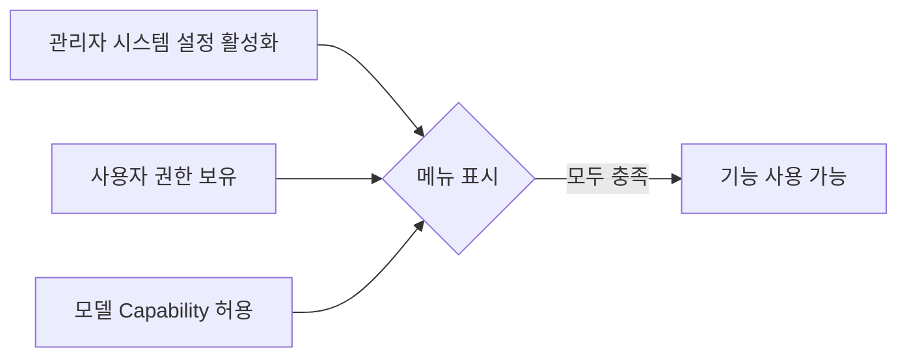

Cloosphere 채팅에서는 AI의 기본 대화 기능 외에 **웹 검색**, **이미지 생성**, **코드 실행** 세 가지 확장 기능을 사용할 수 있습니다.
입력창 좌측의 **"+"** 버튼을 클릭하면 확장 기능 토글 및 파일 첨부 메뉴가 나타납니다.

<Frame caption="확장 기능 토글 메뉴">
  
</Frame>

## 기능 활성화 조건

확장 기능은 다음 조건이 **모두** 충족되어야 메뉴에 표시됩니다.

| 조건 | 설명 |
|------|------|
| **시스템 설정** | 관리자가 해당 기능을 전역으로 활성화해야 합니다 |
| **사용자 권한** | `permissions.features.web_search` 등의 권한이 필요합니다 |
| **모델 Capability** | 에이전트의 capability 설정이 `off`가 아니어야 합니다 |

<Note>
  관리자(`admin` role)는 권한 체크를 우회하므로 시스템 설정만 활성화되면 기능을 사용할 수 있습니다.
</Note>

## 확장 기능 상세

<Tabs>
  <Tab title="웹 검색">
    ### 웹 검색 (Web Search)

    AI가 실시간으로 웹을 검색하여 최신 정보를 기반으로 답변합니다.

    

    #### 활성화 방법

    <Steps>
      <Step title="토글 메뉴 열기">
        입력창 좌측의 **"+"** 버튼을 클릭합니다.
      </Step>
      <Step title="Web Search 활성화">
        **Web Search** 스위치를 켭니다. 활성화되면 이후 전송하는 메시지에 웹 검색이 적용됩니다.
      </Step>
    </Steps>

    #### 동작 방식

    1. AI가 사용자 질문에서 검색 쿼리를 자동 추출
    2. 관리자가 설정한 웹 검색 엔진(SearxNG, Google PSE, Brave 등)으로 웹 검색 수행
    3. 검색 결과 URL 목록과 쿼리가 접힌 상태로 표시
    4. 검색 결과를 컨텍스트로 활용하여 답변 생성
    5. 출처 링크를 인용(citation)으로 제공

    #### 검색 결과 표시

    응답 상단에 검색 쿼리와 참조한 URL 목록이 접기/펼치기(collapsible) 형태로 표시됩니다.
    각 URL을 클릭하면 원본 페이지로 이동합니다.

    <Tip>
      **설정 > 인터페이스 > Web Search in Chat**에서 웹 검색을 **"항상 활성화(always)"**로 설정하면 토글 없이 모든 대화에서 자동으로 웹 검색이 수행됩니다.
    </Tip>

    #### 활용 예시

    - "오늘 코스피 지수 알려줘"
    - "최신 AI 트렌드가 뭐야"
    - "이 회사 최근 뉴스 찾아줘"
  </Tab>

  <Tab title="이미지 생성">
    ### 이미지 생성 (Image Generation)

    DALL-E 등 이미지 생성 모델을 활용하여 텍스트 프롬프트로 이미지를 생성합니다.

    

    #### 활성화 방법

    이미지 생성 Connection이 여러 개 설정된 경우 서브 메뉴에서 사용할 Connection을 선택합니다.

    <Steps>
      <Step title="토글 메뉴 열기">
        입력창 좌측의 **"+"** 버튼을 클릭합니다.
      </Step>
      <Step title="Image Generation 선택">
        **Image Generation** (관리자 설정에 따라 **Image**로 표시될 수 있음) 항목을 클릭하면 사용 가능한 Connection 목록이 나타납니다.
      </Step>
      <Step title="Connection 선택">
        사용할 이미지 생성 엔진을 선택합니다. 각 Connection에 마우스를 올리면 모델명, 크기, 품질 등의 상세 정보가 표시됩니다.
      </Step>
    </Steps>

    #### Connection 정보

    각 이미지 Connection은 다음 정보를 포함합니다.

    | 항목 | 설명 |
    |------|------|
    | **Deployment** | 이미지 생성 배포 이름 (Azure deployment name) |
    | **Model** | 사용하는 모델 이름 |
    | **Size** | 생성 이미지 크기 (예: 1024x1024) |
    | **Quality** | 이미지 품질 설정 (해당 시) |
    | **Format** | 출력 형식 (PNG, JPEG 등) |

    #### 프롬프트 작성 팁

    - **구체적인 묘사**: "산"보다 "눈 덮인 알프스 산맥의 일출 풍경, 사실적인 사진 스타일"
    - **스타일 지정**: "수채화 스타일", "미니멀 일러스트", "3D 렌더링"
    - **구도 명시**: "전체 샷", "클로즈업", "조감도"

    <Note>
      에이전트 모델에서는 관리자가 특정 Connection만 사용하도록 제한할 수 있습니다.
      이 경우 허용된 Connection만 목록에 표시됩니다.
    </Note>
  </Tab>

  <Tab title="코드 실행">
    ### 코드 실행 (Code Interpreter)

    AI가 생성한 코드를 직접 실행하고 결과를 확인할 수 있습니다.

    

    #### 활성화 방법

    <Steps>
      <Step title="토글 메뉴 열기">
        입력창 좌측의 **"+"** 버튼을 클릭합니다.
      </Step>
      <Step title="Code Interpreter 활성화">
        **Code Interpreter** 스위치를 켭니다.
      </Step>
    </Steps>

    #### 지원 기능

    | 기능 | 설명 |
    |------|------|
    | **Python 코드 실행** | Pyodide(브라우저) 또는 서버 사이드 Jupyter 엔진으로 Python 코드 실행 (관리자 설정에 따라 결정) |
    | **데이터 시각화** | matplotlib, plotly 등을 활용한 차트/그래프 생성 |
    | **파일 생성** | 코드 실행 결과를 파일로 다운로드 |
    | **실행 결과 확인** | stdout, stderr, 반환값을 실시간 표시 |

    #### 코드 블록 실행

    AI가 코드 블록을 포함한 응답을 생성하면, 코드 블록 상단에 **실행(Run)** 버튼이 나타납니다.
    클릭하면 코드가 실행되고 결과가 코드 블록 하단에 표시됩니다.

    #### 아티팩트 뷰어

    AI가 HTML 또는 SVG 코드를 생성하면, 아티팩트 뷰어 패널이 **자동으로** 열리며 렌더링된 결과를 바로 확인할 수 있습니다.

    <Steps>
      <Step title="웹 콘텐츠 생성 요청">
        AI에게 웹 페이지, 차트, SVG 그래픽, UI 컴포넌트 등을 생성하도록 요청합니다.
      </Step>
      <Step title="자동 렌더링 확인">
        HTML/SVG 코드가 생성되면 아티팩트 뷰어 패널이 자동으로 열리고 렌더링된 결과가 표시됩니다.
      </Step>
      <Step title="결과 확인">
        Artifact 패널에서 렌더링된 결과를 확인하고, 필요시 코드를 복사합니다.
      </Step>
    </Steps>

    

    <Warning>
      브라우저(Pyodide) 모드에서는 시스템 접근이나 네트워크 요청이 제한됩니다. 관리자가 서버 사이드 Jupyter 엔진을 설정한 경우에는 이 제한이 적용되지 않을 수 있습니다.
    </Warning>
  </Tab>
</Tabs>

## Tool 활용

확장 기능 외에도, 관리자가 등록한 **Tool**을 대화에서 활성화할 수 있습니다.
토글 메뉴 상단에 사용 가능한 Tool 목록이 표시되며, 스위치로 개별 활성화/비활성화합니다.

<Frame caption="확장 기능 토글 메뉴">
  
</Frame>

| 항목 | 설명 |
|------|------|
| **Tool 이름** | 관리자가 등록한 Tool의 이름 |
| **Tool 설명** | 마우스 호버 시 도구 설명 tooltip 표시 |
| **활성화 스위치** | 해당 대화에서 Tool 사용 여부 토글 |

<Tip>
  Tool은 대화 단위로 활성화됩니다. 한 대화에서 Tool을 켜도 다른 대화에는 영향을 주지 않습니다.
</Tip>

## 에이전트 vs 일반 모델

확장 기능의 가용성은 선택한 모델 유형에 따라 달라집니다.

| 기능 | 에이전트 모델 | 일반 모델 |
|------|-------------|----------|
| **웹 검색** | Capability 설정에 따라 | 시스템 설정 + 사용자 권한 충족 시 표시 |
| **이미지 생성** | Capability 설정에 따라 | 시스템 설정 + 사용자 권한 충족 시 표시 |
| **코드 실행** | Capability 설정에 따라 | 시스템 설정 + 사용자 권한 충족 시 표시 |

<Note>
  에이전트 모델에서 capability가 `on`으로 설정된 기능은 대화 시작 시 자동으로 활성화됩니다.
  `user`로 설정된 기능은 사용자가 직접 토글해야 합니다.
</Note>
