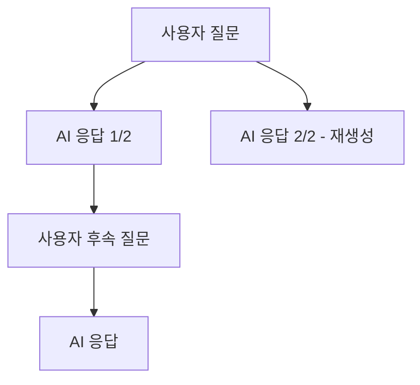

Cloosphere는 모든 대화를 자동으로 저장합니다. 사이드바에서 채팅 이력을 검색하고, 폴더로 분류하고, 다양한 형식으로 내보낼 수 있습니다.

## 새 대화 시작

<Steps>
  <Step title="새 채팅 버튼 클릭">
    사이드바 상단의 **새 채팅** 버튼을 클릭하거나 `Ctrl + Shift + O` 단축키를 사용합니다.
  </Step>
  <Step title="모델 선택">
    채팅 헤더의 드롭다운에서 사용할 AI 모델을 선택합니다. 모델을 선택하지 않으면 기본 모델이 사용됩니다.
  </Step>
  <Step title="메시지 입력 및 전송">
    입력창에 질문이나 요청을 입력하고 `Enter`를 누르면 대화가 시작됩니다. 첫 메시지를 기반으로 채팅 제목이 자동 생성됩니다.
  </Step>
</Steps>

<Tip>
  **임시 채팅(Temporary Chat)** 모드를 활성화하면 대화 이력이 저장되지 않습니다. 민감한 내용을 테스트하거나 일회성 질문에 유용합니다.
</Tip>

## 채팅 이력 검색

사이드바 상단의 검색창에서 대화를 검색할 수 있습니다.

- **제목 검색**: 자동 생성된 채팅 제목으로 검색
- **내용 검색**: 대화 내용 기반 full-text 검색
- **태그 필터**: `tag:태그명` 형식으로 검색하여 특정 태그가 지정된 대화만 필터링

<Note>
  채팅 목록은 스크롤 기반 페이지네이션으로 동작합니다. 아래로 스크롤하면 이전 대화가 자동으로 로드됩니다.
</Note>

## 채팅 메뉴

각 채팅 항목에 마우스를 올리면 나타나는 **더보기(...)** 버튼을 클릭하면 다양한 작업을 수행할 수 있습니다.

<Frame caption="채팅 컨텍스트 메뉴">
  
</Frame>

| 메뉴 | 설명 |
|------|------|
| **고정 / 고정 해제** | 중요한 대화를 사이드바 상단에 고정 |
| **이름 변경** | 자동 생성된 채팅 제목을 수동 변경 |
| **복제** | 현재 대화를 복사하여 새 채팅 생성 |
| **보관** | 대화를 목록에서 숨기되 삭제하지 않음 |
| **공유** | 공유 링크 생성 ([공유 상세](/ko/chat/sharing)) |
| **다운로드** | 채팅 내보내기 (.json), 일반 텍스트(.txt), PDF 문서(.pdf) 형식으로 내보내기 |
| **삭제** | 대화 영구 삭제 |
| **태그** | 카테고리 태그 추가/제거 |

## 메시지 편집 및 삭제

### 사용자 메시지 편집

사용자가 보낸 메시지를 편집하면 **원본 메시지는 보존**되고, 수정된 내용으로 AI가 새로운 응답을 생성합니다. 이 과정에서 대화 분기(branch)가 만들어집니다.

<Frame caption="사용자 메시지 편집 후 분기">
  
</Frame>

<Steps>
  <Step title="메시지 호버">
    편집할 메시지에 마우스를 올립니다.
  </Step>
  <Step title="편집 버튼 클릭">
    메시지 우측에 나타나는 **편집** 아이콘을 클릭합니다.
  </Step>
  <Step title="내용 수정 후 전송">
    수정된 내용을 입력하고 **보내기** 버튼을 클릭하면 AI가 새로운 응답을 생성합니다.
    **저장** 버튼을 클릭하면 내용만 수정되고 새로운 응답은 생성되지 않습니다.
  </Step>
</Steps>

### AI 응답 편집

AI의 응답도 직접 수정할 수 있습니다. 편집 시 원본 내용이 보존되므로 언제든 원래 응답으로 돌아갈 수 있습니다.

### 메시지 삭제

메시지를 삭제하면 해당 메시지의 하위 응답(children)은 상위 메시지로 재연결됩니다. 대화의 전체 흐름이 끊어지지 않도록 설계되어 있습니다.

### 분기(Branch) 탐색

메시지가 여러 분기를 가진 경우, 메시지 하단에 `1/3` 형태의 인디케이터가 표시됩니다. 좌우 화살표로 다른 분기의 응답을 탐색할 수 있습니다.

## 폴더 관리

대화를 폴더로 분류하여 체계적으로 관리할 수 있습니다.

<Steps>
  <Step title="폴더 생성">
    사이드바에서 **새 폴더** 버튼을 클릭하고 폴더 이름을 입력합니다.
  </Step>
  <Step title="채팅을 폴더로 이동">
    채팅 항목을 드래그하여 원하는 폴더에 드롭합니다.
  </Step>
  <Step title="폴더 구조 관리">
    폴더 안에 하위 폴더를 생성하여 계층적으로 관리할 수 있습니다.
  </Step>
</Steps>

<Frame caption="사이드바 폴더 구조">
  
</Frame>

<Tip>
  폴더를 접거나 펼쳐서 사이드바 공간을 효율적으로 활용하세요.
</Tip>

## 대화 내보내기

### 개별 채팅 내보내기

채팅 메뉴의 **다운로드** 서브 메뉴에서 원하는 형식을 선택합니다.

<Tabs>
  <Tab title="JSON (.json)">
    메시지 이력, 메타데이터, 분기 구조를 포함한 완전한 형식입니다.
    다른 Cloosphere 인스턴스로 **가져오기(import)**할 수 있습니다.
  </Tab>
  <Tab title="텍스트 (.txt)">
    역할(USER/ASSISTANT)과 메시지 내용만 포함한 플레인 텍스트 형식입니다.
    간단한 기록 보관이나 외부 도구에서의 활용에 적합합니다.
  </Tab>
  <Tab title="PDF (.pdf)">
    A4 형식의 PDF로 내보냅니다. 현재 테마(라이트/다크)가 반영되며,
    긴 대화는 여러 페이지로 자동 분할됩니다.
  </Tab>
</Tabs>

### 전체 채팅 내보내기 / 가져오기

설정 > **채팅** 탭에서 전체 대화를 일괄 관리할 수 있습니다.

<Frame caption="설정 채팅 탭">
  
</Frame>

| 기능 | 설명 |
|------|------|
| **Import Chats** | JSON 파일로 대화 가져오기 (OpenAI export 형식도 자동 변환 지원) |
| **Export Chats** | 모든 대화를 `chat-export-{timestamp}.json` 파일로 일괄 내보내기 |
| **Archived Chats** | 보관된 대화 목록 확인 및 복원 |
| **모든 채팅 보관** | 모든 대화를 보관 (확인 필요) |
| **Delete All Chats** | 모든 대화를 영구 삭제 (확인 필요) |

<Warning>
  **Delete All Chats**는 되돌릴 수 없습니다. 중요한 대화는 미리 내보내기하세요.
</Warning>

## 일괄 작업

Shift 키를 누른 상태에서 채팅 항목에 마우스를 올리면 보관/삭제 버튼이 바로 표시되어 빠르게 개별 작업할 수 있습니다.

## 보관 관리

보관된 대화는 사이드바 목록에서 숨겨지지만 삭제되지 않습니다.

<Steps>
  <Step title="보관된 대화 보기">
    설정 > 채팅 > **Archived Chats** 버튼을 클릭하여 보관 목록을 엽니다.
  </Step>
  <Step title="복원 또는 삭제">
    보관된 대화를 복원하여 사이드바에 다시 표시하거나, 영구 삭제할 수 있습니다.
    **모두 보관 해제** 버튼으로 보관된 모든 대화를 일괄 복원하거나, **내보내기** 버튼으로 보관된 대화를 일괄 내보낼 수도 있습니다.
  </Step>
</Steps>
