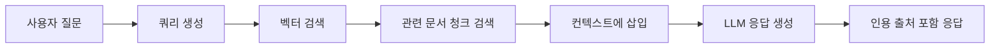

Cloosphere 채팅에서는 파일을 첨부하여 AI에게 분석을 요청하거나, 지식기반(Knowledge Base)을 연동하여 문서 기반 답변을 받을 수 있습니다.

## 파일 첨부 방법

다양한 방법으로 파일을 채팅에 첨부할 수 있습니다.

<Frame caption="파일 첨부 입력 영역">
  
</Frame>

<Tabs>
  <Tab title="드래그 앤 드롭">
    파일을 채팅 영역으로 끌어다 놓으면 자동으로 업로드됩니다.
    여러 파일을 동시에 드래그할 수 있습니다.
  </Tab>
  <Tab title="파일 선택">
    입력창 좌측의 **"+"** 버튼 > **Upload Files**를 클릭하여 파일 탐색기에서 선택합니다.
  </Tab>
  <Tab title="화면 캡처">
    **"+"** 버튼 > **Capture**를 클릭하면 화면을 캡처하여 이미지로 첨부합니다.
    데스크톱에서는 화면 공유 방식으로, 모바일에서는 카메라로 동작합니다.
  </Tab>
  <Tab title="클립보드 붙여넣기">
    이미지를 클립보드에 복사한 후 입력창에 `Ctrl + V`로 붙여넣을 수 있습니다.
    긴 텍스트를 붙여넣을 때 파일로 자동 변환하려면, **설정 > 인터페이스**에서 **"Paste Large Text as File"** 옵션을 활성화해야 합니다 (기본값: 비활성화).
  </Tab>
  <Tab title="클라우드 스토리지">
    관리자가 활성화한 경우, 다음 클라우드 스토리지에서 직접 파일을 가져올 수 있습니다.

    - **Google Drive**: Google 계정 연동
    - **OneDrive**: Microsoft 계정 연동
    - **SharePoint**: 조직 SharePoint 사이트 탐색
  </Tab>
</Tabs>

## 지원 파일 형식

| 카테고리 | 형식 |
|----------|------|
| **문서** | PDF, DOCX, PPTX, TXT, MD, HTML |
| **스프레드시트** | XLSX, CSV |
| **이미지** | PNG, JPG, GIF, WebP, AVIF |
| **코드** | PY, JS, TS, Java, C++ 등 |
| **오디오** | WAV, MP3 등 |
| **데이터** | JSON, XML, YAML |

<Tip>
  오디오 파일(WAV, MP3 등)을 업로드하면 STT(Speech-to-Text)를 통해 자동으로 텍스트 변환(트랜스크립션)이 수행됩니다.
</Tip>

## 파일 크기 제한

<Note>
  파일 최대 크기는 관리자가 **설정 > 문서** 메뉴에서 지정한 값에 따라 달라집니다.
  제한을 초과하는 파일은 "File size should not exceed X MB" 오류 메시지와 함께 업로드가 거부됩니다.
</Note>

## 이미지 분석

이미지 파일(PNG, JPG, GIF, WebP, AVIF)을 첨부하면 Vision 모델이 내용을 분석합니다.

<Frame caption="이미지 분석 응답">
  
</Frame>

<Accordion title="이미지 분석 활용 예시">
  - **차트/그래프**: 데이터 포인트 추출 및 분석
  - **문서 이미지**: OCR 기반 텍스트 추출
  - **UI 디자인**: 디자인 피드백 및 코드 변환
  - **오류 화면**: 에러 메시지 분석 및 해결책 제안
  - **사진**: 객체 인식, 장면 설명
</Accordion>

<Warning>
  선택된 모델이 Vision을 지원하지 않는 경우, 이미지 첨부 시 "Selected model(s) do not support image inputs" 오류가 표시됩니다.
</Warning>

<Tip>
  **설정 > 인터페이스 > 파일 > Image Compression**을 활성화하면 고해상도 이미지를 지정된 크기로 자동 압축하여 전송 속도와 토큰 효율을 높일 수 있습니다.
</Tip>

## 문서 기반 파일 처리

이미지가 아닌 파일(PDF, DOCX, 코드 파일 등)은 업로드 시 **자동으로 텍스트가 추출**됩니다.

<Steps>
  <Step title="파일 업로드">
    위 방법 중 하나로 파일을 첨부합니다. 업로드 중에는 "uploading" 상태가 표시됩니다.
  </Step>
  <Step title="텍스트 추출">
    서버에서 파일 내용을 자동 추출합니다. 추출 완료 후 "uploaded" 상태로 변경됩니다.
  </Step>
  <Step title="컨텍스트 활용">
    추출된 텍스트가 AI 대화의 컨텍스트로 포함되어, 파일 내용에 대한 질문이 가능합니다.
  </Step>
</Steps>

## 지식기반 연동 (RAG)

### `#` 명령어로 지식기반 참조

입력창에서 `#`을 입력하면 사용 가능한 지식기반 컬렉션과 개별 파일 목록이 나타납니다. 선택한 지식기반 또는 파일의 문서를 검색하여 답변에 활용합니다.

<Frame caption="지식기반 자동완성 드롭다운">
  
</Frame>

```
#인사규정 연차 신청 절차가 어떻게 되나요?
```

### RAG 동작 방식



<Steps>
  <Step title="쿼리 분석">
    사용자 질문에서 검색 쿼리를 생성합니다.
  </Step>
  <Step title="벡터 검색">
    지식기반에 저장된 문서 청크(chunk)를 대상으로 벡터 유사도 검색을 수행합니다.
  </Step>
  <Step title="컨텍스트 구성">
    검색된 관련 문서 청크를 AI 프롬프트의 컨텍스트에 삽입합니다.
  </Step>
  <Step title="응답 생성">
    AI가 검색된 문서를 참고하여 답변을 생성하고, 인용 출처를 함께 제공합니다.
  </Step>
</Steps>

### 에이전트 기반 RAG

에이전트 모델에 지식기반이 연결된 경우, `#` 명령어 없이도 자동으로 지식기반을 검색합니다.
워크스페이스 > 에이전트 설정에서 지식기반을 연결할 수 있습니다.

## 인용 출처 표시

지식기반 검색이나 웹 검색을 참조한 응답에는 **인용 출처**가 표시됩니다.

<Frame caption="인용 출처 표시">
  
</Frame>

### 인용 목록

응답 하단에 참조한 문서들이 목록으로 표시됩니다.

| 표시 정보 | 설명 |
|----------|------|
| **인덱스 번호** | 인용 순서를 나타내는 번호 |
| **출처명** | 원본 파일명 또는 URL |
| **출처 수 토글** | "N Sources" 형식으로 참조된 전체 출처 수를 표시하며, 클릭하여 목록을 펼칠 수 있습니다 |

<Note>
  관련도(유사도 점수)는 인용 목록에서는 표시되지 않으며, 인용 항목을 클릭하여 열리는 **원문 모달** 내에서만 확인할 수 있습니다.
</Note>

### 원문 확인

인용 항목을 클릭하면 **원문 모달**이 열려 검색된 문서 청크의 전체 내용을 확인할 수 있습니다.

<Steps>
  <Step title="인용 배지 클릭">
    응답 하단의 인용 영역에서 출처 항목을 클릭합니다.
  </Step>
  <Step title="원문 확인">
    모달에서 검색된 문서 청크의 전체 텍스트와 메타데이터를 확인합니다.
  </Step>
  <Step title="신뢰성 검증">
    원문을 통해 AI 응답의 정확성을 직접 검증할 수 있습니다.
  </Step>
</Steps>

<Tip>
  URL 기반 출처(웹 검색 결과)는 클릭 시 원본 웹 페이지로 바로 이동합니다.
</Tip>

## Chat Controls의 파일 관리

제어 패널(Chat Controls)의 **Files** 섹션에서 현재 대화에 첨부된 파일 목록을 확인하고 관리할 수 있습니다.

- 각 파일 항목에서 파일명, 유형, 크기를 확인
- **휴지통 아이콘**으로 개별 파일 제거
- 파일 클릭으로 상세 정보 확인
