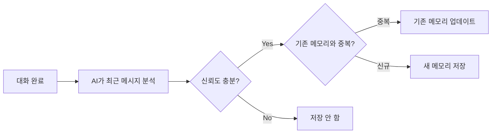
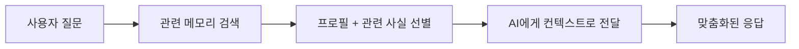

AI와 대화할 때마다 매번 같은 맥락을 반복 설명해야 했던 경험이 있으신가요?

메모리 기능을 활성화하면, AI가 이전 대화에서 학습한 정보를 **자동으로 기억**하고 이후 대화에 활용합니다.

### 예시

> "우리 팀은 Python 3.11 + FastAPI를 사용하고, 배포는 Azure AKS로 합니다"

| 상태 | 동작 | 결과 |
|------|------|------|
| 메모리 OFF | 매번 새로운 대화 | "어떤 프레임워크를 쓰시나요?" 반복 질문 |
| 메모리 ON | 이전 대화에서 기술 스택 기억 | FastAPI 기반 코드 제안, AKS 배포 가이드 바로 제공 |

<Warning>
  메모리는 현재 **Experimental(실험적)** 기능입니다. 향후 동작이 변경될 수 있습니다.
</Warning>

---

## 메모리 활성화

<Steps>
  <Step title="설정 열기">
    화면 우상단 또는 사이드바에서 **Settings** 아이콘을 클릭합니다.
  </Step>
  <Step title="Personalization 탭 선택">
    설정 모달에서 **Personalization** 탭으로 이동합니다.
  </Step>
  <Step title="Memory 토글 ON">
    Memory 섹션의 토글 스위치를 켭니다.

    {/* SCREENSHOT: memory-toggle
         화면: Settings 모달 > Personalization 탭
         영역: Memory 섹션 (Experimental 뱃지 + 토글 스위치 + 설명 텍스트 + Manage 버튼)
         상태: 토글 ON 상태
         하이라이트: 토글 스위치 영역 */}
    <Frame caption="Settings > Personalization 탭에서 Memory 토글을 켭니다">
      
    </Frame>
  </Step>
</Steps>

<Tip>
  메모리를 끄면 자동 추출과 대화 주입이 **모두** 비활성화됩니다. 기존에 저장된 메모리는 삭제되지 않고 보존됩니다.
</Tip>

---

## 메모리가 저장되는 3가지 방식

메모리는 출처에 따라 세 가지 유형으로 나뉘며, 각각 보존 기간이 다릅니다.

| 유형 | 생성 방식 | 보존 기간 | 목록에서 표시 |
|------|----------|----------|:------------:|
| **수동 (Manual)** | 사용자가 직접 입력 | 180일 | 뱃지 없음 |
| **자동 (Auto)** | AI가 대화에서 자동 추출 | 30일 | `Auto` 뱃지 |
| **프로필 (Profile)** | AI가 전체 메모리를 요약·통합 | 영구 | `Auto-generated` 뱃지 |

### 수동 메모리

사용자가 직접 AI에게 기억시키고 싶은 정보를 입력합니다.

**입력 예시:**
- "User는 데이터 엔지니어이고 Snowflake를 주로 사용합니다"
- "User는 코드 리뷰 시 변수명에 camelCase를 선호합니다"
- "User의 팀은 매주 수요일에 스프린트 리뷰를 합니다"

<Note>
  메모리는 3인칭으로 작성하는 것이 효과적입니다. "나는 ~" 대신 **"User는 ~"** 형식을 사용하세요.
</Note>

### 자동 메모리

메모리가 활성화된 상태에서 대화하면, AI가 응답 완료 후 **백그라운드에서 자동으로** 핵심 사실(fact)을 추출하여 저장합니다.

- 사용자당 **최대 100개**의 자동 메모리가 저장됩니다
- 중복된 내용은 자동으로 병합되어 메모리가 불필요하게 쌓이지 않습니다
- 같은 채팅에서 **5분 이내** 연속 메시지는 추출을 건너뜁니다

### 프로필 요약

자동/수동 메모리가 일정 수 이상 쌓이면, AI가 이를 종합하여 **구조화된 프로필 문서**로 통합합니다.

프로필에 포함되는 내용:
- 역할 및 업무 영역
- 기술 스택 선호도
- 진행 중인 프로젝트
- 커뮤니케이션 스타일

프로필은 **1개만 유지**되며, 새 메모리가 쌓일 때마다 자동으로 갱신됩니다.

---

## 메모리가 대화에 반영되는 방식

메모리가 ON인 상태에서 질문을 보내면, AI는 답변 전에 관련 메모리를 자동으로 참고합니다.

AI는 메모리 양에 따라 **자동으로 전략을 조절**합니다:

| 메모리 수 | 동작 |
|----------|------|
| 없음 | 일반 대화 (메모리 주입 없음) |
| 소량 (20개 미만) | 모든 메모리를 참고 |
| 다량 (20개 이상) | 프로필 + 질문과 관련된 메모리만 선별하여 참고 |

<Tip>
  메모리가 20개 이상 쌓이면, AI가 질문 내용에 따라 **관련성 높은 메모리만 골라** 참고합니다.
  예를 들어 Python 관련 질문을 하면, Python 관련 메모리가 우선적으로 선택됩니다.
</Tip>

---

## 메모리 관리

Settings > Personalization에서 **Manage** 버튼을 클릭하면 메모리 관리 화면이 열립니다.

{/* SCREENSHOT: memory-manage-list
     화면: Manage 모달 (Settings > Personalization > Manage 버튼 클릭 후)
     영역: 전체 모달 — Profile Summary 접힌 상태 + 메모리 목록 테이블 + 하단 Add/Clear 버튼
     상태: 메모리 2~3개 이상 있는 상태 (Auto 뱃지 항목 포함)
     하이라이트: 없음 (전체 화면 캡처) */}
<Frame caption="메모리 관리 모달 — 저장된 메모리 목록과 프로필 요약을 확인할 수 있습니다">
  
</Frame>

### 메모리 추가

{/* SCREENSHOT: memory-add-modal
     화면: Add Memory 모달 (Manage 모달에서 Add Memory 버튼 클릭 후)
     영역: 텍스트 입력 영역 + 힌트 텍스트 ("Refer to yourself as User") + Add 버튼
     상태: 예시 텍스트 입력된 상태 (예: "User는 한국어로 코드 주석을 작성합니다")
     하이라이트: 없음 */}
<Frame caption="3인칭으로 작성하세요 — 'User는 ~' 형식이 가장 효과적입니다">
  
</Frame>

1. **Add Memory** 버튼 클릭
2. 텍스트 입력 (예: "User는 한국어로 코드 주석을 작성합니다")
3. **Add** 클릭

### 메모리 수정

각 메모리 항목의 **연필 아이콘**을 클릭하여 내용을 수정할 수 있습니다.
자동 추출된 메모리도 수정 가능합니다.

### 메모리 삭제

- **개별 삭제**: 각 항목의 **휴지통 아이콘** 클릭
- **전체 삭제**: 하단 **Clear memory** 버튼 (확인 다이얼로그 표시)

<Note>
  삭제된 메모리는 즉시 사라지지 않고 **30일간 유예 기간** 후 완전히 제거됩니다. 이 기간 동안에는 대화에 반영되지 않습니다.
</Note>

### 프로필 요약 확인

메모리 관리 화면 상단에 **Profile Summary** 섹션이 표시됩니다 (프로필이 생성된 경우).
{/* SCREENSHOT: memory-profile-summary
     화면: Manage 모달 — Profile Summary 섹션 펼친 상태
     영역: Profile Summary 영역 (Auto-generated 초록 뱃지 + 프로필 내용)
     상태: 프로필이 생성되어 있고 펼쳐진 상태
     하이라이트: Profile Summary 섹션 */}
클릭하면 AI가 자동 생성한 사용자 프로필 내용을 확인할 수 있습니다.

<Frame caption="AI가 자동 생성한 프로필 요약 — 역할, 기술 스택, 프로젝트 등이 정리됩니다">
  
</Frame>

---

## 조직 메모리 (관리자 전용)

관리자는 **조직 전체에 공유되는 메모리**를 설정할 수 있습니다.

**진입 경로**: Admin > Settings > Memory 탭 > Organization Memory

조직 메모리는 **해당 조직의 모든 사용자** 대화에 자동으로 주입됩니다.

{/* SCREENSHOT: admin-org-memory
     화면: Admin > Settings > Memory 탭 > Organization Memory 탭
     영역: 조직 메모리 목록 + 입력 영역
     상태: 조직 메모리 1~2개 있는 상태
     하이라이트: 없음 */}
<Frame caption="조직 메모리는 모든 멤버의 대화에 자동으로 포함됩니다">
  
</Frame>

### 활용 예시

- "우리 회사는 고객 데이터를 다룰 때 항상 개인정보 보호법을 준수해야 합니다"
- "사내 용어로 'Sprint'는 2주 단위 개발 주기를 의미합니다"
- "보고서 작성 시 회사 공식 양식(Template A)을 사용합니다"

<Warning>
  조직 메모리는 모든 멤버의 **모든 대화**에 포함되므로, 핵심적인 정보만 간결하게 입력하세요.
  너무 많은 조직 메모리는 AI 응답 품질에 영향을 줄 수 있습니다.
</Warning>

---

## 관리자 설정

{/* SCREENSHOT: admin-memory-settings
     화면: Admin > Settings > Memory 탭
     영역: 전체 화면 — Configuration 섹션 (Extraction Model + Confidence Threshold + Retention Policies)
     상태: 기본 설정 상태
     하이라이트: 없음 (전체 캡처) */}
<Frame caption="Admin > Settings > Memory — 추출 모델, 신뢰도, 보존 정책을 설정합니다">
  
</Frame>

Admin > Settings > Memory 탭에서 메모리 시스템 전체를 관리할 수 있습니다.

### 추출 설정

| 설정 | 기본값 | 설명 |
|------|--------|------|
| **Extraction Model** | 시스템 기본 모델 | 메모리 추출에 사용할 LLM 모델. 미설정 시 시스템 기본 모델 사용 |
| **Confidence Threshold** | 0.8 | 추출된 사실의 신뢰도 임계값 (0~1). 낮출수록 더 많은 메모리가 저장됨 |

### 보존 정책

| 유형 | 기본 보존 기간 | 수정 가능 |
|------|:------------:|:---------:|
| Temporary (자동 추출) | 30일 | O |
| Standard (수동 입력) | 180일 | O |
| Permanent (프로필) | 무제한 | X |

### 감사 로그 (Audit Log)

메모리 생성, 수정, 삭제, 설정 변경 등 모든 이벤트가 기록됩니다.
이벤트 유형과 사용자별로 필터링할 수 있습니다.

### 사용자 메모리 관리

특정 사용자를 선택하여 해당 사용자의 메모리 목록을 조회하고, 필요 시 삭제할 수 있습니다.

---

## 효과적인 메모리 활용 팁

<AccordionGroup>
  <Accordion title="어떤 정보를 메모리에 넣으면 좋을까요?" icon="lightbulb">
    **효과적인 메모리:**
    - 역할과 전문 분야 ("User는 백엔드 개발자입니다")
    - 기술 스택 ("User의 프로젝트는 Python + FastAPI를 사용합니다")
    - 선호하는 작업 방식 ("User는 코드에 타입 힌트를 필수로 사용합니다")
    - 프로젝트 맥락 ("User는 현재 결제 시스템 마이그레이션 작업 중입니다")

    **비효율적인 메모리:**
    - 일시적인 정보 ("오늘 회의 3시에 있음") → 자동 메모리에 맡기세요
    - 너무 일반적인 정보 ("User는 프로그래밍을 합니다")
    - 매우 긴 텍스트 → 핵심만 간결하게 작성하세요
  </Accordion>

  <Accordion title="자동 메모리가 부정확하면 어떻게 하나요?" icon="circle-question">
    자동 추출된 메모리는 AI가 대화 내용을 분석하여 생성하므로 간혹 부정확할 수 있습니다.

    - **Manage** 화면에서 `Auto` 뱃지가 붙은 항목을 정기적으로 확인하세요
    - 부정확한 메모리는 **수정** 또는 **삭제**할 수 있습니다
    - 관리자가 **Confidence Threshold**를 높이면 추출 기준이 엄격해집니다 (기본 0.8)
  </Accordion>

  <Accordion title="메모리를 끄면 기존 메모리는 어떻게 되나요?" icon="toggle-off">
    메모리 토글을 OFF로 전환하면:
    - 자동 추출이 **중단**됩니다
    - 대화에 메모리가 **주입되지 않습니다**
    - 기존에 저장된 메모리는 **삭제되지 않고 보존**됩니다
    - 다시 ON으로 전환하면 기존 메모리를 바로 활용할 수 있습니다
  </Accordion>
</AccordionGroup>

---

## 개인 메모리 vs 조직 메모리

| | 개인 메모리 | 조직 메모리 |
|---|---|---|
| **대상** | 본인의 대화에만 적용 | 조직 전체 사용자의 대화에 적용 |
| **생성** | 사용자 본인 (수동/자동) | 관리자만 가능 |
| **보존** | 유형에 따라 30일~영구 | 영구 |
| **용도** | 개인 선호도, 업무 맥락 | 회사 정책, 공통 규칙, 용어 정의 |
