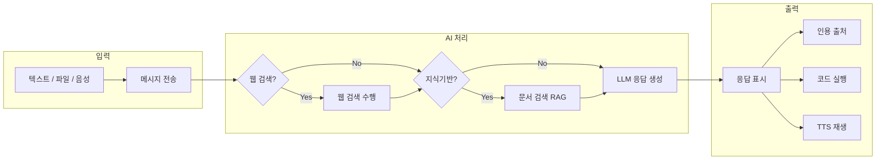

Cloosphere의 채팅은 단순한 대화를 넘어, 파일 분석, 코드 실행, 웹 검색, 음성 대화까지 지원하는 **종합 AI 작업 공간**입니다.

<Frame caption="채팅 인터페이스 전체 화면">
  
</Frame>

## 채팅 흐름

사용자가 메시지를 입력하면 다음 흐름으로 처리됩니다.

## 채팅 화면 구성

| 영역 | 설명 |
|------|------|
| **사이드바** | 채팅 목록, 검색, 태그 필터, 폴더 관리, 워크스페이스 접근 |
| **채팅 헤더** | 모델 선택, 멀티 모델 추가, 채팅 메뉴(공유/다운로드/삭제) |
| **메시지 영역** | 대화 내용 표시, 응답 분기(branch) 탐색, 응답 도구 모음 |
| **입력 영역** | 텍스트 입력, 파일 첨부, 음성 입력, capability 토글 |
| **제어 패널** | 시스템 프롬프트, 모델 파라미터, 대화 흐름 시각화 |

## 주요 기능

<Columns cols={2}>
  <Card title="대화 관리" icon="messages" href="/ko/chat/conversations">
    채팅 생성, 검색, 폴더 분류, 핀 고정, 내보내기 등 대화 이력 관리
  </Card>
  <Card title="모델 선택" icon="robot" href="/ko/chat/models">
    모델 선택, 멀티 모델 비교, Temperature 등 파라미터 조정
  </Card>
  <Card title="특수 기능" icon="wand-magic-sparkles" href="/ko/chat/capabilities">
    웹 검색, 이미지 생성, 코드 실행 기능 활성화 및 활용
  </Card>
  <Card title="파일 및 RAG" icon="file-lines" href="/ko/chat/files-and-rag">
    파일 첨부, 지식기반 연동, 인용 출처 확인
  </Card>
  <Card title="공유 및 정리" icon="share-nodes" href="/ko/chat/sharing">
    대화 공유 링크, 태그, 아카이브, 폴더 관리
  </Card>
</Columns>

## 명령어 시스템

입력창에서 특수 기호로 시작하는 명령어를 사용하여 빠르게 기능을 호출할 수 있습니다.

| 명령어 | 기능 | 예시 |
|--------|------|------|
| `@모델명` | 특정 모델에게 직접 질문 | `@gpt-4o 이 코드를 리뷰해줘` |
| `/프롬프트명` | 저장된 프롬프트 템플릿 호출 | `/email-draft 프로젝트 지연 안내` |
| `#지식기반명` | 특정 지식기반 문서 참조 | `#인사규정 연차 신청 절차는?` |

<Tip>
  `@`, `/`, `#` 입력 시 자동 완성 드롭다운이 나타나 선택할 수 있습니다.
</Tip>

## 키보드 단축키

| 단축키 | 기능 |
|--------|------|
| `Enter` | 메시지 전송 |
| `Shift + Enter` | 줄바꿈 |
| `Ctrl + N` | 새 채팅 |
| `Ctrl + K` | 검색 |
| `Ctrl + /` | 사이드바 토글 |
| `Esc` | 모달 닫기 |

## AI 응답 도구 모음

AI 응답 하단에는 다양한 액션 버튼이 제공됩니다.

<Frame caption="AI 응답 하단 도구 모음">
  
</Frame>

| 버튼 | 기능 |
|------|------|
| **편집** | AI 응답 내용 직접 수정 |
| **복사** | 전체 응답 클립보드 복사 |
| **음성** | TTS로 응답 읽기 |
| **정보** | 사용된 토큰량, 처리 시간 확인 |
| **평가** | 응답 품질 피드백 (좋아요/싫어요 + 코멘트) |
| **계속** | 잘린 응답 이어서 생성 |
| **재생성** | 동일 프롬프트로 새로운 응답 요청 |

<Note>
  사용자 메시지를 편집하면 원본은 보존되고 새로운 분기(branch)가 생성됩니다.
  좌우 화살표로 이전/다음 분기를 탐색할 수 있습니다.
</Note>

## 다음 단계

- [대화 관리](/ko/chat/conversations)에서 채팅 이력을 체계적으로 정리하는 방법을 알아보세요.
- [모델 선택](/ko/chat/models)에서 목적에 맞는 모델을 선택하고 파라미터를 조정하세요.
- [특수 기능](/ko/chat/capabilities)에서 웹 검색, 이미지 생성, 코드 실행을 활용해 보세요.
